# 04_25_2017
John D.  
April 25, 2017  


```r
#install.packages("tidyverse")
library(tidyverse)
```

```
## Loading tidyverse: ggplot2
## Loading tidyverse: tibble
## Loading tidyverse: tidyr
## Loading tidyverse: readr
## Loading tidyverse: purrr
## Loading tidyverse: dplyr
```

```
## Conflicts with tidy packages ----------------------------------------------
```

```
## filter(): dplyr, stats
## lag():    dplyr, stats
```


```r
#mpg
ggplot(data = mpg) +
  geom_point(mapping = aes(x = displ, y = hwy))
```

<!-- -->

Template  
`ggplot(data = <DATA>) + `
`  <GEOM_FUNCTION>(mapping = aes(<MAPPINGS>))`

### 3.2.4 Exercises  

1. Run `ggplot(data = mpg)` what do you see?

```r
ggplot(data = mpg)
```

<!-- -->

A blank plot is produced since no layers have been applied.

2. How many rows are in `mtcars`? How many columns?


```r
dim(mtcars)
```

```
## [1] 32 11
```

32 rows and 11 columns

3. What does the `drv` variable describe? Read the help for`?mpg` to find out.

`?mpg` drv describes the drive type of the car. ie front-wheel

4. Make a scatterplot of `hwy` vs `cyl`


```r
ggplot(data = mpg) +
  geom_point(mapping = aes(x = hwy, y = cyl))
```

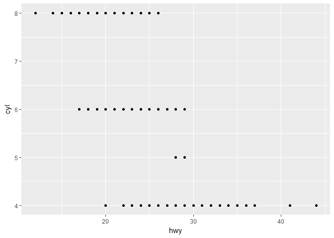<!-- -->

5. What happens if you make a scatterplot of `class` vs `drv`. Why is the plot not useful?


```r
ggplot(data = mpg) +
  geom_point(mapping = aes(x = class, y = drv))
```

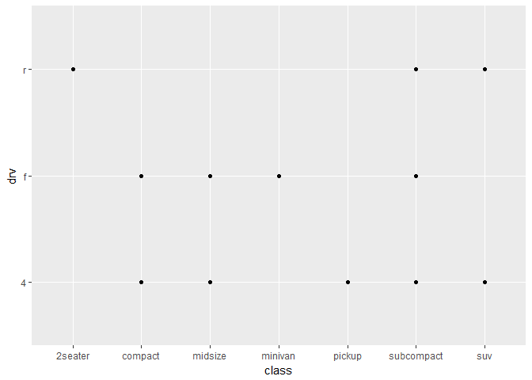<!-- -->

There is not a relationship between class and drive type. I personally can make use of this plot because it tells me the available drive types for each class of car.

### 3.3.1 Exercises  

1. What’s gone wrong with this code? Why are the points not blue?  

color = 'blue' needs to be outside of the aes function

2. Which variables in `mpg` are categorical? Which variables are continuous? (Hint: type `?mpg` to read the documentation for the dataset). How can you see this information when you run `mpg`?


```r
mpg
```

```
## # A tibble: 234 × 11
##    manufacturer      model displ  year   cyl      trans   drv   cty   hwy
##           <chr>      <chr> <dbl> <int> <int>      <chr> <chr> <int> <int>
## 1          audi         a4   1.8  1999     4   auto(l5)     f    18    29
## 2          audi         a4   1.8  1999     4 manual(m5)     f    21    29
## 3          audi         a4   2.0  2008     4 manual(m6)     f    20    31
## 4          audi         a4   2.0  2008     4   auto(av)     f    21    30
## 5          audi         a4   2.8  1999     6   auto(l5)     f    16    26
## 6          audi         a4   2.8  1999     6 manual(m5)     f    18    26
## 7          audi         a4   3.1  2008     6   auto(av)     f    18    27
## 8          audi a4 quattro   1.8  1999     4 manual(m5)     4    18    26
## 9          audi a4 quattro   1.8  1999     4   auto(l5)     4    16    25
## 10         audi a4 quattro   2.0  2008     4 manual(m6)     4    20    28
## # ... with 224 more rows, and 2 more variables: fl <chr>, class <chr>
```

```r
sapply(mpg, class)
```

```
## manufacturer        model        displ         year          cyl 
##  "character"  "character"    "numeric"    "integer"    "integer" 
##        trans          drv          cty          hwy           fl 
##  "character"  "character"    "integer"    "integer"  "character" 
##        class 
##  "character"
```

Columns of class `character` and `factor` are categorical, class `integer` and `numeric` are continous.

3. Map a continuous variable to `color`, `size`, and `shape`. How do these aesthetics behave differently for categorical vs. continuous variables?


```r
# ggplot(data = mpg) +
#   geom_point(mapping = aes(x = cyl, y = hwy, shape= cty, color = year, size = cyl))
```

Shape cannot be mapped to a continous variable

4. What happens if you map the same variable to multiple aesthetics?


```r
ggplot(data = mpg) +
  geom_point(mapping = aes(x = cyl, y = hwy, color = hwy, size = hwy))
```

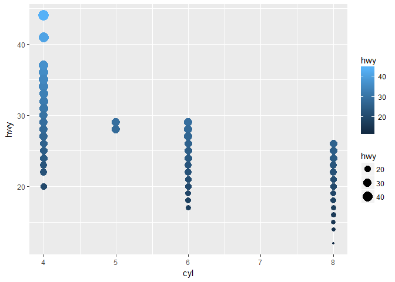<!-- -->

It will apply each aesthetic appropriately according to the values in the variable

5. What does the `stroke` aesthetic do? What shapes does it work with? (Hint: use `?geom_point`)


```r
ggplot(mtcars, aes(wt, mpg)) +
  geom_point(shape = 21, colour = "black", fill = "white", stroke = 5)
```

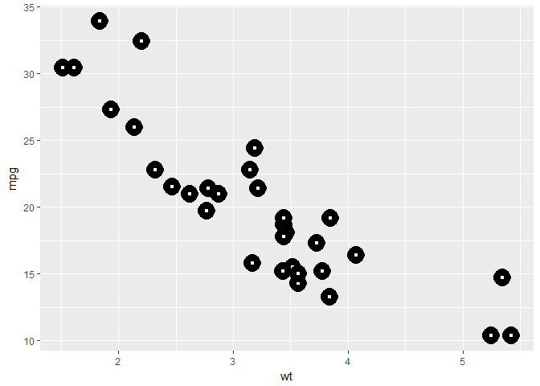<!-- -->

Stroke changes the size of the border for the points on the plot

6. What happens if you map an aesthetic to something other than a variable name, like `aes(colour = displ < 5)`?


```r
ggplot(data = mpg) +
  geom_point(mapping = aes(x = hwy, y = cyl, color = displ < 5))
```

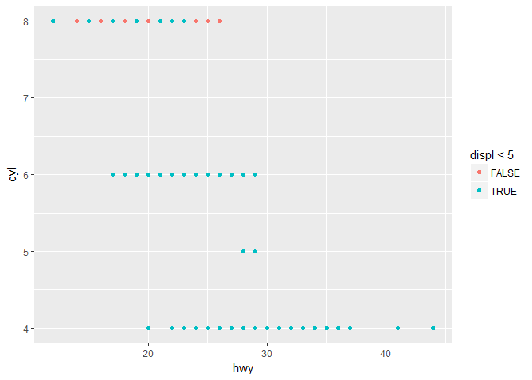<!-- -->

Turns the color scheme into a boolean of either true or false

### 3.5.1 Exercises

1. What happens if you facet on a continuous variable?


```r
ggplot(data = mpg) + 
  geom_point(mapping = aes(x = displ, y = hwy)) + 
  facet_wrap(~hwy)
```

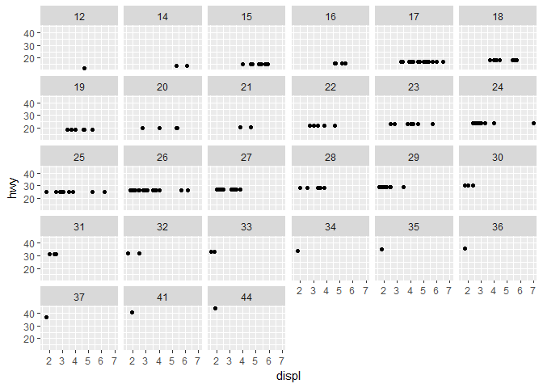<!-- -->

You get a plot for each value in the continous variable

2. What do the empty cells in plot with `facet_grid(drv ~ cyl)` mean? How do they relate to this plot?


```r
ggplot(data = mpg) + 
  geom_point(mapping = aes(x = drv, y = cyl))
```

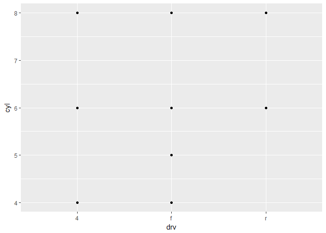<!-- -->

Samples which do not have the combination of faceting variable values

They are the missing points in the plot where there xists another point sharing a similar x or y value

3. What plots does the following code make? What does `.` do?


```r
ggplot(data = mpg) + 
  geom_point(mapping = aes(x = displ, y = hwy)) +
  facet_grid(drv ~ .)
```

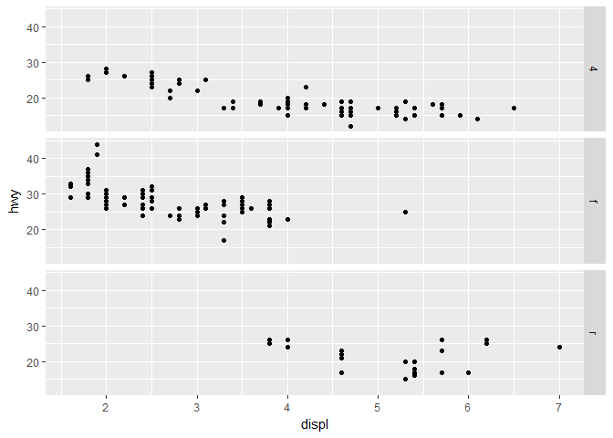<!-- -->

```r
ggplot(data = mpg) + 
  geom_point(mapping = aes(x = displ, y = hwy)) +
  facet_grid(. ~ cyl)
```

<!-- -->

When the `.` comes first, the plot is fauceted by columns using the variable after `~`. When the `.` comes second, the plot is fauceted by rows using the variable before the `~`.

4. Take the first faceted plot in this section:


```r
ggplot(data = mpg) + 
  geom_point(mapping = aes(x = displ, y = hwy)) + 
  facet_wrap(~ class, nrow = 2)
```

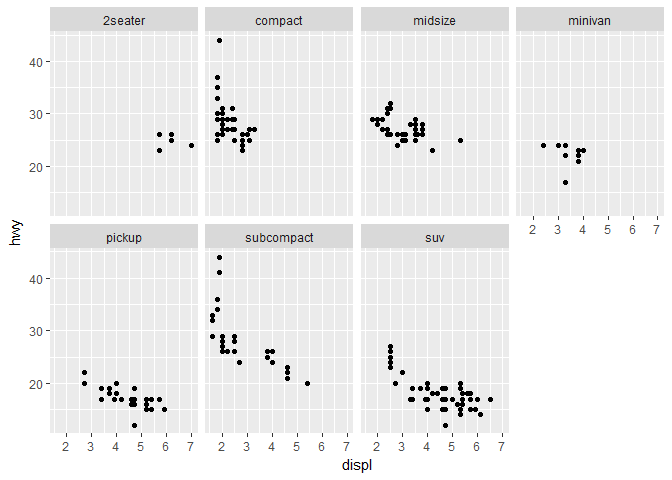<!-- -->

Allows us to look at a plot which contains only one value for a specific variable. Easier to read. Harder to compare one value vs another value. With large datasets, faceting allows you to more easily interpret your data due to less clutter.

5. Read `?facet_wrap`. What does `nrow do`? What does `ncol` do? What other options control the layout of the individual panels? Why doesn’t `facet_grid()` have nrow and ncol variables.

nrow and ncol determine how many rows and columns of plots to display when creating the output. `scales,shrink,labeller,as.table,switch,drop,dir,strip.position` all allow you to control the output layout. `facet_grid` creates a matrix of panels using your two variables. The number of rows and cols is automatically determined by the number of unique values in your variables.

6. When using `facet_grid()` you should usually put the variable with more unique levels in the columns. Why?


```r
ggplot(data = mpg) + 
  geom_point(mapping = aes(x = displ, y = hwy)) +
  facet_grid(cty ~ drv)
```

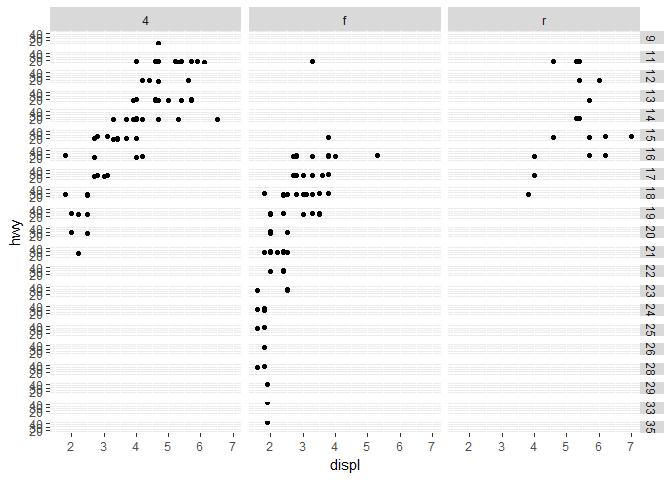<!-- -->

```r
ggplot(data = mpg) + 
  geom_point(mapping = aes(x = displ, y = hwy)) +
  facet_grid(drv ~ cty)
```

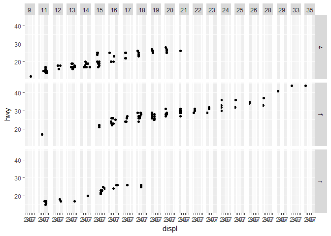<!-- -->

When the variable with more unique levels is in the rows, the plots become squished horizontally and are a lot harder to read.
