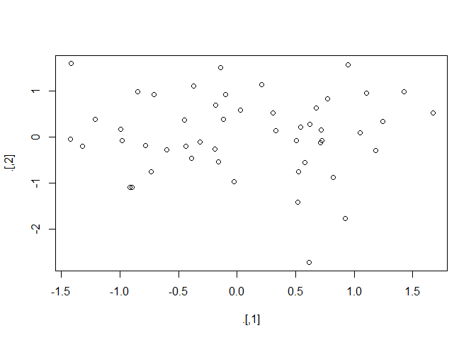
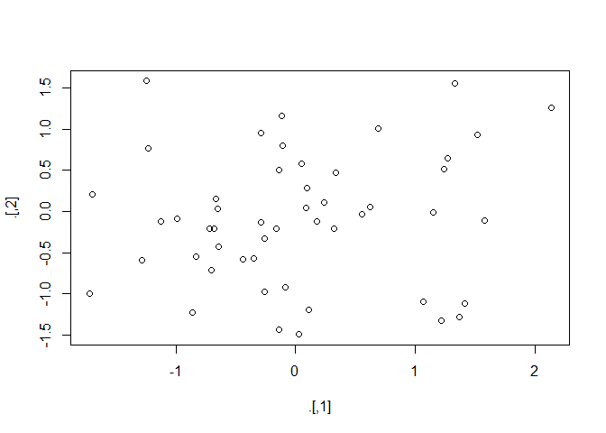

# 08_09_2017
John D.  
July 20, 2017  


# 17 Introduction

# 18 Pipes

## 18.1 Introduction

### 18.1.1 Prerequisites


```r
library(magrittr)
```

## 18.2 Piping alternatives


```r
#foo_foo <- little_bunny()
```

### 18.2.1 Intermediate steps


```r
# foo_foo_1 <- hop(foo_foo, through = forest)
# foo_foo_2 <- scoop(foo_foo_1, up = field_mice)
# foo_foo_3 <- bop(foo_foo_2, on = head)

diamonds <- ggplot2::diamonds
diamonds2 <- diamonds %>% 
  dplyr::mutate(price_per_carat = price / carat)

pryr::object_size(diamonds)
```

```
## 3.46 MB
```

```r
pryr::object_size(diamonds2)
```

```
## 3.89 MB
```

```r
pryr::object_size(diamonds, diamonds2)
```

```
## 3.89 MB
```

```r
diamonds$carat[1] <- NA
pryr::object_size(diamonds)
```

```
## 3.46 MB
```

```r
pryr::object_size(diamonds2)
```

```
## 3.89 MB
```

```r
pryr::object_size(diamonds, diamonds2)
```

```
## 4.32 MB
```

### 18.2.2 Overwrite the original


```r
# foo_foo <- hop(foo_foo, through = forest)
# foo_foo <- scoop(foo_foo, up = field_mice)
# foo_foo <- bop(foo_foo, on = head)
```

### 18.2.3 Function composition


```r
# bop(
#   scoop(
#     hop(foo_foo, through = forest),
#     up = field_mice
#   ), 
#   on = head
# )
```

### 18.2.4 Use the pipe


```r
# foo_foo %>%
#   hop(through = forest) %>%
#   scoop(up = field_mouse) %>%
#   bop(on = head)

my_pipe <- function(.) {
  . <- hop(., through = forest)
  . <- scoop(., up = field_mice)
  bop(., on = head)
}
#   my_pipe(foo_foo)

assign("x", 10)
x
```

```
## [1] 10
```

```r
"x" %>% assign(100)
x
```

```
## [1] 10
```

```r
env <- environment()
"x" %>% assign(100, envir = env)
x
```

```
## [1] 100
```

```r
tryCatch(stop("!"), error = function(e) "An error")
```

```
## [1] "An error"
```

```r
# stop("!") %>% 
#   tryCatch(error = function(e) "An error")
```

## 18.3 When not to use the pipe

## 18.4 Other tools from magrittr


```r
rnorm(100) %>%
  matrix(ncol = 2) %>%
  plot() %>%
  str()
```

<!-- -->

```
##  NULL
```

```r
rnorm(100) %>%
  matrix(ncol = 2) %T>%
  plot() %>%
  str()
```

<!-- -->

```
##  num [1:50, 1:2] -0.2634 -0.9912 -0.0837 -0.7222 0.6873 ...
```

```r
mtcars %$%
  cor(disp, mpg)
```

```
## [1] -0.8475514
```

```r
mtcars <- mtcars %>% 
  transform(cyl = cyl * 2)

mtcars %<>% transform(cyl = cyl * 2)
```

