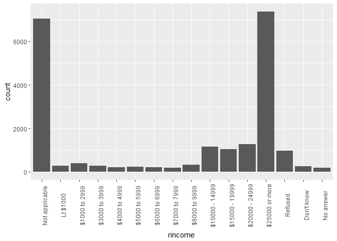

# Ch.15
John D.  
July 20, 2017  


```r
library(tidyverse)
```

```
## Loading tidyverse: ggplot2
## Loading tidyverse: tibble
## Loading tidyverse: tidyr
## Loading tidyverse: readr
## Loading tidyverse: purrr
## Loading tidyverse: dplyr
```

```
## Conflicts with tidy packages ----------------------------------------------
```

```
## filter(): dplyr, stats
## lag():    dplyr, stats
```

```r
library(forcats)
```

# Factors

## 15.2 Creating factors


```r
x1 <- c("Dec", "Apr", "Jan", "Mar")

x2 <- c("Dec", "Apr", "Jam", "Mar")

sort(x1)
```

```
## [1] "Apr" "Dec" "Jan" "Mar"
```

```r
month_levels <- c(
  "Jan", "Feb", "Mar", "Apr", "May", "Jun", 
  "Jul", "Aug", "Sep", "Oct", "Nov", "Dec"
)

y1 <- factor(x1, levels = month_levels)
y1
```

```
## [1] Dec Apr Jan Mar
## Levels: Jan Feb Mar Apr May Jun Jul Aug Sep Oct Nov Dec
```

```r
sort(y1)
```

```
## [1] Jan Mar Apr Dec
## Levels: Jan Feb Mar Apr May Jun Jul Aug Sep Oct Nov Dec
```

```r
y2 <- factor(x2, levels = month_levels)
y2
```

```
## [1] Dec  Apr  <NA> Mar 
## Levels: Jan Feb Mar Apr May Jun Jul Aug Sep Oct Nov Dec
```

```r
y2 <- parse_factor(x2, levels = month_levels)
```

```
## Warning: 1 parsing failure.
## row # A tibble: 1 x 4 col     row   col           expected actual expected   <int> <int>              <chr>  <chr> actual 1     3    NA value in level set    Jam
```

```r
factor(x1)
```

```
## [1] Dec Apr Jan Mar
## Levels: Apr Dec Jan Mar
```

```r
f1 <- factor(x1, levels = unique(x1))
f1
```

```
## [1] Dec Apr Jan Mar
## Levels: Dec Apr Jan Mar
```

```r
f2 <- x1 %>% factor() %>% fct_inorder()
f2
```

```
## [1] Dec Apr Jan Mar
## Levels: Dec Apr Jan Mar
```

```r
levels(f2)
```

```
## [1] "Dec" "Apr" "Jan" "Mar"
```

## General Social Survey


```r
gss_cat
```

```
## # A tibble: 21,483 x 9
##     year       marital   age   race        rincome            partyid
##    <int>        <fctr> <int> <fctr>         <fctr>             <fctr>
##  1  2000 Never married    26  White  $8000 to 9999       Ind,near rep
##  2  2000      Divorced    48  White  $8000 to 9999 Not str republican
##  3  2000       Widowed    67  White Not applicable        Independent
##  4  2000 Never married    39  White Not applicable       Ind,near rep
##  5  2000      Divorced    25  White Not applicable   Not str democrat
##  6  2000       Married    25  White $20000 - 24999    Strong democrat
##  7  2000 Never married    36  White $25000 or more Not str republican
##  8  2000      Divorced    44  White  $7000 to 7999       Ind,near dem
##  9  2000       Married    44  White $25000 or more   Not str democrat
## 10  2000       Married    47  White $25000 or more  Strong republican
## # ... with 21,473 more rows, and 3 more variables: relig <fctr>,
## #   denom <fctr>, tvhours <int>
```

```r
gss_cat %>%
  count(race)
```

```
## # A tibble: 3 x 2
##     race     n
##   <fctr> <int>
## 1  Other  1959
## 2  Black  3129
## 3  White 16395
```

```r
ggplot(gss_cat, aes(race)) +
  geom_bar()
```

<!-- -->

```r
ggplot(gss_cat, aes(race)) +
  geom_bar() +
  scale_x_discrete(drop = FALSE)
```

<!-- -->

### 15.3.1 Exercise

1. Explore the distribution of `rincome` (reported income). What makes the default bar chart hard to understand? How could you improve the plot?


```r
ggplot(gss_cat, aes(rincome)) +
  geom_bar() +
  scale_x_discrete(drop = FALSE) +
  theme(axis.text.x = element_text(angle = 90))
```

<!-- -->

```r
ggplot(gss_cat, aes(rincome)) +
  geom_bar() +
  scale_x_discrete(limits = rev(levels(gss_cat$rincome)), drop = FALSE) +
  theme(axis.text.x = element_text(angle = 90))
```

<!-- -->
The money amounts go from most to least which is reverse of how most would present it. Also would be nice to have categories which do not have a dollar range grouped together at the end.

2. What is the most common `relig` in this survey? What’s the most common `partyid`?


```r
gss_cat %>%
  count(relig, sort = T) %>%
  head(1)
```

```
## # A tibble: 1 x 2
##        relig     n
##       <fctr> <int>
## 1 Protestant 10846
```

```r
gss_cat %>%
  count(partyid, sort = T) %>%
  head(1)
```

```
## # A tibble: 1 x 2
##       partyid     n
##        <fctr> <int>
## 1 Independent  4119
```

3. Which `relig` does `denom` (denomination) apply to? How can you find out with a table? How can you find out with a visualisation?


```r
gss_cat %>%
  group_by(relig) %>%
  count(denom, sort = T)
```

```
## # A tibble: 47 x 3
## # Groups:   relig [15]
##         relig            denom     n
##        <fctr>           <fctr> <int>
##  1   Catholic   Not applicable  5124
##  2       None   Not applicable  3523
##  3 Protestant            Other  2534
##  4 Protestant Southern baptist  1536
##  5 Protestant Baptist-dk which  1457
##  6 Protestant  No denomination  1224
##  7 Protestant United methodist  1067
##  8  Christian  No denomination   452
##  9 Protestant        Episcopal   397
## 10     Jewish   Not applicable   388
## # ... with 37 more rows
```

```r
gss_cat %>%
  group_by(relig) %>%
  count(denom, sort = T) %>%
  mutate(comb = paste(relig,denom, sep = "_")) %>%
  ggplot(aes(reorder(comb, order(n)), weight = n)) +
  geom_bar() +
  theme(axis.text.x = element_text(angle = 90))
```

<!-- -->

```r
gss_cat %>%
  filter(relig == "Protestant") %>%
  count(denom) %>%
  ggplot(aes(reorder(denom, n), n)) +
  geom_bar(stat = "identity") +
  theme(axis.text.x = element_text(angle = 90))
```

<!-- -->

## Modifying factor order


```r
relig_summary <- gss_cat %>%
  group_by(relig) %>%
  summarise(
    age = mean(age, na.rm = TRUE),
    tvhours = mean(tvhours, na.rm = TRUE),
    n = n()
  )

ggplot(relig_summary, aes(tvhours, relig)) + geom_point()
```

<!-- -->

```r
ggplot(relig_summary, aes(tvhours, fct_reorder(relig, tvhours))) +
  geom_point()
```

<!-- -->

```r
relig_summary %>%
  mutate(relig = fct_reorder(relig, tvhours)) %>%
  ggplot(aes(tvhours, relig)) +
    geom_point()
```

<!-- -->

```r
rincome_summary <- gss_cat %>%
  group_by(rincome) %>%
  summarise(
    age = mean(age, na.rm = TRUE),
    tvhours = mean(tvhours, na.rm = TRUE),
    n = n()
  )

ggplot(rincome_summary, aes(age, fct_reorder(rincome, age))) + geom_point()
```

<!-- -->

```r
ggplot(rincome_summary, aes(age, fct_relevel(rincome, "Not applicable"))) +
  geom_point()
```

<!-- -->

```r
by_age <- gss_cat %>%
  filter(!is.na(age)) %>%
  group_by(age, marital) %>%
  count() %>%
  ungroup() %>%
  group_by(age) %>%
  mutate(prop = n / sum(n))

ggplot(by_age, aes(age, prop, colour = marital)) +
  geom_line(na.rm = TRUE)
```

<!-- -->

```r
ggplot(by_age, aes(age, prop, colour = fct_reorder2(marital, age, prop))) +
  geom_line() +
  labs(colour = "marital")
```

<!-- -->

```r
gss_cat %>%
  mutate(marital = marital %>% fct_infreq() %>% fct_rev()) %>%
  ggplot(aes(marital)) +
    geom_bar()
```

<!-- -->

### 15.4.1 Exercises

1. There are some suspiciously high numbers in tvhours. Is the mean a good summary?


```r
summary(gss_cat$tvhours)
```

```
##    Min. 1st Qu.  Median    Mean 3rd Qu.    Max.    NA's 
##   0.000   1.000   2.000   2.981   4.000  24.000   10146
```

```r
gss_cat %>%
  group_by(tvhours) %>%
  count() %>%
  ggplot(aes(tvhours, weight = n)) + 
  geom_bar()
```

```
## Warning: Removed 1 rows containing non-finite values (stat_count).
```

<!-- -->

The mean is a good summary despite the erroneous high numbers

2. For each factor in `gss_cat` identify whether the order of the levels is arbitrary or principled


```r
str(gss_cat)
```

```
## Classes 'tbl_df', 'tbl' and 'data.frame':	21483 obs. of  9 variables:
##  $ year   : int  2000 2000 2000 2000 2000 2000 2000 2000 2000 2000 ...
##  $ marital: Factor w/ 6 levels "No answer","Never married",..: 2 4 5 2 4 6 2 4 6 6 ...
##  $ age    : int  26 48 67 39 25 25 36 44 44 47 ...
##  $ race   : Factor w/ 4 levels "Other","Black",..: 3 3 3 3 3 3 3 3 3 3 ...
##  $ rincome: Factor w/ 16 levels "No answer","Don't know",..: 8 8 16 16 16 5 4 9 4 4 ...
##  $ partyid: Factor w/ 10 levels "No answer","Don't know",..: 6 5 7 6 9 10 5 8 9 4 ...
##  $ relig  : Factor w/ 16 levels "No answer","Don't know",..: 15 15 15 6 12 15 5 15 15 15 ...
##  $ denom  : Factor w/ 30 levels "No answer","Don't know",..: 25 23 3 30 30 25 30 15 4 25 ...
##  $ tvhours: int  12 NA 2 4 1 NA 3 NA 0 3 ...
```

```r
levels(gss_cat$marital)
```

```
## [1] "No answer"     "Never married" "Separated"     "Divorced"     
## [5] "Widowed"       "Married"
```

```r
levels(gss_cat$race)
```

```
## [1] "Other"          "Black"          "White"          "Not applicable"
```

```r
levels(gss_cat$rincome)
```

```
##  [1] "No answer"      "Don't know"     "Refused"        "$25000 or more"
##  [5] "$20000 - 24999" "$15000 - 19999" "$10000 - 14999" "$8000 to 9999" 
##  [9] "$7000 to 7999"  "$6000 to 6999"  "$5000 to 5999"  "$4000 to 4999" 
## [13] "$3000 to 3999"  "$1000 to 2999"  "Lt $1000"       "Not applicable"
```

```r
levels(gss_cat$partyid)
```

```
##  [1] "No answer"          "Don't know"         "Other party"       
##  [4] "Strong republican"  "Not str republican" "Ind,near rep"      
##  [7] "Independent"        "Ind,near dem"       "Not str democrat"  
## [10] "Strong democrat"
```

```r
levels(gss_cat$relig)
```

```
##  [1] "No answer"               "Don't know"             
##  [3] "Inter-nondenominational" "Native american"        
##  [5] "Christian"               "Orthodox-christian"     
##  [7] "Moslem/islam"            "Other eastern"          
##  [9] "Hinduism"                "Buddhism"               
## [11] "Other"                   "None"                   
## [13] "Jewish"                  "Catholic"               
## [15] "Protestant"              "Not applicable"
```

```r
levels(gss_cat$denom)
```

```
##  [1] "No answer"            "Don't know"           "No denomination"     
##  [4] "Other"                "Episcopal"            "Presbyterian-dk wh"  
##  [7] "Presbyterian, merged" "Other presbyterian"   "United pres ch in us"
## [10] "Presbyterian c in us" "Lutheran-dk which"    "Evangelical luth"    
## [13] "Other lutheran"       "Wi evan luth synod"   "Lutheran-mo synod"   
## [16] "Luth ch in america"   "Am lutheran"          "Methodist-dk which"  
## [19] "Other methodist"      "United methodist"     "Afr meth ep zion"    
## [22] "Afr meth episcopal"   "Baptist-dk which"     "Other baptists"      
## [25] "Southern baptist"     "Nat bapt conv usa"    "Nat bapt conv of am" 
## [28] "Am bapt ch in usa"    "Am baptist asso"      "Not applicable"
```

Marital is arbitrary, race is arbitrary, rincome is principled, partyid is principled, relig is arbitrary, and denom is arbitrary

3. Why did moving “Not applicable” to the front of the levels move it to the bottom of the plot?

Moving "Not applicable" to the front gave it the index value of 1 which puts it at the bottom of the y axis.

## 15.5 Modifying factor levels


```r
gss_cat %>% count(partyid)
```

```
## # A tibble: 10 x 2
##               partyid     n
##                <fctr> <int>
##  1          No answer   154
##  2         Don't know     1
##  3        Other party   393
##  4  Strong republican  2314
##  5 Not str republican  3032
##  6       Ind,near rep  1791
##  7        Independent  4119
##  8       Ind,near dem  2499
##  9   Not str democrat  3690
## 10    Strong democrat  3490
```

```r
gss_cat %>%
  mutate(partyid = fct_recode(partyid,
    "Republican, strong"    = "Strong republican",
    "Republican, weak"      = "Not str republican",
    "Independent, near rep" = "Ind,near rep",
    "Independent, near dem" = "Ind,near dem",
    "Democrat, weak"        = "Not str democrat",
    "Democrat, strong"      = "Strong democrat"
  )) %>%
  count(partyid)
```

```
## # A tibble: 10 x 2
##                  partyid     n
##                   <fctr> <int>
##  1             No answer   154
##  2            Don't know     1
##  3           Other party   393
##  4    Republican, strong  2314
##  5      Republican, weak  3032
##  6 Independent, near rep  1791
##  7           Independent  4119
##  8 Independent, near dem  2499
##  9        Democrat, weak  3690
## 10      Democrat, strong  3490
```

```r
gss_cat %>%
  mutate(partyid = fct_recode(partyid,
    "Republican, strong"    = "Strong republican",
    "Republican, weak"      = "Not str republican",
    "Independent, near rep" = "Ind,near rep",
    "Independent, near dem" = "Ind,near dem",
    "Democrat, weak"        = "Not str democrat",
    "Democrat, strong"      = "Strong democrat",
    "Other"                 = "No answer",
    "Other"                 = "Don't know",
    "Other"                 = "Other party"
  )) %>%
  count(partyid)
```

```
## # A tibble: 8 x 2
##                 partyid     n
##                  <fctr> <int>
## 1                 Other   548
## 2    Republican, strong  2314
## 3      Republican, weak  3032
## 4 Independent, near rep  1791
## 5           Independent  4119
## 6 Independent, near dem  2499
## 7        Democrat, weak  3690
## 8      Democrat, strong  3490
```

```r
gss_cat %>%
  mutate(partyid = fct_collapse(partyid,
    other = c("No answer", "Don't know", "Other party"),
    rep = c("Strong republican", "Not str republican"),
    ind = c("Ind,near rep", "Independent", "Ind,near dem"),
    dem = c("Not str democrat", "Strong democrat")
  )) %>%
  count(partyid)
```

```
## # A tibble: 4 x 2
##   partyid     n
##    <fctr> <int>
## 1   other   548
## 2     rep  5346
## 3     ind  8409
## 4     dem  7180
```

```r
gss_cat %>%
  mutate(relig = fct_lump(relig)) %>%
  count(relig)
```

```
## # A tibble: 2 x 2
##        relig     n
##       <fctr> <int>
## 1 Protestant 10846
## 2      Other 10637
```

```r
gss_cat %>%
  mutate(relig = fct_lump(relig, n = 10)) %>%
  count(relig, sort = TRUE) %>%
  print(n = Inf)
```

```
## # A tibble: 10 x 2
##                      relig     n
##                     <fctr> <int>
##  1              Protestant 10846
##  2                Catholic  5124
##  3                    None  3523
##  4               Christian   689
##  5                   Other   458
##  6                  Jewish   388
##  7                Buddhism   147
##  8 Inter-nondenominational   109
##  9            Moslem/islam   104
## 10      Orthodox-christian    95
```

### 15.5.1 Exercises

1. How have the proportions of people identifying as Democrat, Republican, and Independent changed over time?


```r
parties <- gss_cat %>%
  mutate(partyid = fct_collapse(partyid,
    other = c("No answer", "Don't know", "Other party"),
    rep = c("Strong republican", "Not str republican"),
    ind = c("Ind,near rep", "Independent", "Ind,near dem"),
    dem = c("Not str democrat", "Strong democrat")
  )) %>%
  group_by(year) %>%
  count(partyid) %>%
  mutate(prop = n / sum(n))

ggplot(parties, aes(year, prop, fill = partyid)) +
  geom_bar(stat = "identity")
```

<!-- -->

```r
ggplot(parties, aes(partyid, prop, fill = partyid)) +
  geom_bar(stat = "identity") +
  facet_wrap(~year)
```

<!-- -->

2. How could you collapse rincome into a small set of categories?


```r
gss_cat %>%
  mutate(rincome = fct_collapse(rincome,
    other = c("No answer", "Don't know", "Refused", "Not applicable"),
    `$4999 or less` = c("Lt $1000", "$1000 to 2999", "$3000 to 3999", "$4000 to 4999"),
    `$5000 to 9999`= c("$5000 to 5999", "$6000 to 6999", "$7000 to 7999", "$8000 to 9999")
  )) %>%
  count(rincome)
```

```
## # A tibble: 7 x 2
##          rincome     n
##           <fctr> <int>
## 1          other  8468
## 2 $25000 or more  7363
## 3 $20000 - 24999  1283
## 4 $15000 - 19999  1048
## 5 $10000 - 14999  1168
## 6  $5000 to 9999   970
## 7  $4999 or less  1183
```
