# Ch.16
John D.  
July 20, 2017  


# 16 Dates and times

## 16.1 Introduction

### 16.1.1 Prerequisites


```r
library(tidyverse)
```

```
## Loading tidyverse: ggplot2
## Loading tidyverse: tibble
## Loading tidyverse: tidyr
## Loading tidyverse: readr
## Loading tidyverse: purrr
## Loading tidyverse: dplyr
```

```
## Conflicts with tidy packages ----------------------------------------------
```

```
## filter(): dplyr, stats
## lag():    dplyr, stats
```

```r
library(lubridate)
```

```
## 
## Attaching package: 'lubridate'
```

```
## The following object is masked from 'package:base':
## 
##     date
```

```r
library(nycflights13)
```

## Creating date/times


```r
today()
```

```
## [1] "2017-07-20"
```

```r
now()
```

```
## [1] "2017-07-20 15:04:44 PDT"
```

### 16.2.1 From strings


```r
ymd("2017-01-31")
```

```
## [1] "2017-01-31"
```

```r
mdy("January 31st, 2017")
```

```
## [1] "2017-01-31"
```

```r
dmy("31-Jan-2017")
```

```
## [1] "2017-01-31"
```

```r
ymd(20170131)
```

```
## [1] "2017-01-31"
```

```r
ymd_hms("2017-01-31 20:11:59")
```

```
## [1] "2017-01-31 20:11:59 UTC"
```

```r
mdy_hm("01/31/2017 08:01")
```

```
## [1] "2017-01-31 08:01:00 UTC"
```

```r
ymd(20170131, tz = "UTC")
```

```
## [1] "2017-01-31 UTC"
```

### 16.2.2 From individual components


```r
flights %>% 
  select(year, month, day, hour, minute)
```

```
## # A tibble: 336,776 x 5
##     year month   day  hour minute
##    <int> <int> <int> <dbl>  <dbl>
##  1  2013     1     1     5     15
##  2  2013     1     1     5     29
##  3  2013     1     1     5     40
##  4  2013     1     1     5     45
##  5  2013     1     1     6      0
##  6  2013     1     1     5     58
##  7  2013     1     1     6      0
##  8  2013     1     1     6      0
##  9  2013     1     1     6      0
## 10  2013     1     1     6      0
## # ... with 336,766 more rows
```

```r
flights %>% 
  select(year, month, day, hour, minute) %>% 
  mutate(departure = make_datetime(year, month, day, hour, minute))
```

```
## # A tibble: 336,776 x 6
##     year month   day  hour minute           departure
##    <int> <int> <int> <dbl>  <dbl>              <dttm>
##  1  2013     1     1     5     15 2013-01-01 05:15:00
##  2  2013     1     1     5     29 2013-01-01 05:29:00
##  3  2013     1     1     5     40 2013-01-01 05:40:00
##  4  2013     1     1     5     45 2013-01-01 05:45:00
##  5  2013     1     1     6      0 2013-01-01 06:00:00
##  6  2013     1     1     5     58 2013-01-01 05:58:00
##  7  2013     1     1     6      0 2013-01-01 06:00:00
##  8  2013     1     1     6      0 2013-01-01 06:00:00
##  9  2013     1     1     6      0 2013-01-01 06:00:00
## 10  2013     1     1     6      0 2013-01-01 06:00:00
## # ... with 336,766 more rows
```

```r
make_datetime_100 <- function(year, month, day, time) {
  make_datetime(year, month, day, time %/% 100, time %% 100)
}

flights_dt <- flights %>% 
  filter(!is.na(dep_time), !is.na(arr_time)) %>% 
  mutate(
    dep_time = make_datetime_100(year, month, day, dep_time),
    arr_time = make_datetime_100(year, month, day, arr_time),
    sched_dep_time = make_datetime_100(year, month, day, sched_dep_time),
    sched_arr_time = make_datetime_100(year, month, day, sched_arr_time)
  ) %>% 
  select(origin, dest, ends_with("delay"), ends_with("time"))

flights_dt %>% 
  ggplot(aes(dep_time)) + 
  geom_freqpoly(binwidth = 86400) # 86400 seconds = 1 day
```

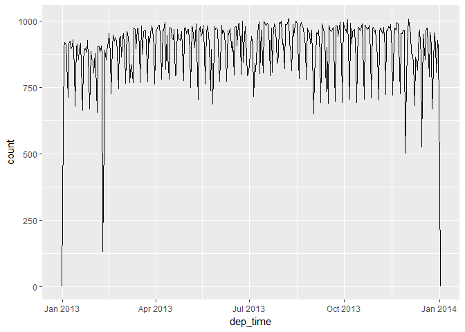<!-- -->

```r
flights_dt %>% 
  filter(dep_time < ymd(20130102)) %>% 
  ggplot(aes(dep_time)) + 
  geom_freqpoly(binwidth = 600) # 600 s = 10 minutes
```

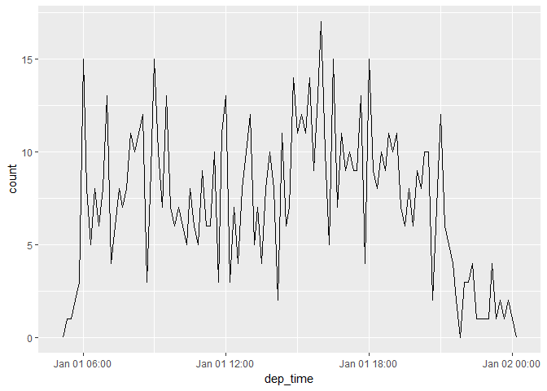<!-- -->

### 16.2.3 From other types


```r
as_datetime(today())
```

```
## [1] "2017-07-20 UTC"
```

```r
as_date(now())
```

```
## [1] "2017-07-20"
```

```r
as_datetime(60 * 60 * 10)
```

```
## [1] "1970-01-01 10:00:00 UTC"
```

```r
as_date(365 * 10 + 2)
```

```
## [1] "1980-01-01"
```

### 16.2.4 Exercises

1. What happens if you parse a string that contains invalid dates?

```r
ymd(c("2010-10-10", "bananas"))
```

```
## Warning: 1 failed to parse.
```

```
## [1] "2010-10-10" NA
```

Prints with a warning message and the failed to parse item becomes NA

2. What does the `tzone` argument to `today()` do? Why is it important?


```r
today("America/Los_Angeles")
```

```
## [1] "2017-07-20"
```

```r
today("Australia/Sydney")
```

```
## [1] "2017-07-21"
```

Tells the function what timezone to use when calculating today's date. Due to timezones parts of the world are on different days at the same time

3. Use the appropriate lubridate function to parse each of the following dates:


```r
# 1
d1 <- "January 1, 2010"
mdy(d1)
```

```
## [1] "2010-01-01"
```

```r
# 2
d2 <- "2015-Mar-07"
ymd(d2)
```

```
## [1] "2015-03-07"
```

```r
# 3
d3 <- "06-Jun-2017"
dmy(d3)
```

```
## [1] "2017-06-06"
```

```r
# 4
d4 <- c("August 19 (2015)", "July 1 (2015)")
mdy(d4)
```

```
## [1] "2015-08-19" "2015-07-01"
```

```r
# 5
d5 <- "12/30/14" # Dec 30, 2014
mdy(d5)
```

```
## [1] "2014-12-30"
```

## 16.3 Date-time components

### 16.3.1 Getting components


```r
datetime <- ymd_hms("2016-07-08 12:34:56")
year(datetime)
```

```
## [1] 2016
```

```r
month(datetime)
```

```
## [1] 7
```

```r
mday(datetime)
```

```
## [1] 8
```

```r
yday(datetime)
```

```
## [1] 190
```

```r
wday(datetime)
```

```
## [1] 6
```

```r
month(datetime, label = TRUE)
```

```
## [1] Jul
## 12 Levels: Jan < Feb < Mar < Apr < May < Jun < Jul < Aug < Sep < ... < Dec
```

```r
wday(datetime, label = TRUE, abbr = FALSE)
```

```
## [1] Friday
## 7 Levels: Sunday < Monday < Tuesday < Wednesday < Thursday < ... < Saturday
```

```r
flights_dt %>% 
  mutate(wday = wday(dep_time, label = TRUE)) %>% 
  ggplot(aes(x = wday)) +
    geom_bar()
```

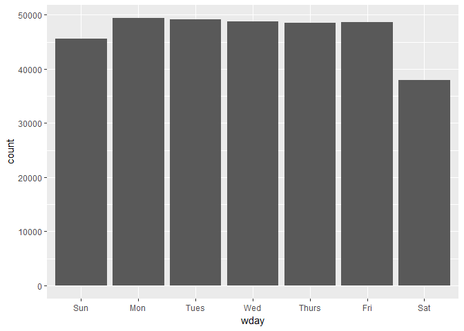<!-- -->

```r
flights_dt %>% 
  mutate(minute = minute(dep_time)) %>% 
  group_by(minute) %>% 
  summarise(
    avg_delay = mean(arr_delay, na.rm = TRUE),
    n = n()) %>% 
  ggplot(aes(minute, avg_delay)) +
    geom_line()
```

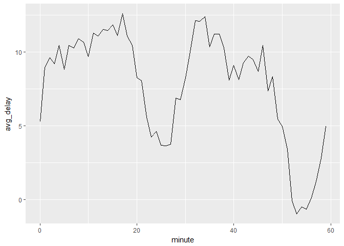<!-- -->

```r
sched_dep <- flights_dt %>% 
  mutate(minute = minute(sched_dep_time)) %>% 
  group_by(minute) %>% 
  summarise(
    avg_delay = mean(arr_delay, na.rm = TRUE),
    n = n())

ggplot(sched_dep, aes(minute, avg_delay)) +
  geom_line()
```

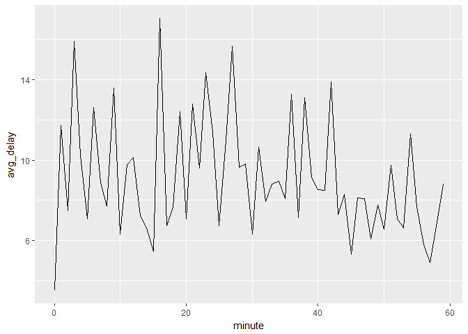<!-- -->

```r
ggplot(sched_dep, aes(minute, n)) +
  geom_line()
```

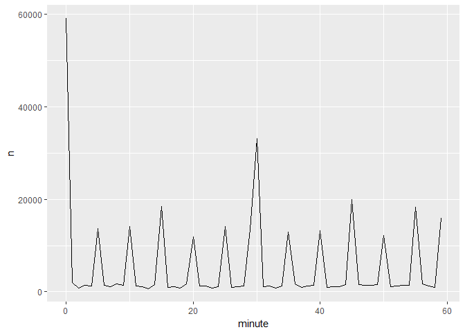<!-- -->

### 16.3.2 Rounding


```r
flights_dt %>% 
  count(week = floor_date(dep_time, "day")) %>% 
  ggplot(aes(week, n)) +
    geom_line()
```

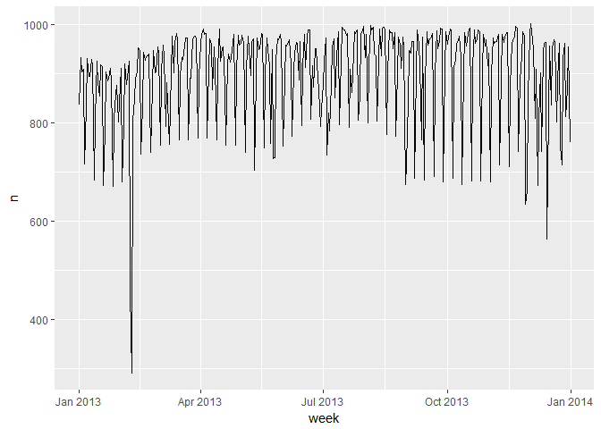<!-- -->

### 16.3.3 Setting components


```r
(datetime <- ymd_hms("2016-07-08 12:34:56"))
```

```
## [1] "2016-07-08 12:34:56 UTC"
```

```r
year(datetime) <- 2020
datetime
```

```
## [1] "2020-07-08 12:34:56 UTC"
```

```r
month(datetime) <- 01
datetime
```

```
## [1] "2020-01-08 12:34:56 UTC"
```

```r
hour(datetime) <- hour(datetime) + 1
datetime
```

```
## [1] "2020-01-08 13:34:56 UTC"
```

```r
update(datetime, year = 2020, month = 2, mday = 2, hour = 2)
```

```
## [1] "2020-02-02 02:34:56 UTC"
```

```r
ymd("2015-02-01") %>% 
  update(mday = 30)
```

```
## [1] "2015-03-02"
```

```r
ymd("2015-02-01") %>% 
  update(hour = 400)
```

```
## [1] "2015-02-17 16:00:00 UTC"
```

```r
flights_dt %>% 
  mutate(dep_hour = update(dep_time, yday = 1)) %>% 
  ggplot(aes(dep_hour)) +
    geom_freqpoly(binwidth = 300)
```

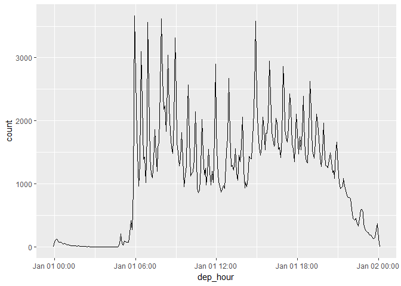<!-- -->

### 16.3.4

1. How does the distribution of flight times within a day change over the course of the year?


```r
flights_dt %>%
  mutate(time = hour(dep_time) * 100 + minute(dep_time),
         day = as.factor(yday
                         (dep_time))) %>%
  ggplot(aes(x = time, group = day, color = day)) +
  geom_freqpoly(binwidth = 100)
```

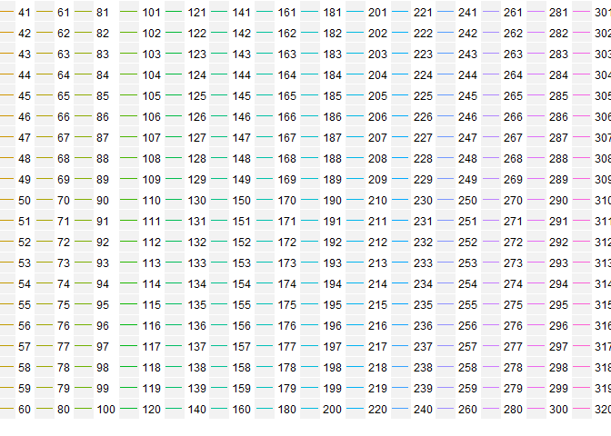<!-- -->

2. Compare dep_time, sched_dep_time and dep_delay. Are they consistent? Explain your findings.


```r
flights_dt %>%
  mutate(dep_time2 = sched_dep_time + dep_delay * 60) %>%
  filter(dep_time2 != dep_time) %>%
  select(dep_time2, dep_time, sched_dep_time, dep_delay)
```

```
## # A tibble: 1,205 x 4
##              dep_time2            dep_time      sched_dep_time dep_delay
##                 <dttm>              <dttm>              <dttm>     <dbl>
##  1 2013-01-02 08:48:00 2013-01-01 08:48:00 2013-01-01 18:35:00       853
##  2 2013-01-03 00:42:00 2013-01-02 00:42:00 2013-01-02 23:59:00        43
##  3 2013-01-03 01:26:00 2013-01-02 01:26:00 2013-01-02 22:50:00       156
##  4 2013-01-04 00:32:00 2013-01-03 00:32:00 2013-01-03 23:59:00        33
##  5 2013-01-04 00:50:00 2013-01-03 00:50:00 2013-01-03 21:45:00       185
##  6 2013-01-04 02:35:00 2013-01-03 02:35:00 2013-01-03 23:59:00       156
##  7 2013-01-05 00:25:00 2013-01-04 00:25:00 2013-01-04 23:59:00        26
##  8 2013-01-05 01:06:00 2013-01-04 01:06:00 2013-01-04 22:45:00       141
##  9 2013-01-06 00:14:00 2013-01-05 00:14:00 2013-01-05 23:59:00        15
## 10 2013-01-06 00:37:00 2013-01-05 00:37:00 2013-01-05 22:30:00       127
## # ... with 1,195 more rows
```

3. Compare air_time with the duration between the departure and arrival. Explain your findings. (Hint: consider the location of the airport.)

```r
flights_dt %>%
  mutate(est_air_time = minutes(arr_time - dep_time),
         act_air_time = minutes(air_time)) %>%
  filter(act_air_time != est_air_time) %>%
  select(origin,dest,act_air_time,est_air_time)
```

```
## # A tibble: 327,150 x 4
##    origin  dest act_air_time est_air_time
##     <chr> <chr> <S4: Period> <S4: Period>
##  1    EWR   IAH      227M 0S      193M 0S
##  2    LGA   IAH      227M 0S      197M 0S
##  3    JFK   MIA      160M 0S      221M 0S
##  4    JFK   BQN      183M 0S      260M 0S
##  5    LGA   ATL      116M 0S      138M 0S
##  6    EWR   ORD      150M 0S      106M 0S
##  7    EWR   FLL      158M 0S      198M 0S
##  8    LGA   IAD       53M 0S       72M 0S
##  9    JFK   MCO      140M 0S      161M 0S
## 10    LGA   ORD      138M 0S      115M 0S
## # ... with 327,140 more rows
```

The different locations of the airports can be in different timezones. The times are most likely relative to the timezone of the airport they are recorded at.

4. How does the average delay time change over the course of a day? Should you use `dep_time` or `sched_dep_time`? Why?


```r
flights_dt %>%
  mutate(sched_dep_hour = hour(sched_dep_time)) %>%
  group_by(sched_dep_hour) %>%
  summarise(dep_delay = mean(dep_delay)) %>%
  ggplot(aes(y = dep_delay, x = sched_dep_hour)) +
  geom_point() +
  geom_smooth()
```

```
## `geom_smooth()` using method = 'loess'
```

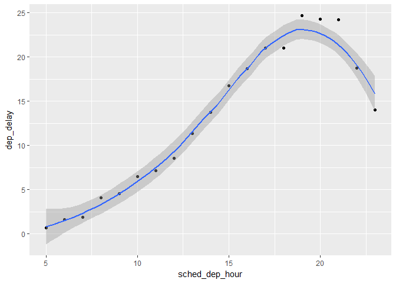<!-- -->

Delays increase throughout the day until about 7 pm

5. On what day of the week should you leave if you want to minimise the chance of a delay?

```r
flights_dt %>%
  mutate(sched_dep_day = wday(sched_dep_time, label = T)) %>%
  group_by(sched_dep_day) %>%
  summarise(dep_delay = mean(dep_delay, na.rm = T)) %>%
  ggplot(aes(y = dep_delay, x = sched_dep_day)) +
  geom_bar(stat = "identity")
```

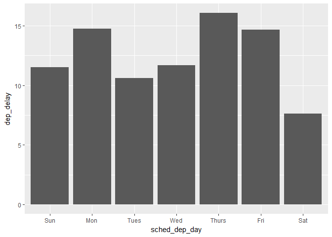<!-- -->

```r
flights_dt %>%
  mutate(sched_arr_day = wday(sched_arr_time, label = T)) %>%
  group_by(sched_arr_day) %>%
  summarise(arr_delay = mean(arr_delay, na.rm = T)) %>%
  ggplot(aes(y = arr_delay, x = sched_arr_day)) +
  geom_bar(stat = "identity")
```

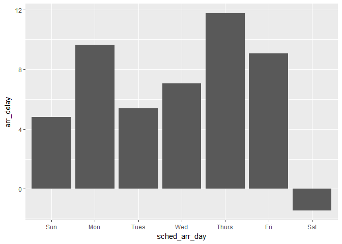<!-- -->

The best day is saturday

6. What makes the distribution of `diamonds$carat` and `flights$sched_dep_time` similar?


```r
ggplot(diamonds, aes(carat)) +
  geom_density()
```

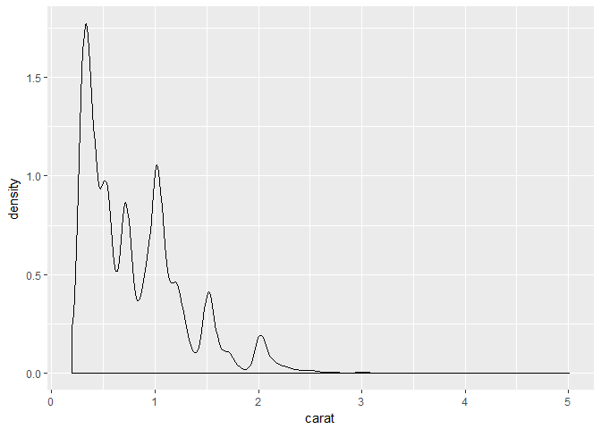<!-- -->

```r
ggplot(flights, aes(sched_dep_time)) +
  geom_density()
```

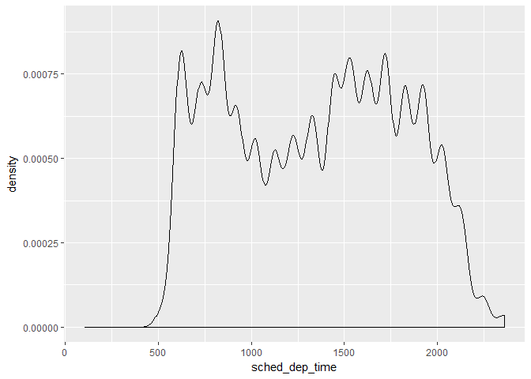<!-- -->

Humans like nice numbers hence the peaks

7. Confirm my hypothesis that the early departures of flights in minutes 20-30 and 50-60 are caused by scheduled flights that leave early. Hint: create a binary variable that tells you whether or not a flight was delayed.


```r
flights_dt %>%
  mutate(early = dep_delay < 0,
         minute = minute(sched_dep_time) %/% 10) %>%
  group_by(minute) %>%
  summarise(early = mean(early)) %>%
  ggplot(aes(x = minute, y = early)) +
  geom_point()
```

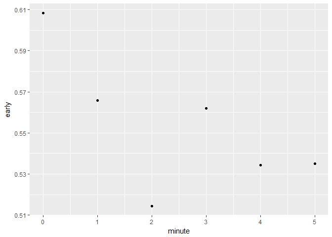<!-- -->

Hypothesis doesn't seem to be confirmed based off this result

## 16.4 Time spans

### 16.4.1 Durations


```r
h_age <- today() - ymd(19791014)
h_age
```

```
## Time difference of 13794 days
```

```r
as.duration(h_age)
```

```
## [1] "1191801600s (~37.77 years)"
```

```r
dseconds(15)
```

```
## [1] "15s"
```

```r
dminutes(10)
```

```
## [1] "600s (~10 minutes)"
```

```r
dhours(c(12, 24))
```

```
## [1] "43200s (~12 hours)" "86400s (~1 days)"
```

```r
ddays(0:5)
```

```
## [1] "0s"                "86400s (~1 days)"  "172800s (~2 days)"
## [4] "259200s (~3 days)" "345600s (~4 days)" "432000s (~5 days)"
```

```r
dweeks(3)
```

```
## [1] "1814400s (~3 weeks)"
```

```r
dyears(1)
```

```
## [1] "31536000s (~52.14 weeks)"
```

```r
2 * dyears(1)
```

```
## [1] "63072000s (~2 years)"
```

```r
dyears(1) + dweeks(12) + dhours(15)
```

```
## [1] "38847600s (~1.23 years)"
```

```r
tomorrow <- today() + ddays(1)
last_year <- today() - dyears(1)


one_pm <- ymd_hms("2016-03-12 13:00:00", tz = "America/New_York")
one_pm
```

```
## [1] "2016-03-12 13:00:00 EST"
```

```r
one_pm + ddays(1)
```

```
## [1] "2016-03-13 14:00:00 EDT"
```

### 16.4.2 Periods


```r
one_pm
```

```
## [1] "2016-03-12 13:00:00 EST"
```

```r
one_pm + days(1)
```

```
## [1] "2016-03-13 13:00:00 EDT"
```

```r
seconds(15)
```

```
## [1] "15S"
```

```r
minutes(10)
```

```
## [1] "10M 0S"
```

```r
hours(c(12, 24))
```

```
## [1] "12H 0M 0S" "24H 0M 0S"
```

```r
days(7)
```

```
## [1] "7d 0H 0M 0S"
```

```r
months(1:6)
```

```
## [1] "1m 0d 0H 0M 0S" "2m 0d 0H 0M 0S" "3m 0d 0H 0M 0S" "4m 0d 0H 0M 0S"
## [5] "5m 0d 0H 0M 0S" "6m 0d 0H 0M 0S"
```

```r
weeks(3)
```

```
## [1] "21d 0H 0M 0S"
```

```r
years(1)
```

```
## [1] "1y 0m 0d 0H 0M 0S"
```

```r
10 * (months(6) + days(1))
```

```
## [1] "60m 10d 0H 0M 0S"
```

```r
days(50) + hours(25) + minutes(2)
```

```
## [1] "50d 25H 2M 0S"
```

```r
ymd("2016-01-01") + dyears(1)
```

```
## [1] "2016-12-31"
```

```r
ymd("2016-01-01") + years(1)
```

```
## [1] "2017-01-01"
```

```r
one_pm + ddays(1)
```

```
## [1] "2016-03-13 14:00:00 EDT"
```

```r
one_pm + days(1)
```

```
## [1] "2016-03-13 13:00:00 EDT"
```

```r
flights_dt %>% 
  filter(arr_time < dep_time) 
```

```
## # A tibble: 10,633 x 9
##    origin  dest dep_delay arr_delay            dep_time
##     <chr> <chr>     <dbl>     <dbl>              <dttm>
##  1    EWR   BQN         9        -4 2013-01-01 19:29:00
##  2    JFK   DFW        59        NA 2013-01-01 19:39:00
##  3    EWR   TPA        -2         9 2013-01-01 20:58:00
##  4    EWR   SJU        -6       -12 2013-01-01 21:02:00
##  5    EWR   SFO        11       -14 2013-01-01 21:08:00
##  6    LGA   FLL       -10        -2 2013-01-01 21:20:00
##  7    EWR   MCO        41        43 2013-01-01 21:21:00
##  8    JFK   LAX        -7       -24 2013-01-01 21:28:00
##  9    EWR   FLL        49        28 2013-01-01 21:34:00
## 10    EWR   FLL        -9       -14 2013-01-01 21:36:00
## # ... with 10,623 more rows, and 4 more variables: sched_dep_time <dttm>,
## #   arr_time <dttm>, sched_arr_time <dttm>, air_time <dbl>
```

```r
flights_dt <- flights_dt %>% 
  mutate(
    overnight = arr_time < dep_time,
    arr_time = arr_time + days(overnight * 1),
    sched_arr_time = sched_arr_time + days(overnight * 1)
  )

flights_dt %>% 
  filter(overnight, arr_time < dep_time) 
```

```
## # A tibble: 0 x 10
## # ... with 10 variables: origin <chr>, dest <chr>, dep_delay <dbl>,
## #   arr_delay <dbl>, dep_time <dttm>, sched_dep_time <dttm>,
## #   arr_time <dttm>, sched_arr_time <dttm>, air_time <dbl>,
## #   overnight <lgl>
```

### 16.4.3 Intervals


```r
years(1) / days(1)
```

```
## estimate only: convert to intervals for accuracy
```

```
## [1] 365.25
```

```r
next_year <- today() + years(1)
(today() %--% next_year) / ddays(1)
```

```
## [1] 365
```

```r
(today() %--% next_year) %/% days(1)
```

```
## Note: method with signature 'Timespan#Timespan' chosen for function '%/%',
##  target signature 'Interval#Period'.
##  "Interval#ANY", "ANY#Period" would also be valid
```

```
## [1] 365
```

### 16.4.5 Exercises

1. Why is there months() but no dmonths()?

The number of days in a month changes based on the month and year

2. Explain days(overnight * 1) to someone who has just started learning R. How does it work?

If a flight arrives before it lands due to timezomes if can cause problems. Overnight is a boolean which tells you if this occurred. If this did occur, the function adds 1 day to the arrival date to correct the error, TRUE = 1 and FALSE = 0

3. Create a vector of dates giving the first day of every month in 2015. Create a vector of dates giving the first day of every month in the current year.


```r
ymd("2015-01-01") + months(0:11)
```

```
##  [1] "2015-01-01" "2015-02-01" "2015-03-01" "2015-04-01" "2015-05-01"
##  [6] "2015-06-01" "2015-07-01" "2015-08-01" "2015-09-01" "2015-10-01"
## [11] "2015-11-01" "2015-12-01"
```

```r
floor_date(today(), "year") + months(0:11)
```

```
##  [1] "2017-01-01" "2017-02-01" "2017-03-01" "2017-04-01" "2017-05-01"
##  [6] "2017-06-01" "2017-07-01" "2017-08-01" "2017-09-01" "2017-10-01"
## [11] "2017-11-01" "2017-12-01"
```

4. Write a function that given your birthday (as a date), returns how old you are in years.


```r
age <- function(x) {
  (ymd(x) %--% today()) %/% years(1)
}
age("1993-10-10")
```

```
## [1] 23
```

5. Why can’t `(today() %--% (today() + years(1)) / months(1)` work?


```r
(today() %--% (today() + years(1)) / months(1))
```

```
## [1] 12
```

You forget a parenthesis...

## 16.5 Time zones


```r
Sys.timezone()
```

```
## [1] "America/Los_Angeles"
```

```r
length(OlsonNames())
```

```
## [1] 593
```

```r
head(OlsonNames())
```

```
## [1] "Africa/Abidjan"     "Africa/Accra"       "Africa/Addis_Ababa"
## [4] "Africa/Algiers"     "Africa/Asmara"      "Africa/Asmera"
```

```r
(x1 <- ymd_hms("2015-06-01 12:00:00", tz = "America/New_York"))
```

```
## [1] "2015-06-01 12:00:00 EDT"
```

```r
(x2 <- ymd_hms("2015-06-01 18:00:00", tz = "Europe/Copenhagen"))
```

```
## [1] "2015-06-01 18:00:00 CEST"
```

```r
(x3 <- ymd_hms("2015-06-02 04:00:00", tz = "Pacific/Auckland"))
```

```
## [1] "2015-06-02 04:00:00 NZST"
```

```r
x1 - x2
```

```
## Time difference of 0 secs
```

```r
x1 - x3
```

```
## Time difference of 0 secs
```

```r
x4 <- c(x1, x2, x3)
x4
```

```
## [1] "2015-06-01 09:00:00 PDT" "2015-06-01 09:00:00 PDT"
## [3] "2015-06-01 09:00:00 PDT"
```

```r
x4a <- with_tz(x4, tzone = "Australia/Lord_Howe")
x4a
```

```
## [1] "2015-06-02 02:30:00 LHST" "2015-06-02 02:30:00 LHST"
## [3] "2015-06-02 02:30:00 LHST"
```

```r
x4a - x4
```

```
## Time differences in secs
## [1] 0 0 0
```

```r
x4b <- force_tz(x4, tzone = "Australia/Lord_Howe")
x4b
```

```
## [1] "2015-06-01 09:00:00 LHST" "2015-06-01 09:00:00 LHST"
## [3] "2015-06-01 09:00:00 LHST"
```

```r
x4b - x4
```

```
## Time differences in hours
## [1] -17.5 -17.5 -17.5
```

