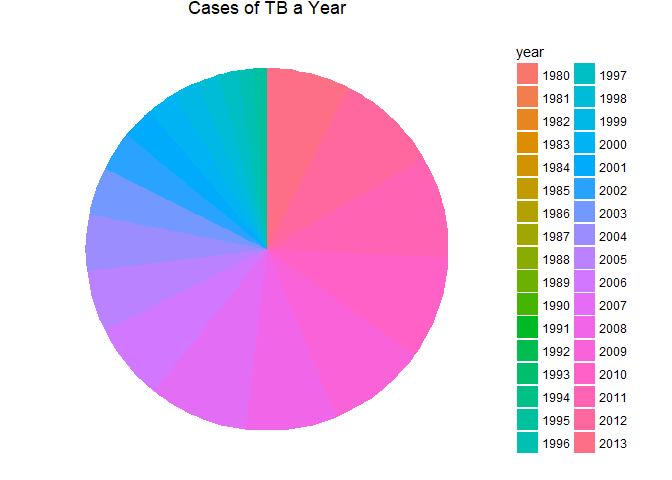

# 06_21_2017
John D.  
June 21, 2017  


# 12.5 Missing values


```r
stocks <- tibble(
  year   = c(2015, 2015, 2015, 2015, 2016, 2016, 2016),
  qtr    = c(   1,    2,    3,    4,    2,    3,    4),
  return = c(1.88, 0.59, 0.35,   NA, 0.92, 0.17, 2.66)
)
stocks
```

```
## # A tibble: 7 x 3
##    year   qtr return
##   <dbl> <dbl>  <dbl>
## 1  2015     1   1.88
## 2  2015     2   0.59
## 3  2015     3   0.35
## 4  2015     4     NA
## 5  2016     2   0.92
## 6  2016     3   0.17
## 7  2016     4   2.66
```

```r
stocks %>% 
  spread(year, return)
```

```
## # A tibble: 4 x 3
##     qtr `2015` `2016`
## * <dbl>  <dbl>  <dbl>
## 1     1   1.88     NA
## 2     2   0.59   0.92
## 3     3   0.35   0.17
## 4     4     NA   2.66
```

```r
stocks %>% 
  spread(year, return) %>% 
  gather(year, return, `2015`:`2016`, na.rm = TRUE)
```

```
## # A tibble: 6 x 3
##     qtr  year return
## * <dbl> <chr>  <dbl>
## 1     1  2015   1.88
## 2     2  2015   0.59
## 3     3  2015   0.35
## 4     2  2016   0.92
## 5     3  2016   0.17
## 6     4  2016   2.66
```

```r
stocks %>% 
  complete(year, qtr)
```

```
## # A tibble: 8 x 3
##    year   qtr return
##   <dbl> <dbl>  <dbl>
## 1  2015     1   1.88
## 2  2015     2   0.59
## 3  2015     3   0.35
## 4  2015     4     NA
## 5  2016     1     NA
## 6  2016     2   0.92
## 7  2016     3   0.17
## 8  2016     4   2.66
```

```r
treatment <- tribble(
  ~ person,           ~ treatment, ~response,
  "Derrick Whitmore", 1,           7,
  NA,                 2,           10,
  NA,                 3,           9,
  "Katherine Burke",  1,           4
)
treatment
```

```
## # A tibble: 4 x 3
##             person treatment response
##              <chr>     <dbl>    <dbl>
## 1 Derrick Whitmore         1        7
## 2             <NA>         2       10
## 3             <NA>         3        9
## 4  Katherine Burke         1        4
```

```r
treatment %>% 
  fill(person)
```

```
## # A tibble: 4 x 3
##             person treatment response
##              <chr>     <dbl>    <dbl>
## 1 Derrick Whitmore         1        7
## 2 Derrick Whitmore         2       10
## 3 Derrick Whitmore         3        9
## 4  Katherine Burke         1        4
```

### 12.5.1 Exercises

1. Compare and contrast the `fill` arguments to `spread()` and `complete()`


```r
stocks %>% 
  spread(year, return)
```

```
## # A tibble: 4 x 3
##     qtr `2015` `2016`
## * <dbl>  <dbl>  <dbl>
## 1     1   1.88     NA
## 2     2   0.59   0.92
## 3     3   0.35   0.17
## 4     4     NA   2.66
```

```r
stocks %>% 
  spread(year, return, fill = "BLANK")
```

```
## # A tibble: 4 x 3
##     qtr `2015` `2016`
## * <dbl>  <chr>  <chr>
## 1     1   1.88  BLANK
## 2     2   0.59   0.92
## 3     3   0.35   0.17
## 4     4  BLANK   2.66
```

```r
stocks %>% 
  complete(year, qtr)
```

```
## # A tibble: 8 x 3
##    year   qtr return
##   <dbl> <dbl>  <dbl>
## 1  2015     1   1.88
## 2  2015     2   0.59
## 3  2015     3   0.35
## 4  2015     4     NA
## 5  2016     1     NA
## 6  2016     2   0.92
## 7  2016     3   0.17
## 8  2016     4   2.66
```

```r
stocks %>% 
  complete(year, qtr, fill = list(return = "We Broke"))
```

```
## # A tibble: 8 x 3
##    year   qtr   return
##   <dbl> <dbl>    <chr>
## 1  2015     1     1.88
## 2  2015     2     0.59
## 3  2015     3     0.35
## 4  2015     4 We Broke
## 5  2016     1 We Broke
## 6  2016     2     0.92
## 7  2016     3     0.17
## 8  2016     4     2.66
```

Spread with fill will replace both explicit and implicit missing values with whatever you set fill equal to. Complete with fill will fill each column with a specific value for each variable. It will also replace NA with the designated value

2. What does the direction argument to `fill()` do?


```r
treatment %>% 
  fill(person)
```

```
## # A tibble: 4 x 3
##             person treatment response
##              <chr>     <dbl>    <dbl>
## 1 Derrick Whitmore         1        7
## 2 Derrick Whitmore         2       10
## 3 Derrick Whitmore         3        9
## 4  Katherine Burke         1        4
```

```r
treatment %>% 
  fill(person, .direction = "up")
```

```
## # A tibble: 4 x 3
##             person treatment response
##              <chr>     <dbl>    <dbl>
## 1 Derrick Whitmore         1        7
## 2  Katherine Burke         2       10
## 3  Katherine Burke         3        9
## 4  Katherine Burke         1        4
```

By default fills in missing data from top to bottom with the most recent non-missing data. Can be changed to fill in missing data from bottom to top.

## 12.6 Case Study


```r
who
```

```
## # A tibble: 7,240 x 60
##        country  iso2  iso3  year new_sp_m014 new_sp_m1524 new_sp_m2534
##          <chr> <chr> <chr> <int>       <int>        <int>        <int>
##  1 Afghanistan    AF   AFG  1980          NA           NA           NA
##  2 Afghanistan    AF   AFG  1981          NA           NA           NA
##  3 Afghanistan    AF   AFG  1982          NA           NA           NA
##  4 Afghanistan    AF   AFG  1983          NA           NA           NA
##  5 Afghanistan    AF   AFG  1984          NA           NA           NA
##  6 Afghanistan    AF   AFG  1985          NA           NA           NA
##  7 Afghanistan    AF   AFG  1986          NA           NA           NA
##  8 Afghanistan    AF   AFG  1987          NA           NA           NA
##  9 Afghanistan    AF   AFG  1988          NA           NA           NA
## 10 Afghanistan    AF   AFG  1989          NA           NA           NA
## # ... with 7,230 more rows, and 53 more variables: new_sp_m3544 <int>,
## #   new_sp_m4554 <int>, new_sp_m5564 <int>, new_sp_m65 <int>,
## #   new_sp_f014 <int>, new_sp_f1524 <int>, new_sp_f2534 <int>,
## #   new_sp_f3544 <int>, new_sp_f4554 <int>, new_sp_f5564 <int>,
## #   new_sp_f65 <int>, new_sn_m014 <int>, new_sn_m1524 <int>,
## #   new_sn_m2534 <int>, new_sn_m3544 <int>, new_sn_m4554 <int>,
## #   new_sn_m5564 <int>, new_sn_m65 <int>, new_sn_f014 <int>,
## #   new_sn_f1524 <int>, new_sn_f2534 <int>, new_sn_f3544 <int>,
## #   new_sn_f4554 <int>, new_sn_f5564 <int>, new_sn_f65 <int>,
## #   new_ep_m014 <int>, new_ep_m1524 <int>, new_ep_m2534 <int>,
## #   new_ep_m3544 <int>, new_ep_m4554 <int>, new_ep_m5564 <int>,
## #   new_ep_m65 <int>, new_ep_f014 <int>, new_ep_f1524 <int>,
## #   new_ep_f2534 <int>, new_ep_f3544 <int>, new_ep_f4554 <int>,
## #   new_ep_f5564 <int>, new_ep_f65 <int>, newrel_m014 <int>,
## #   newrel_m1524 <int>, newrel_m2534 <int>, newrel_m3544 <int>,
## #   newrel_m4554 <int>, newrel_m5564 <int>, newrel_m65 <int>,
## #   newrel_f014 <int>, newrel_f1524 <int>, newrel_f2534 <int>,
## #   newrel_f3544 <int>, newrel_f4554 <int>, newrel_f5564 <int>,
## #   newrel_f65 <int>
```

```r
who1 <- who %>% 
  gather(new_sp_m014:newrel_f65, key = "key", value = "cases", na.rm = TRUE)
who1
```

```
## # A tibble: 76,046 x 6
##        country  iso2  iso3  year         key cases
##  *       <chr> <chr> <chr> <int>       <chr> <int>
##  1 Afghanistan    AF   AFG  1997 new_sp_m014     0
##  2 Afghanistan    AF   AFG  1998 new_sp_m014    30
##  3 Afghanistan    AF   AFG  1999 new_sp_m014     8
##  4 Afghanistan    AF   AFG  2000 new_sp_m014    52
##  5 Afghanistan    AF   AFG  2001 new_sp_m014   129
##  6 Afghanistan    AF   AFG  2002 new_sp_m014    90
##  7 Afghanistan    AF   AFG  2003 new_sp_m014   127
##  8 Afghanistan    AF   AFG  2004 new_sp_m014   139
##  9 Afghanistan    AF   AFG  2005 new_sp_m014   151
## 10 Afghanistan    AF   AFG  2006 new_sp_m014   193
## # ... with 76,036 more rows
```

```r
who1 %>% 
  count(key)
```

```
## # A tibble: 56 x 2
##             key     n
##           <chr> <int>
##  1  new_ep_f014  1032
##  2 new_ep_f1524  1021
##  3 new_ep_f2534  1021
##  4 new_ep_f3544  1021
##  5 new_ep_f4554  1017
##  6 new_ep_f5564  1017
##  7   new_ep_f65  1014
##  8  new_ep_m014  1038
##  9 new_ep_m1524  1026
## 10 new_ep_m2534  1020
## # ... with 46 more rows
```

```r
who2 <- who1 %>% 
  mutate(key = stringr::str_replace(key, "newrel", "new_rel"))
who2
```

```
## # A tibble: 76,046 x 6
##        country  iso2  iso3  year         key cases
##          <chr> <chr> <chr> <int>       <chr> <int>
##  1 Afghanistan    AF   AFG  1997 new_sp_m014     0
##  2 Afghanistan    AF   AFG  1998 new_sp_m014    30
##  3 Afghanistan    AF   AFG  1999 new_sp_m014     8
##  4 Afghanistan    AF   AFG  2000 new_sp_m014    52
##  5 Afghanistan    AF   AFG  2001 new_sp_m014   129
##  6 Afghanistan    AF   AFG  2002 new_sp_m014    90
##  7 Afghanistan    AF   AFG  2003 new_sp_m014   127
##  8 Afghanistan    AF   AFG  2004 new_sp_m014   139
##  9 Afghanistan    AF   AFG  2005 new_sp_m014   151
## 10 Afghanistan    AF   AFG  2006 new_sp_m014   193
## # ... with 76,036 more rows
```

```r
who3 <- who2 %>% 
  separate(key, c("new", "type", "sexage"), sep = "_")
who3
```

```
## # A tibble: 76,046 x 8
##        country  iso2  iso3  year   new  type sexage cases
##  *       <chr> <chr> <chr> <int> <chr> <chr>  <chr> <int>
##  1 Afghanistan    AF   AFG  1997   new    sp   m014     0
##  2 Afghanistan    AF   AFG  1998   new    sp   m014    30
##  3 Afghanistan    AF   AFG  1999   new    sp   m014     8
##  4 Afghanistan    AF   AFG  2000   new    sp   m014    52
##  5 Afghanistan    AF   AFG  2001   new    sp   m014   129
##  6 Afghanistan    AF   AFG  2002   new    sp   m014    90
##  7 Afghanistan    AF   AFG  2003   new    sp   m014   127
##  8 Afghanistan    AF   AFG  2004   new    sp   m014   139
##  9 Afghanistan    AF   AFG  2005   new    sp   m014   151
## 10 Afghanistan    AF   AFG  2006   new    sp   m014   193
## # ... with 76,036 more rows
```

```r
who3 %>% 
  count(new)
```

```
## # A tibble: 1 x 2
##     new     n
##   <chr> <int>
## 1   new 76046
```

```r
who4 <- who3 %>% 
  select(-new, -iso2, -iso3)
who4
```

```
## # A tibble: 76,046 x 5
##        country  year  type sexage cases
##  *       <chr> <int> <chr>  <chr> <int>
##  1 Afghanistan  1997    sp   m014     0
##  2 Afghanistan  1998    sp   m014    30
##  3 Afghanistan  1999    sp   m014     8
##  4 Afghanistan  2000    sp   m014    52
##  5 Afghanistan  2001    sp   m014   129
##  6 Afghanistan  2002    sp   m014    90
##  7 Afghanistan  2003    sp   m014   127
##  8 Afghanistan  2004    sp   m014   139
##  9 Afghanistan  2005    sp   m014   151
## 10 Afghanistan  2006    sp   m014   193
## # ... with 76,036 more rows
```

```r
who5 <- who4 %>% 
  separate(sexage, c("sex", "age"), sep = 1)
who5
```

```
## # A tibble: 76,046 x 6
##        country  year  type   sex   age cases
##  *       <chr> <int> <chr> <chr> <chr> <int>
##  1 Afghanistan  1997    sp     m   014     0
##  2 Afghanistan  1998    sp     m   014    30
##  3 Afghanistan  1999    sp     m   014     8
##  4 Afghanistan  2000    sp     m   014    52
##  5 Afghanistan  2001    sp     m   014   129
##  6 Afghanistan  2002    sp     m   014    90
##  7 Afghanistan  2003    sp     m   014   127
##  8 Afghanistan  2004    sp     m   014   139
##  9 Afghanistan  2005    sp     m   014   151
## 10 Afghanistan  2006    sp     m   014   193
## # ... with 76,036 more rows
```

```r
who %>%
  gather(code, value, new_sp_m014:newrel_f65, na.rm = TRUE) %>% 
  mutate(code = stringr::str_replace(code, "newrel", "new_rel")) %>%
  separate(code, c("new", "var", "sexage")) %>% 
  select(-new, -iso2, -iso3) %>% 
  separate(sexage, c("sex", "age"), sep = 1)
```

```
## # A tibble: 76,046 x 6
##        country  year   var   sex   age value
##  *       <chr> <int> <chr> <chr> <chr> <int>
##  1 Afghanistan  1997    sp     m   014     0
##  2 Afghanistan  1998    sp     m   014    30
##  3 Afghanistan  1999    sp     m   014     8
##  4 Afghanistan  2000    sp     m   014    52
##  5 Afghanistan  2001    sp     m   014   129
##  6 Afghanistan  2002    sp     m   014    90
##  7 Afghanistan  2003    sp     m   014   127
##  8 Afghanistan  2004    sp     m   014   139
##  9 Afghanistan  2005    sp     m   014   151
## 10 Afghanistan  2006    sp     m   014   193
## # ... with 76,036 more rows
```

### 12.6.1 Exercises

1. In this case study I set `na.rm = TRUE` just to make it easier to check that we had the correct values. Is this reasonable? Think about how missing values are represented in this dataset. Are there implicit missing values? What’s the difference between an `NA` and zero?


```r
who %>%
  gather(code, value, new_sp_m014:newrel_f65, na.rm = TRUE) %>%
  dim() #76046
```

```
## [1] 76046     6
```

```r
who %>%
  gather(code, value, new_sp_m014:newrel_f65) %>%
  dim() #405440
```

```
## [1] 405440      6
```

In this case, getting rid of NA values is reasonable. NA means that they do not have data for a particular combination of variables. The missing values are implicit in this dataset. We do have situations were the number of cases is 0. Zero is an actual data point while NA indicates a lack of data rather than no cases.

2. What happens if you neglect the `mutate()` step? `(mutate(key = stringr::str_replace(key, "newrel", "new_rel")))`


```r
who %>%
  gather(code, value, new_sp_m014:newrel_f65, na.rm = TRUE) %>% 
  separate(code, c("new", "var", "sexage")) %>% 
  select(-iso2, -iso3) %>% 
  separate(sexage, c("sex", "age"), sep = 1)
```

```
## Warning: Too few values at 2580 locations: 73467, 73468, 73469, 73470,
## 73471, 73472, 73473, 73474, 73475, 73476, 73477, 73478, 73479, 73480,
## 73481, 73482, 73483, 73484, 73485, 73486, ...
```

```
## # A tibble: 76,046 x 7
##        country  year   new   var   sex   age value
##  *       <chr> <int> <chr> <chr> <chr> <chr> <int>
##  1 Afghanistan  1997   new    sp     m   014     0
##  2 Afghanistan  1998   new    sp     m   014    30
##  3 Afghanistan  1999   new    sp     m   014     8
##  4 Afghanistan  2000   new    sp     m   014    52
##  5 Afghanistan  2001   new    sp     m   014   129
##  6 Afghanistan  2002   new    sp     m   014    90
##  7 Afghanistan  2003   new    sp     m   014   127
##  8 Afghanistan  2004   new    sp     m   014   139
##  9 Afghanistan  2005   new    sp     m   014   151
## 10 Afghanistan  2006   new    sp     m   014   193
## # ... with 76,036 more rows
```

Although it is hard to see, by not adding an "_", our separate function fails to completely split our key into 3 separate columns. Separate splits on nonalphanumeric characters. We indicate 2 nonalphanumeric characters, but we have 2580 values which contain only 1 nonalphanumeric character.

3. I claimed that `iso2` and `iso3` were redundant with country. Confirm this claim.


```r
who %>%
  gather(code, value, new_sp_m014:newrel_f65, na.rm = TRUE) %>% 
  mutate(code = stringr::str_replace(code, "newrel", "new_rel")) %>%
  separate(code, c("new", "var", "sexage")) %>% 
  select(-new, -iso2, -iso3) %>% 
  separate(sexage, c("sex", "age"), sep = 1) %>%
  dim()
```

```
## [1] 76046     6
```

```r
who %>%
  gather(code, value, new_sp_m014:newrel_f65, na.rm = TRUE) %>% 
  mutate(code = stringr::str_replace(code, "newrel", "new_rel")) %>%
  separate(code, c("new", "var", "sexage")) %>% 
  select(-new, -country, -iso3) %>% 
  separate(sexage, c("sex", "age"), sep = 1) %>%
  dim()
```

```
## [1] 76046     6
```

```r
who %>%
  gather(code, value, new_sp_m014:newrel_f65, na.rm = TRUE) %>% 
  mutate(code = stringr::str_replace(code, "newrel", "new_rel")) %>%
  separate(code, c("new", "var", "sexage")) %>% 
  select(-new, -iso2, -country) %>% 
  separate(sexage, c("sex", "age"), sep = 1) %>%
  dim()
```

```
## [1] 76046     6
```

```r
who %>%
  mutate(Location = paste0(country,iso2,iso3,year)) %>%
  select(Location) %>%
  unique() %>%
  dim()
```

```
## [1] 7240    1
```

```r
who %>%
  select(country,year) %>%
  unique() %>%
  dim()
```

```
## [1] 7240    2
```

When combining country, iso2, iso3, and year into one variable then keep only unique values, you get 7240 rows. This the same if you count only the number of unique country,year combinations.

4. For each country, year, and sex compute the total number of cases of TB. Make an informative visualisation of the data.


```r
who %>%
  gather(code, value, new_sp_m014:newrel_f65, na.rm = TRUE) %>% 
  select(country,value) %>%
  group_by(country) %>%
  tally(value) %>%
  ggplot(aes(reorder(country, n),n)) +
  geom_col() +
  theme(axis.text.x = element_text(angle = 90, hjust = 1))
```

<!-- -->

```r
who %>%
  gather(code, value, new_sp_m014:newrel_f65, na.rm = TRUE) %>% 
  select(year,value) %>%
  group_by(year) %>%
  tally(value) %>%
  mutate(year = as.character(year)) %>%
  ggplot(aes(reorder(year, n),n, fill = year)) +
  geom_col() +
  theme(axis.text.x = element_text(angle = 90, hjust = 1))
```

<!-- -->

```r
who %>%
  gather(code, value, new_sp_m014:newrel_f65, na.rm = TRUE) %>% 
  mutate(code = stringr::str_replace(code, "newrel", "new_rel")) %>%
  separate(code, c("new", "var", "sexage")) %>% 
  select(-new, -iso2, -iso3) %>% 
  separate(sexage, c("sex", "age"), sep = 1) %>%
  select(sex,value) %>%
  group_by(sex) %>%
  tally(value) %>%
  ggplot(aes(sex,n, fill = sex)) +
  geom_col()
```

<!-- -->

# 13 Relational data

## 13.1 Introduction


```r
library(nycflights13)
```

## 13.2 nycflights13


```r
airlines
```

```
## # A tibble: 16 x 2
##    carrier                        name
##      <chr>                       <chr>
##  1      9E           Endeavor Air Inc.
##  2      AA      American Airlines Inc.
##  3      AS        Alaska Airlines Inc.
##  4      B6             JetBlue Airways
##  5      DL        Delta Air Lines Inc.
##  6      EV    ExpressJet Airlines Inc.
##  7      F9      Frontier Airlines Inc.
##  8      FL AirTran Airways Corporation
##  9      HA      Hawaiian Airlines Inc.
## 10      MQ                   Envoy Air
## 11      OO       SkyWest Airlines Inc.
## 12      UA       United Air Lines Inc.
## 13      US             US Airways Inc.
## 14      VX              Virgin America
## 15      WN      Southwest Airlines Co.
## 16      YV          Mesa Airlines Inc.
```

```r
airports
```

```
## # A tibble: 1,458 x 8
##      faa                           name      lat        lon   alt    tz
##    <chr>                          <chr>    <dbl>      <dbl> <int> <dbl>
##  1   04G              Lansdowne Airport 41.13047  -80.61958  1044    -5
##  2   06A  Moton Field Municipal Airport 32.46057  -85.68003   264    -6
##  3   06C            Schaumburg Regional 41.98934  -88.10124   801    -6
##  4   06N                Randall Airport 41.43191  -74.39156   523    -5
##  5   09J          Jekyll Island Airport 31.07447  -81.42778    11    -5
##  6   0A9 Elizabethton Municipal Airport 36.37122  -82.17342  1593    -5
##  7   0G6        Williams County Airport 41.46731  -84.50678   730    -5
##  8   0G7  Finger Lakes Regional Airport 42.88356  -76.78123   492    -5
##  9   0P2   Shoestring Aviation Airfield 39.79482  -76.64719  1000    -5
## 10   0S9          Jefferson County Intl 48.05381 -122.81064   108    -8
## # ... with 1,448 more rows, and 2 more variables: dst <chr>, tzone <chr>
```

```r
planes
```

```
## # A tibble: 3,322 x 9
##    tailnum  year                    type     manufacturer     model
##      <chr> <int>                   <chr>            <chr>     <chr>
##  1  N10156  2004 Fixed wing multi engine          EMBRAER EMB-145XR
##  2  N102UW  1998 Fixed wing multi engine AIRBUS INDUSTRIE  A320-214
##  3  N103US  1999 Fixed wing multi engine AIRBUS INDUSTRIE  A320-214
##  4  N104UW  1999 Fixed wing multi engine AIRBUS INDUSTRIE  A320-214
##  5  N10575  2002 Fixed wing multi engine          EMBRAER EMB-145LR
##  6  N105UW  1999 Fixed wing multi engine AIRBUS INDUSTRIE  A320-214
##  7  N107US  1999 Fixed wing multi engine AIRBUS INDUSTRIE  A320-214
##  8  N108UW  1999 Fixed wing multi engine AIRBUS INDUSTRIE  A320-214
##  9  N109UW  1999 Fixed wing multi engine AIRBUS INDUSTRIE  A320-214
## 10  N110UW  1999 Fixed wing multi engine AIRBUS INDUSTRIE  A320-214
## # ... with 3,312 more rows, and 4 more variables: engines <int>,
## #   seats <int>, speed <int>, engine <chr>
```

```r
weather
```

```
## # A tibble: 26,130 x 15
##    origin  year month   day  hour  temp  dewp humid wind_dir wind_speed
##     <chr> <dbl> <dbl> <int> <int> <dbl> <dbl> <dbl>    <dbl>      <dbl>
##  1    EWR  2013     1     1     0 37.04 21.92 53.97      230   10.35702
##  2    EWR  2013     1     1     1 37.04 21.92 53.97      230   13.80936
##  3    EWR  2013     1     1     2 37.94 21.92 52.09      230   12.65858
##  4    EWR  2013     1     1     3 37.94 23.00 54.51      230   13.80936
##  5    EWR  2013     1     1     4 37.94 24.08 57.04      240   14.96014
##  6    EWR  2013     1     1     6 39.02 26.06 59.37      270   10.35702
##  7    EWR  2013     1     1     7 39.02 26.96 61.63      250    8.05546
##  8    EWR  2013     1     1     8 39.02 28.04 64.43      240   11.50780
##  9    EWR  2013     1     1     9 39.92 28.04 62.21      250   12.65858
## 10    EWR  2013     1     1    10 39.02 28.04 64.43      260   12.65858
## # ... with 26,120 more rows, and 5 more variables: wind_gust <dbl>,
## #   precip <dbl>, pressure <dbl>, visib <dbl>, time_hour <dttm>
```

```r
flights
```

```
## # A tibble: 336,776 x 19
##     year month   day dep_time sched_dep_time dep_delay arr_time
##    <int> <int> <int>    <int>          <int>     <dbl>    <int>
##  1  2013     1     1      517            515         2      830
##  2  2013     1     1      533            529         4      850
##  3  2013     1     1      542            540         2      923
##  4  2013     1     1      544            545        -1     1004
##  5  2013     1     1      554            600        -6      812
##  6  2013     1     1      554            558        -4      740
##  7  2013     1     1      555            600        -5      913
##  8  2013     1     1      557            600        -3      709
##  9  2013     1     1      557            600        -3      838
## 10  2013     1     1      558            600        -2      753
## # ... with 336,766 more rows, and 12 more variables: sched_arr_time <int>,
## #   arr_delay <dbl>, carrier <chr>, flight <int>, tailnum <chr>,
## #   origin <chr>, dest <chr>, air_time <dbl>, distance <dbl>, hour <dbl>,
## #   minute <dbl>, time_hour <dttm>
```

### 13.2.1 Exercises

1. Imagine you wanted to draw (approximately) the route each plane flies from its origin to its destination. What variables would you need? What tables would you need to combine?

From flights need dest and origin.
From airports need lat and long, combine faa with origin and dest from flights

2. I forgot to draw the relationship between `weather` and `airports`. What is the relationship and how should it appear in the diagram?


```r
weather
```

```
## # A tibble: 26,130 x 15
##    origin  year month   day  hour  temp  dewp humid wind_dir wind_speed
##     <chr> <dbl> <dbl> <int> <int> <dbl> <dbl> <dbl>    <dbl>      <dbl>
##  1    EWR  2013     1     1     0 37.04 21.92 53.97      230   10.35702
##  2    EWR  2013     1     1     1 37.04 21.92 53.97      230   13.80936
##  3    EWR  2013     1     1     2 37.94 21.92 52.09      230   12.65858
##  4    EWR  2013     1     1     3 37.94 23.00 54.51      230   13.80936
##  5    EWR  2013     1     1     4 37.94 24.08 57.04      240   14.96014
##  6    EWR  2013     1     1     6 39.02 26.06 59.37      270   10.35702
##  7    EWR  2013     1     1     7 39.02 26.96 61.63      250    8.05546
##  8    EWR  2013     1     1     8 39.02 28.04 64.43      240   11.50780
##  9    EWR  2013     1     1     9 39.92 28.04 62.21      250   12.65858
## 10    EWR  2013     1     1    10 39.02 28.04 64.43      260   12.65858
## # ... with 26,120 more rows, and 5 more variables: wind_gust <dbl>,
## #   precip <dbl>, pressure <dbl>, visib <dbl>, time_hour <dttm>
```

```r
airports
```

```
## # A tibble: 1,458 x 8
##      faa                           name      lat        lon   alt    tz
##    <chr>                          <chr>    <dbl>      <dbl> <int> <dbl>
##  1   04G              Lansdowne Airport 41.13047  -80.61958  1044    -5
##  2   06A  Moton Field Municipal Airport 32.46057  -85.68003   264    -6
##  3   06C            Schaumburg Regional 41.98934  -88.10124   801    -6
##  4   06N                Randall Airport 41.43191  -74.39156   523    -5
##  5   09J          Jekyll Island Airport 31.07447  -81.42778    11    -5
##  6   0A9 Elizabethton Municipal Airport 36.37122  -82.17342  1593    -5
##  7   0G6        Williams County Airport 41.46731  -84.50678   730    -5
##  8   0G7  Finger Lakes Regional Airport 42.88356  -76.78123   492    -5
##  9   0P2   Shoestring Aviation Airfield 39.79482  -76.64719  1000    -5
## 10   0S9          Jefferson County Intl 48.05381 -122.81064   108    -8
## # ... with 1,448 more rows, and 2 more variables: dst <chr>, tzone <chr>
```

Origin from weather is related to origin in flights which is related to faa from airports. Or simpler Origin from weather is related to faa from airports

3. `weather` only contains information for the origin (NYC) airports. If it contained weather records for all airports in the USA, what additional relation would it define with `flights`?


```r
flights
```

```
## # A tibble: 336,776 x 19
##     year month   day dep_time sched_dep_time dep_delay arr_time
##    <int> <int> <int>    <int>          <int>     <dbl>    <int>
##  1  2013     1     1      517            515         2      830
##  2  2013     1     1      533            529         4      850
##  3  2013     1     1      542            540         2      923
##  4  2013     1     1      544            545        -1     1004
##  5  2013     1     1      554            600        -6      812
##  6  2013     1     1      554            558        -4      740
##  7  2013     1     1      555            600        -5      913
##  8  2013     1     1      557            600        -3      709
##  9  2013     1     1      557            600        -3      838
## 10  2013     1     1      558            600        -2      753
## # ... with 336,766 more rows, and 12 more variables: sched_arr_time <int>,
## #   arr_delay <dbl>, carrier <chr>, flight <int>, tailnum <chr>,
## #   origin <chr>, dest <chr>, air_time <dbl>, distance <dbl>, hour <dbl>,
## #   minute <dbl>, time_hour <dttm>
```

```r
weather
```

```
## # A tibble: 26,130 x 15
##    origin  year month   day  hour  temp  dewp humid wind_dir wind_speed
##     <chr> <dbl> <dbl> <int> <int> <dbl> <dbl> <dbl>    <dbl>      <dbl>
##  1    EWR  2013     1     1     0 37.04 21.92 53.97      230   10.35702
##  2    EWR  2013     1     1     1 37.04 21.92 53.97      230   13.80936
##  3    EWR  2013     1     1     2 37.94 21.92 52.09      230   12.65858
##  4    EWR  2013     1     1     3 37.94 23.00 54.51      230   13.80936
##  5    EWR  2013     1     1     4 37.94 24.08 57.04      240   14.96014
##  6    EWR  2013     1     1     6 39.02 26.06 59.37      270   10.35702
##  7    EWR  2013     1     1     7 39.02 26.96 61.63      250    8.05546
##  8    EWR  2013     1     1     8 39.02 28.04 64.43      240   11.50780
##  9    EWR  2013     1     1     9 39.92 28.04 62.21      250   12.65858
## 10    EWR  2013     1     1    10 39.02 28.04 64.43      260   12.65858
## # ... with 26,120 more rows, and 5 more variables: wind_gust <dbl>,
## #   precip <dbl>, pressure <dbl>, visib <dbl>, time_hour <dttm>
```

It would define an additional relation of flight's dest with weather's origio. The arrival time information from flights and time information from weather is also possible. Most likely will cause problems due to flights that span 2 days. There is not individual dates for arrival and departure.

4. We know that some days of the year are “special”, and fewer people than usual fly on them. How might you represent that data as a data frame? What would be the primary keys of that table? How would it connect to the existing tables?

Separate table with the year, month, day, and number of flights. Connect that to the existing tables using the date information. Possibly origin and des information too.
