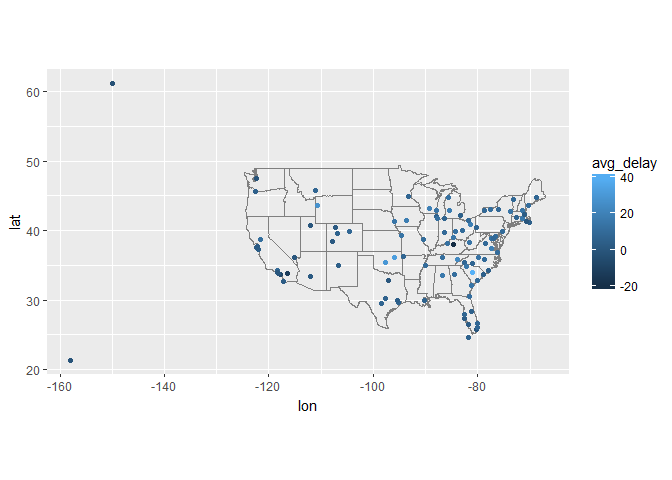
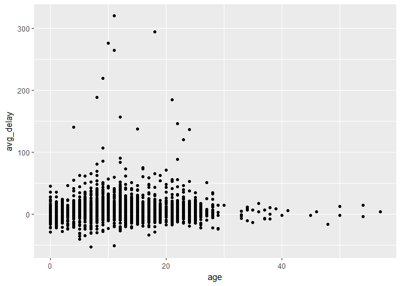
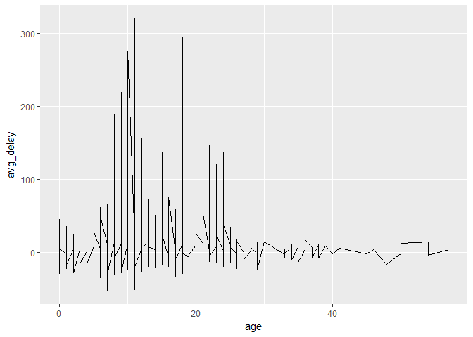
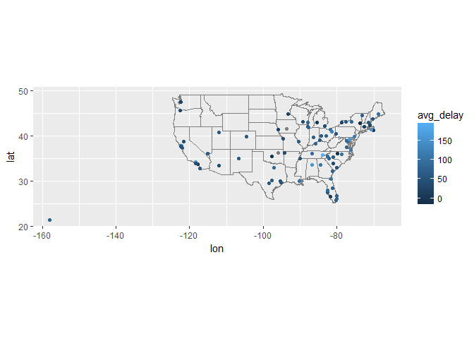

# 06_28_2017
John D.  
June 28, 2017  


```r
library(tidyverse)
```

```
## Loading tidyverse: ggplot2
## Loading tidyverse: tibble
## Loading tidyverse: tidyr
## Loading tidyverse: readr
## Loading tidyverse: purrr
## Loading tidyverse: dplyr
```

```
## Conflicts with tidy packages ----------------------------------------------
```

```
## filter(): dplyr, stats
## lag():    dplyr, stats
```

```r
library(nycflights13)
library(RcppRoll)
```

## 13.3 Keys


```r
planes %>% 
  count(tailnum) %>% 
  filter(n > 1)
```

```
## # A tibble: 0 x 2
## # ... with 2 variables: tailnum <chr>, n <int>
```

```r
weather %>% 
  count(year, month, day, hour, origin) %>% 
  filter(n > 1)
```

```
## # A tibble: 0 x 6
## # ... with 6 variables: year <dbl>, month <dbl>, day <int>, hour <int>,
## #   origin <chr>, n <int>
```

```r
flights %>% 
  count(year, month, day, flight) %>% 
  filter(n > 1)
```

```
## # A tibble: 29,768 x 5
##     year month   day flight     n
##    <int> <int> <int>  <int> <int>
##  1  2013     1     1      1     2
##  2  2013     1     1      3     2
##  3  2013     1     1      4     2
##  4  2013     1     1     11     3
##  5  2013     1     1     15     2
##  6  2013     1     1     21     2
##  7  2013     1     1     27     4
##  8  2013     1     1     31     2
##  9  2013     1     1     32     2
## 10  2013     1     1     35     2
## # ... with 29,758 more rows
```

```r
flights %>% 
  count(year, month, day, tailnum) %>% 
  filter(n > 1)
```

```
## # A tibble: 64,928 x 5
##     year month   day tailnum     n
##    <int> <int> <int>   <chr> <int>
##  1  2013     1     1  N0EGMQ     2
##  2  2013     1     1  N11189     2
##  3  2013     1     1  N11536     2
##  4  2013     1     1  N11544     3
##  5  2013     1     1  N11551     2
##  6  2013     1     1  N12540     2
##  7  2013     1     1  N12567     2
##  8  2013     1     1  N13123     2
##  9  2013     1     1  N13538     3
## 10  2013     1     1  N13566     3
## # ... with 64,918 more rows
```

### 13.3.1 Exercises

1. Add a surrogate key to `flights`.


```r
sur_flights <- flights %>%
  mutate(surrogate = row_number()) %>%
  select(surrogate,year:time_hour)
sur_flights
```

```
## # A tibble: 336,776 x 20
##    surrogate  year month   day dep_time sched_dep_time dep_delay arr_time
##        <int> <int> <int> <int>    <int>          <int>     <dbl>    <int>
##  1         1  2013     1     1      517            515         2      830
##  2         2  2013     1     1      533            529         4      850
##  3         3  2013     1     1      542            540         2      923
##  4         4  2013     1     1      544            545        -1     1004
##  5         5  2013     1     1      554            600        -6      812
##  6         6  2013     1     1      554            558        -4      740
##  7         7  2013     1     1      555            600        -5      913
##  8         8  2013     1     1      557            600        -3      709
##  9         9  2013     1     1      557            600        -3      838
## 10        10  2013     1     1      558            600        -2      753
## # ... with 336,766 more rows, and 12 more variables: sched_arr_time <int>,
## #   arr_delay <dbl>, carrier <chr>, flight <int>, tailnum <chr>,
## #   origin <chr>, dest <chr>, air_time <dbl>, distance <dbl>, hour <dbl>,
## #   minute <dbl>, time_hour <dttm>
```

2. Identify the keys in the following datasets


```r
#Lahman::Batting
summary(Lahman::Batting)
```

```
##    playerID             yearID         stint           teamID     
##  Length:101332      Min.   :1871   Min.   :1.000   CHN    : 4818  
##  Class :character   1st Qu.:1933   1st Qu.:1.000   PHI    : 4721  
##  Mode  :character   Median :1972   Median :1.000   PIT    : 4667  
##                     Mean   :1964   Mean   :1.078   SLN    : 4627  
##                     3rd Qu.:1997   3rd Qu.:1.000   CIN    : 4488  
##                     Max.   :2015   Max.   :5.000   CLE    : 4451  
##                                                    (Other):73560  
##  lgID             G                AB             R         
##  AA: 1890   Min.   :  0.00   Min.   :  0    Min.   :  0.00  
##  AL:46371   1st Qu.: 13.00   1st Qu.:  7    1st Qu.:  0.00  
##  FL:  470   Median : 34.00   Median : 57    Median :  5.00  
##  NA:  737   Mean   : 51.40   Mean   :150    Mean   : 19.89  
##  NL:51385   3rd Qu.: 80.25   3rd Qu.:251    3rd Qu.: 30.00  
##  PL:  147   Max.   :165.00   Max.   :716    Max.   :192.00  
##  UA:  332                    NA's   :5149   NA's   :5149    
##        H               X2B              X3B               HR        
##  Min.   :  0.00   Min.   : 0.000   Min.   : 0.000   Min.   : 0.000  
##  1st Qu.:  1.00   1st Qu.: 0.000   1st Qu.: 0.000   1st Qu.: 0.000  
##  Median : 11.00   Median : 1.000   Median : 0.000   Median : 0.000  
##  Mean   : 39.26   Mean   : 6.637   Mean   : 1.373   Mean   : 2.949  
##  3rd Qu.: 63.00   3rd Qu.:10.000   3rd Qu.: 2.000   3rd Qu.: 3.000  
##  Max.   :262.00   Max.   :67.000   Max.   :36.000   Max.   :73.000  
##  NA's   :5149     NA's   :5149     NA's   :5149     NA's   :5149    
##       RBI               SB                CS               BB        
##  Min.   :  0.00   Min.   :  0.000   Min.   : 0.000   Min.   :  0.00  
##  1st Qu.:  0.00   1st Qu.:  0.000   1st Qu.: 0.000   1st Qu.:  0.00  
##  Median :  4.00   Median :  0.000   Median : 0.000   Median :  3.00  
##  Mean   : 17.96   Mean   :  3.158   Mean   : 1.324   Mean   : 13.81  
##  3rd Qu.: 27.00   3rd Qu.:  2.000   3rd Qu.: 1.000   3rd Qu.: 20.00  
##  Max.   :191.00   Max.   :138.000   Max.   :42.000   Max.   :232.00  
##  NA's   :5573     NA's   :6449      NA's   :28603    NA's   :5149    
##        SO              IBB              HBP               SH        
##  Min.   :  0.00   Min.   :  0.00   Min.   : 0.000   Min.   : 0.000  
##  1st Qu.:  2.00   1st Qu.:  0.00   1st Qu.: 0.000   1st Qu.: 0.000  
##  Median : 10.00   Median :  0.00   Median : 0.000   Median : 1.000  
##  Mean   : 21.63   Mean   :  1.21   Mean   : 1.113   Mean   : 2.458  
##  3rd Qu.: 30.00   3rd Qu.:  1.00   3rd Qu.: 1.000   3rd Qu.: 3.000  
##  Max.   :223.00   Max.   :120.00   Max.   :51.000   Max.   :67.000  
##  NA's   :12987    NA's   :41712    NA's   :7959     NA's   :11487   
##        SF             GIDP      
##  Min.   : 0.00   Min.   : 0.00  
##  1st Qu.: 0.00   1st Qu.: 0.00  
##  Median : 0.00   Median : 1.00  
##  Mean   : 1.15   Mean   : 3.21  
##  3rd Qu.: 2.00   3rd Qu.: 5.00  
##  Max.   :19.00   Max.   :36.00  
##  NA's   :41181   NA's   :31257
```

```r
Lahman::Batting %>%
  count(playerID,yearID,stint) %>%
  filter(n > 1)
```

```
## # A tibble: 0 x 4
## # ... with 4 variables: playerID <chr>, yearID <int>, stint <int>, n <int>
```

```r
#babynames::babynames
summary(babynames::babynames)
```

```
##       year          sex                name                 n          
##  Min.   :1880   Length:1858689     Length:1858689     Min.   :    5.0  
##  1st Qu.:1950   Class :character   Class :character   1st Qu.:    7.0  
##  Median :1983   Mode  :character   Mode  :character   Median :   12.0  
##  Mean   :1973                                         Mean   :  183.4  
##  3rd Qu.:2002                                         3rd Qu.:   32.0  
##  Max.   :2015                                         Max.   :99680.0  
##       prop          
##  Min.   :2.260e-06  
##  1st Qu.:3.900e-06  
##  Median :7.350e-06  
##  Mean   :1.391e-04  
##  3rd Qu.:2.324e-05  
##  Max.   :8.155e-02
```

```r
babynames::babynames %>%
  count(year,name, sex) %>%
  filter(nn > 1)
```

```
## # A tibble: 0 x 4
## # ... with 4 variables: year <dbl>, name <chr>, sex <chr>, nn <int>
```

```r
# nasaweather::atmos
summary(nasaweather::atmos)
```

```
##       lat              long             year          month      
##  Min.   :-21.20   Min.   :-113.8   Min.   :1995   Min.   : 1.00  
##  1st Qu.: -6.85   1st Qu.: -99.4   1st Qu.:1996   1st Qu.: 3.75  
##  Median :  7.50   Median : -85.0   Median :1998   Median : 6.50  
##  Mean   :  7.50   Mean   : -85.0   Mean   :1998   Mean   : 6.50  
##  3rd Qu.: 21.85   3rd Qu.: -70.6   3rd Qu.:1999   3rd Qu.: 9.25  
##  Max.   : 36.20   Max.   : -56.2   Max.   :2000   Max.   :12.00  
##                                                                  
##     surftemp          temp          pressure          ozone      
##  Min.   :266.0   Min.   :269.1   Min.   : 615.0   Min.   :232.0  
##  1st Qu.:294.1   1st Qu.:295.5   1st Qu.: 995.0   1st Qu.:254.0  
##  Median :296.9   Median :299.2   Median :1000.0   Median :264.0  
##  Mean   :296.2   Mean   :297.9   Mean   : 985.4   Mean   :267.2  
##  3rd Qu.:299.2   3rd Qu.:301.4   3rd Qu.:1000.0   3rd Qu.:276.0  
##  Max.   :314.9   Max.   :310.0   Max.   :1000.0   Max.   :390.0  
##                                                                  
##     cloudlow        cloudmid       cloudhigh   
##  Min.   : 0.50   Min.   : 0.00   Min.   : 0.0  
##  1st Qu.:15.00   1st Qu.: 7.50   1st Qu.: 1.5  
##  Median :23.50   Median :14.00   Median : 8.5  
##  Mean   :26.24   Mean   :15.27   Mean   :12.0  
##  3rd Qu.:34.50   3rd Qu.:22.00   3rd Qu.:18.5  
##  Max.   :84.50   Max.   :83.50   Max.   :62.5  
##  NA's   :110
```

```r
nasaweather::atmos %>%
  count(lat,long, year, month) %>%
  filter(n > 1)
```

```
## # A tibble: 0 x 5
## # ... with 5 variables: lat <dbl>, long <dbl>, year <int>, month <int>,
## #   n <int>
```

```r
# fueleconomy::vehicles
summary(fueleconomy::vehicles)
```

```
##        id            make              model                year     
##  Min.   :    1   Length:33442       Length:33442       Min.   :1984  
##  1st Qu.: 8361   Class :character   Class :character   1st Qu.:1991  
##  Median :16724   Mode  :character   Mode  :character   Median :1999  
##  Mean   :17038                                         Mean   :1999  
##  3rd Qu.:25265                                         3rd Qu.:2008  
##  Max.   :34932                                         Max.   :2015  
##                                                                      
##     class              trans              drive                cyl        
##  Length:33442       Length:33442       Length:33442       Min.   : 2.000  
##  Class :character   Class :character   Class :character   1st Qu.: 4.000  
##  Mode  :character   Mode  :character   Mode  :character   Median : 6.000  
##                                                           Mean   : 5.772  
##                                                           3rd Qu.: 6.000  
##                                                           Max.   :16.000  
##                                                           NA's   :58      
##      displ           fuel                hwy              cty        
##  Min.   :0.000   Length:33442       Min.   :  9.00   Min.   :  6.00  
##  1st Qu.:2.300   Class :character   1st Qu.: 19.00   1st Qu.: 15.00  
##  Median :3.000   Mode  :character   Median : 23.00   Median : 17.00  
##  Mean   :3.353                      Mean   : 23.55   Mean   : 17.49  
##  3rd Qu.:4.300                      3rd Qu.: 27.00   3rd Qu.: 20.00  
##  Max.   :8.400                      Max.   :109.00   Max.   :138.00  
##  NA's   :57
```

```r
head(fueleconomy::vehicles)
```

```
## # A tibble: 6 x 12
##      id       make               model  year                       class
##   <int>      <chr>               <chr> <int>                       <chr>
## 1 27550 AM General   DJ Po Vehicle 2WD  1984 Special Purpose Vehicle 2WD
## 2 28426 AM General   DJ Po Vehicle 2WD  1984 Special Purpose Vehicle 2WD
## 3 27549 AM General    FJ8c Post Office  1984 Special Purpose Vehicle 2WD
## 4 28425 AM General    FJ8c Post Office  1984 Special Purpose Vehicle 2WD
## 5  1032 AM General Post Office DJ5 2WD  1985 Special Purpose Vehicle 2WD
## 6  1033 AM General Post Office DJ8 2WD  1985 Special Purpose Vehicle 2WD
## # ... with 7 more variables: trans <chr>, drive <chr>, cyl <int>,
## #   displ <dbl>, fuel <chr>, hwy <int>, cty <int>
```

```r
fueleconomy::vehicles %>%
  count(id) %>%
  filter(n > 1)
```

```
## # A tibble: 0 x 2
## # ... with 2 variables: id <int>, n <int>
```

```r
# ggplot2::diamonds
summary(ggplot2::diamonds)
```

```
##      carat               cut        color        clarity     
##  Min.   :0.2000   Fair     : 1610   D: 6775   SI1    :13065  
##  1st Qu.:0.4000   Good     : 4906   E: 9797   VS2    :12258  
##  Median :0.7000   Very Good:12082   F: 9542   SI2    : 9194  
##  Mean   :0.7979   Premium  :13791   G:11292   VS1    : 8171  
##  3rd Qu.:1.0400   Ideal    :21551   H: 8304   VVS2   : 5066  
##  Max.   :5.0100                     I: 5422   VVS1   : 3655  
##                                     J: 2808   (Other): 2531  
##      depth           table           price             x         
##  Min.   :43.00   Min.   :43.00   Min.   :  326   Min.   : 0.000  
##  1st Qu.:61.00   1st Qu.:56.00   1st Qu.:  950   1st Qu.: 4.710  
##  Median :61.80   Median :57.00   Median : 2401   Median : 5.700  
##  Mean   :61.75   Mean   :57.46   Mean   : 3933   Mean   : 5.731  
##  3rd Qu.:62.50   3rd Qu.:59.00   3rd Qu.: 5324   3rd Qu.: 6.540  
##  Max.   :79.00   Max.   :95.00   Max.   :18823   Max.   :10.740  
##                                                                  
##        y                z         
##  Min.   : 0.000   Min.   : 0.000  
##  1st Qu.: 4.720   1st Qu.: 2.910  
##  Median : 5.710   Median : 3.530  
##  Mean   : 5.735   Mean   : 3.539  
##  3rd Qu.: 6.540   3rd Qu.: 4.040  
##  Max.   :58.900   Max.   :31.800  
## 
```

```r
ggplot2::diamonds %>%
  count(depth,clarity,carat,color,price,cut,table,x,y,z) %>%
  filter(n > 1)
```

```
## # A tibble: 143 x 11
##    depth clarity carat color price       cut table     x     y     z     n
##    <dbl>   <ord> <dbl> <ord> <int>     <ord> <dbl> <dbl> <dbl> <dbl> <int>
##  1  57.2     VS1  1.50     I  9702      Good    62  7.64  7.61  4.36     2
##  2  57.3      I1  1.52     E  3105      Good    58  7.53  7.42  4.28     2
##  3  57.5     SI2  0.71     E  1783      Good    58  5.91  5.89  3.39     2
##  4  57.5     SI2  1.50     G  6006      Good    63  7.53  7.49  4.32     2
##  5  58.1     SI2  0.51     F  1052   Premium    59  5.26  5.24  3.05     2
##  6  58.4     SI2  0.52     G  1076   Premium    62  5.33  5.28  3.10     2
##  7  58.4     VS2  0.90     I  3334 Very Good    62  6.29  6.35  3.69     2
##  8  58.5     SI2  1.50     F  7644   Premium    60  7.52  7.48  4.39     2
##  9  58.8     SI2  1.00     I  3629     Ideal    55  6.53  6.46  3.82     2
## 10  59.1     SI2  1.10     E  4967   Premium    60  6.77  6.70  3.98     2
## # ... with 133 more rows
```

```r
### Impossible exact duplicates
surg_diamonds <- diamonds %>%
  mutate(surrogate_key = row_number()) %>%
  select(surrogate_key, carat:z)
surg_diamonds
```

```
## # A tibble: 53,940 x 11
##    surrogate_key carat       cut color clarity depth table price     x
##            <int> <dbl>     <ord> <ord>   <ord> <dbl> <dbl> <int> <dbl>
##  1             1  0.23     Ideal     E     SI2  61.5    55   326  3.95
##  2             2  0.21   Premium     E     SI1  59.8    61   326  3.89
##  3             3  0.23      Good     E     VS1  56.9    65   327  4.05
##  4             4  0.29   Premium     I     VS2  62.4    58   334  4.20
##  5             5  0.31      Good     J     SI2  63.3    58   335  4.34
##  6             6  0.24 Very Good     J    VVS2  62.8    57   336  3.94
##  7             7  0.24 Very Good     I    VVS1  62.3    57   336  3.95
##  8             8  0.26 Very Good     H     SI1  61.9    55   337  4.07
##  9             9  0.22      Fair     E     VS2  65.1    61   337  3.87
## 10            10  0.23 Very Good     H     VS1  59.4    61   338  4.00
## # ... with 53,930 more rows, and 2 more variables: y <dbl>, z <dbl>
```

```r
## or account for duplicates
ggplot2::diamonds %>%
  count(depth,clarity,carat,color,price,cut,table,x,y,z) %>%
  filter(n > 2)
```

```
## # A tibble: 1 x 11
##   depth clarity carat color price   cut table     x     y     z     n
##   <dbl>   <ord> <dbl> <ord> <int> <ord> <dbl> <dbl> <dbl> <dbl> <int>
## 1  62.3     SI1  0.79     G  2898 Ideal    57   5.9  5.85  3.66     5
```

```r
# Can't
```

3. Draw a diagram illustrating the connections between the `Batting`, `Master`, and `Salaries` tables in the Lahman package. Draw another diagram that shows the relationship between `Master`, `Managers`, `AwardsManagers`.

How would you characterise the relationship between the Batting, Pitching, and Fielding tables?

I'm gonna skip this one

## 13.4 Mutating joins


```r
flights2 <- flights %>% 
  select(year:day, hour, origin, dest, tailnum, carrier)
flights2
```

```
## # A tibble: 336,776 x 8
##     year month   day  hour origin  dest tailnum carrier
##    <int> <int> <int> <dbl>  <chr> <chr>   <chr>   <chr>
##  1  2013     1     1     5    EWR   IAH  N14228      UA
##  2  2013     1     1     5    LGA   IAH  N24211      UA
##  3  2013     1     1     5    JFK   MIA  N619AA      AA
##  4  2013     1     1     5    JFK   BQN  N804JB      B6
##  5  2013     1     1     6    LGA   ATL  N668DN      DL
##  6  2013     1     1     5    EWR   ORD  N39463      UA
##  7  2013     1     1     6    EWR   FLL  N516JB      B6
##  8  2013     1     1     6    LGA   IAD  N829AS      EV
##  9  2013     1     1     6    JFK   MCO  N593JB      B6
## 10  2013     1     1     6    LGA   ORD  N3ALAA      AA
## # ... with 336,766 more rows
```

```r
flights2 %>%
  select(-origin, -dest) %>% 
  left_join(airlines, by = "carrier")
```

```
## # A tibble: 336,776 x 7
##     year month   day  hour tailnum carrier                     name
##    <int> <int> <int> <dbl>   <chr>   <chr>                    <chr>
##  1  2013     1     1     5  N14228      UA    United Air Lines Inc.
##  2  2013     1     1     5  N24211      UA    United Air Lines Inc.
##  3  2013     1     1     5  N619AA      AA   American Airlines Inc.
##  4  2013     1     1     5  N804JB      B6          JetBlue Airways
##  5  2013     1     1     6  N668DN      DL     Delta Air Lines Inc.
##  6  2013     1     1     5  N39463      UA    United Air Lines Inc.
##  7  2013     1     1     6  N516JB      B6          JetBlue Airways
##  8  2013     1     1     6  N829AS      EV ExpressJet Airlines Inc.
##  9  2013     1     1     6  N593JB      B6          JetBlue Airways
## 10  2013     1     1     6  N3ALAA      AA   American Airlines Inc.
## # ... with 336,766 more rows
```

```r
flights2 %>%
  select(-origin, -dest) %>% 
  mutate(name = airlines$name[match(carrier, airlines$carrier)])
```

```
## # A tibble: 336,776 x 7
##     year month   day  hour tailnum carrier                     name
##    <int> <int> <int> <dbl>   <chr>   <chr>                    <chr>
##  1  2013     1     1     5  N14228      UA    United Air Lines Inc.
##  2  2013     1     1     5  N24211      UA    United Air Lines Inc.
##  3  2013     1     1     5  N619AA      AA   American Airlines Inc.
##  4  2013     1     1     5  N804JB      B6          JetBlue Airways
##  5  2013     1     1     6  N668DN      DL     Delta Air Lines Inc.
##  6  2013     1     1     5  N39463      UA    United Air Lines Inc.
##  7  2013     1     1     6  N516JB      B6          JetBlue Airways
##  8  2013     1     1     6  N829AS      EV ExpressJet Airlines Inc.
##  9  2013     1     1     6  N593JB      B6          JetBlue Airways
## 10  2013     1     1     6  N3ALAA      AA   American Airlines Inc.
## # ... with 336,766 more rows
```

### 13.4.1 Understanding joins

```r
x <- tribble(
  ~key, ~val_x,
     1, "x1",
     2, "x2",
     3, "x3"
)
y <- tribble(
  ~key, ~val_y,
     1, "y1",
     2, "y2",
     4, "y3"
)
```

### 13.4.2 Inner join


```r
x
```

```
## # A tibble: 3 x 2
##     key val_x
##   <dbl> <chr>
## 1     1    x1
## 2     2    x2
## 3     3    x3
```

```r
y
```

```
## # A tibble: 3 x 2
##     key val_y
##   <dbl> <chr>
## 1     1    y1
## 2     2    y2
## 3     4    y3
```

```r
x %>% 
  inner_join(y, by = "key")
```

```
## # A tibble: 2 x 3
##     key val_x val_y
##   <dbl> <chr> <chr>
## 1     1    x1    y1
## 2     2    x2    y2
```

### 13.4.3 Outer joins

### 13.4.4 Duplicate keys


```r
x <- tribble(
  ~key, ~val_x,
     1, "x1",
     2, "x2",
     2, "x3",
     1, "x4"
)
y <- tribble(
  ~key, ~val_y,
     1, "y1",
     2, "y2"
)
x
```

```
## # A tibble: 4 x 2
##     key val_x
##   <dbl> <chr>
## 1     1    x1
## 2     2    x2
## 3     2    x3
## 4     1    x4
```

```r
y
```

```
## # A tibble: 2 x 2
##     key val_y
##   <dbl> <chr>
## 1     1    y1
## 2     2    y2
```

```r
left_join(x, y, by = "key")
```

```
## # A tibble: 4 x 3
##     key val_x val_y
##   <dbl> <chr> <chr>
## 1     1    x1    y1
## 2     2    x2    y2
## 3     2    x3    y2
## 4     1    x4    y1
```

```r
x <- tribble(
  ~key, ~val_x,
     1, "x1",
     2, "x2",
     2, "x3",
     3, "x4"
)
y <- tribble(
  ~key, ~val_y,
     1, "y1",
     2, "y2",
     2, "y3",
     3, "y4"
)

x
```

```
## # A tibble: 4 x 2
##     key val_x
##   <dbl> <chr>
## 1     1    x1
## 2     2    x2
## 3     2    x3
## 4     3    x4
```

```r
y
```

```
## # A tibble: 4 x 2
##     key val_y
##   <dbl> <chr>
## 1     1    y1
## 2     2    y2
## 3     2    y3
## 4     3    y4
```

```r
left_join(x, y, by = "key")
```

```
## # A tibble: 6 x 3
##     key val_x val_y
##   <dbl> <chr> <chr>
## 1     1    x1    y1
## 2     2    x2    y2
## 3     2    x2    y3
## 4     2    x3    y2
## 5     2    x3    y3
## 6     3    x4    y4
```

### 13.4.5 Defining the key columns


```r
flights2 %>% 
  left_join(weather)
```

```
## Joining, by = c("year", "month", "day", "hour", "origin")
```

```
## # A tibble: 336,776 x 18
##     year month   day  hour origin  dest tailnum carrier  temp  dewp humid
##    <dbl> <dbl> <int> <dbl>  <chr> <chr>   <chr>   <chr> <dbl> <dbl> <dbl>
##  1  2013     1     1     5    EWR   IAH  N14228      UA    NA    NA    NA
##  2  2013     1     1     5    LGA   IAH  N24211      UA    NA    NA    NA
##  3  2013     1     1     5    JFK   MIA  N619AA      AA    NA    NA    NA
##  4  2013     1     1     5    JFK   BQN  N804JB      B6    NA    NA    NA
##  5  2013     1     1     6    LGA   ATL  N668DN      DL 39.92 26.06 57.33
##  6  2013     1     1     5    EWR   ORD  N39463      UA    NA    NA    NA
##  7  2013     1     1     6    EWR   FLL  N516JB      B6 39.02 26.06 59.37
##  8  2013     1     1     6    LGA   IAD  N829AS      EV 39.92 26.06 57.33
##  9  2013     1     1     6    JFK   MCO  N593JB      B6 39.02 26.06 59.37
## 10  2013     1     1     6    LGA   ORD  N3ALAA      AA 39.92 26.06 57.33
## # ... with 336,766 more rows, and 7 more variables: wind_dir <dbl>,
## #   wind_speed <dbl>, wind_gust <dbl>, precip <dbl>, pressure <dbl>,
## #   visib <dbl>, time_hour <dttm>
```

```r
flights2 %>% 
  left_join(planes, by = "tailnum")
```

```
## # A tibble: 336,776 x 16
##    year.x month   day  hour origin  dest tailnum carrier year.y
##     <int> <int> <int> <dbl>  <chr> <chr>   <chr>   <chr>  <int>
##  1   2013     1     1     5    EWR   IAH  N14228      UA   1999
##  2   2013     1     1     5    LGA   IAH  N24211      UA   1998
##  3   2013     1     1     5    JFK   MIA  N619AA      AA   1990
##  4   2013     1     1     5    JFK   BQN  N804JB      B6   2012
##  5   2013     1     1     6    LGA   ATL  N668DN      DL   1991
##  6   2013     1     1     5    EWR   ORD  N39463      UA   2012
##  7   2013     1     1     6    EWR   FLL  N516JB      B6   2000
##  8   2013     1     1     6    LGA   IAD  N829AS      EV   1998
##  9   2013     1     1     6    JFK   MCO  N593JB      B6   2004
## 10   2013     1     1     6    LGA   ORD  N3ALAA      AA     NA
## # ... with 336,766 more rows, and 7 more variables: type <chr>,
## #   manufacturer <chr>, model <chr>, engines <int>, seats <int>,
## #   speed <int>, engine <chr>
```

```r
flights2 %>% 
  left_join(airports, c("dest" = "faa"))
```

```
## # A tibble: 336,776 x 15
##     year month   day  hour origin  dest tailnum carrier
##    <int> <int> <int> <dbl>  <chr> <chr>   <chr>   <chr>
##  1  2013     1     1     5    EWR   IAH  N14228      UA
##  2  2013     1     1     5    LGA   IAH  N24211      UA
##  3  2013     1     1     5    JFK   MIA  N619AA      AA
##  4  2013     1     1     5    JFK   BQN  N804JB      B6
##  5  2013     1     1     6    LGA   ATL  N668DN      DL
##  6  2013     1     1     5    EWR   ORD  N39463      UA
##  7  2013     1     1     6    EWR   FLL  N516JB      B6
##  8  2013     1     1     6    LGA   IAD  N829AS      EV
##  9  2013     1     1     6    JFK   MCO  N593JB      B6
## 10  2013     1     1     6    LGA   ORD  N3ALAA      AA
## # ... with 336,766 more rows, and 7 more variables: name <chr>, lat <dbl>,
## #   lon <dbl>, alt <int>, tz <dbl>, dst <chr>, tzone <chr>
```

```r
flights2 %>% 
  left_join(airports, c("origin" = "faa"))
```

```
## # A tibble: 336,776 x 15
##     year month   day  hour origin  dest tailnum carrier
##    <int> <int> <int> <dbl>  <chr> <chr>   <chr>   <chr>
##  1  2013     1     1     5    EWR   IAH  N14228      UA
##  2  2013     1     1     5    LGA   IAH  N24211      UA
##  3  2013     1     1     5    JFK   MIA  N619AA      AA
##  4  2013     1     1     5    JFK   BQN  N804JB      B6
##  5  2013     1     1     6    LGA   ATL  N668DN      DL
##  6  2013     1     1     5    EWR   ORD  N39463      UA
##  7  2013     1     1     6    EWR   FLL  N516JB      B6
##  8  2013     1     1     6    LGA   IAD  N829AS      EV
##  9  2013     1     1     6    JFK   MCO  N593JB      B6
## 10  2013     1     1     6    LGA   ORD  N3ALAA      AA
## # ... with 336,766 more rows, and 7 more variables: name <chr>, lat <dbl>,
## #   lon <dbl>, alt <int>, tz <dbl>, dst <chr>, tzone <chr>
```

### 13.4.6 Exercises

1. Compute the average delay by destination, then join on the `airports` data frame so you can show the spatial distribution of delays. Here’s an easy way to draw a map of the United States:

(Don’t worry if you don’t understand what semi_join() does — you’ll learn about it next.)

You might want to use the size or colour of the points to display the average delay for each airport.

```r
flights3 <- flights %>%
  group_by(dest) %>%
  mutate(avg_delay = mean(arr_delay, na.rm = T)) %>%
  select(dest,avg_delay) %>%
  inner_join(airports, by = c(dest = "faa")) 

flights3 %>%
  ggplot(aes(lon, lat)) +
    borders("state") +
    geom_point(aes(color = avg_delay)) +
    coord_quickmap()
```

```
## 
## Attaching package: 'maps'
```

```
## The following object is masked from 'package:purrr':
## 
##     map
```

<!-- -->

2. Add the location of the origin and destination (i.e. the `lat` and `lon`) to flights.


```r
flights4 <- flights2 %>%
  left_join(airports %>% select(faa,lat,lon), by = c(origin = "faa")) %>%
  left_join(airports%>% select(faa,lat,lon), by = c(dest = "faa")) %>%
  rename(origin.lat = lat.x ,  dest.lat = lat.y, origin.lon = lon.x, dest.lon = lon.y)
flights4
```

```
## # A tibble: 336,776 x 12
##     year month   day  hour origin  dest tailnum carrier origin.lat
##    <int> <int> <int> <dbl>  <chr> <chr>   <chr>   <chr>      <dbl>
##  1  2013     1     1     5    EWR   IAH  N14228      UA   40.69250
##  2  2013     1     1     5    LGA   IAH  N24211      UA   40.77725
##  3  2013     1     1     5    JFK   MIA  N619AA      AA   40.63975
##  4  2013     1     1     5    JFK   BQN  N804JB      B6   40.63975
##  5  2013     1     1     6    LGA   ATL  N668DN      DL   40.77725
##  6  2013     1     1     5    EWR   ORD  N39463      UA   40.69250
##  7  2013     1     1     6    EWR   FLL  N516JB      B6   40.69250
##  8  2013     1     1     6    LGA   IAD  N829AS      EV   40.77725
##  9  2013     1     1     6    JFK   MCO  N593JB      B6   40.63975
## 10  2013     1     1     6    LGA   ORD  N3ALAA      AA   40.77725
## # ... with 336,766 more rows, and 3 more variables: origin.lon <dbl>,
## #   dest.lat <dbl>, dest.lon <dbl>
```

3. Is there a relationship between the age of a plane and its delays?


```r
flights %>%
  group_by(tailnum) %>%
  mutate(avg_delay = mean(arr_delay, na.rm = T)) %>%
  select(tailnum,avg_delay) %>%
  unique() %>%
  inner_join(planes) %>%
  mutate(age = 2013-year) %>%
  ggplot(aes(age,avg_delay)) +
    geom_point()
```

```
## Joining, by = "tailnum"
```

```
## Warning: Removed 76 rows containing missing values (geom_point).
```

<!-- -->

```r
flights %>%
  group_by(tailnum) %>%
  mutate(avg_delay = mean(arr_delay, na.rm = T)) %>%
  select(tailnum,avg_delay) %>%
  unique() %>%
  inner_join(planes) %>%
  mutate(age = 2013-year) %>%
  ggplot(aes(age,avg_delay)) +
    geom_line()
```

```
## Joining, by = "tailnum"
```

```
## Warning: Removed 70 rows containing missing values (geom_path).
```

<!-- -->

4. What weather conditions make it more likely to see a delay?


```r
flights %>%
  group_by(origin,year,month,day) %>%
  mutate(avg_delay = mean(arr_delay, na.rm = T)) %>%
  select(origin,avg_delay,year,month,day) %>%
  inner_join(weather) %>%
  arrange(-avg_delay)
```

```
## Joining, by = c("origin", "year", "month", "day")
```

```
## # A tibble: 8,040,775 x 16
## # Groups:   origin, year, month, day [1,092]
##    origin avg_delay  year month   day  hour  temp  dewp humid wind_dir
##     <chr>     <dbl> <dbl> <dbl> <int> <int> <dbl> <dbl> <dbl>    <dbl>
##  1    EWR  104.9812  2013     3     8     0 35.60 33.80 93.08      350
##  2    EWR  104.9812  2013     3     8     1 35.06 32.00 88.47      340
##  3    EWR  104.9812  2013     3     8     2 35.06 32.00 88.47      350
##  4    EWR  104.9812  2013     3     8     3 33.80 32.00 93.03      340
##  5    EWR  104.9812  2013     3     8     4 33.98 32.00 92.36      330
##  6    EWR  104.9812  2013     3     8     5 33.80 32.00 93.03      330
##  7    EWR  104.9812  2013     3     8     6 33.08 32.00 95.75      330
##  8    EWR  104.9812  2013     3     8     7 33.08 30.92 91.66      330
##  9    EWR  104.9812  2013     3     8     8 33.08 30.92 91.66      340
## 10    EWR  104.9812  2013     3     8     9 33.80 30.20 86.49      340
## # ... with 8,040,765 more rows, and 6 more variables: wind_speed <dbl>,
## #   wind_gust <dbl>, precip <dbl>, pressure <dbl>, visib <dbl>,
## #   time_hour <dttm>
```

Cold weather, high winds, and low visibility

5. What happened on June 13 2013? Display the spatial pattern of delays, and then use Google to cross-reference with the weather


```r
flights5 <- flights %>%
  filter(month == 6 & day == 13) %>%
  group_by(dest) %>%
  mutate(avg_delay = mean(arr_delay, na.rm = T)) %>%
  select(dest,avg_delay) %>%
  inner_join(airports, by = c(dest = "faa"))

flights5 %>%
  ggplot(aes(lon, lat)) +
    borders("state") +
    geom_point(aes(color = avg_delay)) +
    coord_quickmap()
```

<!-- -->

Something going down on east coast. Everyone on the east coast stopped to watch an Australian swim in Florida. Or more likely the June 12–13, 2013 derecho series. A widespread, long-lived, straight-line wind storm that is associated with a land-based, fast-moving group of severe thunderstorms.

### 13.4.7 Other implementations

## 13.5 Filtering joins


```r
top_dest <- flights %>%
  count(dest, sort = TRUE) %>%
  head(10)
top_dest
```

```
## # A tibble: 10 x 2
##     dest     n
##    <chr> <int>
##  1   ORD 17283
##  2   ATL 17215
##  3   LAX 16174
##  4   BOS 15508
##  5   MCO 14082
##  6   CLT 14064
##  7   SFO 13331
##  8   FLL 12055
##  9   MIA 11728
## 10   DCA  9705
```

```r
flights %>% 
  filter(dest %in% top_dest$dest)
```

```
## # A tibble: 141,145 x 19
##     year month   day dep_time sched_dep_time dep_delay arr_time
##    <int> <int> <int>    <int>          <int>     <dbl>    <int>
##  1  2013     1     1      542            540         2      923
##  2  2013     1     1      554            600        -6      812
##  3  2013     1     1      554            558        -4      740
##  4  2013     1     1      555            600        -5      913
##  5  2013     1     1      557            600        -3      838
##  6  2013     1     1      558            600        -2      753
##  7  2013     1     1      558            600        -2      924
##  8  2013     1     1      558            600        -2      923
##  9  2013     1     1      559            559         0      702
## 10  2013     1     1      600            600         0      851
## # ... with 141,135 more rows, and 12 more variables: sched_arr_time <int>,
## #   arr_delay <dbl>, carrier <chr>, flight <int>, tailnum <chr>,
## #   origin <chr>, dest <chr>, air_time <dbl>, distance <dbl>, hour <dbl>,
## #   minute <dbl>, time_hour <dttm>
```

```r
flights %>% 
  semi_join(top_dest)
```

```
## Joining, by = "dest"
```

```
## # A tibble: 141,145 x 19
##     year month   day dep_time sched_dep_time dep_delay arr_time
##    <int> <int> <int>    <int>          <int>     <dbl>    <int>
##  1  2013     1     1      554            558        -4      740
##  2  2013     1     1      558            600        -2      753
##  3  2013     1     1      608            600         8      807
##  4  2013     1     1      629            630        -1      824
##  5  2013     1     1      656            700        -4      854
##  6  2013     1     1      709            700         9      852
##  7  2013     1     1      715            713         2      911
##  8  2013     1     1      739            745        -6      918
##  9  2013     1     1      749            710        39      939
## 10  2013     1     1      828            830        -2     1027
## # ... with 141,135 more rows, and 12 more variables: sched_arr_time <int>,
## #   arr_delay <dbl>, carrier <chr>, flight <int>, tailnum <chr>,
## #   origin <chr>, dest <chr>, air_time <dbl>, distance <dbl>, hour <dbl>,
## #   minute <dbl>, time_hour <dttm>
```

```r
flights %>%
  anti_join(planes, by = "tailnum") %>%
  count(tailnum, sort = TRUE)
```

```
## # A tibble: 722 x 2
##    tailnum     n
##      <chr> <int>
##  1    <NA>  2512
##  2  N725MQ   575
##  3  N722MQ   513
##  4  N723MQ   507
##  5  N713MQ   483
##  6  N735MQ   396
##  7  N0EGMQ   371
##  8  N534MQ   364
##  9  N542MQ   363
## 10  N531MQ   349
## # ... with 712 more rows
```

### 13.5.1 Exercises

1. What does it mean for a flight to have a missing `tailnum`? What do the tail numbers that don’t have a matching record in `planes` have in common? (Hint: one variable explains ~90% of the problems.)


```r
flights %>%
  anti_join(planes, by = "tailnum")
```

```
## # A tibble: 52,606 x 19
##     year month   day dep_time sched_dep_time dep_delay arr_time
##    <int> <int> <int>    <int>          <int>     <dbl>    <int>
##  1  2013     1    30      555            600        -5      733
##  2  2013    10     1     1209           1215        -6     1419
##  3  2013    10     2      606            610        -4      833
##  4  2013    10     2     1457           1459        -2     1826
##  5  2013    10     3      728            735        -7     1042
##  6  2013    10     3     1459           1505        -6     1813
##  7  2013    10     5     1846           1850        -4     2205
##  8  2013    10     7     1847           1850        -3     2147
##  9  2013    10    18     1121           1125        -4     1252
## 10  2013    10    24     1618           1615         3     1909
## # ... with 52,596 more rows, and 12 more variables: sched_arr_time <int>,
## #   arr_delay <dbl>, carrier <chr>, flight <int>, tailnum <chr>,
## #   origin <chr>, dest <chr>, air_time <dbl>, distance <dbl>, hour <dbl>,
## #   minute <dbl>, time_hour <dttm>
```

```r
flights %>%
  anti_join(planes, by = "tailnum") %>%
  count(carrier, sort = T)
```

```
## # A tibble: 10 x 2
##    carrier     n
##      <chr> <int>
##  1      MQ 25397
##  2      AA 22558
##  3      UA  1693
##  4      9E  1044
##  5      B6   830
##  6      US   699
##  7      FL   187
##  8      DL   110
##  9      F9    50
## 10      WN    38
```

```r
flights %>%
  filter(carrier == "AA") %>%
  count(tailnum)
```

```
## # A tibble: 601 x 2
##    tailnum     n
##      <chr> <int>
##  1  N200AA    34
##  2  N201AA    54
##  3  N202AA    36
##  4  N319AA   354
##  5  N320AA   307
##  6  N322AA    15
##  7  N323AA   357
##  8  N324AA   328
##  9  N325AA     7
## 10  N327AA   387
## # ... with 591 more rows
```

```r
flights %>%
  filter(carrier == "MQ") %>%
  count(tailnum)
```

```
## # A tibble: 238 x 2
##    tailnum     n
##      <chr> <int>
##  1  N0EGMQ   371
##  2  N1EAMQ   210
##  3  N3AEMQ   276
##  4  N500MQ   237
##  5  N501MQ   250
##  6  N502MQ   282
##  7  N503MQ   191
##  8  N504MQ   271
##  9  N505MQ   242
## 10  N506MQ   284
## # ... with 228 more rows
```
AA and MQ did not report a significant number of their tailnums

2. Filter flights to only show flights with planes that have flown at least 100 flights


```r
enough <- flights %>%
  group_by(tailnum) %>%
  count(tailnum) %>%
  filter(n >= 100)

flights %>%
  semi_join(enough, by = "tailnum")
```

```
## # A tibble: 230,902 x 19
##     year month   day dep_time sched_dep_time dep_delay arr_time
##    <int> <int> <int>    <int>          <int>     <dbl>    <int>
##  1  2013     1     1     1604           1510        54     1817
##  2  2013     1     1     2100           2100         0     2307
##  3  2013     1     2      827            835        -8     1059
##  4  2013     1     2     2014           2020        -6     2256
##  5  2013     1     4     1621           1625        -4     1853
##  6  2013     1     5      834            835        -1     1050
##  7  2013     1     6      832            835        -3     1101
##  8  2013     1     6     2051           2100        -9     2241
##  9  2013     1     7      826            835        -9     1057
## 10  2013     1     7     1444           1445        -1     1659
## # ... with 230,892 more rows, and 12 more variables: sched_arr_time <int>,
## #   arr_delay <dbl>, carrier <chr>, flight <int>, tailnum <chr>,
## #   origin <chr>, dest <chr>, air_time <dbl>, distance <dbl>, hour <dbl>,
## #   minute <dbl>, time_hour <dttm>
```

3. Combine `fueleconomy::vehicles` and `fueleconomy::common` to find only the records for the most common models.


```r
fueleconomy::vehicles
```

```
## # A tibble: 33,442 x 12
##       id             make               model  year
##    <int>            <chr>               <chr> <int>
##  1 27550       AM General   DJ Po Vehicle 2WD  1984
##  2 28426       AM General   DJ Po Vehicle 2WD  1984
##  3 27549       AM General    FJ8c Post Office  1984
##  4 28425       AM General    FJ8c Post Office  1984
##  5  1032       AM General Post Office DJ5 2WD  1985
##  6  1033       AM General Post Office DJ8 2WD  1985
##  7  3347 ASC Incorporated                 GNX  1987
##  8 13309            Acura         2.2CL/3.0CL  1997
##  9 13310            Acura         2.2CL/3.0CL  1997
## 10 13311            Acura         2.2CL/3.0CL  1997
## # ... with 33,432 more rows, and 8 more variables: class <chr>,
## #   trans <chr>, drive <chr>, cyl <int>, displ <dbl>, fuel <chr>,
## #   hwy <int>, cty <int>
```

```r
fueleconomy::common
```

```
## # A tibble: 347 x 4
## # Groups:   make [?]
##     make            model     n years
##    <chr>            <chr> <int> <int>
##  1 Acura          Integra    42    16
##  2 Acura           Legend    28    10
##  3 Acura          MDX 4WD    12    12
##  4 Acura              NSX    28    14
##  5 Acura              TSX    27    11
##  6  Audi               A4    49    19
##  7  Audi A4 Avant quattro    49    15
##  8  Audi       A4 quattro    66    19
##  9  Audi               A6    20    19
## 10  Audi A6 Avant quattro    12    12
## # ... with 337 more rows
```

```r
fueleconomy::vehicles %>%
  semi_join(fueleconomy::common, by = "model")
```

```
## # A tibble: 14,631 x 12
##       id  make   model  year           class           trans
##    <int> <chr>   <chr> <int>           <chr>           <chr>
##  1  1833 Acura Integra  1986 Subcompact Cars Automatic 4-spd
##  2  1834 Acura Integra  1986 Subcompact Cars    Manual 5-spd
##  3  3037 Acura Integra  1987 Subcompact Cars Automatic 4-spd
##  4  3038 Acura Integra  1987 Subcompact Cars    Manual 5-spd
##  5  4183 Acura Integra  1988 Subcompact Cars Automatic 4-spd
##  6  4184 Acura Integra  1988 Subcompact Cars    Manual 5-spd
##  7  5303 Acura Integra  1989 Subcompact Cars Automatic 4-spd
##  8  5304 Acura Integra  1989 Subcompact Cars    Manual 5-spd
##  9  6442 Acura Integra  1990 Subcompact Cars Automatic 4-spd
## 10  6443 Acura Integra  1990 Subcompact Cars    Manual 5-spd
## # ... with 14,621 more rows, and 6 more variables: drive <chr>, cyl <int>,
## #   displ <dbl>, fuel <chr>, hwy <int>, cty <int>
```

4. Find the 48 hours (over the course of the whole year) that have the worst delays. Cross-reference it with the `weather data`. Can you see any patterns?

```r
delays <- flights %>%
  group_by(month,day) %>%
  mutate(delay = mean(arr_delay, na.rm = T)) %>%
  select(month,day,delay) %>%
  unique() %>%
  arrange(month,day)
two_day_delay <- roll_sum(delays$delay, n = 2)
grep(max(two_day_delay), two_day_delay)
```

```
## [1] 203
```

```r
worst <- delays[203:204,]
worst
```

```
## # A tibble: 2 x 3
## # Groups:   month, day [2]
##   month   day    delay
##   <int> <int>    <dbl>
## 1     7    22 62.76340
## 2     7    23 44.95982
```

```r
inner_join(worst,weather) %>%
  select(-delay)
```

```
## Joining, by = c("month", "day")
```

```
## # A tibble: 144 x 15
## # Groups:   month, day [2]
##    month   day origin  year  hour  temp  dewp humid wind_dir wind_speed
##    <dbl> <int>  <chr> <dbl> <int> <dbl> <dbl> <dbl>    <dbl>      <dbl>
##  1     7    22    EWR  2013     0 78.98 64.94 62.16      150    4.60312
##  2     7    22    EWR  2013     1 78.98 66.92 66.58        0    0.00000
##  3     7    22    EWR  2013     2 78.08 69.08 73.88      100    3.45234
##  4     7    22    EWR  2013     3 78.08 66.92 68.59        0    0.00000
##  5     7    22    EWR  2013     4 77.00 68.00 73.78        0    0.00000
##  6     7    22    EWR  2013     5 78.08 68.00 71.19       90    5.75390
##  7     7    22    EWR  2013     6 78.08 68.00 71.19       40    3.45234
##  8     7    22    EWR  2013     7 78.08 69.08 73.88       30    5.75390
##  9     7    22    EWR  2013     8 78.08 71.06 79.05      110    4.60312
## 10     7    22    EWR  2013     9 77.00 71.60 83.44      100    4.60312
## # ... with 134 more rows, and 5 more variables: wind_gust <dbl>,
## #   precip <dbl>, pressure <dbl>, visib <dbl>, time_hour <dttm>
```
July 22nd and 23rd had the worst combined delays

5. What does `anti_join(flights, airports, by = c("dest" = "faa"))` tell you? What does `anti_join(airports, flights, by = c("faa" = "dest"))` tell you?


```r
anti_join(flights, airports, by = c("dest" = "faa"))
```

```
## # A tibble: 7,602 x 19
##     year month   day dep_time sched_dep_time dep_delay arr_time
##    <int> <int> <int>    <int>          <int>     <dbl>    <int>
##  1  2013     1     1      615            615         0     1039
##  2  2013     1     1      628            630        -2     1137
##  3  2013     1     1      701            700         1     1123
##  4  2013     1     1      711            715        -4     1151
##  5  2013     1     1      820            820         0     1254
##  6  2013     1     1      820            820         0     1249
##  7  2013     1     1      840            845        -5     1311
##  8  2013     1     1      926            929        -3     1404
##  9  2013     1     1     1202           1159         3     1645
## 10  2013     1     1     1245           1249        -4     1722
## # ... with 7,592 more rows, and 12 more variables: sched_arr_time <int>,
## #   arr_delay <dbl>, carrier <chr>, flight <int>, tailnum <chr>,
## #   origin <chr>, dest <chr>, air_time <dbl>, distance <dbl>, hour <dbl>,
## #   minute <dbl>, time_hour <dttm>
```

```r
anti_join(airports, flights, by = c("faa" = "dest"))
```

```
## # A tibble: 1,357 x 8
##      faa                            name      lat        lon   alt    tz
##    <chr>                           <chr>    <dbl>      <dbl> <int> <dbl>
##  1   JES      Jesup-Wayne County Airport 31.55389  -81.88250   107    -5
##  2   CVX    Charlevoix Municipal Airport 45.30478  -85.27533   669    -5
##  3   WSJ San Juan - Uganik Seaplane Base 57.73028 -153.32056     0    -9
##  4   MQI            Dare County Regional 35.55140  -75.41730    13    -5
##  5   GRB            Austin Straubel Intl 44.48507  -88.12959   695    -6
##  6   57C     East Troy Municipal Airport 42.79717  -88.37261   860    -6
##  7   RDD                    Redding Muni 40.50900 -122.29339   504    -8
##  8   IDL                   Idlewild Intl 40.63975  -73.77892    13    -5
##  9   CHI                    All Airports 41.88361  -87.63167   596    -6
## 10   VBG                  Vandenberg Afb 34.73733 -120.58431   369    -8
## # ... with 1,347 more rows, and 2 more variables: dst <chr>, tzone <chr>
```

The first shows all the flights whose destinations are not contained in the airport data frame's faa column. The second shows all airports which have a value in the faa column which is not present in the flights dest column.

6. You might expect that there’s an implicit relationship between plane and airline, because each plane is flown by a single airline. Confirm or reject this hypothesis using the tools you’ve learned above.


```r
flights %>%
  select(carrier,tailnum) %>%
  unique() %>%
  count(tailnum) %>%
  filter(n > 1)
```

```
## # A tibble: 18 x 2
##    tailnum     n
##      <chr> <int>
##  1  N146PQ     2
##  2  N153PQ     2
##  3  N176PQ     2
##  4  N181PQ     2
##  5  N197PQ     2
##  6  N200PQ     2
##  7  N228PQ     2
##  8  N232PQ     2
##  9  N933AT     2
## 10  N935AT     2
## 11  N977AT     2
## 12  N978AT     2
## 13  N979AT     2
## 14  N981AT     2
## 15  N989AT     2
## 16  N990AT     2
## 17  N994AT     2
## 18    <NA>     7
```

Not true, there are at least 17 planes which were flown under 2 different airlines in 2013
