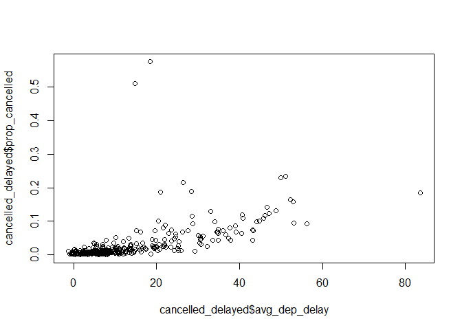
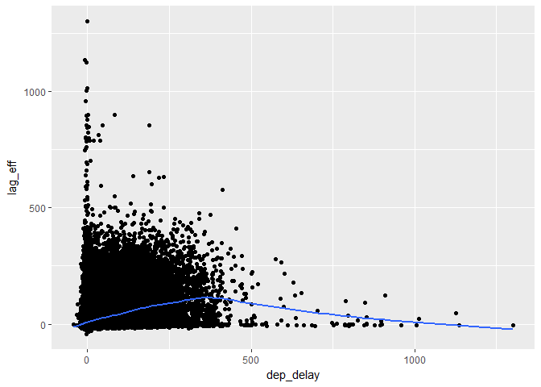

# 05_17_2017
John D.  
May 16, 2017  


```r
library(tidyverse)
```

```
## Loading tidyverse: ggplot2
## Loading tidyverse: tibble
## Loading tidyverse: tidyr
## Loading tidyverse: readr
## Loading tidyverse: purrr
## Loading tidyverse: dplyr
```

```
## Conflicts with tidy packages ----------------------------------------------
```

```
## filter(): dplyr, stats
## lag():    dplyr, stats
```

```r
library(nycflights13)
```

## 5.6.7 Exercises

1. Brainstorm at least 5 different ways to assess the typical delay characteristics of a group of flights. Consider the following scenarios:
    * A flight is 15 minutes early 50% of the time, and 15 minutes late 50% of the time.
    * A flight is always 10 minutes late.
    * A flight is 30 minutes early 50% of the time, and 30 minutes late 50% of the time.
    * 99% of the time a flight is on time. 1% of the time it’s 2 hours late.
    
  Which is more important: arrival delay or departure delay?
  
    Arrival delay is more important than departure delay. If a flight is delayed, it is still possible for the flight to make up time in the air. Arrival delay can cause a lot of problems though. Depending on how late a flight arrives, a person may end up missing their connecting flight o the next fight for that plane may be cancelled since the departure gate is no longer available. Would want some way to estimate the expected arrival delay based off flights travelling  the same path. And the usual arrival delay relative to the departure delay.
  
2. Come up with another approach that will give you the same output as `not_cancelled %>% count(dest)` and `not_cancelled %>% count(tailnum, wt = distance)` (without using `count()`).


```r
not_cancelled <- flights %>% 
  filter(!is.na(dep_delay), !is.na(arr_delay))

not_cancelled %>% group_by(dest) %>%
  summarise(n = n())
```

```
## # A tibble: 104 × 2
##     dest     n
##    <chr> <int>
## 1    ABQ   254
## 2    ACK   264
## 3    ALB   418
## 4    ANC     8
## 5    ATL 16837
## 6    AUS  2411
## 7    AVL   261
## 8    BDL   412
## 9    BGR   358
## 10   BHM   269
## # ... with 94 more rows
```

```r
not_cancelled%>% group_by(tailnum) %>%
  summarise(n = sum(distance))
```

```
## # A tibble: 4,037 × 2
##    tailnum      n
##      <chr>  <dbl>
## 1   D942DN   3418
## 2   N0EGMQ 239143
## 3   N10156 109664
## 4   N102UW  25722
## 5   N103US  24619
## 6   N104UW  24616
## 7   N10575 139903
## 8   N105UW  23618
## 9   N107US  21677
## 10  N108UW  32070
## # ... with 4,027 more rows
```

3. Our definition of cancelled flights `(is.na(dep_delay) | is.na(arr_delay) )` is slightly suboptimal. Why? Which is the most important column?

arr_delay is the most important column. Having a value for arr_delay means the flight both took off and arrived at its original destination.
I guess for this data set though, a flight is capable of having NA for arr_delay will still taking off and landing.

4. Look at the number of cancelled flights per day. Is there a pattern? Is the proportion of cancelled flights related to the average delay?


```r
cancelled_delayed <- 
  flights %>%
  mutate(cancelled = (is.na(arr_delay) | is.na(dep_delay))) %>%
  group_by(year, month, day) %>%
  summarise(prop_cancelled = mean(cancelled),
            avg_dep_delay = mean(dep_delay, na.rm = TRUE))
plot(cancelled_delayed$avg_dep_delay, cancelled_delayed$prop_cancelled)
```

<!-- -->

The longer the delay, the more likely the flight will get cancelled.

5. Which carrier has the worst delays? Challenge: can you disentangle the effects of bad airports vs. bad carriers? Why/why not? (Hint: think about `flights %>% group_by(carrier, dest) %>% summarise(n())`


```r
flights %>% group_by(carrier) %>%
  summarise(worst_delay = max(dep_delay, na.rm = T)) %>%
  arrange(desc(worst_delay))
```

```
## # A tibble: 16 × 2
##    carrier worst_delay
##      <chr>       <dbl>
## 1       HA        1301
## 2       MQ        1137
## 3       AA        1014
## 4       DL         960
## 5       F9         853
## 6       9E         747
## 7       VX         653
## 8       FL         602
## 9       EV         548
## 10      B6         502
## 11      US         500
## 12      UA         483
## 13      WN         471
## 14      YV         387
## 15      AS         225
## 16      OO         154
```

```r
flights %>% group_by(carrier) %>%
  summarise(worst_delay = mean(dep_delay, na.rm = T)) %>%
  arrange(desc(worst_delay))
```

```
## # A tibble: 16 × 2
##    carrier worst_delay
##      <chr>       <dbl>
## 1       F9   20.215543
## 2       EV   19.955390
## 3       YV   18.996330
## 4       FL   18.726075
## 5       WN   17.711744
## 6       9E   16.725769
## 7       B6   13.022522
## 8       VX   12.869421
## 9       OO   12.586207
## 10      UA   12.106073
## 11      MQ   10.552041
## 12      DL    9.264505
## 13      AA    8.586016
## 14      AS    5.804775
## 15      HA    4.900585
## 16      US    3.782418
```

```r
flights %>% group_by(carrier, dest) %>%
  summarise(worst_delay = max(dep_delay, na.rm = T)) %>%
  arrange(desc(worst_delay))
```

```
## Source: local data frame [314 x 3]
## Groups: carrier [16]
## 
##    carrier  dest worst_delay
##      <chr> <chr>       <dbl>
## 1       HA   HNL        1301
## 2       MQ   CMH        1137
## 3       MQ   ORD        1126
## 4       AA   SFO        1014
## 5       MQ   CVG        1005
## 6       DL   TPA         960
## 7       DL   MSP         911
## 8       DL   PDX         899
## 9       DL   ATL         898
## 10      AA   MIA         896
## # ... with 304 more rows
```

Hawaiian Airlines had the worst delay in 2013. While Frontier Airlines had the worst avg delay.

6. What does the `sort` argument to `count()` do. When might you use it?


```r
not_cancelled %>%
  count(tailnum)
```

```
## # A tibble: 4,037 × 2
##    tailnum     n
##      <chr> <int>
## 1   D942DN     4
## 2   N0EGMQ   352
## 3   N10156   145
## 4   N102UW    48
## 5   N103US    46
## 6   N104UW    46
## 7   N10575   269
## 8   N105UW    45
## 9   N107US    41
## 10  N108UW    60
## # ... with 4,027 more rows
```

```r
not_cancelled %>%
  count(tailnum, sort = T)
```

```
## # A tibble: 4,037 × 2
##    tailnum     n
##      <chr> <int>
## 1   N725MQ   544
## 2   N722MQ   485
## 3   N723MQ   475
## 4   N711MQ   462
## 5   N713MQ   449
## 6   N258JB   420
## 7   N353JB   403
## 8   N298JB   402
## 9   N351JB   391
## 10  N328AA   389
## # ... with 4,027 more rows
```

If sort = T, will sort output of n in descending order. Faster than piping the output to arrange.

### 5.7.1 Exercises

1. Refer back to the lists of useful mutate and filtering functions. Describe how each operation changes when you combine it with grouping.

When working with grouping, the functions will operate independantly on each individual group rather than operating on the whole data frame at once.

2. Which plane (`tailnum`) has the worst on-time record?


```r
flights %>% group_by(tailnum) %>%
  summarise(avg_delay = mean(arr_delay, na.rm = T)) %>%
  arrange(desc(avg_delay))
```

```
## # A tibble: 4,044 × 2
##    tailnum avg_delay
##      <chr>     <dbl>
## 1   N844MH  320.0000
## 2   N911DA  294.0000
## 3   N922EV  276.0000
## 4   N587NW  264.0000
## 5   N851NW  219.0000
## 6   N928DN  201.0000
## 7   N7715E  188.0000
## 8   N654UA  185.0000
## 9   N665MQ  174.6667
## 10  N427SW  157.0000
## # ... with 4,034 more rows
```

3. What time of day should you fly if you want to avoid delays as much as possible?


```r
flights %>% 
  group_by(sched_dep_time) %>%
  summarise(avg_delay = mean(arr_delay, na.rm = T)) %>%
  arrange(avg_delay) %>%
  head(n = 1)
```

```
## # A tibble: 1 × 2
##   sched_dep_time avg_delay
##            <int>     <dbl>
## 1            712    -35.35
```

```r
flights %>% 
  group_by(hour) %>%
  summarise(avg_delay = mean(arr_delay, na.rm = T)) %>%
  arrange(avg_delay) %>%
  head(n = 1)
```

```
## # A tibble: 1 × 2
##    hour avg_delay
##   <dbl>     <dbl>
## 1     7 -5.304472
```

Flights scheduled for 7:12 AM have on average the least amount of delays. Flights at 7 overall have the least amount of delays.

4. For each destination, compute the total minutes of delay. For each, flight, compute the proportion of the total delay for its destination.


```r
flights %>% group_by(dest) %>%
  mutate(total_delay = sum(arr_delay, na.rm = T), prop_delay = arr_delay/total_delay) %>%
  arrange(desc(total_delay)) %>%
  select(carrier, flight, dest, total_delay, prop_delay)
```

```
## Source: local data frame [336,776 x 5]
## Groups: dest [105]
## 
##    carrier flight  dest total_delay    prop_delay
##      <chr>  <int> <chr>       <dbl>         <dbl>
## 1       DL    461   ATL      190260 -1.313991e-04
## 2       MQ   4650   ATL      190260  6.307159e-05
## 3       DL   1743   ATL      190260 -4.204772e-05
## 4       DL    575   ATL      190260 -4.730369e-05
## 5       DL   1547   ATL      190260  2.627983e-05
## 6       DL   2047   ATL      190260 -1.051193e-05
## 7       DL    269   ATL      190260  0.000000e+00
## 8       FL    346   ATL      190260  8.935141e-05
## 9       MQ   4610   ATL      190260 -6.832755e-05
## 10      DL   1747   ATL      190260 -1.051193e-05
## # ... with 336,766 more rows
```

5. Delays are typically temporally correlated: even once the problem that caused the initial delay has been resolved, later flights are delayed to allow earlier flights to leave. Using `lag()` explore how the delay of a flight is related to the delay of the immediately preceding flight.


```r
flights %>% group_by(year,month,day) %>%
  filter(!is.na(dep_delay)) %>%
  mutate(lag_eff = lag(dep_delay)) %>%
  filter(!is.na(lag_eff)) %>%
  ggplot(aes(x = dep_delay, y = lag_eff)) +
  geom_point() +
  geom_smooth(se = F)
```

```
## `geom_smooth()` using method = 'gam'
```

<!-- -->

6. Look at each destination. Can you find flights that are suspiciously fast? (i.e. flights that represent a potential data entry error). Compute the air time a flight relative to the shortest flight to that destination. Which flights were most delayed in the air?


```r
flights %>% filter(!is.na(air_time)) %>%
  group_by(dest) %>%
  mutate(shortest = min(air_time),faster = air_time - shortest) %>%
  arrange(faster) %>%
  select(dest, air_time, shortest, faster) %>%
  arrange(desc(faster), dest)
```

```
## Source: local data frame [327,346 x 4]
## Groups: dest [104]
## 
##     dest air_time shortest faster
##    <chr>    <dbl>    <dbl>  <dbl>
## 1    SFO      490      295    195
## 2    LAX      440      275    165
## 3    EGE      382      219    163
## 4    DEN      331      182    149
## 5    LAX      422      275    147
## 6    LAS      399      256    143
## 7    SFO      438      295    143
## 8    SAN      413      279    134
## 9    HNL      695      562    133
## 10   SFO      426      295    131
## # ... with 327,336 more rows
```

Flights to the west coast were the most delayed. I don't know

7. Find all destinations that are flown by at least two carriers. Use that information to rank the carriers.


```r
flights %>% group_by(dest) %>%
  mutate(carr_count = length(unique(carrier))) %>%
  filter(carr_count > 1 ) %>%
  ungroup() %>%
  group_by(carrier) %>%
  mutate(total_dests = length(unique(dest))) %>%
  select(carrier, total_dests) %>%
  unique() %>%
  arrange(desc(total_dests))
```

```
## Source: local data frame [16 x 2]
## Groups: carrier [16]
## 
##    carrier total_dests
##      <chr>       <int>
## 1       EV          51
## 2       9E          48
## 3       UA          42
## 4       DL          39
## 5       B6          35
## 6       AA          19
## 7       MQ          19
## 8       WN          10
## 9       US           5
## 10      OO           5
## 11      VX           4
## 12      YV           3
## 13      FL           2
## 14      AS           1
## 15      F9           1
## 16      HA           1
```

Incomplete

8. For each plane, count the number of flights before the first delay of greater than 1 hour.


