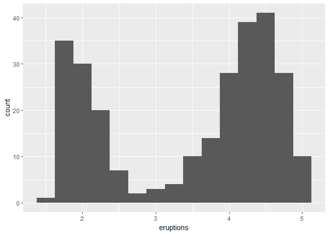
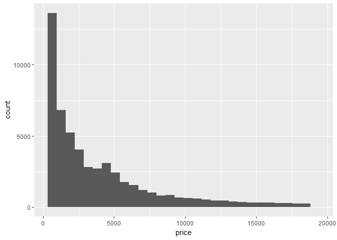
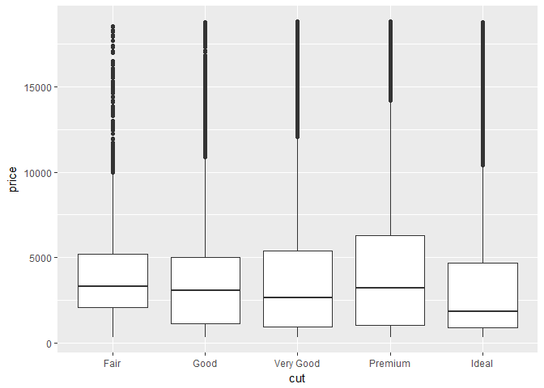

# 05_23_2017
John D.  
May 23, 2017  


```r
library(tidyverse)
```

```
## Loading tidyverse: ggplot2
## Loading tidyverse: tibble
## Loading tidyverse: tidyr
## Loading tidyverse: readr
## Loading tidyverse: purrr
## Loading tidyverse: dplyr
```

```
## Conflicts with tidy packages ----------------------------------------------
```

```
## filter(): dplyr, stats
## lag():    dplyr, stats
```

```r
library(reshape2)
```

```
## 
## Attaching package: 'reshape2'
```

```
## The following object is masked from 'package:tidyr':
## 
##     smiths
```

# 7.3 Variation

### 7.3.1 Visualising distributions


```r
ggplot(data = diamonds) +
  geom_bar(mapping = aes(x = cut))
```

<!-- -->

```r
diamonds %>% 
  count(cut)
```

```
## # A tibble: 5 x 2
##         cut     n
##       <ord> <int>
## 1      Fair  1610
## 2      Good  4906
## 3 Very Good 12082
## 4   Premium 13791
## 5     Ideal 21551
```

```r
ggplot(data = diamonds) +
  geom_histogram(mapping = aes(x = carat), binwidth = 0.5)
```

<!-- -->

```r
diamonds %>% 
  count(cut_width(carat, 0.5))
```

```
## # A tibble: 11 x 2
##    `cut_width(carat, 0.5)`     n
##                     <fctr> <int>
##  1            [-0.25,0.25]   785
##  2             (0.25,0.75] 29498
##  3             (0.75,1.25] 15977
##  4             (1.25,1.75]  5313
##  5             (1.75,2.25]  2002
##  6             (2.25,2.75]   322
##  7             (2.75,3.25]    32
##  8             (3.25,3.75]     5
##  9             (3.75,4.25]     4
## 10             (4.25,4.75]     1
## 11             (4.75,5.25]     1
```

```r
smaller <- diamonds %>% 
  filter(carat < 3)

ggplot(data = smaller, mapping = aes(x = carat)) +
  geom_histogram(binwidth = 0.1)
```

<!-- -->

```r
ggplot(data = smaller, mapping = aes(x = carat, colour = cut)) +
  geom_freqpoly(binwidth = 0.1)
```

<!-- -->

### 7.3.2 Typical values


```r
ggplot(data = smaller, mapping = aes(x = carat)) +
  geom_histogram(binwidth = 0.01)
```

<!-- -->

```r
ggplot(data = faithful, mapping = aes(x = eruptions)) + 
  geom_histogram(binwidth = 0.25)
```

<!-- -->

### 7.3.3 Unusual values


```r
ggplot(diamonds) + 
  geom_histogram(mapping = aes(x = y), binwidth = 0.5)
```

<!-- -->

```r
ggplot(diamonds) + 
  geom_histogram(mapping = aes(x = y), binwidth = 0.5) +
  coord_cartesian(ylim = c(0, 50))
```

<!-- -->

```r
unusual <- diamonds %>% 
  filter(y < 3 | y > 20) %>% 
  select(price, x, y, z) %>%
  arrange(y)
unusual
```

```
## # A tibble: 9 x 4
##   price     x     y     z
##   <int> <dbl> <dbl> <dbl>
## 1  5139  0.00   0.0  0.00
## 2  6381  0.00   0.0  0.00
## 3 12800  0.00   0.0  0.00
## 4 15686  0.00   0.0  0.00
## 5 18034  0.00   0.0  0.00
## 6  2130  0.00   0.0  0.00
## 7  2130  0.00   0.0  0.00
## 8  2075  5.15  31.8  5.12
## 9 12210  8.09  58.9  8.06
```

### 7.3.4 Exercises

1. Explore the distribution of each of the `x`, `y`, and `z` variables in `diamonds`. What do you learn? Think about a diamond and how you might decide which dimension is the length, width, and depth.

```r
summary(diamonds)
```

```
##      carat               cut        color        clarity     
##  Min.   :0.2000   Fair     : 1610   D: 6775   SI1    :13065  
##  1st Qu.:0.4000   Good     : 4906   E: 9797   VS2    :12258  
##  Median :0.7000   Very Good:12082   F: 9542   SI2    : 9194  
##  Mean   :0.7979   Premium  :13791   G:11292   VS1    : 8171  
##  3rd Qu.:1.0400   Ideal    :21551   H: 8304   VVS2   : 5066  
##  Max.   :5.0100                     I: 5422   VVS1   : 3655  
##                                     J: 2808   (Other): 2531  
##      depth           table           price             x         
##  Min.   :43.00   Min.   :43.00   Min.   :  326   Min.   : 0.000  
##  1st Qu.:61.00   1st Qu.:56.00   1st Qu.:  950   1st Qu.: 4.710  
##  Median :61.80   Median :57.00   Median : 2401   Median : 5.700  
##  Mean   :61.75   Mean   :57.46   Mean   : 3933   Mean   : 5.731  
##  3rd Qu.:62.50   3rd Qu.:59.00   3rd Qu.: 5324   3rd Qu.: 6.540  
##  Max.   :79.00   Max.   :95.00   Max.   :18823   Max.   :10.740  
##                                                                  
##        y                z         
##  Min.   : 0.000   Min.   : 0.000  
##  1st Qu.: 4.720   1st Qu.: 2.910  
##  Median : 5.710   Median : 3.530  
##  Mean   : 5.735   Mean   : 3.539  
##  3rd Qu.: 6.540   3rd Qu.: 4.040  
##  Max.   :58.900   Max.   :31.800  
## 
```

```r
smaller <- diamonds %>% select(x,y,z)
colMeans(smaller)
```

```
##        x        y        z 
## 5.731157 5.734526 3.538734
```

```r
m.smaller <- melt(smaller)
```

```
## No id variables; using all as measure variables
```

```r
ggplot(m.smaller) + 
  geom_histogram(aes(value)) + 
  facet_wrap(~variable) +
  coord_cartesian(ylim = c(0, 50))
```

```
## `stat_bin()` using `bins = 30`. Pick better value with `binwidth`.
```

<!-- -->

Based on the distribution, I believe x and y are the width and height and z is the depth. The average of x and y are very similar which could be due to people not wanting oblong diamonds. Additionally, x and y are on average larger than z, suggesting people want diamonds that cover a lot of surface area but do not necessarily care about the depth.

2. Explore the distribution of `price`. Do you discover anything unusual or surprising? (Hint: Carefully think about the binwidth and make sure you try a wide range of values.)


```r
smaller <- diamonds %>% select(price,cut,clarity)
summary(smaller)
```

```
##      price              cut           clarity     
##  Min.   :  326   Fair     : 1610   SI1    :13065  
##  1st Qu.:  950   Good     : 4906   VS2    :12258  
##  Median : 2401   Very Good:12082   SI2    : 9194  
##  Mean   : 3933   Premium  :13791   VS1    : 8171  
##  3rd Qu.: 5324   Ideal    :21551   VVS2   : 5066  
##  Max.   :18823                     VVS1   : 3655  
##                                    (Other): 2531
```

```r
p <- ggplot(smaller, aes(x = price))
p + geom_histogram()
```

```
## `stat_bin()` using `bins = 30`. Pick better value with `binwidth`.
```

<!-- -->

```r
p + geom_histogram(binwidth = 10)
```

<!-- -->

```r
p + geom_histogram(binwidth = 100)
```

<!-- -->

```r
p + geom_histogram(binwidth = 1000)
```

<!-- -->

```r
p + geom_histogram(binwidth = 2000)
```

<!-- -->

```r
p + geom_histogram(binwidth = 10)
```

<!-- -->

```r
p + geom_histogram(binwidth = 10) + coord_cartesian(xlim = c(1400,1600))
```

<!-- -->

There seems to be no diamonds priced between $1460 and $1540

3. How many diamonds are 0.99 carat? How many are 1 carat? What do you think is the cause of the difference?


```r
diamonds %>% 
  filter(carat == .99 | carat == 1) %>%
  group_by(carat) %>%
  count()
```

```
## # A tibble: 2 x 2
##   carat     n
##   <dbl> <int>
## 1  0.99    23
## 2  1.00  1558
```

There are 1558 1 carat diamonds and 23 .99 carat diamonds. This is most likely due to people wanting their diamonds to be atleast 1 carat big. That or people like diamonds with carats that are a multiple of .25, .99 is an unusual size for a cut diamond.

4. Compare and contrast `coord_cartesian()` vs `xlim()` or `ylim()` when zooming in on a histogram. What happens if you leave binwidth unset? What happens if you try and zoom so only half a bar shows?


```r
smaller <- diamonds %>% select(price)
p <- ggplot(smaller, aes(x = price))

p + geom_histogram(binwidth = 100) + coord_cartesian(xlim = c(0,1000))
```

<!-- -->

```r
p + geom_histogram(binwidth = 10000) + coord_cartesian(xlim = c(0,1000))
```

<!-- -->

```r
p + geom_histogram(binwidth = 100) + xlim(0,1000)
```

```
## Warning: Removed 39416 rows containing non-finite values (stat_bin).
```

<!-- -->

```r
p + geom_histogram() + coord_cartesian(xlim = c(0,1000))
```

```
## `stat_bin()` using `bins = 30`. Pick better value with `binwidth`.
```

<!-- -->

```r
p + geom_histogram() + xlim(0,1000)
```

```
## `stat_bin()` using `bins = 30`. Pick better value with `binwidth`.
```

```
## Warning: Removed 39416 rows containing non-finite values (stat_bin).
```

<!-- -->

`xlim()` or `ylim()` will replace values outside of the range with NA and will not be included when creating the histogram and determining bin width. `coord_cartesian()` simply zooms in on the certain part of the plot without changing the bin width.

# 7.4 Missing values


```r
diamonds2 <- diamonds %>% 
  filter(between(y, 3, 20))

diamonds2 <- diamonds %>% 
  mutate(y = ifelse(y < 3 | y > 20, NA, y))

ggplot(data = diamonds2, mapping = aes(x = x, y = y)) + 
  geom_point()
```

```
## Warning: Removed 9 rows containing missing values (geom_point).
```

<!-- -->

```r
ggplot(data = diamonds2, mapping = aes(x = x, y = y)) + 
  geom_point(na.rm = TRUE)
```

<!-- -->

```r
nycflights13::flights %>% 
  mutate(
    cancelled = is.na(dep_time),
    sched_hour = sched_dep_time %/% 100,
    sched_min = sched_dep_time %% 100,
    sched_dep_time = sched_hour + sched_min / 60
  ) %>% 
  ggplot(mapping = aes(sched_dep_time)) + 
    geom_freqpoly(mapping = aes(colour = cancelled), binwidth = 1/4)
```

<!-- -->

### 7.4.1 Exercises

1. What happens to missing values in a histogram? What happens to missing values in a bar chart? Why is there a difference?


```r
diamonds2 <- diamonds %>% 
  mutate(price = ifelse(price < 500 | price > 20000, NA, price))
ggplot(data = diamonds2, mapping = aes(x = price)) + 
  geom_histogram()
```

```
## `stat_bin()` using `bins = 30`. Pick better value with `binwidth`.
```

```
## Warning: Removed 1729 rows containing non-finite values (stat_bin).
```

<!-- -->

```r
diamonds2 <- diamonds %>% 
  mutate(cut = ifelse(price < 500 | price > 20000, NA, as.character(cut)))
ggplot(data = diamonds2, mapping = aes(x = cut)) + 
  geom_bar()
```

<!-- -->

In a histogram the NA values are removed and you are warned. In a bar plot, the NA values get their own bar. Has to do with the difference between categorical and continous variables.

2. What does `na.rm = TRUE` do in `mean()` and `sum()`?


```r
diamonds2 <- diamonds %>% 
  mutate(price = ifelse(price < 500 | price > 20000, NA, price))
mean(diamonds2$price)
```

```
## [1] NA
```

```r
mean(diamonds2$price, na.rm = T)
```

```
## [1] 4048.307
```

```r
sum(diamonds2$price)
```

```
## [1] NA
```

```r
sum(diamonds2$price, na.rm = T)
```

```
## [1] 211366178
```

If `na.rm` is `FALSE` an `NA` or `NaN` value in any of the arguments will cause a value of `NA` or `NaN` to be returned, otherwise `NA` and `NaN` values are ignored. `na.rm = TRUE` makes it so NAs are not included in the calculations

# 7.5 Covariation


```r
ggplot(data = diamonds, mapping = aes(x = price)) + 
  geom_freqpoly(mapping = aes(colour = cut), binwidth = 500)
```

<!-- -->

```r
ggplot(diamonds) + 
  geom_bar(mapping = aes(x = cut))
```

<!-- -->

```r
ggplot(data = diamonds, mapping = aes(x = price, y = ..density..)) + 
  geom_freqpoly(mapping = aes(colour = cut), binwidth = 500)
```

<!-- -->

```r
ggplot(data = diamonds, mapping = aes(x = cut, y = price)) +
  geom_boxplot()
```

<!-- -->

```r
ggplot(data = mpg, mapping = aes(x = class, y = hwy)) +
  geom_boxplot()
```

<!-- -->

```r
ggplot(data = mpg) +
  geom_boxplot(mapping = aes(x = reorder(class, hwy, FUN = median), y = hwy))
```

<!-- -->

```r
ggplot(data = mpg) +
  geom_boxplot(mapping = aes(x = reorder(class, hwy, FUN = median), y = hwy)) +
  coord_flip()
```

<!-- -->

### 7.5.1.1 Exercises

1. Use what you’ve learned to improve the visualisation of the departure times of cancelled vs. non-cancelled flights.


```r
df <- nycflights13::flights %>% 
  mutate(
    cancelled = is.na(dep_time),
    sched_hour = sched_dep_time %/% 100,
    sched_min = sched_dep_time %% 100,
    sched_dep_time = sched_hour + sched_min / 60
  )

ggplot(df, mapping = aes(sched_dep_time)) + 
  geom_density(mapping = aes(colour = cancelled))
```

<!-- -->

```r
ggplot(df, mapping = aes(y = sched_dep_time)) + 
  geom_boxplot(mapping = aes(x = cancelled))
```

<!-- -->

2. What variable in the diamonds dataset is most important for predicting the price of a diamond? How is that variable correlated with cut? Why does the combination of those two relationships lead to lower quality diamonds being more expensive?


```r
summary(diamonds)
```

```
##      carat               cut        color        clarity     
##  Min.   :0.2000   Fair     : 1610   D: 6775   SI1    :13065  
##  1st Qu.:0.4000   Good     : 4906   E: 9797   VS2    :12258  
##  Median :0.7000   Very Good:12082   F: 9542   SI2    : 9194  
##  Mean   :0.7979   Premium  :13791   G:11292   VS1    : 8171  
##  3rd Qu.:1.0400   Ideal    :21551   H: 8304   VVS2   : 5066  
##  Max.   :5.0100                     I: 5422   VVS1   : 3655  
##                                     J: 2808   (Other): 2531  
##      depth           table           price             x         
##  Min.   :43.00   Min.   :43.00   Min.   :  326   Min.   : 0.000  
##  1st Qu.:61.00   1st Qu.:56.00   1st Qu.:  950   1st Qu.: 4.710  
##  Median :61.80   Median :57.00   Median : 2401   Median : 5.700  
##  Mean   :61.75   Mean   :57.46   Mean   : 3933   Mean   : 5.731  
##  3rd Qu.:62.50   3rd Qu.:59.00   3rd Qu.: 5324   3rd Qu.: 6.540  
##  Max.   :79.00   Max.   :95.00   Max.   :18823   Max.   :10.740  
##                                                                  
##        y                z         
##  Min.   : 0.000   Min.   : 0.000  
##  1st Qu.: 4.720   1st Qu.: 2.910  
##  Median : 5.710   Median : 3.530  
##  Mean   : 5.735   Mean   : 3.539  
##  3rd Qu.: 6.540   3rd Qu.: 4.040  
##  Max.   :58.900   Max.   :31.800  
## 
```

```r
n.diamonds <- diamonds
n.diamonds$cut <- as.integer(n.diamonds$cut)
n.diamonds$clarity <- as.integer(n.diamonds$clarity)
n.diamonds$color <- as.integer(n.diamonds$color)
correlations <- cor(n.diamonds)
correlations
```

```
##               carat         cut       color     clarity       depth
## carat    1.00000000 -0.13496702  0.29143675 -0.35284057  0.02822431
## cut     -0.13496702  1.00000000 -0.02051852  0.18917474 -0.21805501
## color    0.29143675 -0.02051852  1.00000000  0.02563128  0.04727923
## clarity -0.35284057  0.18917474  0.02563128  1.00000000 -0.06738444
## depth    0.02822431 -0.21805501  0.04727923 -0.06738444  1.00000000
## table    0.18161755 -0.43340461  0.02646520 -0.16032684 -0.29577852
## price    0.92159130 -0.05349066  0.17251093 -0.14680007 -0.01064740
## x        0.97509423 -0.12556524  0.27028669 -0.37199853 -0.02528925
## y        0.95172220 -0.12146187  0.26358440 -0.35841962 -0.02934067
## z        0.95338738 -0.14932254  0.26822688 -0.36695200  0.09492388
##              table       price           x           y           z
## carat    0.1816175  0.92159130  0.97509423  0.95172220  0.95338738
## cut     -0.4334046 -0.05349066 -0.12556524 -0.12146187 -0.14932254
## color    0.0264652  0.17251093  0.27028669  0.26358440  0.26822688
## clarity -0.1603268 -0.14680007 -0.37199853 -0.35841962 -0.36695200
## depth   -0.2957785 -0.01064740 -0.02528925 -0.02934067  0.09492388
## table    1.0000000  0.12713390  0.19534428  0.18376015  0.15092869
## price    0.1271339  1.00000000  0.88443516  0.86542090  0.86124944
## x        0.1953443  0.88443516  1.00000000  0.97470148  0.97077180
## y        0.1837601  0.86542090  0.97470148  1.00000000  0.95200572
## z        0.1509287  0.86124944  0.97077180  0.95200572  1.00000000
```

```r
ggplot(diamonds, aes(cut,price)) + geom_boxplot()
```

<!-- -->

```r
ggplot(diamonds, aes(carat,price)) + geom_point(aes(color = cut))
```

<!-- -->

Carat is most important for for predicting the price of a diamond. As the carat increases, the price rapidly increases regardless of cut. This is what causes lower quality diamonds to be more expensive

3. Install the ggstance package, and create a horizontal boxplot. How does this compare to using coord_flip()?


```r
#install.packages("ggstance")
library(ggstance)
```

```
## 
## Attaching package: 'ggstance'
```

```
## The following objects are masked from 'package:ggplot2':
## 
##     geom_errorbarh, GeomErrorbarh
```

```r
ggplot(data = mpg) +
  geom_boxplot(mapping = aes(x = reorder(class, hwy, FUN = median), y = hwy)) +
  coord_flip()
```

<!-- -->

```r
ggplot(data = mpg) +
  geom_boxploth(mapping = aes(x = reorder(class, hwy, FUN = median), y = hwy))
```

```
## Warning: position_dodgev requires non-overlapping y intervals
```

<!-- -->

```r
ggplot(data = mpg) +
  geom_boxploth(mapping = aes(y = reorder(class, hwy, FUN = median), x = hwy))
```

<!-- -->

Creates the same horinzontal boxplot, need to switch the x and y variables though.

4. One problem with boxplots is that they were developed in an era of much smaller datasets and tend to display a prohibitively large number of “outlying values”. One approach to remedy this problem is the letter value plot. Install the lvplot package, and try using `geom_lv()` to display the distribution of price vs cut. What do you learn? How do you interpret the plots?


```r
#install.packages("lvplot")
library(lvplot)
ggplot(data = diamonds) +
  geom_lv(aes(cut,price))
```

<!-- -->

An extension of standard boxplots which draws k letter statistics

5. Compare and contrast `geom_violin()` with a facetted `geom_histogram()`, or a coloured `geom_freqpoly()`. What are the pros and cons of each method?


```r
ggplot(data = diamonds) +
  geom_violin(aes(cut,price))
```

<!-- -->

```r
ggplot(data = diamonds) +
  geom_histogram(aes(price)) +
  facet_wrap(~cut)
```

```
## `stat_bin()` using `bins = 30`. Pick better value with `binwidth`.
```

<!-- -->

```r
ggplot(data = diamonds, mapping = aes(x = price, y = ..density..)) + 
  geom_freqpoly(mapping = aes(colour = cut), binwidth = 500)
```

<!-- -->

A violin plot is a like a faceted histgram except all the x variables are on the same plot. a frequency plot is similar except they are all overlapping each other.

6. If you have a small dataset, it’s sometimes useful to use `geom_jitter()` to see the relationship between a continuous and categorical variable. The ggbeeswarm package provides a number of methods similar to `geom_jitter()`. List them and briefly describe what each one does.


```r
#install.packages("ggbeeswarm")
library(ggbeeswarm)
qplot(class, hwy, data = ggplot2::mpg, geom='beeswarm')
```

<!-- -->

geom_beeswarm creates a plot similar to a violin plot but with dots.
The beeswarm geom is a convenient means to offset points within categories to reduce overplotting.
