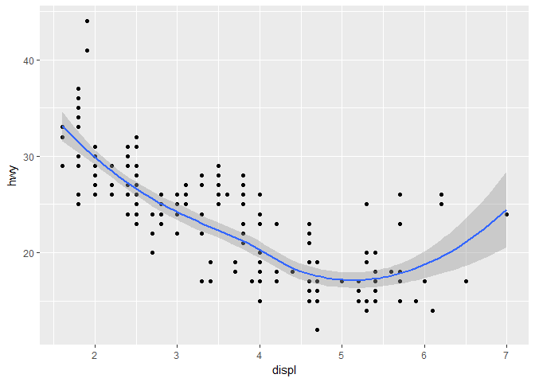
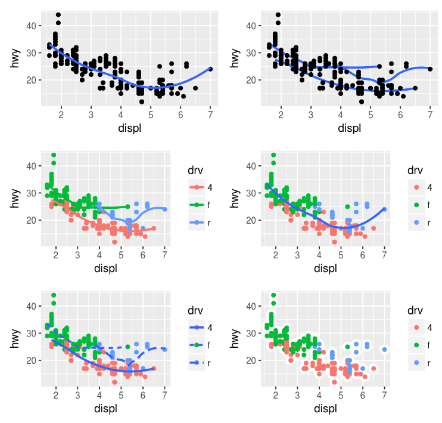

# 05_03_2017
John D.  
April 27, 2017  


### 3.6.1 Exercises  

1.What geom would you use to draw a line chart? A boxplot? A histogram? An area chart?

geom_line(), geom_boxplot(), geom_histogram

2.Run this code in your head and predict what the output will look like. Then, run the code in R and check your predictions.

A scatterplot and a smoothed lineplot in the same window. There'll be 3 colors and 3 lines due to the three types of drive trains.


```r
ggplot(data = mpg, mapping = aes(x = displ, y = hwy, color = drv)) + 
  geom_point() + 
  geom_smooth(se = FALSE)
```

```
## `geom_smooth()` using method = 'loess'
```

<!-- -->

3. What does `show.legend = FALSE` do? What happens if you remove it?

Removes the legend associated with the geometric object being plotted. Adds the legend in for that geom. Use it to prevent showing redundant/unnecessary data.

4. What does the `se` argument to `geom_smooth()` do?

Adds a confidence interval around the line(s) being drawn

5. Will these two graphs look different? Why/why not?

They will look the same because listing the mapping attributes under `ggplot() will create a global setting for all geoms added. You can do this rather than listing it for each individual geom. You can always override the global setting by specifying something else in each individual geom


```r
ggplot(data = mpg, mapping = aes(x = displ, y = hwy)) + 
  geom_point() + 
  geom_smooth()
```

```
## `geom_smooth()` using method = 'loess'
```

<!-- -->

```r
ggplot() + 
  geom_point(data = mpg, mapping = aes(x = displ, y = hwy)) + 
  geom_smooth(data = mpg, mapping = aes(x = displ, y = hwy))
```

```
## `geom_smooth()` using method = 'loess'
```

<!-- -->

6. Recreate the R code necessary to generate the following graphs.




```r
ggplot(data = mpg, mapping = aes(x = displ, y = hwy)) +
  geom_point(size = 3.5) +
  geom_smooth(se = F, size = 1.5)
```

```
## `geom_smooth()` using method = 'loess'
```

<!-- -->

```r
ggplot(data = mpg, mapping = aes(x = displ, y = hwy)) +
  geom_point(size = 3.5) +
  geom_smooth(se = F, size = 1.5, color = "blue", aes(group = drv))
```

```
## `geom_smooth()` using method = 'loess'
```

<!-- -->

```r
ggplot(data = mpg, mapping = aes(x = displ, y = hwy, color = drv)) +
  geom_point(size = 3.5) +
  geom_smooth(se = F, size = 1.5)
```

```
## `geom_smooth()` using method = 'loess'
```

<!-- -->

```r
ggplot(data = mpg, mapping = aes(x = displ, y = hwy)) +
  geom_point(size = 3.5, aes(color = drv)) +
  geom_smooth(se = F, size = 1.5)
```

```
## `geom_smooth()` using method = 'loess'
```

<!-- -->

```r
ggplot(data = mpg, mapping = aes(x = displ, y = hwy)) +
  geom_point(size = 3.5, aes(color = drv)) +
  geom_smooth(se = F, size = 1.5, aes(linetype = drv))
```

```
## `geom_smooth()` using method = 'loess'
```

<!-- -->

```r
ggplot(data = mpg, mapping = aes(x = displ, y = hwy, fill = drv)) +
  geom_point(shape = 21, color = "white", size = 3.5, stroke = 2.5)
```

<!-- -->

### 3.7.1 Exercises 

1. 
