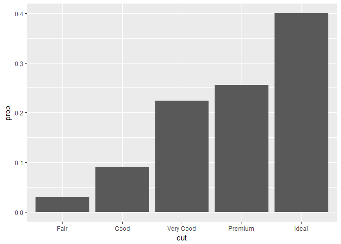
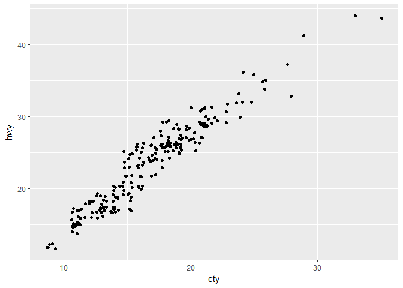
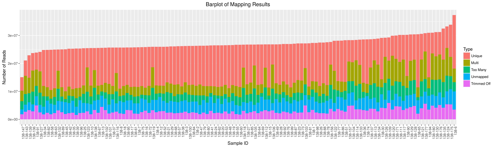

# 05_03_2017
John D.  
April 27, 2017  


### 3.6.1 Exercises  

1.What geom would you use to draw a line chart? A boxplot? A histogram? An area chart?

geom_line(), geom_boxplot(), geom_histogram

2.Run this code in your head and predict what the output will look like. Then, run the code in R and check your predictions.

A scatterplot and a smoothed lineplot in the same window. There'll be 3 colors and 3 lines due to the three types of drive trains.


```r
ggplot(data = mpg, mapping = aes(x = displ, y = hwy, color = drv)) + 
  geom_point() + 
  geom_smooth(se = FALSE)
```

```
## `geom_smooth()` using method = 'loess'
```

<!-- -->

3.What does `show.legend = FALSE` do? What happens if you remove it?

Removes the legend associated with the geometric object being plotted. Adds the legend in for that geom. Use it to prevent showing redundant/unnecessary data.

4.What does the `se` argument to `geom_smooth()` do?

Adds a confidence interval around the line(s) being drawn

5.Will these two graphs look different? Why/why not?

They will look the same because listing the mapping attributes under `ggplot() will create a global setting for all geoms added. You can do this rather than listing it for each individual geom. You can always override the global setting by specifying something else in each individual geom


```r
ggplot(data = mpg, mapping = aes(x = displ, y = hwy)) + 
  geom_point() + 
  geom_smooth()
```

```
## `geom_smooth()` using method = 'loess'
```

<!-- -->

```r
ggplot() + 
  geom_point(data = mpg, mapping = aes(x = displ, y = hwy)) + 
  geom_smooth(data = mpg, mapping = aes(x = displ, y = hwy))
```

```
## `geom_smooth()` using method = 'loess'
```

<!-- -->

6.Recreate the R code necessary to generate the following graphs.


```r
ggplot(data = mpg, mapping = aes(x = displ, y = hwy)) +
  geom_point(size = 3.5) +
  geom_smooth(se = F, size = 1.5)
```

```
## `geom_smooth()` using method = 'loess'
```

<!-- -->

```r
ggplot(data = mpg, mapping = aes(x = displ, y = hwy)) +
  geom_point(size = 3.5) +
  geom_smooth(se = F, size = 1.5, color = "blue", aes(group = drv))
```

```
## `geom_smooth()` using method = 'loess'
```

<!-- -->

```r
ggplot(data = mpg, mapping = aes(x = displ, y = hwy, color = drv)) +
  geom_point(size = 3.5) +
  geom_smooth(se = F, size = 1.5)
```

```
## `geom_smooth()` using method = 'loess'
```

<!-- -->

```r
ggplot(data = mpg, mapping = aes(x = displ, y = hwy)) +
  geom_point(size = 3.5, aes(color = drv)) +
  geom_smooth(se = F, size = 1.5)
```

```
## `geom_smooth()` using method = 'loess'
```

<!-- -->

```r
ggplot(data = mpg, mapping = aes(x = displ, y = hwy)) +
  geom_point(size = 3.5, aes(color = drv)) +
  geom_smooth(se = F, size = 1.5, aes(linetype = drv))
```

```
## `geom_smooth()` using method = 'loess'
```

<!-- -->

```r
ggplotly(ggplot(data = mpg, mapping = aes(x = displ, y = hwy, fill = drv)) +
  geom_point(shape = 21, color = "white", size = 3.5, stroke = 2.5))
```

```
## Warning: We recommend that you use the dev version of ggplot2 with `ggplotly()`
## Install it with: `devtools::install_github('hadley/ggplot2')`
```

<!--html_preserve--><div id="26309446dd0" style="width:672px;height:480px;" class="plotly html-widget"></div>
<script type="application/json" data-for="26309446dd0">{"x":{"data":[{"x":[1.8,1.8,2,2,2.8,2.8,3.1,3.1,2.8,3.1,4.2,5.3,5.3,5.7,6.5,3.7,3.7,3.9,3.9,4.7,4.7,4.7,5.2,5.2,3.9,4.7,4.7,4.7,5.2,5.7,5.9,4.7,4.7,4.7,4.7,4.7,4.7,5.2,5.2,5.7,5.9,4,4,4,4,4.6,5,4.2,4.2,4.6,4.6,4.6,5.4,5.4,3,3.7,4,4.7,4.7,4.7,5.7,6.1,4,4.2,4.4,4.6,4,4,4.6,5,3.3,3.3,4,5.6,2.5,2.5,2.5,2.5,2.5,2.5,2.2,2.2,2.5,2.5,2.5,2.5,2.5,2.5,2.7,2.7,3.4,3.4,4,4.7,4.7,5.7,2.7,2.7,2.7,3.4,3.4,4,4],"y":[26,25,28,27,25,25,25,25,24,25,23,19,14,15,17,19,18,17,17,19,19,12,17,15,17,17,12,17,16,18,15,16,12,17,17,16,12,15,16,17,15,17,19,17,19,19,17,17,17,16,16,17,15,17,22,19,20,17,12,19,18,14,15,18,18,15,17,19,19,17,17,17,20,18,25,24,27,25,26,23,26,26,26,26,25,27,25,27,20,20,19,17,20,17,15,18,20,20,22,17,19,18,20],"text":["displ: 1.8<br />hwy: 26<br />drv: 4","displ: 1.8<br />hwy: 25<br />drv: 4","displ: 2.0<br />hwy: 28<br />drv: 4","displ: 2.0<br />hwy: 27<br />drv: 4","displ: 2.8<br />hwy: 25<br />drv: 4","displ: 2.8<br />hwy: 25<br />drv: 4","displ: 3.1<br />hwy: 25<br />drv: 4","displ: 3.1<br />hwy: 25<br />drv: 4","displ: 2.8<br />hwy: 24<br />drv: 4","displ: 3.1<br />hwy: 25<br />drv: 4","displ: 4.2<br />hwy: 23<br />drv: 4","displ: 5.3<br />hwy: 19<br />drv: 4","displ: 5.3<br />hwy: 14<br />drv: 4","displ: 5.7<br />hwy: 15<br />drv: 4","displ: 6.5<br />hwy: 17<br />drv: 4","displ: 3.7<br />hwy: 19<br />drv: 4","displ: 3.7<br />hwy: 18<br />drv: 4","displ: 3.9<br />hwy: 17<br />drv: 4","displ: 3.9<br />hwy: 17<br />drv: 4","displ: 4.7<br />hwy: 19<br />drv: 4","displ: 4.7<br />hwy: 19<br />drv: 4","displ: 4.7<br />hwy: 12<br />drv: 4","displ: 5.2<br />hwy: 17<br />drv: 4","displ: 5.2<br />hwy: 15<br />drv: 4","displ: 3.9<br />hwy: 17<br />drv: 4","displ: 4.7<br />hwy: 17<br />drv: 4","displ: 4.7<br />hwy: 12<br />drv: 4","displ: 4.7<br />hwy: 17<br />drv: 4","displ: 5.2<br />hwy: 16<br />drv: 4","displ: 5.7<br />hwy: 18<br />drv: 4","displ: 5.9<br />hwy: 15<br />drv: 4","displ: 4.7<br />hwy: 16<br />drv: 4","displ: 4.7<br />hwy: 12<br />drv: 4","displ: 4.7<br />hwy: 17<br />drv: 4","displ: 4.7<br />hwy: 17<br />drv: 4","displ: 4.7<br />hwy: 16<br />drv: 4","displ: 4.7<br />hwy: 12<br />drv: 4","displ: 5.2<br />hwy: 15<br />drv: 4","displ: 5.2<br />hwy: 16<br />drv: 4","displ: 5.7<br />hwy: 17<br />drv: 4","displ: 5.9<br />hwy: 15<br />drv: 4","displ: 4.0<br />hwy: 17<br />drv: 4","displ: 4.0<br />hwy: 19<br />drv: 4","displ: 4.0<br />hwy: 17<br />drv: 4","displ: 4.0<br />hwy: 19<br />drv: 4","displ: 4.6<br />hwy: 19<br />drv: 4","displ: 5.0<br />hwy: 17<br />drv: 4","displ: 4.2<br />hwy: 17<br />drv: 4","displ: 4.2<br />hwy: 17<br />drv: 4","displ: 4.6<br />hwy: 16<br />drv: 4","displ: 4.6<br />hwy: 16<br />drv: 4","displ: 4.6<br />hwy: 17<br />drv: 4","displ: 5.4<br />hwy: 15<br />drv: 4","displ: 5.4<br />hwy: 17<br />drv: 4","displ: 3.0<br />hwy: 22<br />drv: 4","displ: 3.7<br />hwy: 19<br />drv: 4","displ: 4.0<br />hwy: 20<br />drv: 4","displ: 4.7<br />hwy: 17<br />drv: 4","displ: 4.7<br />hwy: 12<br />drv: 4","displ: 4.7<br />hwy: 19<br />drv: 4","displ: 5.7<br />hwy: 18<br />drv: 4","displ: 6.1<br />hwy: 14<br />drv: 4","displ: 4.0<br />hwy: 15<br />drv: 4","displ: 4.2<br />hwy: 18<br />drv: 4","displ: 4.4<br />hwy: 18<br />drv: 4","displ: 4.6<br />hwy: 15<br />drv: 4","displ: 4.0<br />hwy: 17<br />drv: 4","displ: 4.0<br />hwy: 19<br />drv: 4","displ: 4.6<br />hwy: 19<br />drv: 4","displ: 5.0<br />hwy: 17<br />drv: 4","displ: 3.3<br />hwy: 17<br />drv: 4","displ: 3.3<br />hwy: 17<br />drv: 4","displ: 4.0<br />hwy: 20<br />drv: 4","displ: 5.6<br />hwy: 18<br />drv: 4","displ: 2.5<br />hwy: 25<br />drv: 4","displ: 2.5<br />hwy: 24<br />drv: 4","displ: 2.5<br />hwy: 27<br />drv: 4","displ: 2.5<br />hwy: 25<br />drv: 4","displ: 2.5<br />hwy: 26<br />drv: 4","displ: 2.5<br />hwy: 23<br />drv: 4","displ: 2.2<br />hwy: 26<br />drv: 4","displ: 2.2<br />hwy: 26<br />drv: 4","displ: 2.5<br />hwy: 26<br />drv: 4","displ: 2.5<br />hwy: 26<br />drv: 4","displ: 2.5<br />hwy: 25<br />drv: 4","displ: 2.5<br />hwy: 27<br />drv: 4","displ: 2.5<br />hwy: 25<br />drv: 4","displ: 2.5<br />hwy: 27<br />drv: 4","displ: 2.7<br />hwy: 20<br />drv: 4","displ: 2.7<br />hwy: 20<br />drv: 4","displ: 3.4<br />hwy: 19<br />drv: 4","displ: 3.4<br />hwy: 17<br />drv: 4","displ: 4.0<br />hwy: 20<br />drv: 4","displ: 4.7<br />hwy: 17<br />drv: 4","displ: 4.7<br />hwy: 15<br />drv: 4","displ: 5.7<br />hwy: 18<br />drv: 4","displ: 2.7<br />hwy: 20<br />drv: 4","displ: 2.7<br />hwy: 20<br />drv: 4","displ: 2.7<br />hwy: 22<br />drv: 4","displ: 3.4<br />hwy: 17<br />drv: 4","displ: 3.4<br />hwy: 19<br />drv: 4","displ: 4.0<br />hwy: 18<br />drv: 4","displ: 4.0<br />hwy: 20<br />drv: 4"],"type":"scatter","mode":"markers","marker":{"autocolorscale":false,"color":"rgba(248,118,109,1)","opacity":1,"size":13.2283464566929,"symbol":"circle","line":{"width":9.4488188976378,"color":"rgba(255,255,255,1)"}},"hoveron":"points","name":"4","legendgroup":"4","showlegend":true,"xaxis":"x","yaxis":"y","hoverinfo":"text","frame":null},{"x":[1.8,1.8,2,2,2.8,2.8,3.1,2.4,2.4,3.1,3.5,3.6,2.4,3,3.3,3.3,3.3,3.3,3.3,3.8,3.8,3.8,4,1.6,1.6,1.6,1.6,1.6,1.8,1.8,1.8,2,2.4,2.4,2.4,2.4,2.5,2.5,3.3,2,2,2,2,2.7,2.7,2.7,2.4,2.4,2.5,2.5,3.5,3.5,3,3,3.5,3.1,3.8,3.8,3.8,5.3,2.2,2.2,2.4,2.4,3,3,3.5,2.2,2.2,2.4,2.4,3,3,3.3,1.8,1.8,1.8,1.8,1.8,2,2,2,2,2.8,1.9,2,2,2,2,2.5,2.5,2.8,2.8,1.9,1.9,2,2,2.5,2.5,1.8,1.8,2,2,2.8,2.8,3.6],"y":[29,29,31,30,26,26,27,27,30,26,29,26,24,24,22,22,24,24,17,22,21,23,23,33,32,32,29,32,34,36,36,29,26,27,30,31,26,26,28,26,29,28,27,24,24,24,29,27,31,32,27,26,26,25,25,26,26,27,28,25,29,27,31,31,26,26,28,27,29,31,31,26,26,27,30,33,35,37,35,29,26,29,29,24,44,29,26,29,29,29,29,23,24,44,41,29,26,28,29,29,29,28,29,26,26,26],"text":["displ: 1.8<br />hwy: 29<br />drv: f","displ: 1.8<br />hwy: 29<br />drv: f","displ: 2.0<br />hwy: 31<br />drv: f","displ: 2.0<br />hwy: 30<br />drv: f","displ: 2.8<br />hwy: 26<br />drv: f","displ: 2.8<br />hwy: 26<br />drv: f","displ: 3.1<br />hwy: 27<br />drv: f","displ: 2.4<br />hwy: 27<br />drv: f","displ: 2.4<br />hwy: 30<br />drv: f","displ: 3.1<br />hwy: 26<br />drv: f","displ: 3.5<br />hwy: 29<br />drv: f","displ: 3.6<br />hwy: 26<br />drv: f","displ: 2.4<br />hwy: 24<br />drv: f","displ: 3.0<br />hwy: 24<br />drv: f","displ: 3.3<br />hwy: 22<br />drv: f","displ: 3.3<br />hwy: 22<br />drv: f","displ: 3.3<br />hwy: 24<br />drv: f","displ: 3.3<br />hwy: 24<br />drv: f","displ: 3.3<br />hwy: 17<br />drv: f","displ: 3.8<br />hwy: 22<br />drv: f","displ: 3.8<br />hwy: 21<br />drv: f","displ: 3.8<br />hwy: 23<br />drv: f","displ: 4.0<br />hwy: 23<br />drv: f","displ: 1.6<br />hwy: 33<br />drv: f","displ: 1.6<br />hwy: 32<br />drv: f","displ: 1.6<br />hwy: 32<br />drv: f","displ: 1.6<br />hwy: 29<br />drv: f","displ: 1.6<br />hwy: 32<br />drv: f","displ: 1.8<br />hwy: 34<br />drv: f","displ: 1.8<br />hwy: 36<br />drv: f","displ: 1.8<br />hwy: 36<br />drv: f","displ: 2.0<br />hwy: 29<br />drv: f","displ: 2.4<br />hwy: 26<br />drv: f","displ: 2.4<br />hwy: 27<br />drv: f","displ: 2.4<br />hwy: 30<br />drv: f","displ: 2.4<br />hwy: 31<br />drv: f","displ: 2.5<br />hwy: 26<br />drv: f","displ: 2.5<br />hwy: 26<br />drv: f","displ: 3.3<br />hwy: 28<br />drv: f","displ: 2.0<br />hwy: 26<br />drv: f","displ: 2.0<br />hwy: 29<br />drv: f","displ: 2.0<br />hwy: 28<br />drv: f","displ: 2.0<br />hwy: 27<br />drv: f","displ: 2.7<br />hwy: 24<br />drv: f","displ: 2.7<br />hwy: 24<br />drv: f","displ: 2.7<br />hwy: 24<br />drv: f","displ: 2.4<br />hwy: 29<br />drv: f","displ: 2.4<br />hwy: 27<br />drv: f","displ: 2.5<br />hwy: 31<br />drv: f","displ: 2.5<br />hwy: 32<br />drv: f","displ: 3.5<br />hwy: 27<br />drv: f","displ: 3.5<br />hwy: 26<br />drv: f","displ: 3.0<br />hwy: 26<br />drv: f","displ: 3.0<br />hwy: 25<br />drv: f","displ: 3.5<br />hwy: 25<br />drv: f","displ: 3.1<br />hwy: 26<br />drv: f","displ: 3.8<br />hwy: 26<br />drv: f","displ: 3.8<br />hwy: 27<br />drv: f","displ: 3.8<br />hwy: 28<br />drv: f","displ: 5.3<br />hwy: 25<br />drv: f","displ: 2.2<br />hwy: 29<br />drv: f","displ: 2.2<br />hwy: 27<br />drv: f","displ: 2.4<br />hwy: 31<br />drv: f","displ: 2.4<br />hwy: 31<br />drv: f","displ: 3.0<br />hwy: 26<br />drv: f","displ: 3.0<br />hwy: 26<br />drv: f","displ: 3.5<br />hwy: 28<br />drv: f","displ: 2.2<br />hwy: 27<br />drv: f","displ: 2.2<br />hwy: 29<br />drv: f","displ: 2.4<br />hwy: 31<br />drv: f","displ: 2.4<br />hwy: 31<br />drv: f","displ: 3.0<br />hwy: 26<br />drv: f","displ: 3.0<br />hwy: 26<br />drv: f","displ: 3.3<br />hwy: 27<br />drv: f","displ: 1.8<br />hwy: 30<br />drv: f","displ: 1.8<br />hwy: 33<br />drv: f","displ: 1.8<br />hwy: 35<br />drv: f","displ: 1.8<br />hwy: 37<br />drv: f","displ: 1.8<br />hwy: 35<br />drv: f","displ: 2.0<br />hwy: 29<br />drv: f","displ: 2.0<br />hwy: 26<br />drv: f","displ: 2.0<br />hwy: 29<br />drv: f","displ: 2.0<br />hwy: 29<br />drv: f","displ: 2.8<br />hwy: 24<br />drv: f","displ: 1.9<br />hwy: 44<br />drv: f","displ: 2.0<br />hwy: 29<br />drv: f","displ: 2.0<br />hwy: 26<br />drv: f","displ: 2.0<br />hwy: 29<br />drv: f","displ: 2.0<br />hwy: 29<br />drv: f","displ: 2.5<br />hwy: 29<br />drv: f","displ: 2.5<br />hwy: 29<br />drv: f","displ: 2.8<br />hwy: 23<br />drv: f","displ: 2.8<br />hwy: 24<br />drv: f","displ: 1.9<br />hwy: 44<br />drv: f","displ: 1.9<br />hwy: 41<br />drv: f","displ: 2.0<br />hwy: 29<br />drv: f","displ: 2.0<br />hwy: 26<br />drv: f","displ: 2.5<br />hwy: 28<br />drv: f","displ: 2.5<br />hwy: 29<br />drv: f","displ: 1.8<br />hwy: 29<br />drv: f","displ: 1.8<br />hwy: 29<br />drv: f","displ: 2.0<br />hwy: 28<br />drv: f","displ: 2.0<br />hwy: 29<br />drv: f","displ: 2.8<br />hwy: 26<br />drv: f","displ: 2.8<br />hwy: 26<br />drv: f","displ: 3.6<br />hwy: 26<br />drv: f"],"type":"scatter","mode":"markers","marker":{"autocolorscale":false,"color":"rgba(0,186,56,1)","opacity":1,"size":13.2283464566929,"symbol":"circle","line":{"width":9.4488188976378,"color":"rgba(255,255,255,1)"}},"hoveron":"points","name":"f","legendgroup":"f","showlegend":true,"xaxis":"x","yaxis":"y","hoverinfo":"text","frame":null},{"x":[5.3,5.3,5.3,5.7,6,5.7,5.7,6.2,6.2,7,4.6,5.4,5.4,3.8,3.8,4,4,4.6,4.6,4.6,4.6,5.4,5.4,5.4,5.4],"y":[20,15,20,17,17,26,23,26,25,24,17,17,18,26,25,26,24,21,22,23,22,20,17,16,18],"text":["displ: 5.3<br />hwy: 20<br />drv: r","displ: 5.3<br />hwy: 15<br />drv: r","displ: 5.3<br />hwy: 20<br />drv: r","displ: 5.7<br />hwy: 17<br />drv: r","displ: 6.0<br />hwy: 17<br />drv: r","displ: 5.7<br />hwy: 26<br />drv: r","displ: 5.7<br />hwy: 23<br />drv: r","displ: 6.2<br />hwy: 26<br />drv: r","displ: 6.2<br />hwy: 25<br />drv: r","displ: 7.0<br />hwy: 24<br />drv: r","displ: 4.6<br />hwy: 17<br />drv: r","displ: 5.4<br />hwy: 17<br />drv: r","displ: 5.4<br />hwy: 18<br />drv: r","displ: 3.8<br />hwy: 26<br />drv: r","displ: 3.8<br />hwy: 25<br />drv: r","displ: 4.0<br />hwy: 26<br />drv: r","displ: 4.0<br />hwy: 24<br />drv: r","displ: 4.6<br />hwy: 21<br />drv: r","displ: 4.6<br />hwy: 22<br />drv: r","displ: 4.6<br />hwy: 23<br />drv: r","displ: 4.6<br />hwy: 22<br />drv: r","displ: 5.4<br />hwy: 20<br />drv: r","displ: 5.4<br />hwy: 17<br />drv: r","displ: 5.4<br />hwy: 16<br />drv: r","displ: 5.4<br />hwy: 18<br />drv: r"],"type":"scatter","mode":"markers","marker":{"autocolorscale":false,"color":"rgba(97,156,255,1)","opacity":1,"size":13.2283464566929,"symbol":"circle","line":{"width":9.4488188976378,"color":"rgba(255,255,255,1)"}},"hoveron":"points","name":"r","legendgroup":"r","showlegend":true,"xaxis":"x","yaxis":"y","hoverinfo":"text","frame":null}],"layout":{"margin":{"t":26.2283105022831,"r":7.30593607305936,"b":40.1826484018265,"l":37.2602739726027},"plot_bgcolor":"rgba(235,235,235,1)","paper_bgcolor":"rgba(255,255,255,1)","font":{"color":"rgba(0,0,0,1)","family":"","size":14.6118721461187},"xaxis":{"domain":[0,1],"type":"linear","autorange":false,"tickmode":"array","range":[1.33,7.27],"ticktext":["2","3","4","5","6","7"],"tickvals":[2,3,4,5,6,7],"ticks":"outside","tickcolor":"rgba(51,51,51,1)","ticklen":3.65296803652968,"tickwidth":0.66417600664176,"showticklabels":true,"tickfont":{"color":"rgba(77,77,77,1)","family":"","size":11.689497716895},"tickangle":-0,"showline":false,"linecolor":null,"linewidth":0,"showgrid":true,"gridcolor":"rgba(255,255,255,1)","gridwidth":0.66417600664176,"zeroline":false,"anchor":"y","title":"displ","titlefont":{"color":"rgba(0,0,0,1)","family":"","size":14.6118721461187},"hoverformat":".2f"},"yaxis":{"domain":[0,1],"type":"linear","autorange":false,"tickmode":"array","range":[10.4,45.6],"ticktext":["20","30","40"],"tickvals":[20,30,40],"ticks":"outside","tickcolor":"rgba(51,51,51,1)","ticklen":3.65296803652968,"tickwidth":0.66417600664176,"showticklabels":true,"tickfont":{"color":"rgba(77,77,77,1)","family":"","size":11.689497716895},"tickangle":-0,"showline":false,"linecolor":null,"linewidth":0,"showgrid":true,"gridcolor":"rgba(255,255,255,1)","gridwidth":0.66417600664176,"zeroline":false,"anchor":"x","title":"hwy","titlefont":{"color":"rgba(0,0,0,1)","family":"","size":14.6118721461187},"hoverformat":".2f"},"shapes":[{"type":"rect","fillcolor":null,"line":{"color":null,"width":0,"linetype":[]},"yref":"paper","xref":"paper","x0":0,"x1":1,"y0":0,"y1":1}],"showlegend":true,"legend":{"bgcolor":"rgba(255,255,255,1)","bordercolor":"transparent","borderwidth":1.88976377952756,"font":{"color":"rgba(0,0,0,1)","family":"","size":11.689497716895},"y":0.93503937007874},"annotations":[{"text":"drv","x":1.02,"y":1,"showarrow":false,"ax":0,"ay":0,"font":{"color":"rgba(0,0,0,1)","family":"","size":14.6118721461187},"xref":"paper","yref":"paper","textangle":-0,"xanchor":"left","yanchor":"bottom","legendTitle":true}],"hovermode":"closest"},"source":"A","attrs":{"263058b7ade":{"x":{},"y":{},"fill":{},"type":"ggplotly"}},"cur_data":"263058b7ade","visdat":{"263058b7ade":["function (y) ","x"]},"config":{"modeBarButtonsToAdd":[{"name":"Collaborate","icon":{"width":1000,"ascent":500,"descent":-50,"path":"M487 375c7-10 9-23 5-36l-79-259c-3-12-11-23-22-31-11-8-22-12-35-12l-263 0c-15 0-29 5-43 15-13 10-23 23-28 37-5 13-5 25-1 37 0 0 0 3 1 7 1 5 1 8 1 11 0 2 0 4-1 6 0 3-1 5-1 6 1 2 2 4 3 6 1 2 2 4 4 6 2 3 4 5 5 7 5 7 9 16 13 26 4 10 7 19 9 26 0 2 0 5 0 9-1 4-1 6 0 8 0 2 2 5 4 8 3 3 5 5 5 7 4 6 8 15 12 26 4 11 7 19 7 26 1 1 0 4 0 9-1 4-1 7 0 8 1 2 3 5 6 8 4 4 6 6 6 7 4 5 8 13 13 24 4 11 7 20 7 28 1 1 0 4 0 7-1 3-1 6-1 7 0 2 1 4 3 6 1 1 3 4 5 6 2 3 3 5 5 6 1 2 3 5 4 9 2 3 3 7 5 10 1 3 2 6 4 10 2 4 4 7 6 9 2 3 4 5 7 7 3 2 7 3 11 3 3 0 8 0 13-1l0-1c7 2 12 2 14 2l218 0c14 0 25-5 32-16 8-10 10-23 6-37l-79-259c-7-22-13-37-20-43-7-7-19-10-37-10l-248 0c-5 0-9-2-11-5-2-3-2-7 0-12 4-13 18-20 41-20l264 0c5 0 10 2 16 5 5 3 8 6 10 11l85 282c2 5 2 10 2 17 7-3 13-7 17-13z m-304 0c-1-3-1-5 0-7 1-1 3-2 6-2l174 0c2 0 4 1 7 2 2 2 4 4 5 7l6 18c0 3 0 5-1 7-1 1-3 2-6 2l-173 0c-3 0-5-1-8-2-2-2-4-4-4-7z m-24-73c-1-3-1-5 0-7 2-2 3-2 6-2l174 0c2 0 5 0 7 2 3 2 4 4 5 7l6 18c1 2 0 5-1 6-1 2-3 3-5 3l-174 0c-3 0-5-1-7-3-3-1-4-4-5-6z"},"click":"function(gd) { \n        // is this being viewed in RStudio?\n        if (location.search == '?viewer_pane=1') {\n          alert('To learn about plotly for collaboration, visit:\\n https://cpsievert.github.io/plotly_book/plot-ly-for-collaboration.html');\n        } else {\n          window.open('https://cpsievert.github.io/plotly_book/plot-ly-for-collaboration.html', '_blank');\n        }\n      }"}],"cloud":false},"highlight":{"on":"plotly_click","persistent":false,"dynamic":false,"selectize":false,"opacityDim":0.2,"selected":{"opacity":1}},"base_url":"https://plot.ly"},"evals":["config.modeBarButtonsToAdd.0.click"],"jsHooks":{"render":[{"code":"function(el, x) { var ctConfig = crosstalk.var('plotlyCrosstalkOpts').set({\"on\":\"plotly_click\",\"persistent\":false,\"dynamic\":false,\"selectize\":false,\"opacityDim\":0.2,\"selected\":{\"opacity\":1}}); }","data":null}]}}</script><!--/html_preserve-->

### 3.7.1 Exercises 

1.What is the default geom associated with `stat_summary()`? How could you rewrite the previous plot to use that geom function instead of the stat function?

geom_pointrange() is the default geom


```r
stat_summary()
```

```
## geom_pointrange: na.rm = FALSE
## stat_summary: fun.data = NULL, fun.y = NULL, fun.ymax = NULL, fun.ymin = NULL, fun.args = list(), na.rm = FALSE
## position_identity
```

```r
ggplot(data = diamonds, aes(x = cut, y = depth)) + 
  geom_pointrange(stat = "summary", fun.ymin = min, fun.ymax = max, fun.y = median)
```

<!-- -->

2.What does `geom_col()` do? How is it different to `geom_bar()`?


```r
ggplot(data = diamonds) + 
  geom_bar(mapping = aes(x = cut, y = ..prop.., group = 1))
```

<!-- -->

```r
ggplot(data = diamonds) + 
  geom_col(mapping = aes(x = cut, y = 1))
```

<!-- -->

`geom_bar` makes the height of the bar proportional to the number of cases in each group (or if the `weight` aethetic is supplied, the sum of the weights). If you want the heights of the bars to represent values in the data, use `geom_col` instead.

3.Most geoms and stats come in pairs that are almost always used in concert. Read through the documentation and make a list of all the pairs. What do they have in common?

I'd rather not...

4.What variables does stat_smooth() compute? What parameters control its behaviour?

Computes y, ymin, ymax, and se. method, formula, se, na.rm, geom, span, fullrange, and level control its behavior

5.In our proportion bar chart, we need to set `group = 1`. Why? In other words what is the problem with these two graphs?


```r
ggplot(data = diamonds) + 
  geom_bar(mapping = aes(x = cut, y = ..prop..))
```

<!-- -->

```r
ggplot(data = diamonds) + 
  geom_bar(mapping = aes(x = cut, fill = color, y = ..prop..))
```

<!-- -->

geom_bar by default groups by the x variable. Therefore by default, the data is grouped by cut. The proportions are then determined by these groups, so "Ideal" is present 100% in "Ideal". This is why all bars equal one. To override this we change the group to "1" which is a fake grouping and allows each level of cut to be relative to the other levels of cut. For the second plot cut has a proportion of 1. By filling by color we stack for each color and get 7 for each because there are 7 colors present in each cut type and 7 * 1 is 7. Below is what happens if you remove the color "E" from the "Ideal" cut group


```r
test <- subset(diamonds,select = c("cut","color"), subset =!(cut == "Ideal" & color == "E"))
ggplot(data = test) + 
  geom_bar(mapping = aes(x = cut, fill = color, y = ..prop..))
```

<!-- -->

### 3.8.1 Exercises

1.What is the problem with this plot? How could you improve it?


```r
ggplot(data = mpg, mapping = aes(x = cty, y = hwy)) + 
  geom_point()
```

<!-- -->

There are multiple points which overlap due to overplotting. We can improve it by adding a jitter to the plotting.


```r
ggplot(data = mpg, mapping = aes(x = cty, y = hwy)) + 
  geom_point(position = "jitter")
```

<!-- -->

2.What parameters to geom_jitter() control the amount of jittering?

width and height control the amount of jittering.

3.Compare and contrast `geom_jitter()` with `geom_count()`

Both are used to help avoid overplotting. `geom_jitter()` attempts to plot as many points at a specific points to help illustrate the density at those points. `geom_count()` counts the occurrences of each xy combination and plots based on the counts for each combination


```r
ggplot(data = mpg, mapping = aes(x = cty, y = hwy)) + 
  geom_count()
```

<!-- -->

4.What’s the default position adjustment for `geom_boxplot()`? Create a visualisation of the `mpg` dataset that demonstrates it.

The default position for`geom_boxplot()` is 'dodge' which causes each boxplot to be plotted next to eachother.

```r
ggplot(data = mpg, mapping = aes(x = class, y = hwy)) +
  geom_boxplot(aes(color = drv))
```

<!-- -->

### 3.9.1 Exercises

1.Turn a stacked bar chart into a pie chart using `coord_polar()`


```r
bar <- ggplot(data = diamonds, aes(cut,fill=color))
bar <- bar + geom_bar() + labs(x = NULL, y = NULL, title = "Cuts and Colors")
bar + coord_polar()
```

<!-- -->

2.What does `labs()` do? Read the documentation.

Lets you names the axises and tite of the plot

3.What’s the difference between `coord_quickmap()` and `coord_map()`?


```r
usa <- map_data("usa")
ggplot(usa, aes(long, lat, group = group)) +
  geom_polygon(fill = "white", colour = "black") + coord_quickmap()
```

<!-- -->

```r
ggplot(usa, aes(long, lat, group = group)) +
  geom_polygon(fill = "white", colour = "black") + coord_map()
```

<!-- -->

Well uh...`coord_map()` required a separate package to run. But `coord_map()` preserves straight lines while `coord_quickmap()` does not

4.What does the plot below tell you about the relationship between city and highway mpg? Why is `coord_fixed()` important? What does `geom_abline()` do?


```r
ggplot(data = mpg, mapping = aes(x = cty, y = hwy)) +
  geom_point() + 
  geom_abline() +
  coord_fixed()
```

<!-- -->

As city mpg goes up so does hwy mpg. Positively correlated. `coord_fixed()` is important because it keeps a constant x to y relationship along the axis which allows us to easily observe a linear relationship. `geom_abline()` adds a diagonal reference line to the plot where y = x since no parameters were given.


### Bonus

```
ggplot(m_star_stats, aes(reorder(Sample_ID, value), value, fill = variable)) + 
  geom_bar(stat = "identity") + 
  theme(axis.text.x=element_text(angle=90, hjust=1), plot.title = element_text(hjust = 0.5)) + 
  ggtitle("Barplot of Mapping Results") + xlab("Sample ID") +
  ylab("Number of Reads") + labs(fill = "Type")
```


