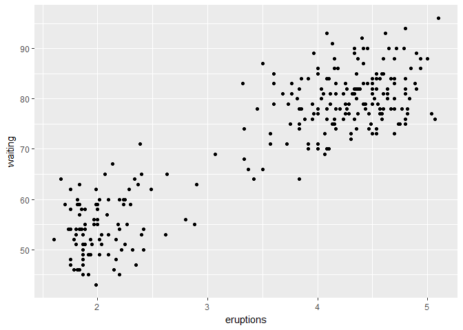

# 05_31_2017
John D.  
May 30, 2017  


```r
library(tidyverse)
```

```
## Loading tidyverse: ggplot2
## Loading tidyverse: tibble
## Loading tidyverse: tidyr
## Loading tidyverse: readr
## Loading tidyverse: purrr
## Loading tidyverse: dplyr
```

```
## Conflicts with tidy packages ----------------------------------------------
```

```
## filter(): dplyr, stats
## lag():    dplyr, stats
```

### 7.6 Patterns and models


```r
ggplot(data = faithful) + 
  geom_point(mapping = aes(x = eruptions, y = waiting))
```

<!-- -->

```r
library(modelr)

mod <- lm(log(price) ~ log(carat), data = diamonds)

diamonds2 <- diamonds %>% 
  add_residuals(mod) %>% 
  mutate(resid = exp(resid))

ggplot(data = diamonds2) + 
  geom_point(mapping = aes(x = carat, y = resid))
```

<!-- -->

```r
ggplot(data = diamonds2) + 
  geom_boxplot(mapping = aes(x = cut, y = resid))
```

<!-- -->

### 7.7 ggplot2 calls


```r
ggplot(data = faithful, mapping = aes(x = eruptions)) + 
  geom_freqpoly(binwidth = 0.25)
```

<!-- -->

```r
ggplot(faithful, aes(eruptions)) + 
  geom_freqpoly(binwidth = 0.25)
```

<!-- -->

```r
diamonds %>% 
  count(cut, clarity) %>% 
  ggplot(aes(clarity, cut, fill = n)) + 
    geom_tile()
```

<!-- -->

### 7.8 Learning more

## 8 Workflow: projects

### 8.1 What is real?

### 8.2 Where does your analysis live?


```r
getwd()
```

```
## [1] "D:/Documents/Rclub-r4ds_John.Davis/R-club-May-31"
```

### 8.3 Paths and directories

### 8.4 RStudio projects


```r
library(tidyverse)

ggplot(diamonds, aes(carat, price)) + 
  geom_hex()
```

<!-- -->

```r
#ggsave("diamonds.pdf")

#write_csv(diamonds, "diamonds.csv")
```

### 8.5 Summary

##9 Introduction

## 10 Tibbles

### 10.1 Introduction

### 10.2 Creating tibbles


```r
iris
```

```
##     Sepal.Length Sepal.Width Petal.Length Petal.Width    Species
## 1            5.1         3.5          1.4         0.2     setosa
## 2            4.9         3.0          1.4         0.2     setosa
## 3            4.7         3.2          1.3         0.2     setosa
## 4            4.6         3.1          1.5         0.2     setosa
## 5            5.0         3.6          1.4         0.2     setosa
## 6            5.4         3.9          1.7         0.4     setosa
## 7            4.6         3.4          1.4         0.3     setosa
## 8            5.0         3.4          1.5         0.2     setosa
## 9            4.4         2.9          1.4         0.2     setosa
## 10           4.9         3.1          1.5         0.1     setosa
## 11           5.4         3.7          1.5         0.2     setosa
## 12           4.8         3.4          1.6         0.2     setosa
## 13           4.8         3.0          1.4         0.1     setosa
## 14           4.3         3.0          1.1         0.1     setosa
## 15           5.8         4.0          1.2         0.2     setosa
## 16           5.7         4.4          1.5         0.4     setosa
## 17           5.4         3.9          1.3         0.4     setosa
## 18           5.1         3.5          1.4         0.3     setosa
## 19           5.7         3.8          1.7         0.3     setosa
## 20           5.1         3.8          1.5         0.3     setosa
## 21           5.4         3.4          1.7         0.2     setosa
## 22           5.1         3.7          1.5         0.4     setosa
## 23           4.6         3.6          1.0         0.2     setosa
## 24           5.1         3.3          1.7         0.5     setosa
## 25           4.8         3.4          1.9         0.2     setosa
## 26           5.0         3.0          1.6         0.2     setosa
## 27           5.0         3.4          1.6         0.4     setosa
## 28           5.2         3.5          1.5         0.2     setosa
## 29           5.2         3.4          1.4         0.2     setosa
## 30           4.7         3.2          1.6         0.2     setosa
## 31           4.8         3.1          1.6         0.2     setosa
## 32           5.4         3.4          1.5         0.4     setosa
## 33           5.2         4.1          1.5         0.1     setosa
## 34           5.5         4.2          1.4         0.2     setosa
## 35           4.9         3.1          1.5         0.2     setosa
## 36           5.0         3.2          1.2         0.2     setosa
## 37           5.5         3.5          1.3         0.2     setosa
## 38           4.9         3.6          1.4         0.1     setosa
## 39           4.4         3.0          1.3         0.2     setosa
## 40           5.1         3.4          1.5         0.2     setosa
## 41           5.0         3.5          1.3         0.3     setosa
## 42           4.5         2.3          1.3         0.3     setosa
## 43           4.4         3.2          1.3         0.2     setosa
## 44           5.0         3.5          1.6         0.6     setosa
## 45           5.1         3.8          1.9         0.4     setosa
## 46           4.8         3.0          1.4         0.3     setosa
## 47           5.1         3.8          1.6         0.2     setosa
## 48           4.6         3.2          1.4         0.2     setosa
## 49           5.3         3.7          1.5         0.2     setosa
## 50           5.0         3.3          1.4         0.2     setosa
## 51           7.0         3.2          4.7         1.4 versicolor
## 52           6.4         3.2          4.5         1.5 versicolor
## 53           6.9         3.1          4.9         1.5 versicolor
## 54           5.5         2.3          4.0         1.3 versicolor
## 55           6.5         2.8          4.6         1.5 versicolor
## 56           5.7         2.8          4.5         1.3 versicolor
## 57           6.3         3.3          4.7         1.6 versicolor
## 58           4.9         2.4          3.3         1.0 versicolor
## 59           6.6         2.9          4.6         1.3 versicolor
## 60           5.2         2.7          3.9         1.4 versicolor
## 61           5.0         2.0          3.5         1.0 versicolor
## 62           5.9         3.0          4.2         1.5 versicolor
## 63           6.0         2.2          4.0         1.0 versicolor
## 64           6.1         2.9          4.7         1.4 versicolor
## 65           5.6         2.9          3.6         1.3 versicolor
## 66           6.7         3.1          4.4         1.4 versicolor
## 67           5.6         3.0          4.5         1.5 versicolor
## 68           5.8         2.7          4.1         1.0 versicolor
## 69           6.2         2.2          4.5         1.5 versicolor
## 70           5.6         2.5          3.9         1.1 versicolor
## 71           5.9         3.2          4.8         1.8 versicolor
## 72           6.1         2.8          4.0         1.3 versicolor
## 73           6.3         2.5          4.9         1.5 versicolor
## 74           6.1         2.8          4.7         1.2 versicolor
## 75           6.4         2.9          4.3         1.3 versicolor
## 76           6.6         3.0          4.4         1.4 versicolor
## 77           6.8         2.8          4.8         1.4 versicolor
## 78           6.7         3.0          5.0         1.7 versicolor
## 79           6.0         2.9          4.5         1.5 versicolor
## 80           5.7         2.6          3.5         1.0 versicolor
## 81           5.5         2.4          3.8         1.1 versicolor
## 82           5.5         2.4          3.7         1.0 versicolor
## 83           5.8         2.7          3.9         1.2 versicolor
## 84           6.0         2.7          5.1         1.6 versicolor
## 85           5.4         3.0          4.5         1.5 versicolor
## 86           6.0         3.4          4.5         1.6 versicolor
## 87           6.7         3.1          4.7         1.5 versicolor
## 88           6.3         2.3          4.4         1.3 versicolor
## 89           5.6         3.0          4.1         1.3 versicolor
## 90           5.5         2.5          4.0         1.3 versicolor
## 91           5.5         2.6          4.4         1.2 versicolor
## 92           6.1         3.0          4.6         1.4 versicolor
## 93           5.8         2.6          4.0         1.2 versicolor
## 94           5.0         2.3          3.3         1.0 versicolor
## 95           5.6         2.7          4.2         1.3 versicolor
## 96           5.7         3.0          4.2         1.2 versicolor
## 97           5.7         2.9          4.2         1.3 versicolor
## 98           6.2         2.9          4.3         1.3 versicolor
## 99           5.1         2.5          3.0         1.1 versicolor
## 100          5.7         2.8          4.1         1.3 versicolor
## 101          6.3         3.3          6.0         2.5  virginica
## 102          5.8         2.7          5.1         1.9  virginica
## 103          7.1         3.0          5.9         2.1  virginica
## 104          6.3         2.9          5.6         1.8  virginica
## 105          6.5         3.0          5.8         2.2  virginica
## 106          7.6         3.0          6.6         2.1  virginica
## 107          4.9         2.5          4.5         1.7  virginica
## 108          7.3         2.9          6.3         1.8  virginica
## 109          6.7         2.5          5.8         1.8  virginica
## 110          7.2         3.6          6.1         2.5  virginica
## 111          6.5         3.2          5.1         2.0  virginica
## 112          6.4         2.7          5.3         1.9  virginica
## 113          6.8         3.0          5.5         2.1  virginica
## 114          5.7         2.5          5.0         2.0  virginica
## 115          5.8         2.8          5.1         2.4  virginica
## 116          6.4         3.2          5.3         2.3  virginica
## 117          6.5         3.0          5.5         1.8  virginica
## 118          7.7         3.8          6.7         2.2  virginica
## 119          7.7         2.6          6.9         2.3  virginica
## 120          6.0         2.2          5.0         1.5  virginica
## 121          6.9         3.2          5.7         2.3  virginica
## 122          5.6         2.8          4.9         2.0  virginica
## 123          7.7         2.8          6.7         2.0  virginica
## 124          6.3         2.7          4.9         1.8  virginica
## 125          6.7         3.3          5.7         2.1  virginica
## 126          7.2         3.2          6.0         1.8  virginica
## 127          6.2         2.8          4.8         1.8  virginica
## 128          6.1         3.0          4.9         1.8  virginica
## 129          6.4         2.8          5.6         2.1  virginica
## 130          7.2         3.0          5.8         1.6  virginica
## 131          7.4         2.8          6.1         1.9  virginica
## 132          7.9         3.8          6.4         2.0  virginica
## 133          6.4         2.8          5.6         2.2  virginica
## 134          6.3         2.8          5.1         1.5  virginica
## 135          6.1         2.6          5.6         1.4  virginica
## 136          7.7         3.0          6.1         2.3  virginica
## 137          6.3         3.4          5.6         2.4  virginica
## 138          6.4         3.1          5.5         1.8  virginica
## 139          6.0         3.0          4.8         1.8  virginica
## 140          6.9         3.1          5.4         2.1  virginica
## 141          6.7         3.1          5.6         2.4  virginica
## 142          6.9         3.1          5.1         2.3  virginica
## 143          5.8         2.7          5.1         1.9  virginica
## 144          6.8         3.2          5.9         2.3  virginica
## 145          6.7         3.3          5.7         2.5  virginica
## 146          6.7         3.0          5.2         2.3  virginica
## 147          6.3         2.5          5.0         1.9  virginica
## 148          6.5         3.0          5.2         2.0  virginica
## 149          6.2         3.4          5.4         2.3  virginica
## 150          5.9         3.0          5.1         1.8  virginica
```

```r
as_tibble(iris)
```

```
## # A tibble: 150 x 5
##    Sepal.Length Sepal.Width Petal.Length Petal.Width Species
##           <dbl>       <dbl>        <dbl>       <dbl>  <fctr>
##  1          5.1         3.5          1.4         0.2  setosa
##  2          4.9         3.0          1.4         0.2  setosa
##  3          4.7         3.2          1.3         0.2  setosa
##  4          4.6         3.1          1.5         0.2  setosa
##  5          5.0         3.6          1.4         0.2  setosa
##  6          5.4         3.9          1.7         0.4  setosa
##  7          4.6         3.4          1.4         0.3  setosa
##  8          5.0         3.4          1.5         0.2  setosa
##  9          4.4         2.9          1.4         0.2  setosa
## 10          4.9         3.1          1.5         0.1  setosa
## # ... with 140 more rows
```

```r
tibble(
  x = 1:5, 
  y = 1, 
  z = x ^ 2 + y
)
```

```
## # A tibble: 5 x 3
##       x     y     z
##   <int> <dbl> <dbl>
## 1     1     1     2
## 2     2     1     5
## 3     3     1    10
## 4     4     1    17
## 5     5     1    26
```

```r
tb <- tibble(
  `:)` = "smile", 
  ` ` = "space",
  `2000` = "number"
)
tb
```

```
## # A tibble: 1 x 3
##    `:)`   ` ` `2000`
##   <chr> <chr>  <chr>
## 1 smile space number
```

```r
tribble(
  ~x, ~y, ~z,
  #--|--|----
  "a", 2, 3.6,
  "b", 1, 8.5
)
```

```
## # A tibble: 2 x 3
##       x     y     z
##   <chr> <dbl> <dbl>
## 1     a     2   3.6
## 2     b     1   8.5
```

### 10.3 Tibbles vs. data.frame

### 10.3.1 Printing


```r
tibble(
  a = lubridate::now() + runif(1e3) * 86400,
  b = lubridate::today() + runif(1e3) * 30,
  c = 1:1e3,
  d = runif(1e3),
  e = sample(letters, 1e3, replace = TRUE)
)
```

```
## # A tibble: 1,000 x 5
##                      a          b     c          d     e
##                 <dttm>     <date> <int>      <dbl> <chr>
##  1 2017-05-31 00:07:01 2017-06-22     1 0.42289427     b
##  2 2017-05-30 19:15:18 2017-06-03     2 0.52605915     h
##  3 2017-05-31 13:14:58 2017-06-16     3 0.90421192     x
##  4 2017-05-30 19:59:49 2017-06-21     4 0.48607170     z
##  5 2017-05-30 19:34:47 2017-06-12     5 0.80927277     z
##  6 2017-05-30 16:03:17 2017-06-03     6 0.68071669     c
##  7 2017-05-31 10:17:17 2017-05-30     7 0.28861006     d
##  8 2017-05-31 01:15:13 2017-06-08     8 0.22225129     b
##  9 2017-05-31 10:43:55 2017-06-12     9 0.41265855     b
## 10 2017-05-31 15:09:02 2017-06-17    10 0.07157656     y
## # ... with 990 more rows
```

```r
nycflights13::flights %>% 
  print(n = 10, width = Inf)
```

```
## # A tibble: 336,776 x 19
##     year month   day dep_time sched_dep_time dep_delay arr_time sched_arr_time arr_delay carrier flight tailnum origin  dest air_time distance  hour minute           time_hour
##    <int> <int> <int>    <int>          <int>     <dbl>    <int>          <int>     <dbl>   <chr>  <int>   <chr>  <chr> <chr>    <dbl>    <dbl> <dbl>  <dbl>              <dttm>
##  1  2013     1     1      517            515         2      830            819        11      UA   1545  N14228    EWR   IAH      227     1400     5     15 2013-01-01 05:00:00
##  2  2013     1     1      533            529         4      850            830        20      UA   1714  N24211    LGA   IAH      227     1416     5     29 2013-01-01 05:00:00
##  3  2013     1     1      542            540         2      923            850        33      AA   1141  N619AA    JFK   MIA      160     1089     5     40 2013-01-01 05:00:00
##  4  2013     1     1      544            545        -1     1004           1022       -18      B6    725  N804JB    JFK   BQN      183     1576     5     45 2013-01-01 05:00:00
##  5  2013     1     1      554            600        -6      812            837       -25      DL    461  N668DN    LGA   ATL      116      762     6      0 2013-01-01 06:00:00
##  6  2013     1     1      554            558        -4      740            728        12      UA   1696  N39463    EWR   ORD      150      719     5     58 2013-01-01 05:00:00
##  7  2013     1     1      555            600        -5      913            854        19      B6    507  N516JB    EWR   FLL      158     1065     6      0 2013-01-01 06:00:00
##  8  2013     1     1      557            600        -3      709            723       -14      EV   5708  N829AS    LGA   IAD       53      229     6      0 2013-01-01 06:00:00
##  9  2013     1     1      557            600        -3      838            846        -8      B6     79  N593JB    JFK   MCO      140      944     6      0 2013-01-01 06:00:00
## 10  2013     1     1      558            600        -2      753            745         8      AA    301  N3ALAA    LGA   ORD      138      733     6      0 2013-01-01 06:00:00
## # ... with 3.368e+05 more rows
```

```r
nycflights13::flights %>% 
  View()
```

### 10.3.2 Subsetting


```r
df <- tibble(
  x = runif(5),
  y = rnorm(5)
)

df$x
```

```
## [1] 0.9781658 0.2720591 0.4963037 0.3388548 0.6639206
```

```r
df[["x"]]
```

```
## [1] 0.9781658 0.2720591 0.4963037 0.3388548 0.6639206
```

```r
df[[1]]
```

```
## [1] 0.9781658 0.2720591 0.4963037 0.3388548 0.6639206
```

```r
df %>% .$x
```

```
## [1] 0.9781658 0.2720591 0.4963037 0.3388548 0.6639206
```

```r
df %>% .[["x"]]
```

```
## [1] 0.9781658 0.2720591 0.4963037 0.3388548 0.6639206
```

### 10.4 Interacting with older code


```r
#class(as.data.frame(tb))
```

### 10.5 Exercises

1. How can you tell if an object is a tibble? (Hint: try printing mtcars, which is a regular data frame)


```r
print(mtcars)
```

```
##                      mpg cyl  disp  hp drat    wt  qsec vs am gear carb
## Mazda RX4           21.0   6 160.0 110 3.90 2.620 16.46  0  1    4    4
## Mazda RX4 Wag       21.0   6 160.0 110 3.90 2.875 17.02  0  1    4    4
## Datsun 710          22.8   4 108.0  93 3.85 2.320 18.61  1  1    4    1
## Hornet 4 Drive      21.4   6 258.0 110 3.08 3.215 19.44  1  0    3    1
## Hornet Sportabout   18.7   8 360.0 175 3.15 3.440 17.02  0  0    3    2
## Valiant             18.1   6 225.0 105 2.76 3.460 20.22  1  0    3    1
## Duster 360          14.3   8 360.0 245 3.21 3.570 15.84  0  0    3    4
## Merc 240D           24.4   4 146.7  62 3.69 3.190 20.00  1  0    4    2
## Merc 230            22.8   4 140.8  95 3.92 3.150 22.90  1  0    4    2
## Merc 280            19.2   6 167.6 123 3.92 3.440 18.30  1  0    4    4
## Merc 280C           17.8   6 167.6 123 3.92 3.440 18.90  1  0    4    4
## Merc 450SE          16.4   8 275.8 180 3.07 4.070 17.40  0  0    3    3
## Merc 450SL          17.3   8 275.8 180 3.07 3.730 17.60  0  0    3    3
## Merc 450SLC         15.2   8 275.8 180 3.07 3.780 18.00  0  0    3    3
## Cadillac Fleetwood  10.4   8 472.0 205 2.93 5.250 17.98  0  0    3    4
## Lincoln Continental 10.4   8 460.0 215 3.00 5.424 17.82  0  0    3    4
## Chrysler Imperial   14.7   8 440.0 230 3.23 5.345 17.42  0  0    3    4
## Fiat 128            32.4   4  78.7  66 4.08 2.200 19.47  1  1    4    1
## Honda Civic         30.4   4  75.7  52 4.93 1.615 18.52  1  1    4    2
## Toyota Corolla      33.9   4  71.1  65 4.22 1.835 19.90  1  1    4    1
## Toyota Corona       21.5   4 120.1  97 3.70 2.465 20.01  1  0    3    1
## Dodge Challenger    15.5   8 318.0 150 2.76 3.520 16.87  0  0    3    2
## AMC Javelin         15.2   8 304.0 150 3.15 3.435 17.30  0  0    3    2
## Camaro Z28          13.3   8 350.0 245 3.73 3.840 15.41  0  0    3    4
## Pontiac Firebird    19.2   8 400.0 175 3.08 3.845 17.05  0  0    3    2
## Fiat X1-9           27.3   4  79.0  66 4.08 1.935 18.90  1  1    4    1
## Porsche 914-2       26.0   4 120.3  91 4.43 2.140 16.70  0  1    5    2
## Lotus Europa        30.4   4  95.1 113 3.77 1.513 16.90  1  1    5    2
## Ford Pantera L      15.8   8 351.0 264 4.22 3.170 14.50  0  1    5    4
## Ferrari Dino        19.7   6 145.0 175 3.62 2.770 15.50  0  1    5    6
## Maserati Bora       15.0   8 301.0 335 3.54 3.570 14.60  0  1    5    8
## Volvo 142E          21.4   4 121.0 109 4.11 2.780 18.60  1  1    4    2
```

```r
print(as_tibble(mtcars))
```

```
## # A tibble: 32 x 11
##      mpg   cyl  disp    hp  drat    wt  qsec    vs    am  gear  carb
##  * <dbl> <dbl> <dbl> <dbl> <dbl> <dbl> <dbl> <dbl> <dbl> <dbl> <dbl>
##  1  21.0     6 160.0   110  3.90 2.620 16.46     0     1     4     4
##  2  21.0     6 160.0   110  3.90 2.875 17.02     0     1     4     4
##  3  22.8     4 108.0    93  3.85 2.320 18.61     1     1     4     1
##  4  21.4     6 258.0   110  3.08 3.215 19.44     1     0     3     1
##  5  18.7     8 360.0   175  3.15 3.440 17.02     0     0     3     2
##  6  18.1     6 225.0   105  2.76 3.460 20.22     1     0     3     1
##  7  14.3     8 360.0   245  3.21 3.570 15.84     0     0     3     4
##  8  24.4     4 146.7    62  3.69 3.190 20.00     1     0     4     2
##  9  22.8     4 140.8    95  3.92 3.150 22.90     1     0     4     2
## 10  19.2     6 167.6   123  3.92 3.440 18.30     1     0     4     4
## # ... with 22 more rows
```

```r
a <- mtcars
b <- as_tibble(mtcars)
class(a)
```

```
## [1] "data.frame"
```

```r
class(b)
```

```
## [1] "tbl_df"     "tbl"        "data.frame"
```

It says "tibble" at the top if it is actually a tibble. Also the default number or rows printed in lower with tibbles. The class of a tibble includes "tbl"and "tbl_df".

2. Compare and contrast the following operations on a data.frame and equivalent tibble. What is different? Why might the default data frame behaviours cause you frustration?


```r
df <- data.frame(abc = 1, xyz = "a")
df$x
```

```
## [1] a
## Levels: a
```

```r
df[, "xyz"]
```

```
## [1] a
## Levels: a
```

```r
df[, c("abc", "xyz")]
```

```
##   abc xyz
## 1   1   a
```

```r
tdf <- as_tibble(data.frame(abc = 1, xyz = "a"))
#tdf$x
# ^^ Will not run
tdf[, "xyz"]
```

```
## # A tibble: 1 x 1
##      xyz
##   <fctr>
## 1      a
```

```r
tdf[, c("abc", "xyz")]
```

```
## # A tibble: 1 x 2
##     abc    xyz
##   <dbl> <fctr>
## 1     1      a
```

With a dataframe, it will match if the pattern is contained is at the start, but does not match for exact patterns. Can cause you to include more columns than you want when subsetting.

3. If you have the name of a variable stored in an object, e.g. var <- "mpg", how can you extract the reference variable from a tibble?


```r
tdf
```

```
## # A tibble: 1 x 2
##     abc    xyz
##   <dbl> <fctr>
## 1     1      a
```

```r
var <- "xyz"
tdf[var]
```

```
## # A tibble: 1 x 1
##      xyz
##   <fctr>
## 1      a
```

```r
tdf %>% .[var]
```

```
## # A tibble: 1 x 1
##      xyz
##   <fctr>
## 1      a
```

4. Practice referring to non-syntactic names in the following data frame by:
    1.  Extracting the variable called `1`.
    2.  Plotting a scatterplot of `1` vs `2`.
    3. Creating a new column called 3 which is 2 divided by 1
    4. Renaming the columns to one, two and three
    

```r
annoying <- tibble(
  `1` = 1:10,
  `2` = `1` * 2 + rnorm(length(`1`))
)
annoying
```

```
## # A tibble: 10 x 2
##      `1`       `2`
##    <int>     <dbl>
##  1     1  2.972225
##  2     2  4.455699
##  3     3  7.886513
##  4     4  7.826334
##  5     5  9.171550
##  6     6 12.917535
##  7     7 12.144841
##  8     8 15.416549
##  9     9 18.621207
## 10    10 19.053686
```

```r
#1
annoying$`1`
```

```
##  [1]  1  2  3  4  5  6  7  8  9 10
```

```r
annoying[["1"]]
```

```
##  [1]  1  2  3  4  5  6  7  8  9 10
```

```r
#2
ggplot(annoying, aes(`1`,`2`)) + geom_point()
```

<!-- -->

```r
#3
annoying$`3` <- annoying$`2` / annoying$`1`
annoying
```

```
## # A tibble: 10 x 3
##      `1`       `2`      `3`
##    <int>     <dbl>    <dbl>
##  1     1  2.972225 2.972225
##  2     2  4.455699 2.227849
##  3     3  7.886513 2.628838
##  4     4  7.826334 1.956583
##  5     5  9.171550 1.834310
##  6     6 12.917535 2.152923
##  7     7 12.144841 1.734977
##  8     8 15.416549 1.927069
##  9     9 18.621207 2.069023
## 10    10 19.053686 1.905369
```

```r
#4
rename(annoying, one = `1`, two = `2`, three = `3`)
```

```
## # A tibble: 10 x 3
##      one       two    three
##    <int>     <dbl>    <dbl>
##  1     1  2.972225 2.972225
##  2     2  4.455699 2.227849
##  3     3  7.886513 2.628838
##  4     4  7.826334 1.956583
##  5     5  9.171550 1.834310
##  6     6 12.917535 2.152923
##  7     7 12.144841 1.734977
##  8     8 15.416549 1.927069
##  9     9 18.621207 2.069023
## 10    10 19.053686 1.905369
```

```r
#or
(colnames(annoying) <- c("one","two","three"))
```

```
## [1] "one"   "two"   "three"
```

5. What does `tibble::enframe()` do? When might you use it?


```r
?enframe
```

```
## starting httpd help server ...
```

```
##  done
```

```r
As <- c("a","a","A")
Bs <- c("B","b","b")
enframe(c(As,Bs))
```

```
## # A tibble: 6 x 2
##    name value
##   <int> <chr>
## 1     1     a
## 2     2     a
## 3     3     A
## 4     4     B
## 5     5     b
## 6     6     b
```

```r
enframe(c(a = 5, b = 7))
```

```
## # A tibble: 2 x 2
##    name value
##   <chr> <dbl>
## 1     a     5
## 2     b     7
```

```r
deframe(df)
```

```
## 1 
## a 
## Levels: a
```

`enframe()` converts named atomic vectors or lists to two-column data frames. For unnamed vectors, the natural sequence is used as name column. Convienient for creating tibbles quicking using vectors.

6. What option controls how many additional column names are printed at the footer of a tibble?


```r
#options(tibble.width = Inf)

# or

# nycflights13::flights %>% 
#  print(n = 10, width = Inf)
```

