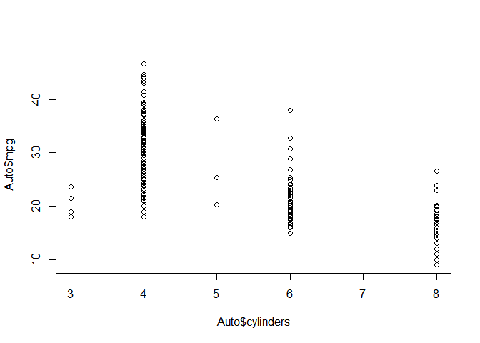
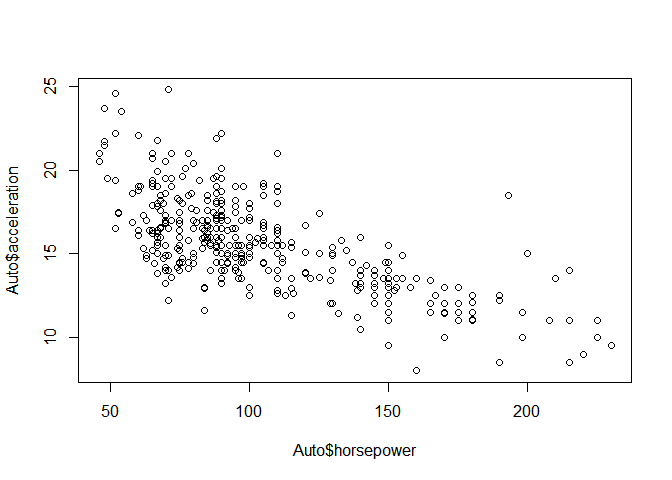
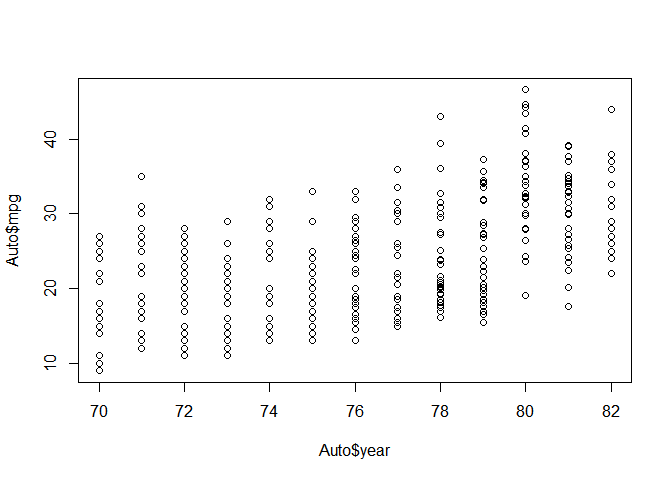
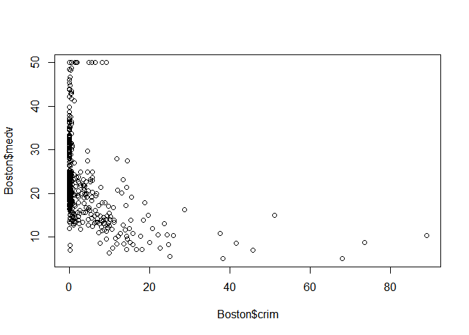
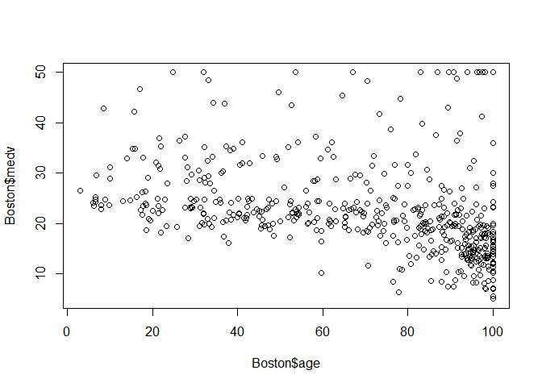
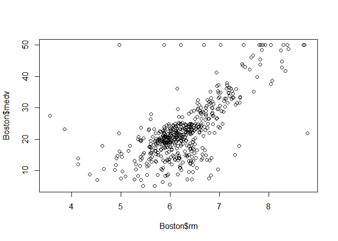
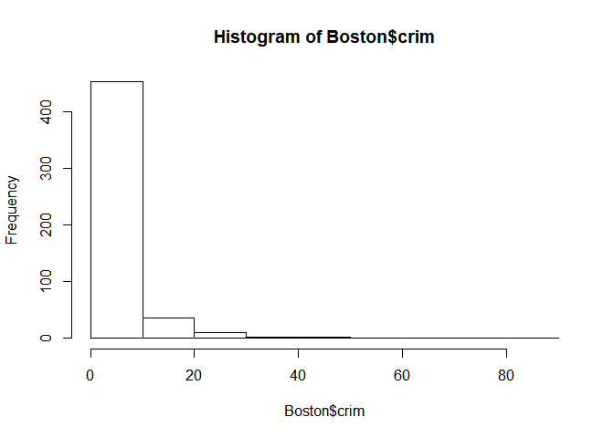
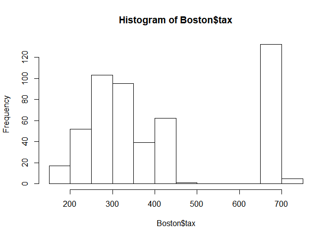
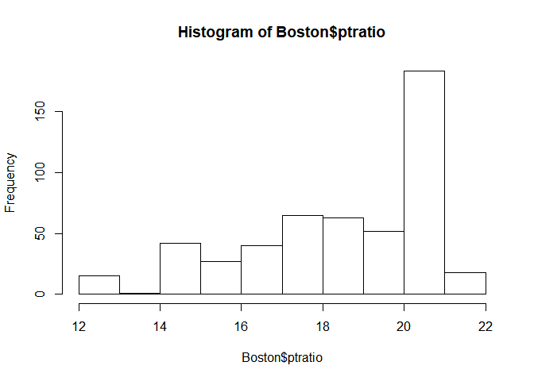

2. Explain whether each scenario is a classification or regression problem,and indicate whether we are most interested in inference or prediction. Finally, provide n and p.

(a) We collect a set of data on the top 500 firms in the US. For each firm we record profit, number of employees, industry and the CEO salary. We are interested in understanding which factors affect CEO salary.

Regression, inference, n = 500, p = (profit, # of employees, industry)

(b) We are considering launching a new product and wish to know whether it will be a success or a failure. We collect data on 20 similar products that were previously launched. For each product we have recorded whether it was a success or failure, price charged for the product, marketing budget, competition price, and ten other variables.

Classification, prediction, n = 20, p = (price charged for the product, marketing budget, competition price, and ten other variables)

(c) We are interest in predicting the % change in the USD/Euro exchange rate in relation to the weekly changes in the world stock markets. Hence we collect weekly data for all of 2012. For each week we record the % change in the USD/Euro, the % change in the US market, the % change in the British market, and the % change in the German market.

Regression, prediction, n = 52, p = (the % change in the US market, the % change in the British market, and the % change in the German market)

7. The table below provides a training data set containing six observations, three predictors, and one qualitative response variable. Suppose we wish to use this data set to make a prediction for Y when
X1 = X2 = X3 = 0 using K-nearest neighbors.


```r
library(fields)
```

```
## Loading required package: spam
```

```
## Loading required package: dotCall64
```

```
## Loading required package: grid
```

```
## Spam version 2.1-1 (2017-07-02) is loaded.
## Type 'help( Spam)' or 'demo( spam)' for a short introduction 
## and overview of this package.
## Help for individual functions is also obtained by adding the
## suffix '.spam' to the function name, e.g. 'help( chol.spam)'.
```

```
## 
## Attaching package: 'spam'
```

```
## The following objects are masked from 'package:base':
## 
##     backsolve, forwardsolve
```

```
## Loading required package: maps
```

```r
mat <- matrix(c(0,2,0,0,-1,1,3,0,1,1,0,1,0,0,3,2,1,1,"Red","Red","Red","Green","Green","Red"), nrow = 6)
```

(a) Compute the Euclidean distance between each observation and the test point, X1 = X2 = X3 = 0.


```r
unknown <- matrix(c(0,0,0,NA), nrow = 1)
combined <- rbind(mat,unknown)
combined
```

```
##      [,1] [,2] [,3] [,4]   
## [1,] "0"  "3"  "0"  "Red"  
## [2,] "2"  "0"  "0"  "Red"  
## [3,] "0"  "1"  "3"  "Red"  
## [4,] "0"  "1"  "2"  "Green"
## [5,] "-1" "0"  "1"  "Green"
## [6,] "1"  "1"  "1"  "Red"  
## [7,] "0"  "0"  "0"  NA
```

```r
dist(combined[,1:3])
```

```
##          1        2        3        4        5        6
## 2 3.605551                                             
## 3 3.605551 3.741657                                    
## 4 2.828427 3.000000 1.000000                           
## 5 3.316625 3.162278 2.449490 1.732051                  
## 6 2.449490 1.732051 2.236068 1.414214 2.236068         
## 7 3.000000 2.000000 3.162278 2.236068 1.414214 1.732051
```

(b) What is our prediction with K = 1? Why?

Green because observation 5 is the closest.

(c) What is our prediction with K = 3? Why?

Red because 2 neighbors are Red and one is Green

(d) If the Bayes decision boundary in this problem is highly nonlinear, then would we expect the best value for K to be large or small? Why?

A smaller value of K is better. With a larger K the Bayes decision boundary becomes more linear, which is not what we want.

9. This exercise involves the Auto data set studied in the lab. Make surethat the missing values have been removed from the data


```r
library(ISLR)
Auto <- Auto
summary(Auto)
```

```
##       mpg          cylinders      displacement     horsepower   
##  Min.   : 9.00   Min.   :3.000   Min.   : 68.0   Min.   : 46.0  
##  1st Qu.:17.00   1st Qu.:4.000   1st Qu.:105.0   1st Qu.: 75.0  
##  Median :22.75   Median :4.000   Median :151.0   Median : 93.5  
##  Mean   :23.45   Mean   :5.472   Mean   :194.4   Mean   :104.5  
##  3rd Qu.:29.00   3rd Qu.:8.000   3rd Qu.:275.8   3rd Qu.:126.0  
##  Max.   :46.60   Max.   :8.000   Max.   :455.0   Max.   :230.0  
##                                                                 
##      weight      acceleration        year           origin     
##  Min.   :1613   Min.   : 8.00   Min.   :70.00   Min.   :1.000  
##  1st Qu.:2225   1st Qu.:13.78   1st Qu.:73.00   1st Qu.:1.000  
##  Median :2804   Median :15.50   Median :76.00   Median :1.000  
##  Mean   :2978   Mean   :15.54   Mean   :75.98   Mean   :1.577  
##  3rd Qu.:3615   3rd Qu.:17.02   3rd Qu.:79.00   3rd Qu.:2.000  
##  Max.   :5140   Max.   :24.80   Max.   :82.00   Max.   :3.000  
##                                                                
##                  name    
##  amc matador       :  5  
##  ford pinto        :  5  
##  toyota corolla    :  5  
##  amc gremlin       :  4  
##  amc hornet        :  4  
##  chevrolet chevette:  4  
##  (Other)           :365
```

(a) Which of the predictors are quantitative, and which are qualitative?

Quantitative: mpg, displacement, horsepower, weight, acceleration
Qualitative: cylinders, year, origin, name

(b) What is the range of each quantitative predictor? You can answer this using the range() function.

```r
quant <- c("mpg", "displacement", "horsepower", "weight", "acceleration")
sapply(quant, function(x) range(Auto[,x]))
```

```
##       mpg displacement horsepower weight acceleration
## [1,]  9.0           68         46   1613          8.0
## [2,] 46.6          455        230   5140         24.8
```

(c) What is the mean and standard deviation of each quantitative
predictor?


```r
sapply(quant, function(x) summary(Auto[,x]))
```

```
##              mpg displacement horsepower   weight acceleration
## Min.     9.00000       68.000    46.0000 1613.000      8.00000
## 1st Qu. 17.00000      105.000    75.0000 2225.250     13.77500
## Median  22.75000      151.000    93.5000 2803.500     15.50000
## Mean    23.44592      194.412   104.4694 2977.584     15.54133
## 3rd Qu. 29.00000      275.750   126.0000 3614.750     17.02500
## Max.    46.60000      455.000   230.0000 5140.000     24.80000
```

```r
sapply(quant, function(x) mean(Auto[,x]))
```

```
##          mpg displacement   horsepower       weight acceleration 
##     23.44592    194.41199    104.46939   2977.58418     15.54133
```

```r
sapply(quant, function(x) sd(Auto[,x]))
```

```
##          mpg displacement   horsepower       weight acceleration 
##     7.805007   104.644004    38.491160   849.402560     2.758864
```

(d) Now remove the 10th through 85th observations. What is the
range, mean, and standard deviation of each predictor in the
subset of the data that remains?


```r
small_auto <- Auto[-(10:85),]
sapply(quant, function(x) range(small_auto[,x]))
```

```
##       mpg displacement horsepower weight acceleration
## [1,] 11.0           68         46   1649          8.5
## [2,] 46.6          455        230   4997         24.8
```

```r
sapply(quant, function(x) mean(small_auto[,x]))
```

```
##          mpg displacement   horsepower       weight acceleration 
##     24.40443    187.24051    100.72152   2935.97152     15.72690
```

```r
sapply(quant, function(x) sd(small_auto[,x]))
```

```
##          mpg displacement   horsepower       weight acceleration 
##     7.867283    99.678367    35.708853   811.300208     2.693721
```

(e) Using the full data set, investigate the predictors graphically, using scatterplots or other tools of your choice. Create some plots highlighting the relationships among the predictors. Comment on your findings


```r
plot(Auto$cylinders, Auto$mpg)
```

<!-- -->

```r
plot(Auto$horsepower, Auto$acceleration)
```

<!-- -->

```r
plot(Auto$year, Auto$mpg)
```

<!-- -->

(f) Suppose that we wish to predict gas mileage (mpg) on the basis of the other variables. Do your plots suggest that any of the other variables might be useful in predicting mpg? Justify your answer.

Yes, cars which are newer have better mpg. Also cars with less cylinders have better mpg.

10. This exercise involves the Boston housing data set.

(a) To begin, load in the Boston data set. The Boston data set is part of the MASS library in R.


```r
library(MASS)
#Now the data set is contained in the object Boston.
#Boston
#Read about the data set:
#?Boston
```

How many rows are in this data set? How many columns? What do the rows and columns represent?

```r
dim(Boston)
```

```
## [1] 506  14
```

```r
head(Boston)
```

```
##      crim zn indus chas   nox    rm  age    dis rad tax ptratio  black
## 1 0.00632 18  2.31    0 0.538 6.575 65.2 4.0900   1 296    15.3 396.90
## 2 0.02731  0  7.07    0 0.469 6.421 78.9 4.9671   2 242    17.8 396.90
## 3 0.02729  0  7.07    0 0.469 7.185 61.1 4.9671   2 242    17.8 392.83
## 4 0.03237  0  2.18    0 0.458 6.998 45.8 6.0622   3 222    18.7 394.63
## 5 0.06905  0  2.18    0 0.458 7.147 54.2 6.0622   3 222    18.7 396.90
## 6 0.02985  0  2.18    0 0.458 6.430 58.7 6.0622   3 222    18.7 394.12
##   lstat medv
## 1  4.98 24.0
## 2  9.14 21.6
## 3  4.03 34.7
## 4  2.94 33.4
## 5  5.33 36.2
## 6  5.21 28.7
```

Each observation is a suburb of Boston and each column is a measurement of different properties of the surburbs.

Make some pairwise scatterplots of the predictors (columns) in this data set. Describe your findings.


```r
plot(Boston$crim, Boston$medv)
```

<!-- -->

```r
plot(Boston$age, Boston$medv)
```

<!-- -->

```r
plot(Boston$rm, Boston$medv)
```

<!-- -->

(c) Are any of the predictors associated with per capita crime rate? If so, explain the relationship.

Crime rates are higher in places where houses are on average cheaper.

(d) Do any of the suburbs of Boston appear to have particularly high crime rates? Tax rates? Pupil-teacher ratios? Comment on the range of each predictor.


```r
range(Boston$crim)
```

```
## [1]  0.00632 88.97620
```

```r
hist(Boston$crim)
```

<!-- -->

```r
range(Boston$tax)
```

```
## [1] 187 711
```

```r
hist(Boston$tax)
```

<!-- -->

```r
range(Boston$ptratio)
```

```
## [1] 12.6 22.0
```

```r
hist(Boston$ptratio)
```

<!-- -->

The distribution of crime does not look unusual. The distribution of tax has has 2 peaks. Pupils to teachers is majority high with some some that are almost half the average.

(e) How many of the suburbs in this data set bound the Charles river?


```r
sum(Boston$chas == 1)
```

```
## [1] 35
```

(f) What is the median pupil-teacher ratio among the towns in this data set?


```r
median(Boston[Boston$chas == 1,]$ptratio)
```

```
## [1] 17.6
```

(g) Which suburb of Boston has lowest median value of owneroccupied homes? What are the values of the other predictors for that suburb, and how do those values compare to the overall ranges for those predictors? Comment on your findings.


```r
lowest <- Boston[which(Boston$medv == min(Boston$medv)),]
lowest
```

```
##        crim zn indus chas   nox    rm age    dis rad tax ptratio  black
## 399 38.3518  0  18.1    0 0.693 5.453 100 1.4896  24 666    20.2 396.90
## 406 67.9208  0  18.1    0 0.693 5.683 100 1.4254  24 666    20.2 384.97
##     lstat medv
## 399 30.59    5
## 406 22.98    5
```

There are 2 suburbs which are tied for the lowest median value of owneroccupied home. They have higher than average crime, are older houses, and high student to teacher ratios.

(h) In this data set, how many of the suburbs average more than seven rooms per dwelling? More than eight rooms per dwelling? Comment on the suburbs that average more than eight rooms per dwelling.


```r
sum(Boston$rm > 7)
```

```
## [1] 64
```

```r
sum(Boston$rm > 8)
```

```
## [1] 13
```

```r
big <- Boston[Boston$rm > 8,]
summary(big)
```

```
##       crim               zn            indus             chas       
##  Min.   :0.02009   Min.   : 0.00   Min.   : 2.680   Min.   :0.0000  
##  1st Qu.:0.33147   1st Qu.: 0.00   1st Qu.: 3.970   1st Qu.:0.0000  
##  Median :0.52014   Median : 0.00   Median : 6.200   Median :0.0000  
##  Mean   :0.71879   Mean   :13.62   Mean   : 7.078   Mean   :0.1538  
##  3rd Qu.:0.57834   3rd Qu.:20.00   3rd Qu.: 6.200   3rd Qu.:0.0000  
##  Max.   :3.47428   Max.   :95.00   Max.   :19.580   Max.   :1.0000  
##       nox               rm             age             dis       
##  Min.   :0.4161   Min.   :8.034   Min.   : 8.40   Min.   :1.801  
##  1st Qu.:0.5040   1st Qu.:8.247   1st Qu.:70.40   1st Qu.:2.288  
##  Median :0.5070   Median :8.297   Median :78.30   Median :2.894  
##  Mean   :0.5392   Mean   :8.349   Mean   :71.54   Mean   :3.430  
##  3rd Qu.:0.6050   3rd Qu.:8.398   3rd Qu.:86.50   3rd Qu.:3.652  
##  Max.   :0.7180   Max.   :8.780   Max.   :93.90   Max.   :8.907  
##       rad              tax           ptratio          black      
##  Min.   : 2.000   Min.   :224.0   Min.   :13.00   Min.   :354.6  
##  1st Qu.: 5.000   1st Qu.:264.0   1st Qu.:14.70   1st Qu.:384.5  
##  Median : 7.000   Median :307.0   Median :17.40   Median :386.9  
##  Mean   : 7.462   Mean   :325.1   Mean   :16.36   Mean   :385.2  
##  3rd Qu.: 8.000   3rd Qu.:307.0   3rd Qu.:17.40   3rd Qu.:389.7  
##  Max.   :24.000   Max.   :666.0   Max.   :20.20   Max.   :396.9  
##      lstat           medv     
##  Min.   :2.47   Min.   :21.9  
##  1st Qu.:3.32   1st Qu.:41.7  
##  Median :4.14   Median :48.3  
##  Mean   :4.31   Mean   :44.2  
##  3rd Qu.:5.12   3rd Qu.:50.0  
##  Max.   :7.44   Max.   :50.0
```

The suburbs have a lower crime rate, a higher property value, and majority white.
