# 11_08_2017
John D.  
November 8, 2017  


# Modeling final meeting

### 23.1.1 Prerequisites


```r
library(tidyverse)
```

```
## Loading tidyverse: ggplot2
## Loading tidyverse: tibble
## Loading tidyverse: tidyr
## Loading tidyverse: readr
## Loading tidyverse: purrr
## Loading tidyverse: dplyr
```

```
## Conflicts with tidy packages ----------------------------------------------
```

```
## filter(): dplyr, stats
## lag():    dplyr, stats
```

```r
library(modelr)
options(na.action = na.warn)
```

## 23.2 A simple model


```r
ggplot(sim1, aes(x, y)) + 
  geom_point()
```

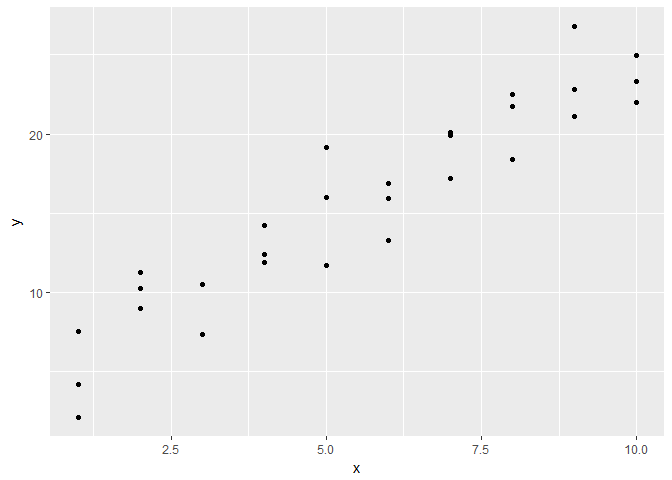<!-- -->

```r
models <- tibble(
  a1 = runif(250, -20, 40),
  a2 = runif(250, -5, 5)
)

ggplot(sim1, aes(x, y)) + 
  geom_abline(aes(intercept = a1, slope = a2), data = models, alpha = 1/4) +
  geom_point()
```

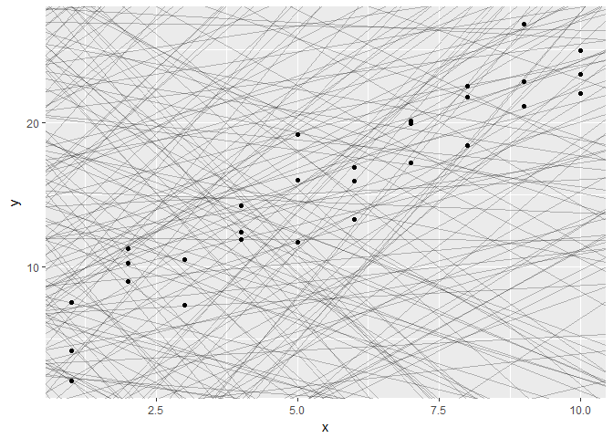<!-- -->

```r
model1 <- function(a, data) {
  a[1] + data$x * a[2]
}
model1(c(7, 1.5), sim1)
```

```
##  [1]  8.5  8.5  8.5 10.0 10.0 10.0 11.5 11.5 11.5 13.0 13.0 13.0 14.5 14.5
## [15] 14.5 16.0 16.0 16.0 17.5 17.5 17.5 19.0 19.0 19.0 20.5 20.5 20.5 22.0
## [29] 22.0 22.0
```

```r
measure_distance <- function(mod, data) {
  diff <- data$y - model1(mod, data)
  sqrt(mean(diff ^ 2))
}
measure_distance(c(7, 1.5), sim1)
```

```
## [1] 2.665212
```

```r
sqrt(mean((sim1$y - model1(c(7, 1.5), sim1))^2))
```

```
## [1] 2.665212
```

```r
sim1_dist <- function(a1, a2) {
  measure_distance(c(a1, a2), sim1)
}

models <- models %>% 
  mutate(dist = purrr::map2_dbl(a1, a2, sim1_dist))
models
```

```
## # A tibble: 250 x 3
##            a1         a2      dist
##         <dbl>      <dbl>     <dbl>
##  1  21.934870  3.8377457 28.092787
##  2   6.542391 -4.3595470 37.797122
##  3  23.459169 -0.8314494  9.194416
##  4 -11.004094  3.6423820  8.205917
##  5 -10.785221 -4.3069068 53.252430
##  6   5.944959  1.1572532  4.618570
##  7  38.669541  3.3701790 41.926967
##  8  -8.178154 -1.1176188 31.259815
##  9  16.893281 -1.5486357 12.738691
## 10   6.671666  0.2060997  9.586489
## # ... with 240 more rows
```

```r
ggplot(sim1, aes(x, y)) + 
  geom_point(size = 2, colour = "grey30") + 
  geom_abline(
    aes(intercept = a1, slope = a2, colour = -dist), 
    data = filter(models, rank(dist) <= 10)
  )
```

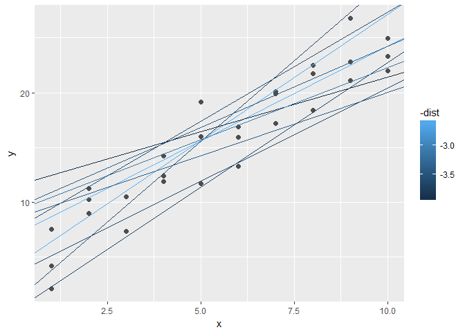<!-- -->

```r
ggplot(models, aes(a1, a2)) +
  geom_point(data = filter(models, rank(dist) <= 10), size = 4, colour = "red") +
  geom_point(aes(colour = -dist))
```

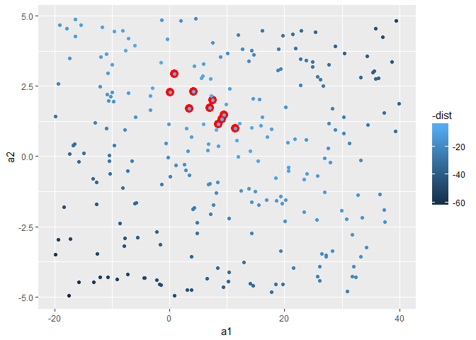<!-- -->

```r
grid <- expand.grid(
  a1 = seq(-5, 20, length = 25),
  a2 = seq(1, 3, length = 25)
  ) %>% 
  mutate(dist = purrr::map2_dbl(a1, a2, sim1_dist))

grid %>% 
  ggplot(aes(a1, a2)) +
  geom_point(data = filter(grid, rank(dist) <= 10), size = 4, colour = "red") +
  geom_point(aes(colour = -dist))
```

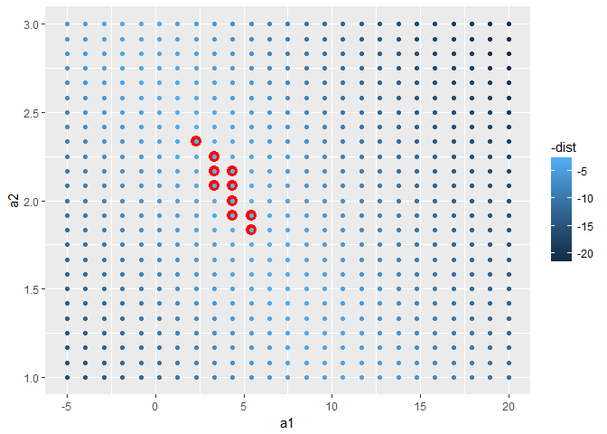<!-- -->

```r
ggplot(sim1, aes(x, y)) + 
  geom_point(size = 2, colour = "grey30") + 
  geom_abline(
    aes(intercept = a1, slope = a2, colour = -dist), 
    data = filter(grid, rank(dist) <= 10)
  )
```

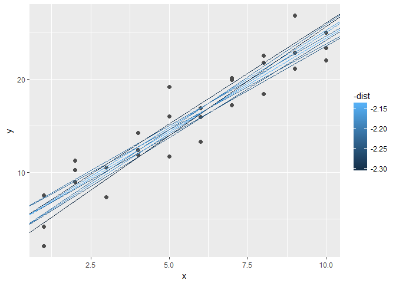<!-- -->

```r
best <- optim(c(0, 0), measure_distance, data = sim1)
best$par
```

```
## [1] 4.222248 2.051204
```

```r
ggplot(sim1, aes(x, y)) + 
  geom_point(size = 2, colour = "grey30") + 
  geom_abline(intercept = best$par[1], slope = best$par[2])
```

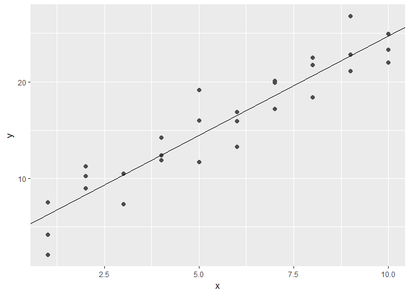<!-- -->

```r
sim1_mod <- lm(y ~ x, data = sim1)
coef(sim1_mod)
```

```
## (Intercept)           x 
##    4.220822    2.051533
```

### 23.2.1 Exercises

1. One downside of the linear model is that it is sensitive to unusual values because the distance incorporates a squared term. Fit a linear model to the simulated data below, and visualise the results. Rerun a few times to generate different simulated datasets. What do you notice about the model?


```r
problem_1 <- function(){sim1a <- tibble(
  x = rep(1:10, each = 3),
  y = x * 1.5 + 6 + rt(length(x), df = 2)
)
sim1a_dist <- function(a1, a2) {
  measure_distance(c(a1, a2), sim1a)
}

models <- models %>% 
  mutate(dist = purrr::map2_dbl(a1, a2, sim1a_dist))
models

best <- optim(c(0, 0), measure_distance, data = sim1a)
best$par
print(best$par)
ggplot(sim1, aes(x, y)) + 
  geom_point(size = 2, colour = "grey30") + 
  geom_abline(
    aes(intercept = a1, slope = a2, colour = -dist), 
    data = filter(models, rank(dist) <= 10)
  )
}

problem_1()
```

```
## [1] 6.739865 1.418659
```

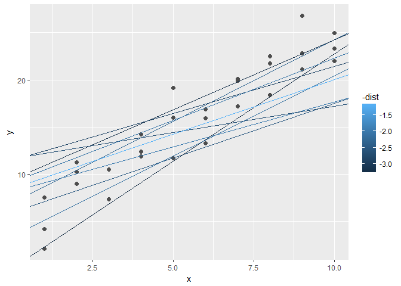<!-- -->

```r
problem_1()
```

```
## [1] 5.895986 1.487445
```

<!-- -->

```r
problem_1()
```

```
## [1] 5.978929 1.500320
```

<!-- -->
You get some really bad models.


2. One way to make linear models more robust is to use a different distance measure. For example, instead of root-mean-squared distance, you could use mean-absolute distance:


```r
measure_distance <- function(mod, data) {
  diff <- data$y - model1(mod, data)
  mean(abs(diff))
}

problem_1()
```

```
## [1] 6.065959 1.516633
```

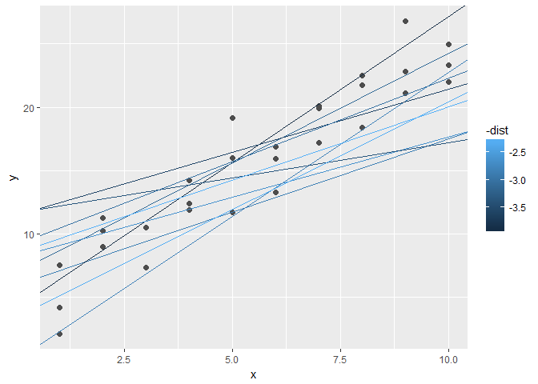<!-- -->
Use `optim()` to fit this model to the simulated data above and compare it to the linear model.


3. One challenge with performing numerical optimisation is that it’s only guaranteed to find one local optima. What’s the problem with optimising a three parameter model like this?


```r
model1 <- function(a, data) {
  a[1] + data$x * a[2] + a[3]
}
```
Infinite number of possible combinations for a[1] and a[3]

## 23.3 Visualising models

### 23.3.1 Predictions


```r
grid <- sim1 %>% 
  data_grid(x) 
grid
```

```
## # A tibble: 10 x 1
##        x
##    <int>
##  1     1
##  2     2
##  3     3
##  4     4
##  5     5
##  6     6
##  7     7
##  8     8
##  9     9
## 10    10
```

```r
grid <- grid %>% 
  add_predictions(sim1_mod) 
grid
```

```
## # A tibble: 10 x 2
##        x      pred
##    <int>     <dbl>
##  1     1  6.272355
##  2     2  8.323888
##  3     3 10.375421
##  4     4 12.426954
##  5     5 14.478487
##  6     6 16.530020
##  7     7 18.581553
##  8     8 20.633087
##  9     9 22.684620
## 10    10 24.736153
```

```r
ggplot(sim1, aes(x)) +
  geom_point(aes(y = y)) +
  geom_line(aes(y = pred), data = grid, colour = "red", size = 1)
```

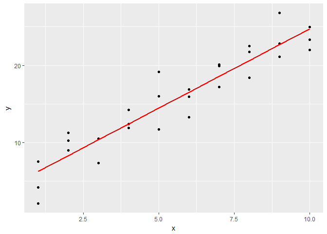<!-- -->

### 23.3.2 Residuals


```r
sim1 <- sim1 %>% 
  add_residuals(sim1_mod)
sim1
```

```
## # A tibble: 30 x 3
##        x         y        resid
##    <int>     <dbl>        <dbl>
##  1     1  4.199913 -2.072442018
##  2     1  7.510634  1.238279125
##  3     1  2.125473 -4.146882207
##  4     2  8.988857  0.664969362
##  5     2 10.243105  1.919217378
##  6     2 11.296823  2.972935148
##  7     3  7.356365 -3.019056466
##  8     3 10.505349  0.129928252
##  9     3 10.511601  0.136179642
## 10     4 12.434589  0.007634878
## # ... with 20 more rows
```

```r
ggplot(sim1, aes(resid)) + 
  geom_freqpoly(binwidth = 0.5)
```

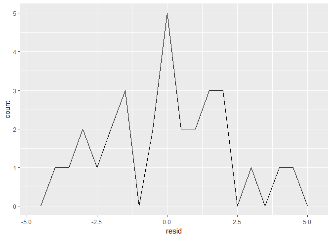<!-- -->

```r
ggplot(sim1, aes(x, resid)) + 
  geom_ref_line(h = 0) +
  geom_point() 
```

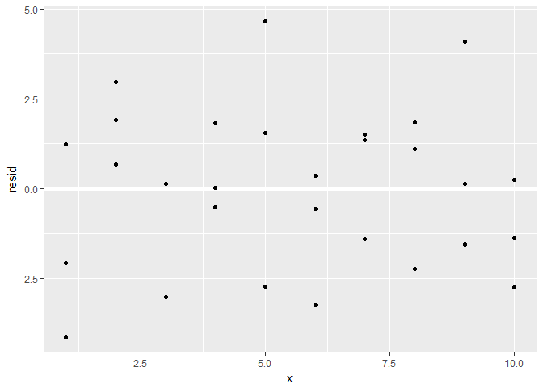<!-- -->

### 23.3.3 Exercises

1. Instead of using `lm()` to fit a straight line, you can use `loess()` to fit a smooth curve. Repeat the process of model fitting, grid generation, predictions, and visualisation on `sim1` using `loess()` instead of `lm()`. How does the result compare to `geom_smooth()`?


```r
rm(sim1)

grid <- sim1 %>% 
  data_grid(x) 
grid
```

```
## # A tibble: 10 x 1
##        x
##    <int>
##  1     1
##  2     2
##  3     3
##  4     4
##  5     5
##  6     6
##  7     7
##  8     8
##  9     9
## 10    10
```

```r
sim1_mod_a <- lm(y ~ x, data = sim1)
sim1_mod_b <- loess(y ~ x, data = sim1)


grid <- grid %>% 
  add_predictions(sim1_mod_a, var = "lm")
grid <- grid %>% 
  add_predictions(sim1_mod_b, var = "loess")
grid
```

```
## # A tibble: 10 x 3
##        x        lm     loess
##    <int>     <dbl>     <dbl>
##  1     1  6.272355  5.338000
##  2     2  8.323888  8.274913
##  3     3 10.375421 10.809582
##  4     4 12.426954 12.779762
##  5     5 14.478487 14.569125
##  6     6 16.530020 16.608674
##  7     7 18.581553 18.659348
##  8     8 20.633087 20.815760
##  9     9 22.684620 22.583429
## 10    10 24.736153 23.979611
```

```r
# plot

ggplot(sim1, aes(x)) +
  geom_point(aes(y = y)) +
  geom_line(aes(y = lm), data = grid, colour = "red", size = 1) +
  geom_line(aes(y = loess), data = grid, colour = "blue", size = 1)
```

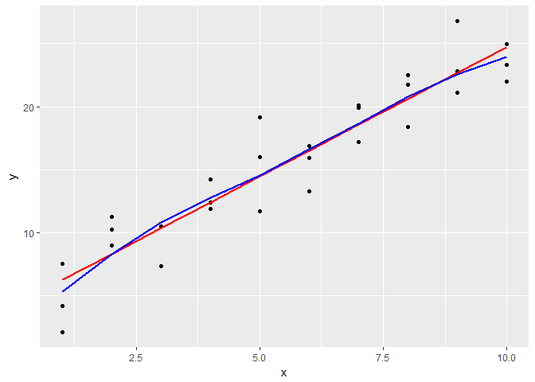<!-- -->

```r
ggplot(sim1, aes(x)) +
  geom_point(aes(y = y)) +
  geom_line(aes(y = lm), data = grid, colour = "red", size = 1) +
  geom_line(aes(y = loess), data = grid, colour = "darkblue", size = 3) +
  geom_smooth(aes(y = y), colour = "lightblue", size = 1)
```

```
## `geom_smooth()` using method = 'loess'
```

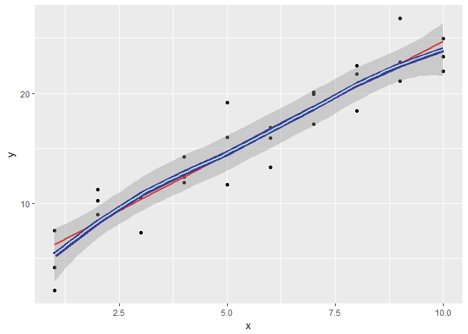<!-- -->

```r
# redo with functions listed in problem 2

grid <- sim1 %>% 
  data_grid(x) 
grid
```

```
## # A tibble: 10 x 1
##        x
##    <int>
##  1     1
##  2     2
##  3     3
##  4     4
##  5     5
##  6     6
##  7     7
##  8     8
##  9     9
## 10    10
```

```r
sim1_lm <- lm(y ~ x, data = sim1)
sim1_loess <- loess(y ~ x, data = sim1)

grid <- grid %>% gather_predictions(sim1_lm,sim1_loess)
grid
```

```
## # A tibble: 20 x 3
##         model     x      pred
##         <chr> <int>     <dbl>
##  1    sim1_lm     1  6.272355
##  2    sim1_lm     2  8.323888
##  3    sim1_lm     3 10.375421
##  4    sim1_lm     4 12.426954
##  5    sim1_lm     5 14.478487
##  6    sim1_lm     6 16.530020
##  7    sim1_lm     7 18.581553
##  8    sim1_lm     8 20.633087
##  9    sim1_lm     9 22.684620
## 10    sim1_lm    10 24.736153
## 11 sim1_loess     1  5.338000
## 12 sim1_loess     2  8.274913
## 13 sim1_loess     3 10.809582
## 14 sim1_loess     4 12.779762
## 15 sim1_loess     5 14.569125
## 16 sim1_loess     6 16.608674
## 17 sim1_loess     7 18.659348
## 18 sim1_loess     8 20.815760
## 19 sim1_loess     9 22.583429
## 20 sim1_loess    10 23.979611
```

```r
ggplot(sim1, aes(x)) +
  geom_point(aes(y = y)) +
  geom_line(aes(y = pred, color = model), data = grid, size = 1)
```

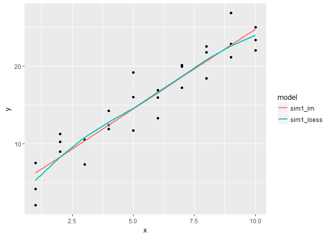<!-- -->

`geom_smooth()` fits a line using the model method 'loess'. They overlap

2. `add_predictions()` is paired with `gather_predictions()` and `spread_predictions()`. How do these three functions differ?

All work on a data frame. `add_prediction()` adds a single new column, default name 'pred', to the input data frame. `spread_predictions()` adds one column for each model. `gather_prections()` adds two columns .model and .pred, and repeats the input rows for each model. `gather_prections()` very useful for visualizing multiple lines on the same plot with labels.


```r
df <- tibble::data_frame(
  x = sort(runif(100)),
  y = 5 * x + 0.5 * x ^ 2 + 3 + rnorm(length(x))
)
plot(df)
```

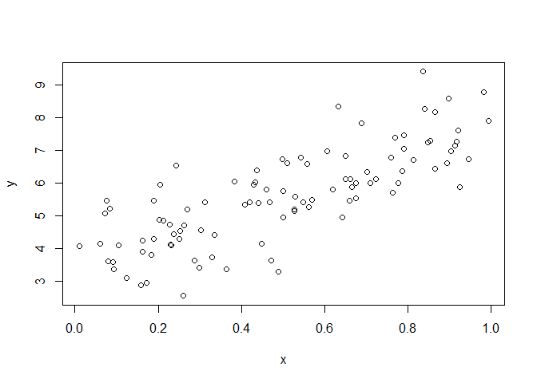<!-- -->

```r
m1 <- lm(y ~ x, data = df)
grid <- data.frame(x = seq(0, 1, length = 10))
grid %>% add_predictions(m1)
```

```
##            x     pred
## 1  0.0000000 3.502906
## 2  0.1111111 3.971873
## 3  0.2222222 4.440840
## 4  0.3333333 4.909807
## 5  0.4444444 5.378774
## 6  0.5555556 5.847740
## 7  0.6666667 6.316707
## 8  0.7777778 6.785674
## 9  0.8888889 7.254641
## 10 1.0000000 7.723608
```

```r
m2 <- lm(y ~ poly(x, 2), data = df)
grid %>% spread_predictions(m1, m2)
```

```
##            x       m1       m2
## 1  0.0000000 3.502906 3.840776
## 2  0.1111111 3.971873 4.123204
## 3  0.2222222 4.440840 4.451783
## 4  0.3333333 4.909807 4.826514
## 5  0.4444444 5.378774 5.247397
## 6  0.5555556 5.847740 5.714431
## 7  0.6666667 6.316707 6.227617
## 8  0.7777778 6.785674 6.786955
## 9  0.8888889 7.254641 7.392444
## 10 1.0000000 7.723608 8.044085
```

```r
grid %>% gather_predictions(m1, m2)
```

```
##    model         x     pred
## 1     m1 0.0000000 3.502906
## 2     m1 0.1111111 3.971873
## 3     m1 0.2222222 4.440840
## 4     m1 0.3333333 4.909807
## 5     m1 0.4444444 5.378774
## 6     m1 0.5555556 5.847740
## 7     m1 0.6666667 6.316707
## 8     m1 0.7777778 6.785674
## 9     m1 0.8888889 7.254641
## 10    m1 1.0000000 7.723608
## 11    m2 0.0000000 3.840776
## 12    m2 0.1111111 4.123204
## 13    m2 0.2222222 4.451783
## 14    m2 0.3333333 4.826514
## 15    m2 0.4444444 5.247397
## 16    m2 0.5555556 5.714431
## 17    m2 0.6666667 6.227617
## 18    m2 0.7777778 6.786955
## 19    m2 0.8888889 7.392444
## 20    m2 1.0000000 8.044085
```

3. What does `geom_ref_line()` do? What package does it come from? Why is displaying a reference line in plots showing residuals useful and important?

Add a reference line. From the modelr package, but modifies ggplot objects. Displaying a reference line in plots showing residuals is usefuly because it gives you a reference for how far from 0 the residuals are.

4. Why might you want to look at a frequency polygon of absolute residuals? What are the pros and cons compared to looking at the raw residuals?

Gives you a better overall view of how the model is performing. By doing so you lose information on if the model is over or under predicting.

## 23.4 Formulas and model families


```r
df <- tribble(
  ~y, ~x1, ~x2,
  4, 2, 5,
  5, 1, 6
)

model_matrix(df, y ~ x1)
```

```
## # A tibble: 2 x 2
##   `(Intercept)`    x1
##           <dbl> <dbl>
## 1             1     2
## 2             1     1
```

```r
model_matrix(df, y ~ x1 - 1)
```

```
## # A tibble: 2 x 1
##      x1
##   <dbl>
## 1     2
## 2     1
```

```r
model_matrix(df, y ~ x1 + x2)
```

```
## # A tibble: 2 x 3
##   `(Intercept)`    x1    x2
##           <dbl> <dbl> <dbl>
## 1             1     2     5
## 2             1     1     6
```

## 23.4.1 Categorical variables


```r
df <- tribble(
  ~ sex, ~ response,
  "male", 1,
  "female", 2,
  "male", 1
)
model_matrix(df, response ~ sex)
```

```
## # A tibble: 3 x 2
##   `(Intercept)` sexmale
##           <dbl>   <dbl>
## 1             1       1
## 2             1       0
## 3             1       1
```

```r
ggplot(sim2) + 
  geom_point(aes(x, y))
```

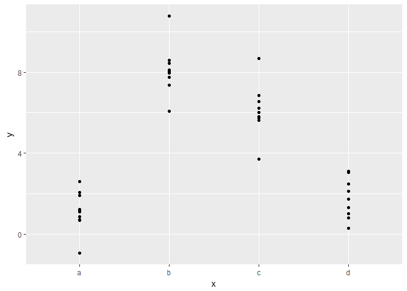<!-- -->

```r
mod2 <- lm(y ~ x, data = sim2)

grid <- sim2 %>% 
  data_grid(x) %>% 
  add_predictions(mod2)
grid
```

```
## # A tibble: 4 x 2
##       x     pred
##   <chr>    <dbl>
## 1     a 1.152166
## 2     b 8.116039
## 3     c 6.127191
## 4     d 1.910981
```

```r
ggplot(sim2, aes(x)) + 
  geom_point(aes(y = y)) +
  geom_point(data = grid, aes(y = pred), colour = "red", size = 4)
```

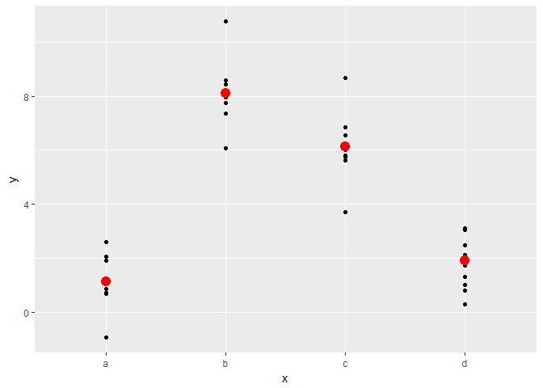<!-- -->

```r
tibble(x = "e") %>% 
  add_predictions(mod2)
```

```
## Error in model.frame.default(Terms, newdata, na.action = na.action, xlev = object$xlevels): factor x has new level e
```

### 23.4.2 Interactions (continuous and categorical)


```r
ggplot(sim3, aes(x1, y)) + 
  geom_point(aes(colour = x2))
```

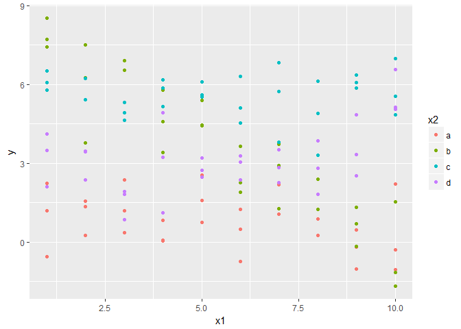<!-- -->

```r
mod1 <- lm(y ~ x1 + x2, data = sim3)
mod2 <- lm(y ~ x1 * x2, data = sim3)

grid <- sim3 %>% 
  data_grid(x1, x2) %>% 
  gather_predictions(mod1, mod2)
grid
```

```
## # A tibble: 80 x 4
##    model    x1     x2     pred
##    <chr> <int> <fctr>    <dbl>
##  1  mod1     1      a 1.674928
##  2  mod1     1      b 4.562739
##  3  mod1     1      c 6.480664
##  4  mod1     1      d 4.034515
##  5  mod1     2      a 1.478190
##  6  mod1     2      b 4.366001
##  7  mod1     2      c 6.283926
##  8  mod1     2      d 3.837777
##  9  mod1     3      a 1.281453
## 10  mod1     3      b 4.169263
## # ... with 70 more rows
```

```r
ggplot(sim3, aes(x1, y, colour = x2)) + 
  geom_point() + 
  geom_line(data = grid, aes(y = pred)) + 
  facet_wrap(~ model)
```

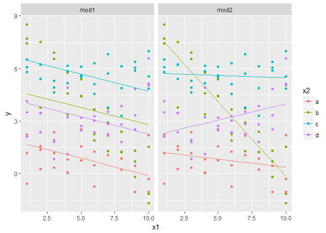<!-- -->

```r
sim3 <- sim3 %>% 
  gather_residuals(mod1, mod2)

ggplot(sim3, aes(x1, resid, colour = x2)) + 
  geom_point() + 
  facet_grid(model ~ x2)
```

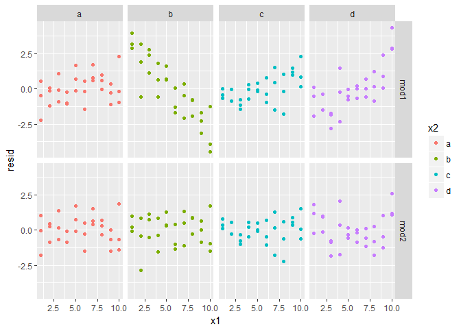<!-- -->

### 23.4.3 Interactions (two continuous)


```r
mod1 <- lm(y ~ x1 + x2, data = sim4)
mod2 <- lm(y ~ x1 * x2, data = sim4)

grid <- sim4 %>% 
  data_grid(
    x1 = seq_range(x1, 5), 
    x2 = seq_range(x2, 5) 
  ) %>% 
  gather_predictions(mod1, mod2)
grid
```

```
## # A tibble: 50 x 4
##    model    x1    x2       pred
##    <chr> <dbl> <dbl>      <dbl>
##  1  mod1  -1.0  -1.0  0.9963094
##  2  mod1  -1.0  -0.5 -0.3949484
##  3  mod1  -1.0   0.0 -1.7862061
##  4  mod1  -1.0   0.5 -3.1774639
##  5  mod1  -1.0   1.0 -4.5687216
##  6  mod1  -0.5  -1.0  1.9071424
##  7  mod1  -0.5  -0.5  0.5158847
##  8  mod1  -0.5   0.0 -0.8753731
##  9  mod1  -0.5   0.5 -2.2666308
## 10  mod1  -0.5   1.0 -3.6578886
## # ... with 40 more rows
```

```r
seq_range(c(0.0123, 0.923423), n = 5)
```

```
## [1] 0.0123000 0.2400808 0.4678615 0.6956423 0.9234230
```

```r
seq_range(c(0.0123, 0.923423), n = 5, pretty = TRUE)
```

```
## [1] 0.0 0.2 0.4 0.6 0.8 1.0
```

```r
x1 <- rcauchy(100)
seq_range(x1, n = 5)
```

```
## [1] -30.6067088   0.5753726  31.7574539  62.9395352  94.1216165
```

```r
seq_range(x1, n = 5, trim = 0.10)
```

```
## [1] -3.6637493 -0.6501517  2.3634458  5.3770434  8.3906410
```

```r
seq_range(x1, n = 5, trim = 0.25)
```

```
## [1] -2.1029141 -0.6807211  0.7414720  2.1636651  3.5858581
```

```r
seq_range(x1, n = 5, trim = 0.50)
```

```
## [1] -0.8560750 -0.3329286  0.1902178  0.7133642  1.2365107
```

```r
x2 <- c(0, 1)
seq_range(x2, n = 5)
```

```
## [1] 0.00 0.25 0.50 0.75 1.00
```

```r
seq_range(x2, n = 5, expand = 0.10)
```

```
## [1] -0.050  0.225  0.500  0.775  1.050
```

```r
seq_range(x2, n = 5, expand = 0.25)
```

```
## [1] -0.1250  0.1875  0.5000  0.8125  1.1250
```

```r
seq_range(x2, n = 5, expand = 0.50)
```

```
## [1] -0.250  0.125  0.500  0.875  1.250
```

```r
ggplot(grid, aes(x1, x2)) + 
  geom_tile(aes(fill = pred)) + 
  facet_wrap(~ model)
```

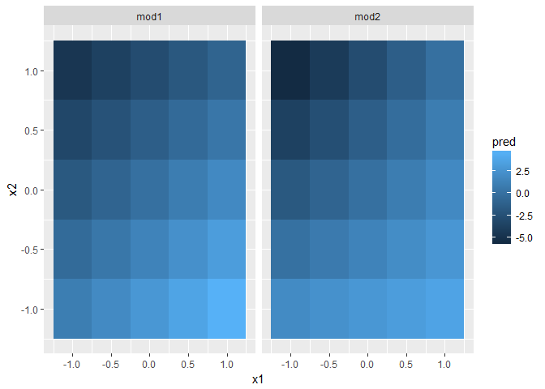<!-- -->

```r
ggplot(grid, aes(x1, pred, colour = x2, group = x2)) + 
  geom_line() +
  facet_wrap(~ model)
```

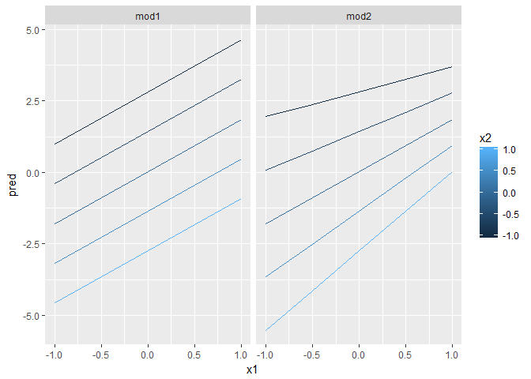<!-- -->

```r
ggplot(grid, aes(x2, pred, colour = x1, group = x1)) + 
  geom_line() +
  facet_wrap(~ model)
```

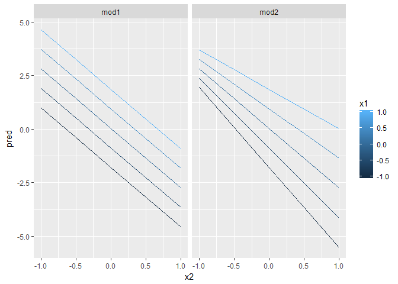<!-- -->

### 23.4.4 Transformations


```r
df <- tribble(
  ~y, ~x,
   1,  1,
   2,  2, 
   3,  3
)
model_matrix(df, y ~ x^2 + x)
```

```
## # A tibble: 3 x 2
##   `(Intercept)`     x
##           <dbl> <dbl>
## 1             1     1
## 2             1     2
## 3             1     3
```

```r
model_matrix(df, y ~ I(x^2) + x)
```

```
## # A tibble: 3 x 3
##   `(Intercept)` `I(x^2)`     x
##           <dbl>    <dbl> <dbl>
## 1             1        1     1
## 2             1        4     2
## 3             1        9     3
```

```r
model_matrix(df, y ~ poly(x, 2))
```

```
## # A tibble: 3 x 3
##   `(Intercept)` `poly(x, 2)1` `poly(x, 2)2`
##           <dbl>         <dbl>         <dbl>
## 1             1 -7.071068e-01     0.4082483
## 2             1 -7.850462e-17    -0.8164966
## 3             1  7.071068e-01     0.4082483
```

```r
library(splines)
model_matrix(df, y ~ ns(x, 2))
```

```
## # A tibble: 3 x 3
##   `(Intercept)` `ns(x, 2)1` `ns(x, 2)2`
##           <dbl>       <dbl>       <dbl>
## 1             1   0.0000000   0.0000000
## 2             1   0.5662628  -0.2108419
## 3             1   0.3440969   0.7706021
```

```r
sim5 <- tibble(
  x = seq(0, 3.5 * pi, length = 50),
  y = 4 * sin(x) + rnorm(length(x))
)

ggplot(sim5, aes(x, y)) +
  geom_point()
```

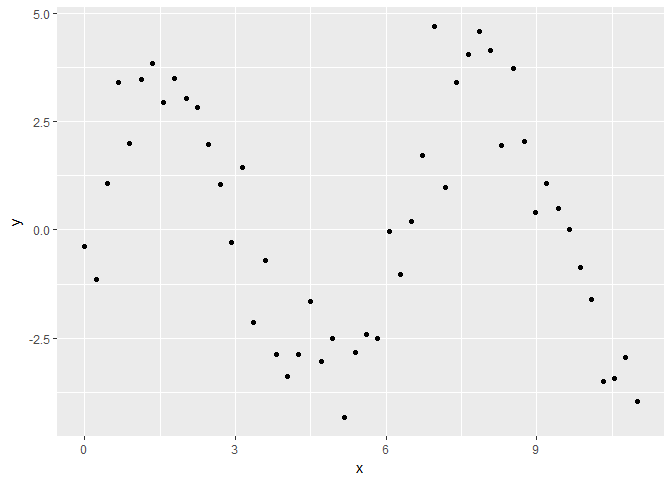<!-- -->

```r
mod1 <- lm(y ~ ns(x, 1), data = sim5)
mod2 <- lm(y ~ ns(x, 2), data = sim5)
mod3 <- lm(y ~ ns(x, 3), data = sim5)
mod4 <- lm(y ~ ns(x, 4), data = sim5)
mod5 <- lm(y ~ ns(x, 5), data = sim5)

grid <- sim5 %>% 
  data_grid(x = seq_range(x, n = 50, expand = 0.1)) %>% 
  gather_predictions(mod1, mod2, mod3, mod4, mod5, .pred = "y")

ggplot(sim5, aes(x, y)) + 
  geom_point() +
  geom_line(data = grid, colour = "red") +
  facet_wrap(~ model)
```

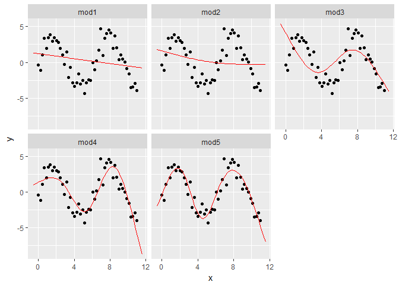<!-- -->

### 23.4.5 Exercises

1. What happens if you repeat the analysis of `sim2` using a model without an intercept. What happens to the model equation? What happens to the predictions?

```r
model_matrix(df, y ~ x)
```

```
## # A tibble: 3 x 2
##   `(Intercept)`     x
##           <dbl> <dbl>
## 1             1     1
## 2             1     2
## 3             1     3
```

```r
model_matrix(df, y ~ x - 1)
```

```
## # A tibble: 3 x 1
##       x
##   <dbl>
## 1     1
## 2     2
## 3     3
```

```r
ggplot(sim2) + 
  geom_point(aes(x, y))
```

<!-- -->

```r
mod1 <- lm(y ~ x, data = sim2)
mod2 <- lm(y ~ x - 1, data = sim2)

mod1
```

```
## 
## Call:
## lm(formula = y ~ x, data = sim2)
## 
## Coefficients:
## (Intercept)           xb           xc           xd  
##      1.1522       6.9639       4.9750       0.7588
```

```r
mod2
```

```
## 
## Call:
## lm(formula = y ~ x - 1, data = sim2)
## 
## Coefficients:
##    xa     xb     xc     xd  
## 1.152  8.116  6.127  1.911
```

```r
grid <- sim2 %>% 
  data_grid(x) %>% 
  gather_predictions(mod1,mod2)
grid
```

```
## # A tibble: 8 x 3
##   model     x     pred
##   <chr> <chr>    <dbl>
## 1  mod1     a 1.152166
## 2  mod1     b 8.116039
## 3  mod1     c 6.127191
## 4  mod1     d 1.910981
## 5  mod2     a 1.152166
## 6  mod2     b 8.116039
## 7  mod2     c 6.127191
## 8  mod2     d 1.910981
```

```r
ggplot(sim2, aes(x)) + 
  geom_point(aes(y = y)) +
  geom_point(data = grid, aes(y = pred), colour = "red", size = 4) +
  facet_wrap(~model)
```

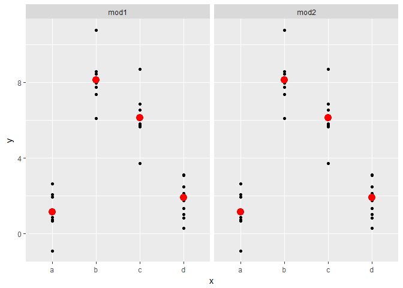<!-- -->

Nothing really changed. Intercept did not make a difference, at least in my case

2. Use `model_matrix()` to explore the equations generated for the models I fit to `sim3` and `sim4`. Why is `*` a good shorthand for interaction?


```r
model_matrix(y ~ x1 + x2, data = sim3)
```

```
## # A tibble: 240 x 5
##    `(Intercept)`    x1   x2b   x2c   x2d
##            <dbl> <dbl> <dbl> <dbl> <dbl>
##  1             1     1     0     0     0
##  2             1     1     0     0     0
##  3             1     1     0     0     0
##  4             1     1     1     0     0
##  5             1     1     1     0     0
##  6             1     1     1     0     0
##  7             1     1     0     1     0
##  8             1     1     0     1     0
##  9             1     1     0     1     0
## 10             1     1     0     0     1
## # ... with 230 more rows
```

```r
model_matrix(y ~ x1 * x2, data = sim3)
```

```
## # A tibble: 240 x 8
##    `(Intercept)`    x1   x2b   x2c   x2d `x1:x2b` `x1:x2c` `x1:x2d`
##            <dbl> <dbl> <dbl> <dbl> <dbl>    <dbl>    <dbl>    <dbl>
##  1             1     1     0     0     0        0        0        0
##  2             1     1     0     0     0        0        0        0
##  3             1     1     0     0     0        0        0        0
##  4             1     1     1     0     0        1        0        0
##  5             1     1     1     0     0        1        0        0
##  6             1     1     1     0     0        1        0        0
##  7             1     1     0     1     0        0        1        0
##  8             1     1     0     1     0        0        1        0
##  9             1     1     0     1     0        0        1        0
## 10             1     1     0     0     1        0        0        1
## # ... with 230 more rows
```

```r
model_matrix(y ~ x1 + x2, data = sim4)
```

```
## # A tibble: 300 x 3
##    `(Intercept)`    x1         x2
##            <dbl> <dbl>      <dbl>
##  1             1    -1 -1.0000000
##  2             1    -1 -1.0000000
##  3             1    -1 -1.0000000
##  4             1    -1 -0.7777778
##  5             1    -1 -0.7777778
##  6             1    -1 -0.7777778
##  7             1    -1 -0.5555556
##  8             1    -1 -0.5555556
##  9             1    -1 -0.5555556
## 10             1    -1 -0.3333333
## # ... with 290 more rows
```

```r
model_matrix(y ~ x1 * x2, data = sim4)
```

```
## # A tibble: 300 x 4
##    `(Intercept)`    x1         x2   `x1:x2`
##            <dbl> <dbl>      <dbl>     <dbl>
##  1             1    -1 -1.0000000 1.0000000
##  2             1    -1 -1.0000000 1.0000000
##  3             1    -1 -1.0000000 1.0000000
##  4             1    -1 -0.7777778 0.7777778
##  5             1    -1 -0.7777778 0.7777778
##  6             1    -1 -0.7777778 0.7777778
##  7             1    -1 -0.5555556 0.5555556
##  8             1    -1 -0.5555556 0.5555556
##  9             1    -1 -0.5555556 0.5555556
## 10             1    -1 -0.3333333 0.3333333
## # ... with 290 more rows
```

It would be a pain to write out the whole equation explicitly

3. Using the basic principles, convert the formulas in the following two models into functions. (Hint: start by converting the categorical variable into 0-1 variables.)


```r
mod1 <- lm(y ~ x1 + x2, data = sim3)
mod2 <- lm(y ~ x1 * x2, data = sim3)
mod1
```

```
## 
## Call:
## lm(formula = y ~ x1 + x2, data = sim3)
## 
## Coefficients:
## (Intercept)           x1          x2b          x2c          x2d  
##      1.8717      -0.1967       2.8878       4.8057       2.3596
```

```r
mod2
```

```
## 
## Call:
## lm(formula = y ~ x1 * x2, data = sim3)
## 
## Coefficients:
## (Intercept)           x1          x2b          x2c          x2d  
##     1.30124     -0.09302      7.06938      4.43090      0.83455  
##      x1:x2b       x1:x2c       x1:x2d  
##    -0.76029      0.06815      0.27728
```

```r
mod1 = a_0 + a_1 * is_a + a_2 * is_b + a_3 * is_c + a_4 * is_d
```

```
## Error in eval(expr, envir, enclos): object 'a_0' not found
```

```r
mod2 = a_0 + a_1 * x1 + a_2 * x2 + a_12 * x1 * x2
```

```
## Error in eval(expr, envir, enclos): object 'a_0' not found
```

```r
# Unsure about mod 2. I feel like it's going to be long.
```

4. For `sim4`, which of `mod1` and `mod2` is better? I think `mod2` does a slightly better job at removing patterns, but it’s pretty subtle. Can you come up with a plot to support my claim?


```r
sim4
```

```
## # A tibble: 300 x 4
##       x1         x2   rep           y
##    <dbl>      <dbl> <int>       <dbl>
##  1    -1 -1.0000000     1  4.24767769
##  2    -1 -1.0000000     2  1.20599701
##  3    -1 -1.0000000     3  0.35347770
##  4    -1 -0.7777778     1 -0.04665814
##  5    -1 -0.7777778     2  4.63868987
##  6    -1 -0.7777778     3  1.37709540
##  7    -1 -0.5555556     1  0.97522088
##  8    -1 -0.5555556     2  2.49963753
##  9    -1 -0.5555556     3  2.70474837
## 10    -1 -0.3333333     1  0.55751522
## # ... with 290 more rows
```

```r
mod1 <- lm(y ~ x1 + x2, data = sim4)
mod2 <- lm(y ~ x1 * x2, data = sim4)
sim4 <- sim4 %>% 
  gather_residuals(mod1, mod2)
sim4
```

```
## # A tibble: 600 x 6
##    model    x1         x2   rep           y      resid
##    <chr> <dbl>      <dbl> <int>       <dbl>      <dbl>
##  1  mod1    -1 -1.0000000     1  4.24767769  3.2513683
##  2  mod1    -1 -1.0000000     2  1.20599701  0.2096876
##  3  mod1    -1 -1.0000000     3  0.35347770 -0.6428317
##  4  mod1    -1 -0.7777778     1 -0.04665814 -0.4246307
##  5  mod1    -1 -0.7777778     2  4.63868987  4.2607173
##  6  mod1    -1 -0.7777778     3  1.37709540  0.9991228
##  7  mod1    -1 -0.5555556     1  0.97522088  1.2155851
##  8  mod1    -1 -0.5555556     2  2.49963753  2.7400017
##  9  mod1    -1 -0.5555556     3  2.70474837  2.9451126
## 10  mod1    -1 -0.3333333     1  0.55751522  1.4162162
## # ... with 590 more rows
```

```r
ggplot(sim4, aes(x1, resid)) + 
  geom_point() + 
  facet_grid(model ~ x2)
```

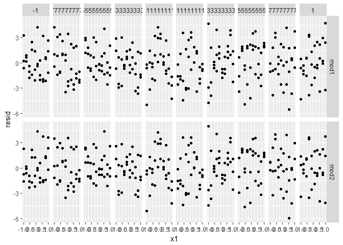<!-- -->

```r
ggplot(sim4, aes(x1, resid)) + 
  geom_point() + 
  facet_grid(~model)
```

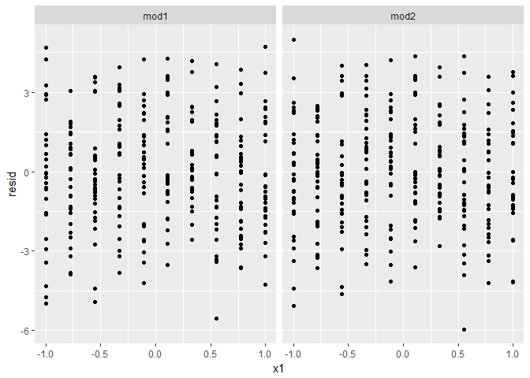<!-- -->

```r
ggplot(sim4, aes(resid)) + 
  geom_freqpoly(binwidth = 0.5) +
  facet_grid(~model)
```

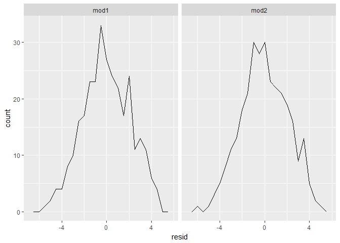<!-- -->
mod2 has a nicer looking freqpoly. More centered. I'm not good at statistics.

## 23.5 Missing values


```r
df <- tribble(
  ~x, ~y,
  1, 2.2,
  2, NA,
  3, 3.5,
  4, 8.3,
  NA, 10
)

mod <- lm(y ~ x, data = df)
```

```
## Warning: Dropping 2 rows with missing values
```

```r
mod <- lm(y ~ x, data = df, na.action = na.exclude)

nobs(mod)
```

```
## [1] 3
```

# 24 Model building

## 24.1 Introduction

### 24.1.1 Prerequisites


```r
library(tidyverse)
library(modelr)
options(na.action = na.warn)

library(nycflights13)
library(lubridate)
```

```
## 
## Attaching package: 'lubridate'
```

```
## The following object is masked from 'package:base':
## 
##     date
```

## 24.2 Why are low quality diamonds more expensive?


```r
ggplot(diamonds, aes(cut, price)) + geom_boxplot()
```

<!-- -->

```r
ggplot(diamonds, aes(color, price)) + geom_boxplot()
```

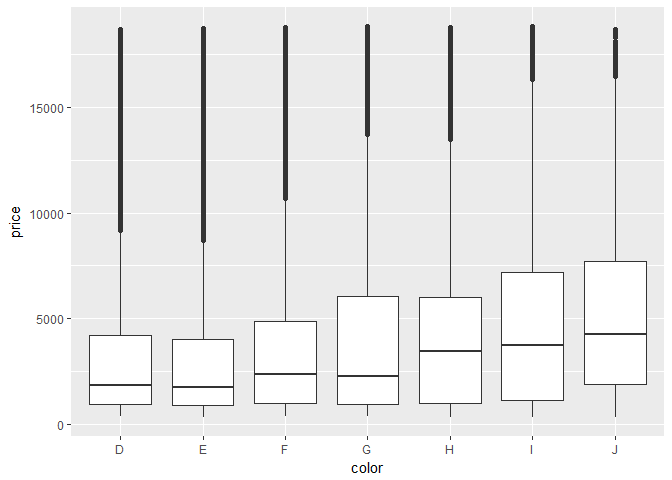<!-- -->

```r
ggplot(diamonds, aes(clarity, price)) + geom_boxplot()
```

<!-- -->

### 24.2.1 Price and carat


```r
ggplot(diamonds, aes(carat, price)) + 
  geom_hex(bins = 50)
```

```
## Warning: package 'hexbin' was built under R version 3.4.2
```

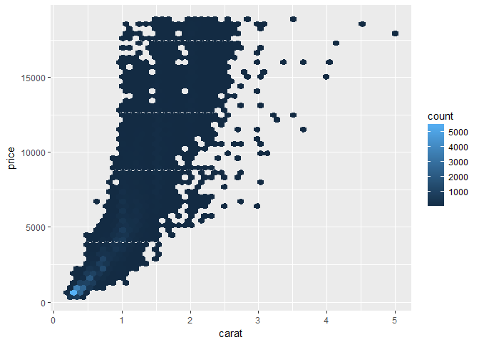<!-- -->

```r
diamonds2 <- diamonds %>% 
  filter(carat <= 2.5) %>% 
  mutate(lprice = log2(price), lcarat = log2(carat))

ggplot(diamonds2, aes(lcarat, lprice)) + 
  geom_hex(bins = 50)
```

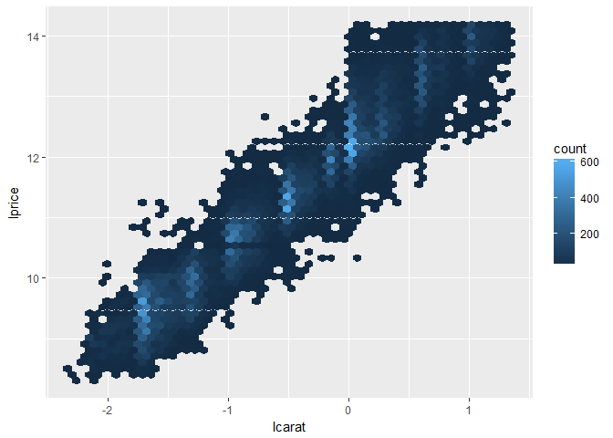<!-- -->

```r
mod_diamond <- lm(lprice ~ lcarat, data = diamonds2)

grid <- diamonds2 %>% 
  data_grid(carat = seq_range(carat, 20)) %>% 
  mutate(lcarat = log2(carat)) %>% 
  add_predictions(mod_diamond, "lprice") %>% 
  mutate(price = 2 ^ lprice)

ggplot(diamonds2, aes(carat, price)) + 
  geom_hex(bins = 50) + 
  geom_line(data = grid, colour = "red", size = 1)
```

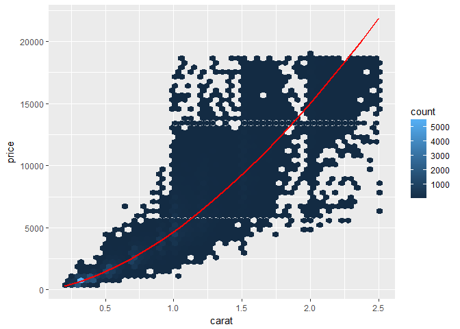<!-- -->

```r
diamonds2 <- diamonds2 %>% 
  add_residuals(mod_diamond, "lresid")

ggplot(diamonds2, aes(lcarat, lresid)) + 
  geom_hex(bins = 50)
```

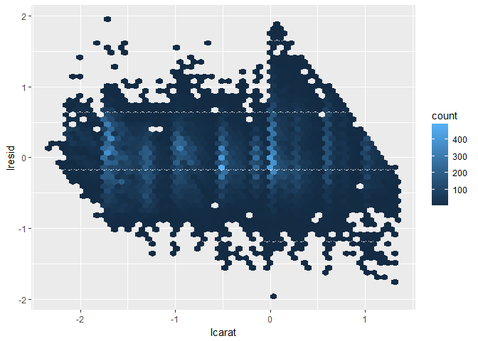<!-- -->

```r
ggplot(diamonds2, aes(cut, lresid)) + geom_boxplot()
```

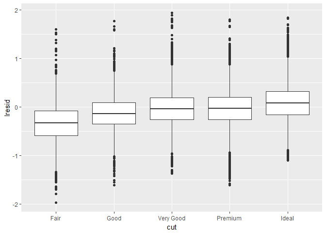<!-- -->

```r
ggplot(diamonds2, aes(color, lresid)) + geom_boxplot()
```

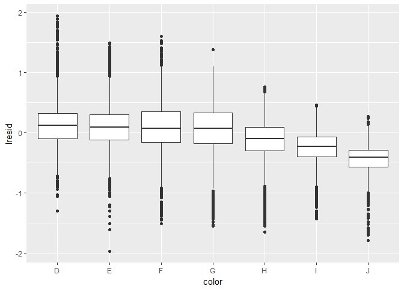<!-- -->

```r
ggplot(diamonds2, aes(clarity, lresid)) + geom_boxplot()
```

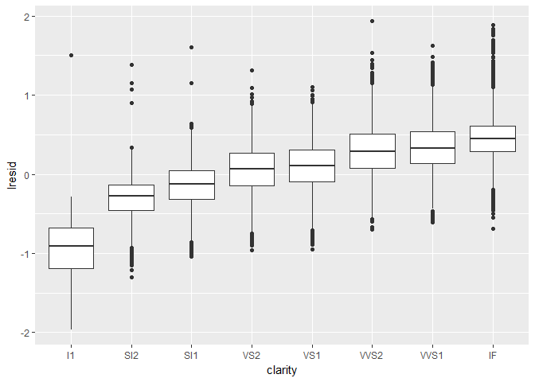<!-- -->

### 24.2.2 A more complicated model


```r
mod_diamond2 <- lm(lprice ~ lcarat + color + cut + clarity, data = diamonds2)

grid <- diamonds2 %>% 
  data_grid(cut, .model = mod_diamond2) %>% 
  add_predictions(mod_diamond2)
```

```
## Error in overscope_eval_next(overscope, expr): object 'G' not found
```

```r
grid
```

```
## # A tibble: 20 x 4
##        carat      lcarat    lprice      price
##        <dbl>       <dbl>     <dbl>      <dbl>
##  1 0.2000000 -2.32192809  8.289840   312.9613
##  2 0.3210526 -1.63911827  9.437897   693.5697
##  3 0.4421053 -1.17753819 10.213984  1187.7244
##  4 0.5631579 -0.82838862 10.801034  1784.1663
##  5 0.6842105 -0.54748780 11.273333  2475.2060
##  6 0.8052632 -0.31246777 11.668489  3255.1059
##  7 0.9263158 -0.11042399 12.008199  4119.3452
##  8 1.0473684  0.06676901 12.306126  5064.2274
##  9 1.1684211  0.22456026 12.571432  6086.6476
## 10 1.2894737  0.36678233 12.810560  7183.9430
## 11 1.4105263  0.49623358 13.028216  8353.7936
## 12 1.5315789  0.61501973 13.227939  9594.1507
## 13 1.6526316  0.72476514 13.412462 10903.1859
## 14 1.7736842  0.82674917 13.583935 12279.2526
## 15 1.8947368  0.92199749 13.744083 13720.8562
## 16 2.0157895  1.01134497 13.894309 15226.6312
## 17 2.1368421  1.09548031 14.035772 16795.3226
## 18 2.2578947  1.17497823 14.169437 18425.7712
## 19 2.3789474  1.25032335 14.296120 20116.9016
## 20 2.5000000  1.32192809 14.416515 21867.7116
```

```r
ggplot(grid, aes(cut, pred)) + 
  geom_point()
```

```
## Don't know how to automatically pick scale for object of type function. Defaulting to continuous.
```

```
## Error in FUN(X[[i]], ...): object 'pred' not found
```

```r
## No pred column

diamonds2 <- diamonds2 %>% 
  add_residuals(mod_diamond2, "lresid2")

ggplot(diamonds2, aes(lcarat, lresid2)) + 
  geom_hex(bins = 50)
```

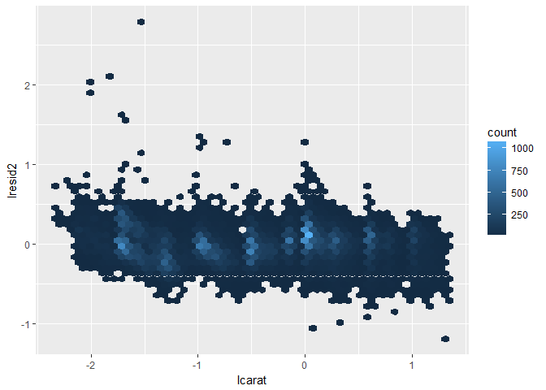<!-- -->

```r
diamonds2 %>% 
  filter(abs(lresid2) > 1) %>% 
  add_predictions(mod_diamond2) %>% 
  mutate(pred = round(2 ^ pred)) %>% 
  select(price, pred, carat:table, x:z) %>% 
  arrange(price)
```

```
## # A tibble: 16 x 11
##    price  pred carat       cut color clarity depth table     x     y     z
##    <int> <dbl> <dbl>     <ord> <ord>   <ord> <dbl> <dbl> <dbl> <dbl> <dbl>
##  1  1013   264  0.25      Fair     F     SI2  54.4    64  4.30  4.23  2.32
##  2  1186   284  0.25   Premium     G     SI2  59.0    60  5.33  5.28  3.12
##  3  1186   284  0.25   Premium     G     SI2  58.8    60  5.33  5.28  3.12
##  4  1262  2644  1.03      Fair     E      I1  78.2    54  5.72  5.59  4.42
##  5  1415   639  0.35      Fair     G     VS2  65.9    54  5.57  5.53  3.66
##  6  1415   639  0.35      Fair     G     VS2  65.9    54  5.57  5.53  3.66
##  7  1715   576  0.32      Fair     F     VS2  59.6    60  4.42  4.34  2.61
##  8  1776   412  0.29      Fair     F     SI1  55.8    60  4.48  4.41  2.48
##  9  2160   314  0.34      Fair     F      I1  55.8    62  4.72  4.60  2.60
## 10  2366   774  0.30 Very Good     D    VVS2  60.6    58  4.33  4.35  2.63
## 11  3360  1373  0.51   Premium     F     SI1  62.7    62  5.09  4.96  3.15
## 12  3807  1540  0.61      Good     F     SI2  62.5    65  5.36  5.29  3.33
## 13  3920  1705  0.51      Fair     F    VVS2  65.4    60  4.98  4.90  3.23
## 14  4368  1705  0.51      Fair     F    VVS2  60.7    66  5.21  5.11  3.13
## 15 10011  4048  1.01      Fair     D     SI2  64.6    58  6.25  6.20  4.02
## 16 10470 23622  2.46   Premium     E     SI2  59.7    59  8.82  8.76  5.25
```

### 24.2.3 Exercises

1. In the plot of `lcarat` vs. `lprice`, there are some bright vertical strips. What do they represent?

2. If `log(price) = a_0 + a_1 * log(carat)`, what does that say about the relationship between `price` and `carat`?

3. Extract the diamonds that have very high and very low residuals. Is there anything unusual about these diamonds? Are the particularly bad or good, or do you think these are pricing errors?

4. Does the final model, `mod_diamonds2`, do a good job of predicting diamond prices? Would you trust it to tell you how much to spend if you were buying a diamond?

## 24.3 What affects the number of daily flights?


```r
daily <- flights %>% 
  mutate(date = make_date(year, month, day)) %>% 
  group_by(date) %>% 
  summarise(n = n())
daily
```

```
## # A tibble: 365 x 2
##          date     n
##        <date> <int>
##  1 2013-01-01   842
##  2 2013-01-02   943
##  3 2013-01-03   914
##  4 2013-01-04   915
##  5 2013-01-05   720
##  6 2013-01-06   832
##  7 2013-01-07   933
##  8 2013-01-08   899
##  9 2013-01-09   902
## 10 2013-01-10   932
## # ... with 355 more rows
```

```r
ggplot(daily, aes(date, n)) + 
  geom_line()
```

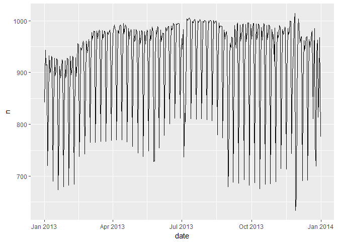<!-- -->

### 24.3.1 Day of week


```r
daily <- daily %>% 
  mutate(wday = wday(date, label = TRUE))
ggplot(daily, aes(wday, n)) + 
  geom_boxplot()
```

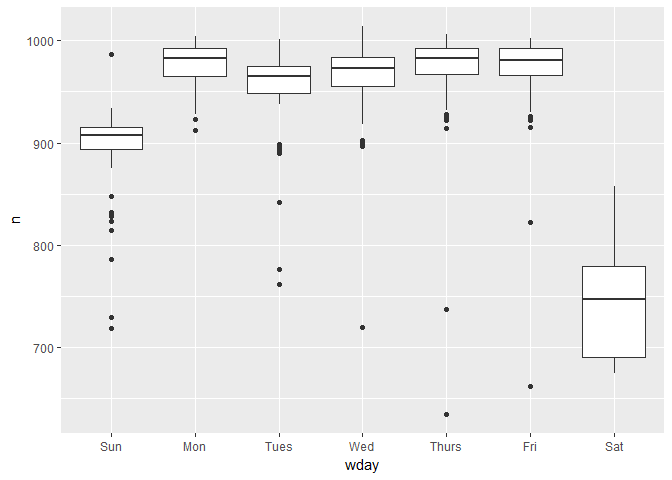<!-- -->

```r
mod <- lm(n ~ wday, data = daily)

grid <- daily %>% 
  data_grid(wday) %>% 
  add_predictions(mod, "n")

ggplot(daily, aes(wday, n)) + 
  geom_boxplot() +
  geom_point(data = grid, colour = "red", size = 4)
```

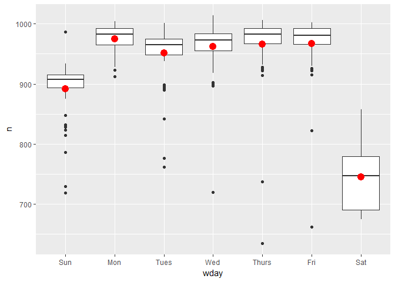<!-- -->

```r
daily <- daily %>% 
  add_residuals(mod)
daily %>% 
  ggplot(aes(date, resid)) + 
  geom_ref_line(h = 0) + 
  geom_line()
```

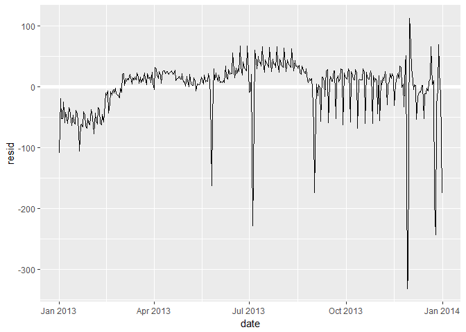<!-- -->

```r
ggplot(daily, aes(date, resid, colour = wday)) + 
  geom_ref_line(h = 0) + 
  geom_line()
```

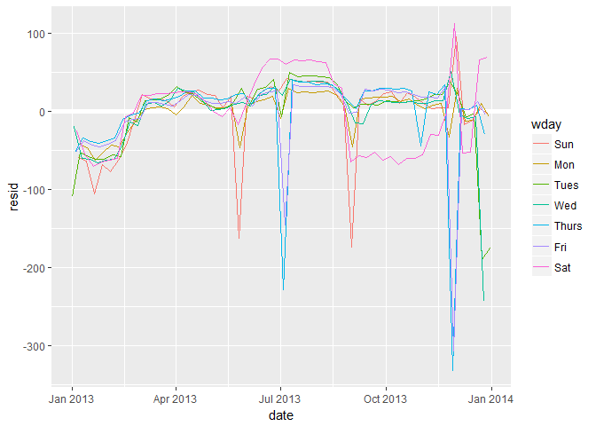<!-- -->

```r
daily %>% 
  filter(resid < -100)
```

```
## # A tibble: 11 x 4
##          date     n  wday     resid
##        <date> <int> <ord>     <dbl>
##  1 2013-01-01   842  Tues -109.3585
##  2 2013-01-20   786   Sun -105.4808
##  3 2013-05-26   729   Sun -162.4808
##  4 2013-07-04   737 Thurs -228.7500
##  5 2013-07-05   822   Fri -145.4615
##  6 2013-09-01   718   Sun -173.4808
##  7 2013-11-28   634 Thurs -331.7500
##  8 2013-11-29   661   Fri -306.4615
##  9 2013-12-24   761  Tues -190.3585
## 10 2013-12-25   719   Wed -243.6923
## 11 2013-12-31   776  Tues -175.3585
```

```r
daily %>% 
  ggplot(aes(date, resid)) + 
  geom_ref_line(h = 0) + 
  geom_line(colour = "grey50") + 
  geom_smooth(se = FALSE, span = 0.20)
```

```
## `geom_smooth()` using method = 'loess'
```

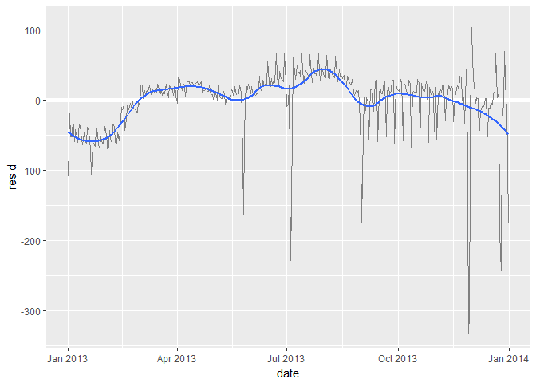<!-- -->

### 24.3.2 Seasonal Saturday effect


```r
daily %>% 
  filter(wday == "Sat") %>% 
  ggplot(aes(date, n)) + 
    geom_point() + 
    geom_line() +
    scale_x_date(NULL, date_breaks = "1 month", date_labels = "%b")
```

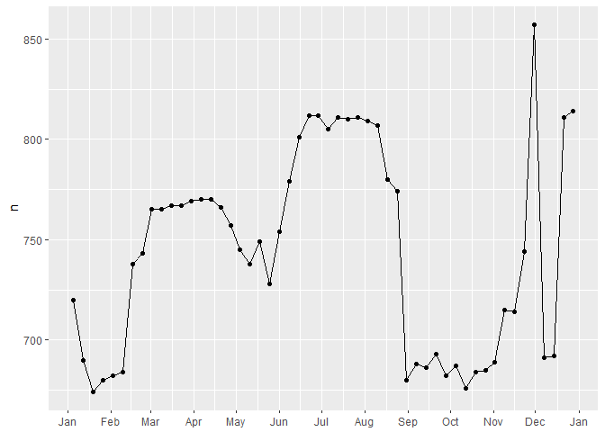<!-- -->

```r
term <- function(date) {
  cut(date, 
    breaks = ymd(20130101, 20130605, 20130825, 20140101),
    labels = c("spring", "summer", "fall") 
  )
}

daily <- daily %>% 
  mutate(term = term(date)) 

daily %>% 
  filter(wday == "Sat") %>% 
  ggplot(aes(date, n, colour = term)) +
  geom_point(alpha = 1/3) + 
  geom_line() +
  scale_x_date(NULL, date_breaks = "1 month", date_labels = "%b")
```

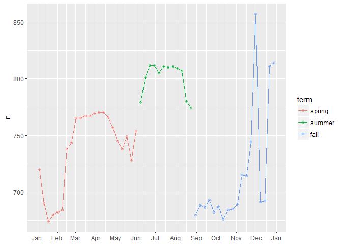<!-- -->

```r
daily %>% 
  ggplot(aes(wday, n, colour = term)) +
    geom_boxplot()
```

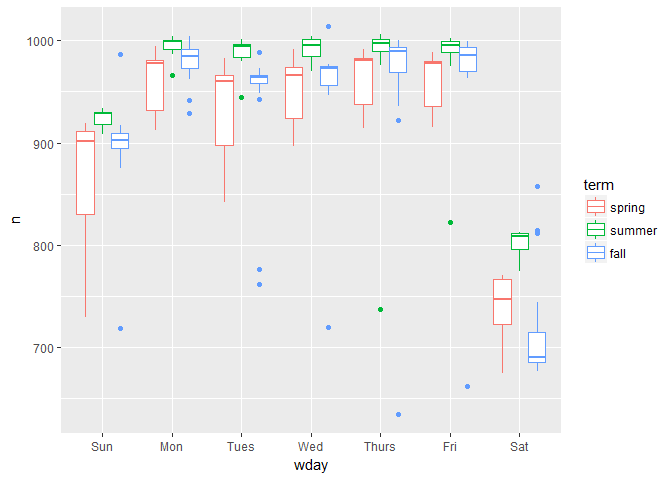<!-- -->

```r
mod1 <- lm(n ~ wday, data = daily)
mod2 <- lm(n ~ wday * term, data = daily)

daily %>% 
  gather_residuals(without_term = mod1, with_term = mod2) %>% 
  ggplot(aes(date, resid, colour = model)) +
    geom_line(alpha = 0.75)
```

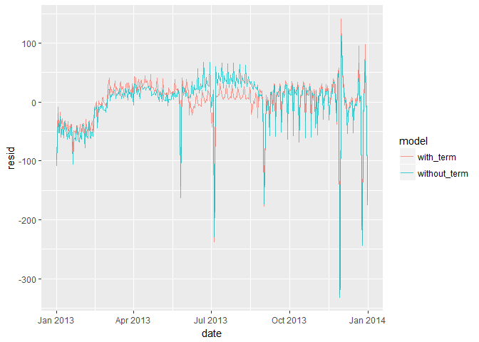<!-- -->

```r
grid <- daily %>% 
  data_grid(wday, term) %>% 
  add_predictions(mod2, "n")

ggplot(daily, aes(wday, n)) +
  geom_boxplot() + 
  geom_point(data = grid, colour = "red") + 
  facet_wrap(~ term)
```

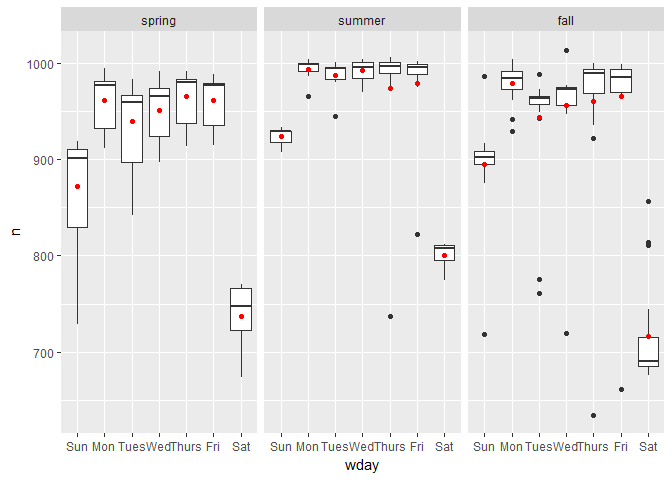<!-- -->

```r
mod3 <- MASS::rlm(n ~ wday * term, data = daily)

daily %>% 
  add_residuals(mod3, "resid") %>% 
  ggplot(aes(date, resid)) + 
  geom_hline(yintercept = 0, size = 2, colour = "white") + 
  geom_line()
```

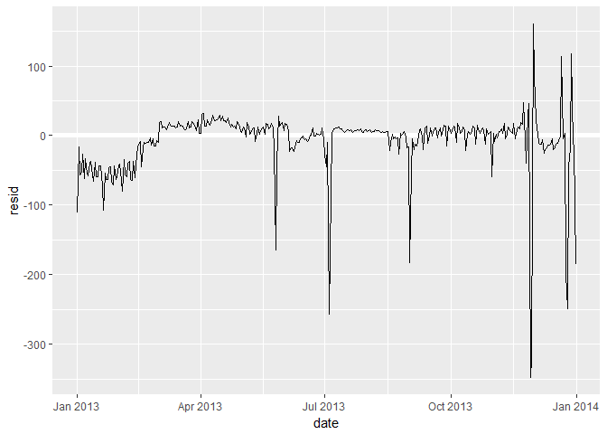<!-- -->
### 24.3.3 Computed variables


```r
compute_vars <- function(data) {
  data %>% 
    mutate(
      term = term(date), 
      wday = wday(date, label = TRUE)
    )
}

wday2 <- function(x) wday(x, label = TRUE)
mod3 <- lm(n ~ wday2(date) * term(date), data = daily)
```

### 24.3.4 Time of year: an alternative approach


```r
library(splines)
mod <- MASS::rlm(n ~ wday * ns(date, 5), data = daily)

daily %>% 
  data_grid(wday, date = seq_range(date, n = 13)) %>% 
  add_predictions(mod) %>% 
  ggplot(aes(date, pred, colour = wday)) + 
    geom_line() +
    geom_point()
```

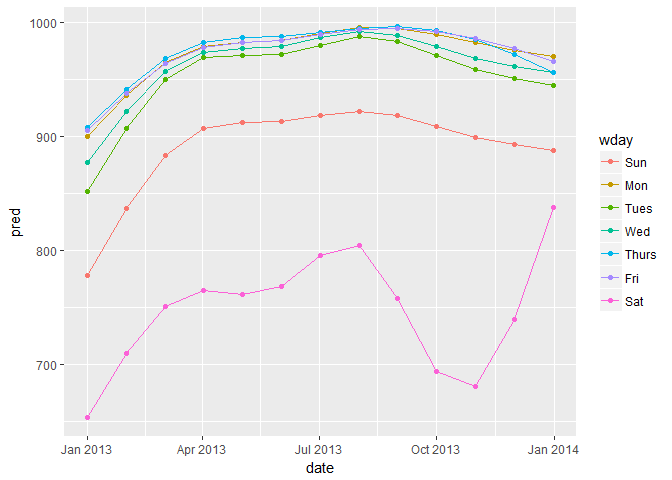<!-- -->

### 24.3.5 Exercises

1. Use your Google sleuthing skills to brainstorm why there were fewer than expected flights on Jan 20, May 26, and Sep 1. (Hint: they all have the same explanation.) How would these days generalise to another year?

2. What do the three days with high positive residuals represent? How would these days generalise to another year?


```r
daily %>% 
  top_n(3, resid)
```

```
## # A tibble: 3 x 5
##         date     n  wday     resid   term
##       <date> <int> <ord>     <dbl> <fctr>
## 1 2013-11-30   857   Sat 112.38462   fall
## 2 2013-12-01   987   Sun  95.51923   fall
## 3 2013-12-28   814   Sat  69.38462   fall
```

3. Create a new variable that splits the `wday` variable into terms, but only for Saturdays, i.e. it should have `Thurs`, `Fri`, but `Sat-summer`, `Sat-spring`, `Sat-fall`. How does this model compare with the model with every combination of `wday` and `term`?

4. Create a new `wday` variable that combines the day of week, term (for Saturdays), and public holidays. What do the residuals of that model look like?

5.What happens if you fit a day of week effect that varies by month (i.e. `n ~ wday * month`)? Why is this not very helpful?

6. What would you expect the model `n ~ wday + ns(date, 5)` to look like? Knowing what you know about the data, why would you expect it to be not particularly effective?

7. We hypothesised that people leaving on Sundays are more likely to be business travellers who need to be somewhere on Monday. Explore that hypothesis by seeing how it breaks down based on distance and time: if it’s true, you’d expect to see more Sunday evening flights to places that are far away.

8. It’s a little frustrating that Sunday and Saturday are on separate ends of the plot. Write a small function to set the levels of the factor so that the week starts on Monday.

## 24.4 Learning more about models

#25 Many models

## 25.1 Introduction

### 25.1.1 Prerequisites


```r
library(modelr)
library(tidyverse)
```

## 25.2 gapminder


```r
library(gapminder)
```

```
## Warning: package 'gapminder' was built under R version 3.4.2
```

```r
gapminder
```

```
## # A tibble: 1,704 x 6
##        country continent  year lifeExp      pop gdpPercap
##         <fctr>    <fctr> <int>   <dbl>    <int>     <dbl>
##  1 Afghanistan      Asia  1952  28.801  8425333  779.4453
##  2 Afghanistan      Asia  1957  30.332  9240934  820.8530
##  3 Afghanistan      Asia  1962  31.997 10267083  853.1007
##  4 Afghanistan      Asia  1967  34.020 11537966  836.1971
##  5 Afghanistan      Asia  1972  36.088 13079460  739.9811
##  6 Afghanistan      Asia  1977  38.438 14880372  786.1134
##  7 Afghanistan      Asia  1982  39.854 12881816  978.0114
##  8 Afghanistan      Asia  1987  40.822 13867957  852.3959
##  9 Afghanistan      Asia  1992  41.674 16317921  649.3414
## 10 Afghanistan      Asia  1997  41.763 22227415  635.3414
## # ... with 1,694 more rows
```

```r
gapminder %>% 
  ggplot(aes(year, lifeExp, group = country)) +
    geom_line(alpha = 1/3)
```

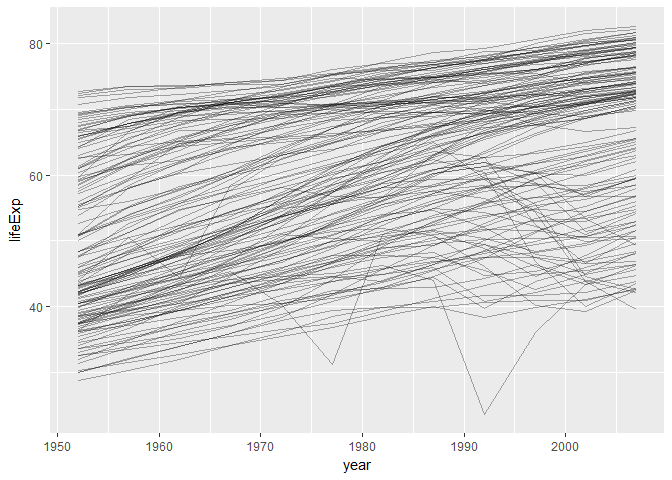<!-- -->

```r
nz <- filter(gapminder, country == "New Zealand")
nz %>% 
  ggplot(aes(year, lifeExp)) + 
  geom_line() + 
  ggtitle("Full data = ")
```

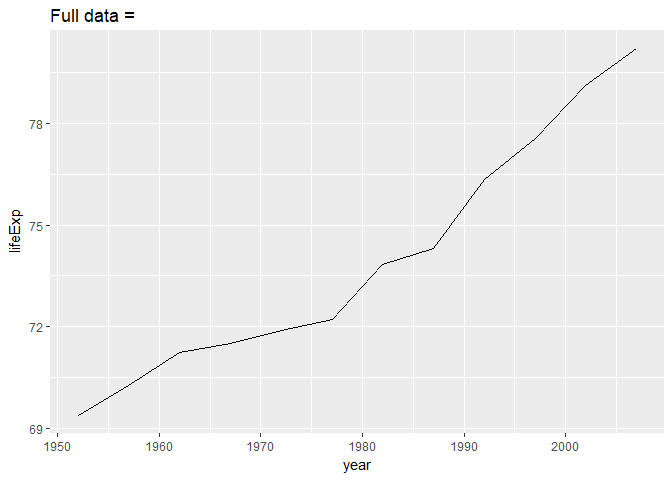<!-- -->

```r
nz_mod <- lm(lifeExp ~ year, data = nz)
nz %>% 
  add_predictions(nz_mod) %>%
  ggplot(aes(year, pred)) + 
  geom_line() + 
  ggtitle("Linear trend + ")
```

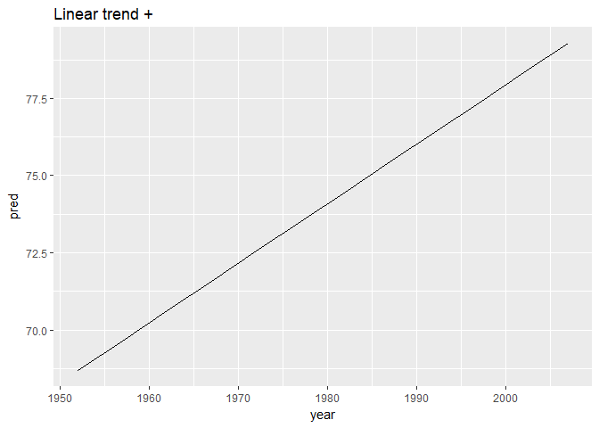<!-- -->

```r
nz %>% 
  add_residuals(nz_mod) %>% 
  ggplot(aes(year, resid)) + 
  geom_hline(yintercept = 0, colour = "white", size = 3) + 
  geom_line() + 
  ggtitle("Remaining pattern")
```

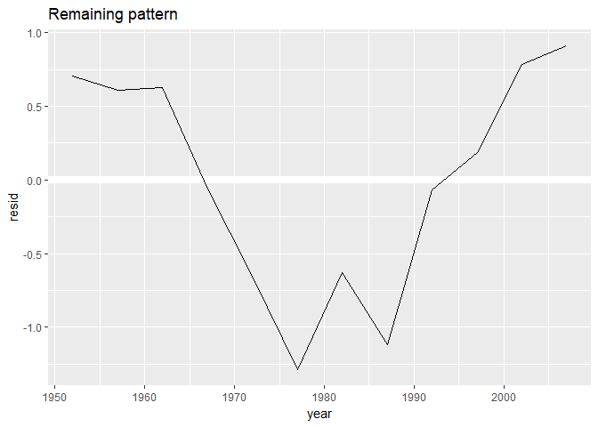<!-- -->

### 25.2.1 Nested data


```r
by_country <- gapminder %>% 
  group_by(country, continent) %>% 
  nest()
by_country
```

```
## # A tibble: 142 x 3
##        country continent              data
##         <fctr>    <fctr>            <list>
##  1 Afghanistan      Asia <tibble [12 x 4]>
##  2     Albania    Europe <tibble [12 x 4]>
##  3     Algeria    Africa <tibble [12 x 4]>
##  4      Angola    Africa <tibble [12 x 4]>
##  5   Argentina  Americas <tibble [12 x 4]>
##  6   Australia   Oceania <tibble [12 x 4]>
##  7     Austria    Europe <tibble [12 x 4]>
##  8     Bahrain      Asia <tibble [12 x 4]>
##  9  Bangladesh      Asia <tibble [12 x 4]>
## 10     Belgium    Europe <tibble [12 x 4]>
## # ... with 132 more rows
```

```r
by_country$data[[1]]
```

```
## # A tibble: 12 x 4
##     year lifeExp      pop gdpPercap
##    <int>   <dbl>    <int>     <dbl>
##  1  1952  28.801  8425333  779.4453
##  2  1957  30.332  9240934  820.8530
##  3  1962  31.997 10267083  853.1007
##  4  1967  34.020 11537966  836.1971
##  5  1972  36.088 13079460  739.9811
##  6  1977  38.438 14880372  786.1134
##  7  1982  39.854 12881816  978.0114
##  8  1987  40.822 13867957  852.3959
##  9  1992  41.674 16317921  649.3414
## 10  1997  41.763 22227415  635.3414
## 11  2002  42.129 25268405  726.7341
## 12  2007  43.828 31889923  974.5803
```

### 25.2.2 List-columns


```r
country_model <- function(df) {
  lm(lifeExp ~ year, data = df)
}
models <- map(by_country$data, country_model)

by_country <- by_country %>% 
  mutate(model = map(data, country_model))
by_country
```

```
## # A tibble: 142 x 4
##        country continent              data    model
##         <fctr>    <fctr>            <list>   <list>
##  1 Afghanistan      Asia <tibble [12 x 4]> <S3: lm>
##  2     Albania    Europe <tibble [12 x 4]> <S3: lm>
##  3     Algeria    Africa <tibble [12 x 4]> <S3: lm>
##  4      Angola    Africa <tibble [12 x 4]> <S3: lm>
##  5   Argentina  Americas <tibble [12 x 4]> <S3: lm>
##  6   Australia   Oceania <tibble [12 x 4]> <S3: lm>
##  7     Austria    Europe <tibble [12 x 4]> <S3: lm>
##  8     Bahrain      Asia <tibble [12 x 4]> <S3: lm>
##  9  Bangladesh      Asia <tibble [12 x 4]> <S3: lm>
## 10     Belgium    Europe <tibble [12 x 4]> <S3: lm>
## # ... with 132 more rows
```

```r
by_country %>% 
  filter(continent == "Europe")
```

```
## # A tibble: 30 x 4
##                   country continent              data    model
##                    <fctr>    <fctr>            <list>   <list>
##  1                Albania    Europe <tibble [12 x 4]> <S3: lm>
##  2                Austria    Europe <tibble [12 x 4]> <S3: lm>
##  3                Belgium    Europe <tibble [12 x 4]> <S3: lm>
##  4 Bosnia and Herzegovina    Europe <tibble [12 x 4]> <S3: lm>
##  5               Bulgaria    Europe <tibble [12 x 4]> <S3: lm>
##  6                Croatia    Europe <tibble [12 x 4]> <S3: lm>
##  7         Czech Republic    Europe <tibble [12 x 4]> <S3: lm>
##  8                Denmark    Europe <tibble [12 x 4]> <S3: lm>
##  9                Finland    Europe <tibble [12 x 4]> <S3: lm>
## 10                 France    Europe <tibble [12 x 4]> <S3: lm>
## # ... with 20 more rows
```

```r
by_country %>% 
  arrange(continent, country)
```

```
## # A tibble: 142 x 4
##                     country continent              data    model
##                      <fctr>    <fctr>            <list>   <list>
##  1                  Algeria    Africa <tibble [12 x 4]> <S3: lm>
##  2                   Angola    Africa <tibble [12 x 4]> <S3: lm>
##  3                    Benin    Africa <tibble [12 x 4]> <S3: lm>
##  4                 Botswana    Africa <tibble [12 x 4]> <S3: lm>
##  5             Burkina Faso    Africa <tibble [12 x 4]> <S3: lm>
##  6                  Burundi    Africa <tibble [12 x 4]> <S3: lm>
##  7                 Cameroon    Africa <tibble [12 x 4]> <S3: lm>
##  8 Central African Republic    Africa <tibble [12 x 4]> <S3: lm>
##  9                     Chad    Africa <tibble [12 x 4]> <S3: lm>
## 10                  Comoros    Africa <tibble [12 x 4]> <S3: lm>
## # ... with 132 more rows
```

### 25.2.3 Unnesting


```r
by_country <- by_country %>% 
  mutate(
    resids = map2(data, model, add_residuals)
  )
by_country
```

```
## # A tibble: 142 x 5
##        country continent              data    model            resids
##         <fctr>    <fctr>            <list>   <list>            <list>
##  1 Afghanistan      Asia <tibble [12 x 4]> <S3: lm> <tibble [12 x 5]>
##  2     Albania    Europe <tibble [12 x 4]> <S3: lm> <tibble [12 x 5]>
##  3     Algeria    Africa <tibble [12 x 4]> <S3: lm> <tibble [12 x 5]>
##  4      Angola    Africa <tibble [12 x 4]> <S3: lm> <tibble [12 x 5]>
##  5   Argentina  Americas <tibble [12 x 4]> <S3: lm> <tibble [12 x 5]>
##  6   Australia   Oceania <tibble [12 x 4]> <S3: lm> <tibble [12 x 5]>
##  7     Austria    Europe <tibble [12 x 4]> <S3: lm> <tibble [12 x 5]>
##  8     Bahrain      Asia <tibble [12 x 4]> <S3: lm> <tibble [12 x 5]>
##  9  Bangladesh      Asia <tibble [12 x 4]> <S3: lm> <tibble [12 x 5]>
## 10     Belgium    Europe <tibble [12 x 4]> <S3: lm> <tibble [12 x 5]>
## # ... with 132 more rows
```

```r
resids <- unnest(by_country, resids)
resids
```

```
## # A tibble: 1,704 x 7
##        country continent  year lifeExp      pop gdpPercap       resid
##         <fctr>    <fctr> <int>   <dbl>    <int>     <dbl>       <dbl>
##  1 Afghanistan      Asia  1952  28.801  8425333  779.4453 -1.10629487
##  2 Afghanistan      Asia  1957  30.332  9240934  820.8530 -0.95193823
##  3 Afghanistan      Asia  1962  31.997 10267083  853.1007 -0.66358159
##  4 Afghanistan      Asia  1967  34.020 11537966  836.1971 -0.01722494
##  5 Afghanistan      Asia  1972  36.088 13079460  739.9811  0.67413170
##  6 Afghanistan      Asia  1977  38.438 14880372  786.1134  1.64748834
##  7 Afghanistan      Asia  1982  39.854 12881816  978.0114  1.68684499
##  8 Afghanistan      Asia  1987  40.822 13867957  852.3959  1.27820163
##  9 Afghanistan      Asia  1992  41.674 16317921  649.3414  0.75355828
## 10 Afghanistan      Asia  1997  41.763 22227415  635.3414 -0.53408508
## # ... with 1,694 more rows
```

```r
resids %>% 
  ggplot(aes(year, resid)) +
    geom_line(aes(group = country), alpha = 1 / 3) + 
    geom_smooth(se = FALSE)
```

```
## `geom_smooth()` using method = 'gam'
```

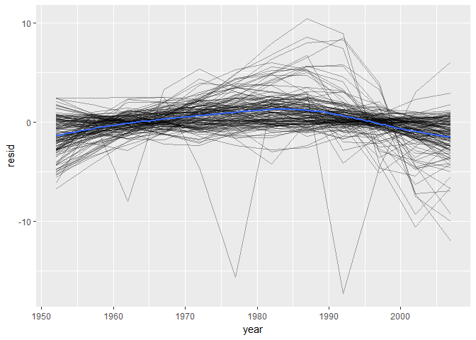<!-- -->

```r
resids %>% 
  ggplot(aes(year, resid, group = country)) +
    geom_line(alpha = 1 / 3) + 
    facet_wrap(~continent)
```

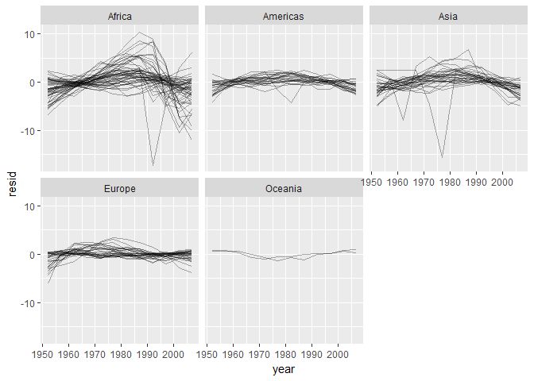<!-- -->

## 25.2.4 Model quality


```r
broom::glance(nz_mod)
```

```
##   r.squared adj.r.squared     sigma statistic      p.value df    logLik
## 1 0.9535846     0.9489431 0.8043472  205.4459 5.407324e-08  2 -13.32064
##        AIC    BIC deviance df.residual
## 1 32.64128 34.096 6.469743          10
```

```r
by_country %>% 
  mutate(glance = map(model, broom::glance)) %>% 
  unnest(glance)
```

```
## # A tibble: 142 x 16
##        country continent              data    model            resids
##         <fctr>    <fctr>            <list>   <list>            <list>
##  1 Afghanistan      Asia <tibble [12 x 4]> <S3: lm> <tibble [12 x 5]>
##  2     Albania    Europe <tibble [12 x 4]> <S3: lm> <tibble [12 x 5]>
##  3     Algeria    Africa <tibble [12 x 4]> <S3: lm> <tibble [12 x 5]>
##  4      Angola    Africa <tibble [12 x 4]> <S3: lm> <tibble [12 x 5]>
##  5   Argentina  Americas <tibble [12 x 4]> <S3: lm> <tibble [12 x 5]>
##  6   Australia   Oceania <tibble [12 x 4]> <S3: lm> <tibble [12 x 5]>
##  7     Austria    Europe <tibble [12 x 4]> <S3: lm> <tibble [12 x 5]>
##  8     Bahrain      Asia <tibble [12 x 4]> <S3: lm> <tibble [12 x 5]>
##  9  Bangladesh      Asia <tibble [12 x 4]> <S3: lm> <tibble [12 x 5]>
## 10     Belgium    Europe <tibble [12 x 4]> <S3: lm> <tibble [12 x 5]>
## # ... with 132 more rows, and 11 more variables: r.squared <dbl>,
## #   adj.r.squared <dbl>, sigma <dbl>, statistic <dbl>, p.value <dbl>,
## #   df <int>, logLik <dbl>, AIC <dbl>, BIC <dbl>, deviance <dbl>,
## #   df.residual <int>
```

```r
glance <- by_country %>% 
  mutate(glance = map(model, broom::glance)) %>% 
  unnest(glance, .drop = TRUE)
glance
```

```
## # A tibble: 142 x 13
##        country continent r.squared adj.r.squared     sigma  statistic
##         <fctr>    <fctr>     <dbl>         <dbl>     <dbl>      <dbl>
##  1 Afghanistan      Asia 0.9477123     0.9424835 1.2227880  181.24941
##  2     Albania    Europe 0.9105778     0.9016355 1.9830615  101.82901
##  3     Algeria    Africa 0.9851172     0.9836289 1.3230064  661.91709
##  4      Angola    Africa 0.8878146     0.8765961 1.4070091   79.13818
##  5   Argentina  Americas 0.9955681     0.9951249 0.2923072 2246.36635
##  6   Australia   Oceania 0.9796477     0.9776125 0.6206086  481.34586
##  7     Austria    Europe 0.9921340     0.9913474 0.4074094 1261.29629
##  8     Bahrain      Asia 0.9667398     0.9634138 1.6395865  290.65974
##  9  Bangladesh      Asia 0.9893609     0.9882970 0.9766908  929.92637
## 10     Belgium    Europe 0.9945406     0.9939946 0.2929025 1821.68840
## # ... with 132 more rows, and 7 more variables: p.value <dbl>, df <int>,
## #   logLik <dbl>, AIC <dbl>, BIC <dbl>, deviance <dbl>, df.residual <int>
```

```r
glance %>% 
  arrange(r.squared)
```

```
## # A tibble: 142 x 13
##             country continent  r.squared adj.r.squared    sigma statistic
##              <fctr>    <fctr>      <dbl>         <dbl>    <dbl>     <dbl>
##  1           Rwanda    Africa 0.01715964  -0.081124401 6.558269 0.1745923
##  2         Botswana    Africa 0.03402340  -0.062574259 6.112177 0.3522177
##  3         Zimbabwe    Africa 0.05623196  -0.038144842 7.205431 0.5958240
##  4           Zambia    Africa 0.05983644  -0.034179918 4.528713 0.6364471
##  5        Swaziland    Africa 0.06821087  -0.024968046 6.644091 0.7320419
##  6          Lesotho    Africa 0.08485635  -0.006658011 5.933934 0.9272463
##  7    Cote d'Ivoire    Africa 0.28337240   0.211709644 3.925590 3.9542491
##  8     South Africa    Africa 0.31246865   0.243715518 4.744356 4.5447914
##  9           Uganda    Africa 0.34215382   0.276369202 3.187668 5.2011219
## 10 Congo, Dem. Rep.    Africa 0.34820278   0.283023054 2.429489 5.3421948
## # ... with 132 more rows, and 7 more variables: p.value <dbl>, df <int>,
## #   logLik <dbl>, AIC <dbl>, BIC <dbl>, deviance <dbl>, df.residual <int>
```

```r
glance %>% 
  ggplot(aes(continent, r.squared)) + 
    geom_jitter(width = 0.5)
```

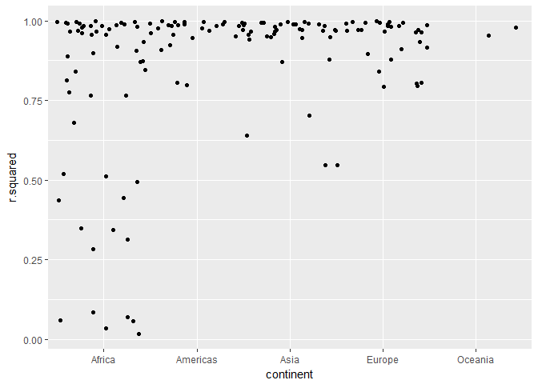<!-- -->

```r
bad_fit <- filter(glance, r.squared < 0.25)

gapminder %>% 
  semi_join(bad_fit, by = "country") %>% 
  ggplot(aes(year, lifeExp, colour = country)) +
    geom_line()
```

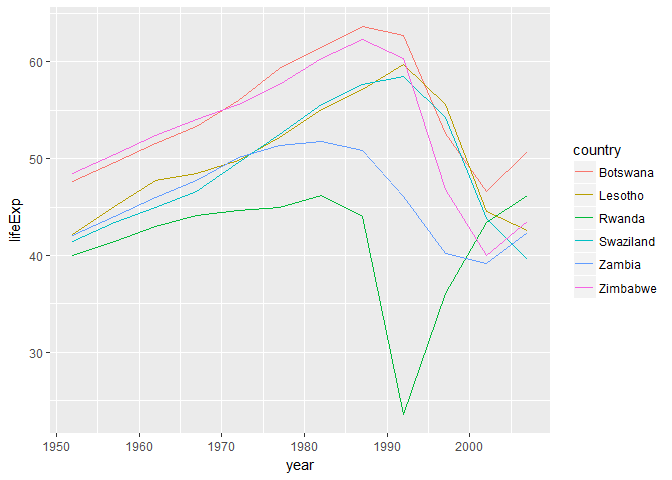<!-- -->

### 25.2.5 Exercises

1. A linear trend seems to be slightly too simple for the overall trend. Can you do better with a quadratic polynomial? How can you interpret the coefficients of the quadratic? (Hint you might want to transform `year` so that it has mean zero.)

2. Explore other methods for visualising the distribution of R2 per continent. You might want to try the ggbeeswarm package, which provides similar methods for avoiding overlaps as jitter, but uses deterministic methods.

3. To create the last plot (showing the data for the countries with the worst model fits), we needed two steps: we created a data frame with one row per country and then semi-joined it to the original dataset. It’s possible avoid this join if we use `unnest()` instead of `unnest(.drop = TRUE)`. How?

## 25.3 List-columns


```r
data.frame(x = list(1:3, 3:5))
```

```
##   x.1.3 x.3.5
## 1     1     3
## 2     2     4
## 3     3     5
```

```r
data.frame(
  x = I(list(1:3, 3:5)), 
  y = c("1, 2", "3, 4, 5")
)
```

```
##         x       y
## 1 1, 2, 3    1, 2
## 2 3, 4, 5 3, 4, 5
```

```r
tibble(
  x = list(1:3, 3:5), 
  y = c("1, 2", "3, 4, 5")
)
```

```
## # A tibble: 2 x 2
##           x       y
##      <list>   <chr>
## 1 <int [3]>    1, 2
## 2 <int [3]> 3, 4, 5
```

```r
tribble(
   ~x, ~y,
  1:3, "1, 2",
  3:5, "3, 4, 5"
)
```

```
## # A tibble: 2 x 2
##           x       y
##      <list>   <chr>
## 1 <int [3]>    1, 2
## 2 <int [3]> 3, 4, 5
```

## 25.4 Creating list-columns

### 25.4.1 With nesting


```r
gapminder %>% 
  group_by(country, continent) %>% 
  nest()
```

```
## # A tibble: 142 x 3
##        country continent              data
##         <fctr>    <fctr>            <list>
##  1 Afghanistan      Asia <tibble [12 x 4]>
##  2     Albania    Europe <tibble [12 x 4]>
##  3     Algeria    Africa <tibble [12 x 4]>
##  4      Angola    Africa <tibble [12 x 4]>
##  5   Argentina  Americas <tibble [12 x 4]>
##  6   Australia   Oceania <tibble [12 x 4]>
##  7     Austria    Europe <tibble [12 x 4]>
##  8     Bahrain      Asia <tibble [12 x 4]>
##  9  Bangladesh      Asia <tibble [12 x 4]>
## 10     Belgium    Europe <tibble [12 x 4]>
## # ... with 132 more rows
```

```r
gapminder %>% 
  nest(year:gdpPercap)
```

```
## # A tibble: 142 x 3
##        country continent              data
##         <fctr>    <fctr>            <list>
##  1 Afghanistan      Asia <tibble [12 x 4]>
##  2     Albania    Europe <tibble [12 x 4]>
##  3     Algeria    Africa <tibble [12 x 4]>
##  4      Angola    Africa <tibble [12 x 4]>
##  5   Argentina  Americas <tibble [12 x 4]>
##  6   Australia   Oceania <tibble [12 x 4]>
##  7     Austria    Europe <tibble [12 x 4]>
##  8     Bahrain      Asia <tibble [12 x 4]>
##  9  Bangladesh      Asia <tibble [12 x 4]>
## 10     Belgium    Europe <tibble [12 x 4]>
## # ... with 132 more rows
```

### 25.4.2 From vectorised functions


```r
df <- tribble(
  ~x1,
  "a,b,c", 
  "d,e,f,g"
) 

df %>% 
  mutate(x2 = stringr::str_split(x1, ","))
```

```
## # A tibble: 2 x 2
##        x1        x2
##     <chr>    <list>
## 1   a,b,c <chr [3]>
## 2 d,e,f,g <chr [4]>
```

```r
df %>% 
  mutate(x2 = stringr::str_split(x1, ",")) %>% 
  unnest()
```

```
## # A tibble: 7 x 2
##        x1    x2
##     <chr> <chr>
## 1   a,b,c     a
## 2   a,b,c     b
## 3   a,b,c     c
## 4 d,e,f,g     d
## 5 d,e,f,g     e
## 6 d,e,f,g     f
## 7 d,e,f,g     g
```

```r
sim <- tribble(
  ~f,      ~params,
  "runif", list(min = -1, max = -1),
  "rnorm", list(sd = 5),
  "rpois", list(lambda = 10)
)

sim %>%
  mutate(sims = invoke_map(f, params, n = 10))
```

```
## # A tibble: 3 x 3
##       f     params       sims
##   <chr>     <list>     <list>
## 1 runif <list [2]> <dbl [10]>
## 2 rnorm <list [1]> <dbl [10]>
## 3 rpois <list [1]> <int [10]>
```

### 25.4.3 From multivalued summaries


```r
mtcars %>% 
  group_by(cyl) %>% 
  summarise(q = quantile(mpg))
```

```
## Error in summarise_impl(.data, dots): Column `q` must be length 1 (a summary value), not 5
```

```r
mtcars %>% 
  group_by(cyl) %>% 
  summarise(q = list(quantile(mpg)))
```

```
## # A tibble: 3 x 2
##     cyl         q
##   <dbl>    <list>
## 1     4 <dbl [5]>
## 2     6 <dbl [5]>
## 3     8 <dbl [5]>
```

```r
probs <- c(0.01, 0.25, 0.5, 0.75, 0.99)
mtcars %>% 
  group_by(cyl) %>% 
  summarise(p = list(probs), q = list(quantile(mpg, probs))) %>% 
  unnest()
```

```
## # A tibble: 15 x 3
##      cyl     p      q
##    <dbl> <dbl>  <dbl>
##  1     4  0.01 21.410
##  2     4  0.25 22.800
##  3     4  0.50 26.000
##  4     4  0.75 30.400
##  5     4  0.99 33.750
##  6     6  0.01 17.818
##  7     6  0.25 18.650
##  8     6  0.50 19.700
##  9     6  0.75 21.000
## 10     6  0.99 21.376
## 11     8  0.01 10.400
## 12     8  0.25 14.400
## 13     8  0.50 15.200
## 14     8  0.75 16.250
## 15     8  0.99 19.135
```

### 25.4.4 From a named list


```r
x <- list(
  a = 1:5,
  b = 3:4, 
  c = 5:6
) 

df <- enframe(x)
df
```

```
## # A tibble: 3 x 2
##    name     value
##   <chr>    <list>
## 1     a <int [5]>
## 2     b <int [2]>
## 3     c <int [2]>
```

```r
df %>% 
  mutate(
    smry = map2_chr(name, value, ~ stringr::str_c(.x, ": ", .y[1]))
  )
```

```
## # A tibble: 3 x 3
##    name     value  smry
##   <chr>    <list> <chr>
## 1     a <int [5]>  a: 1
## 2     b <int [2]>  b: 3
## 3     c <int [2]>  c: 5
```
### 25.4.5 Exercises

1. List all the functions that you can think of that take a atomic vector and return a list.

2. Brainstorm useful summary functions that, like `quantile()`, return multiple values.

3. What’s missing in the following data frame? How does `quantile()` return that missing piece? Why isn’t that helpful here?


```r
mtcars %>% 
  group_by(cyl) %>% 
  summarise(q = list(quantile(mpg))) %>% 
  unnest()
```

```
## # A tibble: 15 x 2
##      cyl     q
##    <dbl> <dbl>
##  1     4 21.40
##  2     4 22.80
##  3     4 26.00
##  4     4 30.40
##  5     4 33.90
##  6     6 17.80
##  7     6 18.65
##  8     6 19.70
##  9     6 21.00
## 10     6 21.40
## 11     8 10.40
## 12     8 14.40
## 13     8 15.20
## 14     8 16.25
## 15     8 19.20
```

4. What does this code do? Why might might it be useful?


```r
mtcars %>% 
  group_by(cyl) %>% 
  summarise_each(funs(list))
```

```
## `summarise_each()` is deprecated.
## Use `summarise_all()`, `summarise_at()` or `summarise_if()` instead.
## To map `funs` over all variables, use `summarise_all()`
```

```
## # A tibble: 3 x 11
##     cyl        mpg       disp         hp       drat         wt       qsec
##   <dbl>     <list>     <list>     <list>     <list>     <list>     <list>
## 1     4 <dbl [11]> <dbl [11]> <dbl [11]> <dbl [11]> <dbl [11]> <dbl [11]>
## 2     6  <dbl [7]>  <dbl [7]>  <dbl [7]>  <dbl [7]>  <dbl [7]>  <dbl [7]>
## 3     8 <dbl [14]> <dbl [14]> <dbl [14]> <dbl [14]> <dbl [14]> <dbl [14]>
## # ... with 4 more variables: vs <list>, am <list>, gear <list>,
## #   carb <list>
```

## 25.5 Simplifying list-columns

### 25.5.1 List to vector


```r
df <- tribble(
  ~x,
  letters[1:5],
  1:3,
  runif(5)
)
  
df %>% mutate(
  type = map_chr(x, typeof),
  length = map_int(x, length)
)
```

```
## # A tibble: 3 x 3
##           x      type length
##      <list>     <chr>  <int>
## 1 <chr [5]> character      5
## 2 <int [3]>   integer      3
## 3 <dbl [5]>    double      5
```

```r
df <- tribble(
  ~x,
  list(a = 1, b = 2),
  list(a = 2, c = 4)
)
df %>% mutate(
  a = map_dbl(x, "a"),
  b = map_dbl(x, "b", .null = NA_real_)
)
```

```
## # A tibble: 2 x 3
##            x     a     b
##       <list> <dbl> <dbl>
## 1 <list [2]>     1     2
## 2 <list [2]>     2    NA
```

### 25.5.2 Unnesting


```r
tibble(x = 1:2, y = list(1:4, 1)) %>% unnest(y)
```

```
## # A tibble: 5 x 2
##       x     y
##   <int> <dbl>
## 1     1     1
## 2     1     2
## 3     1     3
## 4     1     4
## 5     2     1
```

```r
df1 <- tribble(
  ~x, ~y,           ~z,
   1, c("a", "b"), 1:2,
   2, "c",           3
)
df1
```

```
## # A tibble: 2 x 3
##       x         y         z
##   <dbl>    <list>    <list>
## 1     1 <chr [2]> <int [2]>
## 2     2 <chr [1]> <dbl [1]>
```

```r
df1 %>% unnest(y, z)
```

```
## # A tibble: 3 x 3
##       x     y     z
##   <dbl> <chr> <dbl>
## 1     1     a     1
## 2     1     b     2
## 3     2     c     3
```

```r
df2 <- tribble(
  ~x, ~y,           ~z,
   1, "a",         1:2,  
   2, c("b", "c"),   3
)
df2
```

```
## # A tibble: 2 x 3
##       x         y         z
##   <dbl>    <list>    <list>
## 1     1 <chr [1]> <int [2]>
## 2     2 <chr [2]> <dbl [1]>
```

```r
df2 %>% unnest(y, z)
```

```
## Error: All nested columns must have the same number of elements.
```

### 25.5.3 Exercises

1. Why might the `lengths()` function be useful for creating atomic vector columns from list-columns?

2. List the most common types of vector found in a data frame. What makes lists different?

## 25.6 Making tidy data with broom
