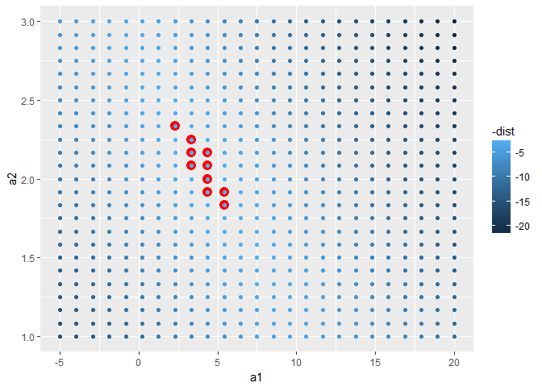
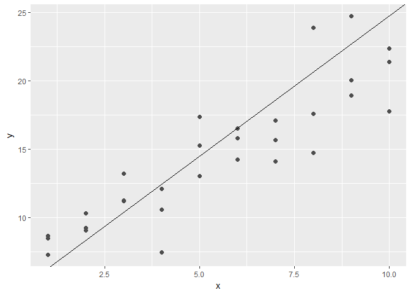

# 09_20_2017
John D.  
September 18, 2017  


# 22 Introduction

## 22.1 Hypothesis generation vs. hypothesis confirmation

# 23 Model basics

## 23.1 Introduction

### 23.1.1 Prerequisites


```r
library(tidyverse)
```

```
## Loading tidyverse: ggplot2
## Loading tidyverse: tibble
## Loading tidyverse: tidyr
## Loading tidyverse: readr
## Loading tidyverse: purrr
## Loading tidyverse: dplyr
```

```
## Conflicts with tidy packages ----------------------------------------------
```

```
## filter(): dplyr, stats
## lag():    dplyr, stats
```

```r
library(modelr)
options(na.action = na.warn)
```

## 23.2 A simple model


```r
ggplot(sim1, aes(x, y)) + 
  geom_point()
```

<!-- -->

```r
models <- tibble(
  a1 = runif(250, -20, 40),
  a2 = runif(250, -5, 5)
)

ggplot(sim1, aes(x, y)) + 
  geom_abline(aes(intercept = a1, slope = a2), data = models, alpha = 1/4) +
  geom_point() 
```

<!-- -->

```r
model1 <- function(a, data) {
  a[1] + data$x * a[2]
}

model1(c(7, 1.5), sim1)
```

```
##  [1]  8.5  8.5  8.5 10.0 10.0 10.0 11.5 11.5 11.5 13.0 13.0 13.0 14.5 14.5
## [15] 14.5 16.0 16.0 16.0 17.5 17.5 17.5 19.0 19.0 19.0 20.5 20.5 20.5 22.0
## [29] 22.0 22.0
```

```r
measure_distance <- function(mod, data) {
  diff <- data$y - model1(mod, data)
  sqrt(mean(diff ^ 2))
}
measure_distance(c(7, 1.5), sim1)
```

```
## [1] 2.665212
```

```r
sim1_dist <- function(a1, a2) {
  measure_distance(c(a1, a2), sim1)
}

models <- models %>% 
  mutate(dist = purrr::map2_dbl(a1, a2, sim1_dist))
models
```

```
## # A tibble: 250 x 3
##             a1         a2      dist
##          <dbl>      <dbl>     <dbl>
##  1  -3.9183478  0.4755009 17.535907
##  2  23.3473990  2.9837643 24.493837
##  3  17.1939095 -3.6075944 24.458957
##  4  18.2500598  0.7324477  8.048276
##  5   1.9848782  4.6845501 14.549244
##  6   9.9940366 -4.7797522 37.425855
##  7  -0.9389222 -0.5361711 20.876473
##  8  25.1818479 -3.2554874 17.452197
##  9 -18.1156416  4.7407442 11.005958
## 10   9.1016405  4.1960216 17.903687
## # ... with 240 more rows
```

```r
ggplot(sim1, aes(x, y)) + 
  geom_point(size = 2, colour = "grey30") + 
  geom_abline(
    aes(intercept = a1, slope = a2, colour = -dist), 
    data = filter(models, rank(dist) <= 10)
  )
```

<!-- -->

```r
ggplot(models, aes(a1, a2)) +
  geom_point(data = filter(models, rank(dist) <= 10), size = 4, colour = "red") +
  geom_point(aes(colour = -dist))
```

<!-- -->

```r
grid <- expand.grid(
  a1 = seq(-5, 20, length = 25),
  a2 = seq(1, 3, length = 25)
  ) %>% 
  mutate(dist = purrr::map2_dbl(a1, a2, sim1_dist))

grid %>% 
  ggplot(aes(a1, a2)) +
  geom_point(data = filter(grid, rank(dist) <= 10), size = 4, colour = "red") +
  geom_point(aes(colour = -dist))
```

<!-- -->

```r
ggplot(sim1, aes(x, y)) + 
  geom_point(size = 2, colour = "grey30") + 
  geom_abline(
    aes(intercept = a1, slope = a2, colour = -dist), 
    data = filter(grid, rank(dist) <= 10)
  )
```

<!-- -->

```r
best <- optim(c(0, 0), measure_distance, data = sim1)
best$par
```

```
## [1] 4.222248 2.051204
```

```r
ggplot(sim1, aes(x, y)) + 
  geom_point(size = 2, colour = "grey30") + 
  geom_abline(intercept = best$par[1], slope = best$par[2])
```

<!-- -->

```r
sim1_mod <- lm(y ~ x, data = sim1)
coef(sim1_mod)
```

```
## (Intercept)           x 
##    4.220822    2.051533
```

### 23.2.1 Exercises

1. One downside of the linear model is that it is sensitive to unusual values because the distance incorporates a squared term. Fit a linear model to the simulated data below, and visualise the results. Rerun a few times to generate different simulated datasets. What do you notice about the model?


```r
sim_models <- function(){
  sim1a <- tibble(
  x = rep(1:10, each = 3),
  y = x * 1.5 + 6 + rt(length(x), df = 2)
)

ggplot(sim1a, aes(x, y)) + 
  geom_point(size = 2, colour = "grey30") + 
  geom_abline(intercept = best$par[1], slope = best$par[2])
}

sim_models()
```

<!-- -->

```r
sim_models()
```

<!-- -->

```r
sim_models()
```

<!-- -->

```r
sim_models()
```

<!-- -->

The best model does not fit as nicely when you have unusual values. The model is forced to adapt to account for the unusual values. If they were not present, the model would line up more nicely with the rest of the data.

2. One way to make linear models more robust is to use a different distance measure. For example, instead of root-mean-squared distance, you could use mean-absolute distance:


```r
measure_distance <- function(mod, data) {
  diff <- data$y - model1(mod, data)
  sqrt(mean(diff ^ 2))
}

measure_distance2 <- function(mod, data) {
  diff <- data$y - model1(mod, data)
  mean(abs(diff))
}

best <- optim(c(0, 0), measure_distance, data = sim1)
best$par
```

```
## [1] 4.222248 2.051204
```

```r
best <- optim(c(0, 0), measure_distance2, data = sim1)
best$par
```

```
## [1] 4.364852 2.048918
```

They are similar but not the same.

3. One challenge with performing numerical optimisation is that it’s only guaranteed to find one local optima. What’s the problem with optimising a three parameter model like this?


```r
model1 <- function(a, data) {
  a[1] + data$x * a[2] + a[3]
}
```

There are unlimited combinations of a[1] and a[3] that would give you the same optimum y intercept.
