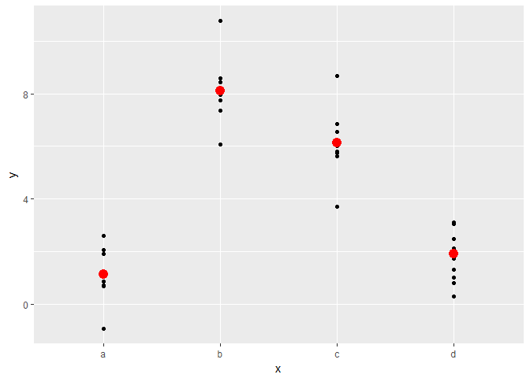
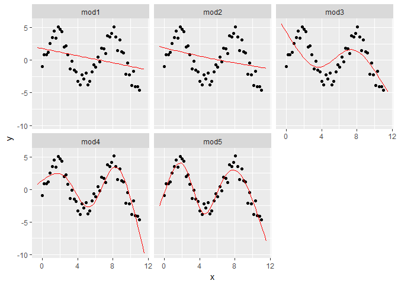

# 09_27_2017
John D.  
September 26, 2017  


# 23 Model basics

### 23.1.1 Prerequisites


```r
library(tidyverse)
```

```
## Loading tidyverse: ggplot2
## Loading tidyverse: tibble
## Loading tidyverse: tidyr
## Loading tidyverse: readr
## Loading tidyverse: purrr
## Loading tidyverse: dplyr
```

```
## Conflicts with tidy packages ----------------------------------------------
```

```
## filter(): dplyr, stats
## lag():    dplyr, stats
```

```r
library(modelr)
options(na.action = na.warn)
sim1_mod <- lm(y ~ x, data = sim1)
```

## 23.3 Visualising models

### 23.3.1 Predictions


```r
grid <- sim1 %>% 
  data_grid(x) 
grid
```

```
## # A tibble: 10 x 1
##        x
##    <int>
##  1     1
##  2     2
##  3     3
##  4     4
##  5     5
##  6     6
##  7     7
##  8     8
##  9     9
## 10    10
```

```r
sim1_mod <- lm(y ~ x, data = sim1)

grid <- grid %>% 
  add_predictions(sim1_mod) 
grid
```

```
## # A tibble: 10 x 2
##        x      pred
##    <int>     <dbl>
##  1     1  6.272355
##  2     2  8.323888
##  3     3 10.375421
##  4     4 12.426954
##  5     5 14.478487
##  6     6 16.530020
##  7     7 18.581553
##  8     8 20.633087
##  9     9 22.684620
## 10    10 24.736153
```

```r
ggplot(sim1, aes(x)) +
  geom_point(aes(y = y)) +
  geom_line(aes(y = pred), data = grid, colour = "blue", size = 1)
```

<!-- -->

### 23.3.2 Residuals


```r
sim1 <- sim1 %>% 
  add_residuals(sim1_mod)
sim1
```

```
## # A tibble: 30 x 3
##        x         y        resid
##    <int>     <dbl>        <dbl>
##  1     1  4.199913 -2.072442018
##  2     1  7.510634  1.238279125
##  3     1  2.125473 -4.146882207
##  4     2  8.988857  0.664969362
##  5     2 10.243105  1.919217378
##  6     2 11.296823  2.972935148
##  7     3  7.356365 -3.019056466
##  8     3 10.505349  0.129928252
##  9     3 10.511601  0.136179642
## 10     4 12.434589  0.007634878
## # ... with 20 more rows
```

```r
ggplot(sim1, aes(resid)) + 
  geom_freqpoly(binwidth = 0.5)
```

<!-- -->

```r
ggplot(sim1, aes(x, resid)) + 
  geom_ref_line(h = 0) +
  geom_point() 
```

<!-- -->

### 23.3.3 Exercises

1. Instead of using `lm()` to fit a straight line, you can use `loess()` to fit a smooth curve. Repeat the process of model fitting, grid generation, predictions, and visualisation on `sim1` using `loess()` instead of `lm()`. How does the result compare to `geom_smooth()`?


```r
rm(sim1)

grid <- sim1 %>% 
  data_grid(x) 
grid
```

```
## # A tibble: 10 x 1
##        x
##    <int>
##  1     1
##  2     2
##  3     3
##  4     4
##  5     5
##  6     6
##  7     7
##  8     8
##  9     9
## 10    10
```

```r
sim1_mod_a <- lm(y ~ x, data = sim1)
sim1_mod_b <- loess(y ~ x, data = sim1)


grid <- grid %>% 
  add_predictions(sim1_mod_a, var = "lm")
grid <- grid %>% 
  add_predictions(sim1_mod_b, var = "loess")
grid
```

```
## # A tibble: 10 x 3
##        x        lm     loess
##    <int>     <dbl>     <dbl>
##  1     1  6.272355  5.338000
##  2     2  8.323888  8.274913
##  3     3 10.375421 10.809582
##  4     4 12.426954 12.779762
##  5     5 14.478487 14.569125
##  6     6 16.530020 16.608674
##  7     7 18.581553 18.659348
##  8     8 20.633087 20.815760
##  9     9 22.684620 22.583429
## 10    10 24.736153 23.979611
```

```r
# plot

ggplot(sim1, aes(x)) +
  geom_point(aes(y = y)) +
  geom_line(aes(y = lm), data = grid, colour = "red", size = 1) +
  geom_line(aes(y = loess), data = grid, colour = "blue", size = 1)
```

<!-- -->

```r
ggplot(sim1, aes(x)) +
  geom_point(aes(y = y)) +
  geom_line(aes(y = lm), data = grid, colour = "red", size = 1) +
  geom_line(aes(y = loess), data = grid, colour = "darkblue", size = 3) +
  geom_line(aes(y = y), colour = "orange", size = 1) +
  geom_smooth(aes(y = y), colour = "lightblue", size = 1)
```

```
## `geom_smooth()` using method = 'loess'
```

<!-- -->

```r
# redo with functions listed in problem 2

grid <- sim1 %>% 
  data_grid(x) 
grid
```

```
## # A tibble: 10 x 1
##        x
##    <int>
##  1     1
##  2     2
##  3     3
##  4     4
##  5     5
##  6     6
##  7     7
##  8     8
##  9     9
## 10    10
```

```r
sim1_lm <- lm(y ~ x, data = sim1)
sim1_loess <- loess(y ~ x, data = sim1)

grid <- grid %>% gather_predictions(sim1_lm,sim1_loess)
grid
```

```
## # A tibble: 20 x 3
##         model     x      pred
##         <chr> <int>     <dbl>
##  1    sim1_lm     1  6.272355
##  2    sim1_lm     2  8.323888
##  3    sim1_lm     3 10.375421
##  4    sim1_lm     4 12.426954
##  5    sim1_lm     5 14.478487
##  6    sim1_lm     6 16.530020
##  7    sim1_lm     7 18.581553
##  8    sim1_lm     8 20.633087
##  9    sim1_lm     9 22.684620
## 10    sim1_lm    10 24.736153
## 11 sim1_loess     1  5.338000
## 12 sim1_loess     2  8.274913
## 13 sim1_loess     3 10.809582
## 14 sim1_loess     4 12.779762
## 15 sim1_loess     5 14.569125
## 16 sim1_loess     6 16.608674
## 17 sim1_loess     7 18.659348
## 18 sim1_loess     8 20.815760
## 19 sim1_loess     9 22.583429
## 20 sim1_loess    10 23.979611
```

```r
ggplot(sim1, aes(x)) +
  geom_point(aes(y = y)) +
  geom_line(aes(y = pred, color = model), data = grid, size = 1)
```

<!-- -->

`geom_smooth()` fits a line using the model method 'loess'. They overlap

2. `add_predictions()` is paired with `gather_predictions()` and `spread_predictions()`. How do these three functions differ?

All work on a data frame. `add_prediction()` adds a single new column, default name 'pred', to the input data frame. `spread_predictions()` adds one column for each model. `gather_prections()` adds two columns .model and .pred, and repeats the input rows for each model. `gather_prections()` very useful for visualizing multiple lines on the same plot with labels.


```r
df <- tibble::data_frame(
  x = sort(runif(100)),
  y = 5 * x + 0.5 * x ^ 2 + 3 + rnorm(length(x))
)
plot(df)
```

<!-- -->

```r
m1 <- lm(y ~ x, data = df)
grid <- data.frame(x = seq(0, 1, length = 10))
grid %>% add_predictions(m1)
```

```
##            x     pred
## 1  0.0000000 2.774805
## 2  0.1111111 3.378119
## 3  0.2222222 3.981432
## 4  0.3333333 4.584746
## 5  0.4444444 5.188059
## 6  0.5555556 5.791373
## 7  0.6666667 6.394686
## 8  0.7777778 6.998000
## 9  0.8888889 7.601313
## 10 1.0000000 8.204627
```

```r
m2 <- lm(y ~ poly(x, 2), data = df)
grid %>% spread_predictions(m1, m2)
```

```
##            x       m1       m2
## 1  0.0000000 2.774805 2.974961
## 2  0.1111111 3.378119 3.464195
## 3  0.2222222 3.981432 3.982251
## 4  0.3333333 4.584746 4.529128
## 5  0.4444444 5.188059 5.104826
## 6  0.5555556 5.791373 5.709345
## 7  0.6666667 6.394686 6.342685
## 8  0.7777778 6.998000 7.004847
## 9  0.8888889 7.601313 7.695829
## 10 1.0000000 8.204627 8.415633
```

```r
grid %>% gather_predictions(m1, m2)
```

```
##    model         x     pred
## 1     m1 0.0000000 2.774805
## 2     m1 0.1111111 3.378119
## 3     m1 0.2222222 3.981432
## 4     m1 0.3333333 4.584746
## 5     m1 0.4444444 5.188059
## 6     m1 0.5555556 5.791373
## 7     m1 0.6666667 6.394686
## 8     m1 0.7777778 6.998000
## 9     m1 0.8888889 7.601313
## 10    m1 1.0000000 8.204627
## 11    m2 0.0000000 2.974961
## 12    m2 0.1111111 3.464195
## 13    m2 0.2222222 3.982251
## 14    m2 0.3333333 4.529128
## 15    m2 0.4444444 5.104826
## 16    m2 0.5555556 5.709345
## 17    m2 0.6666667 6.342685
## 18    m2 0.7777778 7.004847
## 19    m2 0.8888889 7.695829
## 20    m2 1.0000000 8.415633
```

3. What does `geom_ref_line()` do? What package does it come from? Why is displaying a reference line in plots showing residuals useful and important?

Add a reference line. From the modelr package, but modifies ggplot objects. Displaying a reference line in plots showing residuals is usefuly because it gives you a reference for how far from 0 the residuals are.

4. Why might you want to look at a frequency polygon of absolute residuals? What are the pros and cons compared to looking at the raw residuals?

Gives you a better overall view of how the model is performing. By doing so you lose information on if the model is over or under predicting.

## 23.4 Formulas and model families


```r
df <- tribble(
  ~y, ~x1, ~x2,
  4, 2, 5,
  5, 1, 6
)

model_matrix(df, y ~ x1)
```

```
## # A tibble: 2 x 2
##   `(Intercept)`    x1
##           <dbl> <dbl>
## 1             1     2
## 2             1     1
```

```r
model_matrix(df, y ~ x1 - 1)
```

```
## # A tibble: 2 x 1
##      x1
##   <dbl>
## 1     2
## 2     1
```

```r
model_matrix(df, y ~ x1 + x2)
```

```
## # A tibble: 2 x 3
##   `(Intercept)`    x1    x2
##           <dbl> <dbl> <dbl>
## 1             1     2     5
## 2             1     1     6
```

### 23.4.1 Categorical variables


```r
df <- tribble(
  ~ sex, ~ response,
  "male", 1,
  "female", 2,
  "male", 1
)

model_matrix(df, response ~ sex)
```

```
## # A tibble: 3 x 2
##   `(Intercept)` sexmale
##           <dbl>   <dbl>
## 1             1       1
## 2             1       0
## 3             1       1
```

```r
ggplot(sim2) + 
  geom_point(aes(x, y))
```

<!-- -->

```r
mod2 <- lm(y ~ x, data = sim2)

grid <- sim2 %>% 
  data_grid(x) %>% 
  add_predictions(mod2)
grid
```

```
## # A tibble: 4 x 2
##       x     pred
##   <chr>    <dbl>
## 1     a 1.152166
## 2     b 8.116039
## 3     c 6.127191
## 4     d 1.910981
```

```r
ggplot(sim2, aes(x)) + 
  geom_point(aes(y = y)) +
  geom_point(data = grid, aes(y = pred), colour = "red", size = 4)
```

<!-- -->

```r
tibble(x = "e") %>% 
  add_predictions(mod2)
```

```
## Error in model.frame.default(Terms, newdata, na.action = na.action, xlev = object$xlevels): factor x has new level e
```

### 23.4.2 Interactions (continuous and categorical)


```r
sim3
```

```
## # A tibble: 120 x 5
##       x1     x2   rep          y    sd
##    <int> <fctr> <int>      <dbl> <dbl>
##  1     1      a     1 -0.5707363     2
##  2     1      a     2  1.1841503     2
##  3     1      a     3  2.2373204     2
##  4     1      b     1  7.4366963     2
##  5     1      b     2  8.5182934     2
##  6     1      b     3  7.7239098     2
##  7     1      c     1  6.5067480     2
##  8     1      c     2  5.7900643     2
##  9     1      c     3  6.0721817     2
## 10     1      d     1  2.1096727     2
## # ... with 110 more rows
```

```r
ggplot(sim3, aes(x1, y)) + 
  geom_point(aes(colour = x2))
```

<!-- -->

```r
mod1 <- lm(y ~ x1 + x2, data = sim3)
mod2 <- lm(y ~ x1 * x2, data = sim3)

grid <- sim3 %>% 
  data_grid(x1, x2) %>% 
  gather_predictions(mod1, mod2)
grid
```

```
## # A tibble: 80 x 4
##    model    x1     x2     pred
##    <chr> <int> <fctr>    <dbl>
##  1  mod1     1      a 1.674928
##  2  mod1     1      b 4.562739
##  3  mod1     1      c 6.480664
##  4  mod1     1      d 4.034515
##  5  mod1     2      a 1.478190
##  6  mod1     2      b 4.366001
##  7  mod1     2      c 6.283926
##  8  mod1     2      d 3.837777
##  9  mod1     3      a 1.281453
## 10  mod1     3      b 4.169263
## # ... with 70 more rows
```

```r
ggplot(sim3, aes(x1, y, colour = x2)) + 
  geom_point() + 
  geom_line(data = grid, aes(y = pred)) + 
  facet_wrap(~ model)
```

<!-- -->

```r
sim3 <- sim3 %>% 
  gather_residuals(mod1, mod2)

ggplot(sim3, aes(x1, resid, colour = x2)) + 
  geom_point() + 
  facet_grid(model ~ x2)
```

<!-- -->

### 23.4.3 Interactions (two continuous)


```r
mod1 <- lm(y ~ x1 + x2, data = sim4)
mod2 <- lm(y ~ x1 * x2, data = sim4)

grid <- sim4 %>% 
  data_grid(
    x1 = seq_range(x1, 5), 
    x2 = seq_range(x2, 5) 
  ) %>% 
  gather_predictions(mod1, mod2)
grid
```

```
## # A tibble: 50 x 4
##    model    x1    x2       pred
##    <chr> <dbl> <dbl>      <dbl>
##  1  mod1  -1.0  -1.0  0.9963094
##  2  mod1  -1.0  -0.5 -0.3949484
##  3  mod1  -1.0   0.0 -1.7862061
##  4  mod1  -1.0   0.5 -3.1774639
##  5  mod1  -1.0   1.0 -4.5687216
##  6  mod1  -0.5  -1.0  1.9071424
##  7  mod1  -0.5  -0.5  0.5158847
##  8  mod1  -0.5   0.0 -0.8753731
##  9  mod1  -0.5   0.5 -2.2666308
## 10  mod1  -0.5   1.0 -3.6578886
## # ... with 40 more rows
```

```r
seq_range(c(0.0123, 0.923423), n = 5)
```

```
## [1] 0.0123000 0.2400808 0.4678615 0.6956423 0.9234230
```

```r
seq_range(c(0.0123, 0.923423), n = 5, pretty = TRUE)
```

```
## [1] 0.0 0.2 0.4 0.6 0.8 1.0
```

```r
x1 <- rcauchy(100)
seq_range(x1, n = 5)
```

```
## [1] -22.71055  27.89663  78.50382 129.11100 179.71819
```

```r
seq_range(x1, n = 5, trim = 0.10)
```

```
## [1] -9.114390 -5.564895 -2.015401  1.534093  5.083588
```

```r
seq_range(x1, n = 5, trim = 0.25)
```

```
## [1] -2.2033104 -0.9460673  0.3111759  1.5684190  2.8256622
```

```r
seq_range(x1, n = 5, trim = 0.50)
```

```
## [1] -0.9512603 -0.4238513  0.1035577  0.6309666  1.1583756
```

```r
x2 <- c(0, 1)
seq_range(x2, n = 5)
```

```
## [1] 0.00 0.25 0.50 0.75 1.00
```

```r
seq_range(x2, n = 5, expand = 0.10)
```

```
## [1] -0.050  0.225  0.500  0.775  1.050
```

```r
seq_range(x2, n = 5, expand = 0.25)
```

```
## [1] -0.1250  0.1875  0.5000  0.8125  1.1250
```

```r
seq_range(x2, n = 5, expand = 0.50)
```

```
## [1] -0.250  0.125  0.500  0.875  1.250
```

```r
ggplot(grid, aes(x1, x2)) + 
  geom_tile(aes(fill = pred)) + 
  facet_wrap(~ model)
```

<!-- -->

```r
ggplot(grid, aes(x1, pred, colour = x2, group = x2)) + 
  geom_line() +
  facet_wrap(~ model)
```

<!-- -->

```r
ggplot(grid, aes(x2, pred, colour = x1, group = x1)) + 
  geom_line() +
  facet_wrap(~ model)
```

<!-- -->

### 23.4.4 Transformations


```r
df <- tribble(
  ~y, ~x,
   1,  1,
   2,  2, 
   3,  3
)
model_matrix(df, y ~ x^2 + x)
```

```
## # A tibble: 3 x 2
##   `(Intercept)`     x
##           <dbl> <dbl>
## 1             1     1
## 2             1     2
## 3             1     3
```

```r
model_matrix(df, y ~ I(x^2) + x)
```

```
## # A tibble: 3 x 3
##   `(Intercept)` `I(x^2)`     x
##           <dbl>    <dbl> <dbl>
## 1             1        1     1
## 2             1        4     2
## 3             1        9     3
```

```r
model_matrix(df, y ~ poly(x, 2))
```

```
## # A tibble: 3 x 3
##   `(Intercept)` `poly(x, 2)1` `poly(x, 2)2`
##           <dbl>         <dbl>         <dbl>
## 1             1 -7.071068e-01     0.4082483
## 2             1 -7.850462e-17    -0.8164966
## 3             1  7.071068e-01     0.4082483
```

```r
library(splines)
model_matrix(df, y ~ ns(x, 2))
```

```
## # A tibble: 3 x 3
##   `(Intercept)` `ns(x, 2)1` `ns(x, 2)2`
##           <dbl>       <dbl>       <dbl>
## 1             1   0.0000000   0.0000000
## 2             1   0.5662628  -0.2108419
## 3             1   0.3440969   0.7706021
```

```r
sim5 <- tibble(
  x = seq(0, 3.5 * pi, length = 50),
  y = 4 * sin(x) + rnorm(length(x))
)
sim5
```

```
## # A tibble: 50 x 2
##            x          y
##        <dbl>      <dbl>
##  1 0.0000000 -0.9688361
##  2 0.2243995  0.8512040
##  3 0.4487990  0.8853438
##  4 0.6731984  1.1621536
##  5 0.8975979  2.5221775
##  6 1.1219974  3.4678624
##  7 1.3463969  4.5074174
##  8 1.5707963  3.4066964
##  9 1.7951958  5.0607897
## 10 2.0195953  4.7206168
## # ... with 40 more rows
```

```r
ggplot(sim5, aes(x, y)) +
  geom_point()
```

<!-- -->

```r
mod1 <- lm(y ~ ns(x, 1), data = sim5)
mod2 <- lm(y ~ ns(x, 2), data = sim5)
mod3 <- lm(y ~ ns(x, 3), data = sim5)
mod4 <- lm(y ~ ns(x, 4), data = sim5)
mod5 <- lm(y ~ ns(x, 5), data = sim5)

grid <- sim5 %>% 
  data_grid(x = seq_range(x, n = 50, expand = 0.1)) %>% 
  gather_predictions(mod1, mod2, mod3, mod4, mod5, .pred = "y")
grid
```

```
## # A tibble: 250 x 3
##    model           x        y
##    <chr>       <dbl>    <dbl>
##  1  mod1 -0.54977871 1.929541
##  2  mod1 -0.30293929 1.862413
##  3  mod1 -0.05609987 1.795285
##  4  mod1  0.19073955 1.728157
##  5  mod1  0.43757898 1.661029
##  6  mod1  0.68441840 1.593901
##  7  mod1  0.93125782 1.526773
##  8  mod1  1.17809725 1.459645
##  9  mod1  1.42493667 1.392517
## 10  mod1  1.67177609 1.325389
## # ... with 240 more rows
```

```r
ggplot(sim5, aes(x, y)) + 
  geom_point() +
  geom_line(data = grid, colour = "red") +
  facet_wrap(~ model)
```

<!-- -->

### 23.4.5 Exercises

1. What happens if you repeat the analysis of `sim2` using a model without an intercept. What happens to the model equation? What happens to the predictions?

```r
model_matrix(df, y ~ x)
```

```
## # A tibble: 3 x 2
##   `(Intercept)`     x
##           <dbl> <dbl>
## 1             1     1
## 2             1     2
## 3             1     3
```

```r
model_matrix(df, y ~ x - 1)
```

```
## # A tibble: 3 x 1
##       x
##   <dbl>
## 1     1
## 2     2
## 3     3
```

```r
ggplot(sim2) + 
  geom_point(aes(x, y))
```

<!-- -->

```r
mod1 <- lm(y ~ x, data = sim2)
mod2 <- lm(y ~ x - 1, data = sim2)

mod1
```

```
## 
## Call:
## lm(formula = y ~ x, data = sim2)
## 
## Coefficients:
## (Intercept)           xb           xc           xd  
##      1.1522       6.9639       4.9750       0.7588
```

```r
mod2
```

```
## 
## Call:
## lm(formula = y ~ x - 1, data = sim2)
## 
## Coefficients:
##    xa     xb     xc     xd  
## 1.152  8.116  6.127  1.911
```

```r
grid <- sim2 %>% 
  data_grid(x) %>% 
  gather_predictions(mod1,mod2)
grid
```

```
## # A tibble: 8 x 3
##   model     x     pred
##   <chr> <chr>    <dbl>
## 1  mod1     a 1.152166
## 2  mod1     b 8.116039
## 3  mod1     c 6.127191
## 4  mod1     d 1.910981
## 5  mod2     a 1.152166
## 6  mod2     b 8.116039
## 7  mod2     c 6.127191
## 8  mod2     d 1.910981
```

```r
ggplot(sim2, aes(x)) + 
  geom_point(aes(y = y)) +
  geom_point(data = grid, aes(y = pred), colour = "red", size = 4) +
  facet_wrap(~model)
```

<!-- -->

Nothing really changed. Intercept did not make a difference, at least in my case

2. Use `model_matrix()` to explore the equations generated for the models I fit to `sim3` and `sim4`. Why is `*` a good shorthand for interaction?


```r
model_matrix(y ~ x1 + x2, data = sim3)
```

```
## # A tibble: 240 x 5
##    `(Intercept)`    x1   x2b   x2c   x2d
##            <dbl> <dbl> <dbl> <dbl> <dbl>
##  1             1     1     0     0     0
##  2             1     1     0     0     0
##  3             1     1     0     0     0
##  4             1     1     1     0     0
##  5             1     1     1     0     0
##  6             1     1     1     0     0
##  7             1     1     0     1     0
##  8             1     1     0     1     0
##  9             1     1     0     1     0
## 10             1     1     0     0     1
## # ... with 230 more rows
```

```r
model_matrix(y ~ x1 * x2, data = sim3)
```

```
## # A tibble: 240 x 8
##    `(Intercept)`    x1   x2b   x2c   x2d `x1:x2b` `x1:x2c` `x1:x2d`
##            <dbl> <dbl> <dbl> <dbl> <dbl>    <dbl>    <dbl>    <dbl>
##  1             1     1     0     0     0        0        0        0
##  2             1     1     0     0     0        0        0        0
##  3             1     1     0     0     0        0        0        0
##  4             1     1     1     0     0        1        0        0
##  5             1     1     1     0     0        1        0        0
##  6             1     1     1     0     0        1        0        0
##  7             1     1     0     1     0        0        1        0
##  8             1     1     0     1     0        0        1        0
##  9             1     1     0     1     0        0        1        0
## 10             1     1     0     0     1        0        0        1
## # ... with 230 more rows
```

```r
model_matrix(y ~ x1 + x2, data = sim4)
```

```
## # A tibble: 300 x 3
##    `(Intercept)`    x1         x2
##            <dbl> <dbl>      <dbl>
##  1             1    -1 -1.0000000
##  2             1    -1 -1.0000000
##  3             1    -1 -1.0000000
##  4             1    -1 -0.7777778
##  5             1    -1 -0.7777778
##  6             1    -1 -0.7777778
##  7             1    -1 -0.5555556
##  8             1    -1 -0.5555556
##  9             1    -1 -0.5555556
## 10             1    -1 -0.3333333
## # ... with 290 more rows
```

```r
model_matrix(y ~ x1 * x2, data = sim4)
```

```
## # A tibble: 300 x 4
##    `(Intercept)`    x1         x2   `x1:x2`
##            <dbl> <dbl>      <dbl>     <dbl>
##  1             1    -1 -1.0000000 1.0000000
##  2             1    -1 -1.0000000 1.0000000
##  3             1    -1 -1.0000000 1.0000000
##  4             1    -1 -0.7777778 0.7777778
##  5             1    -1 -0.7777778 0.7777778
##  6             1    -1 -0.7777778 0.7777778
##  7             1    -1 -0.5555556 0.5555556
##  8             1    -1 -0.5555556 0.5555556
##  9             1    -1 -0.5555556 0.5555556
## 10             1    -1 -0.3333333 0.3333333
## # ... with 290 more rows
```

It would be a pain to write out the whole equation explicitly

3. Using the basic principles, convert the formulas in the following two models into functions. (Hint: start by converting the categorical variable into 0-1 variables.)


```r
mod1 <- lm(y ~ x1 + x2, data = sim3)
mod2 <- lm(y ~ x1 * x2, data = sim3)
mod1
```

```
## 
## Call:
## lm(formula = y ~ x1 + x2, data = sim3)
## 
## Coefficients:
## (Intercept)           x1          x2b          x2c          x2d  
##      1.8717      -0.1967       2.8878       4.8057       2.3596
```

```r
mod2
```

```
## 
## Call:
## lm(formula = y ~ x1 * x2, data = sim3)
## 
## Coefficients:
## (Intercept)           x1          x2b          x2c          x2d  
##     1.30124     -0.09302      7.06938      4.43090      0.83455  
##      x1:x2b       x1:x2c       x1:x2d  
##    -0.76029      0.06815      0.27728
```

```r
mod1 = a_0 + a_1 * is_a + a_2 * is_b + a_3 * is_c + a_4 * is_d
```

```
## Error in eval(expr, envir, enclos): object 'a_0' not found
```

```r
mod2 = a_0 + a_1 * x1 + a_2 * x2 + a_12 * x1 * x2
```

```
## Error in eval(expr, envir, enclos): object 'a_0' not found
```

```r
# Unsure about mod 2. I feel like it's going to be long.
```

4. For `sim4`, which of `mod1` and `mod2` is better? I think `mod2` does a slightly better job at removing patterns, but it’s pretty subtle. Can you come up with a plot to support my claim?


```r
sim4
```

```
## # A tibble: 300 x 4
##       x1         x2   rep           y
##    <dbl>      <dbl> <int>       <dbl>
##  1    -1 -1.0000000     1  4.24767769
##  2    -1 -1.0000000     2  1.20599701
##  3    -1 -1.0000000     3  0.35347770
##  4    -1 -0.7777778     1 -0.04665814
##  5    -1 -0.7777778     2  4.63868987
##  6    -1 -0.7777778     3  1.37709540
##  7    -1 -0.5555556     1  0.97522088
##  8    -1 -0.5555556     2  2.49963753
##  9    -1 -0.5555556     3  2.70474837
## 10    -1 -0.3333333     1  0.55751522
## # ... with 290 more rows
```

```r
mod1 <- lm(y ~ x1 + x2, data = sim4)
mod2 <- lm(y ~ x1 * x2, data = sim4)
sim4 <- sim4 %>% 
  gather_residuals(mod1, mod2)
sim4
```

```
## # A tibble: 600 x 6
##    model    x1         x2   rep           y      resid
##    <chr> <dbl>      <dbl> <int>       <dbl>      <dbl>
##  1  mod1    -1 -1.0000000     1  4.24767769  3.2513683
##  2  mod1    -1 -1.0000000     2  1.20599701  0.2096876
##  3  mod1    -1 -1.0000000     3  0.35347770 -0.6428317
##  4  mod1    -1 -0.7777778     1 -0.04665814 -0.4246307
##  5  mod1    -1 -0.7777778     2  4.63868987  4.2607173
##  6  mod1    -1 -0.7777778     3  1.37709540  0.9991228
##  7  mod1    -1 -0.5555556     1  0.97522088  1.2155851
##  8  mod1    -1 -0.5555556     2  2.49963753  2.7400017
##  9  mod1    -1 -0.5555556     3  2.70474837  2.9451126
## 10  mod1    -1 -0.3333333     1  0.55751522  1.4162162
## # ... with 590 more rows
```

```r
ggplot(sim4, aes(x1, resid)) + 
  geom_point() + 
  facet_grid(model ~ x2)
```

<!-- -->

```r
ggplot(sim4, aes(x1, resid)) + 
  geom_point() + 
  facet_grid(~model)
```

<!-- -->

```r
ggplot(sim4, aes(resid)) + 
  geom_freqpoly(binwidth = 0.5) +
  facet_grid(~model)
```

<!-- -->
mod2 has a nicer looking freqpoly. More centered. I'm not good at statistics.

## 23.5 Missing values


```r
df <- tribble(
  ~x, ~y,
  1, 2.2,
  2, NA,
  3, 3.5,
  4, 8.3,
  NA, 10
)

mod <- lm(y ~ x, data = df)
```

```
## Warning: Dropping 2 rows with missing values
```

```r
mod <- lm(y ~ x, data = df, na.action = na.exclude)
nobs(mod)
```

```
## [1] 3
```

## 23.6 Other model families
